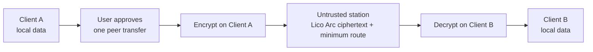

<div align="center">


**Create value with your agents.**

English · [简体中文](README.zh-CN.md)

[](LICENSE)
[](docs/STATUS.md)
[](docs/COMPATIBILITY.md)

</div>

## Introduction

LicoUp is an open-source agent collaboration client focused on cross-device connectivity and privacy. It makes organizing collaborative agent sessions across devices fast and effortless. User data stays solely on local devices and is never uploaded to servers.

LicoUp secures client-to-client communication with post-quantum end-to-end encryption, ensuring user data cannot be intercepted by relay stations. It supports agent collaboration across multiple stations and identities to build a truly distributed, agent-native collaboration platform.

## Installation

No packaged release is published yet — build from source:

| Toolchain | Requirement |
| --- | --- |
| Node.js | 22 or 24 |
| Flutter | stable |
| Rust | stable |

```bash
npm ci
npm run client:get
npm run client:analyze
npm run client:test
```

> [!NOTE]
> LicoUp is in early alpha: a build target or preview feature is not a
> supported release. Check the [compatibility matrix](docs/COMPATIBILITY.md)
> before relying on a platform or feature.

## Perspective

Building a distributed collaboration network for the agentic era — where humans and agents across endpoints connect and create freely, while privacy and ownership remain firmly with the individual.

| Principle | Idea |
| --- | --- |
| **Diverse** | Work with different agents, devices, and local setups. |
| **Connected** | Move between local agents and trusted peer devices with less friction. |
| **Open** | Keep the source, client protocols, and contribution path visible. |
| **Integrated** | Give different tools one simple client experience. |

## Capabilities

| Capability | Description |
| --- | --- |
| **Multi-Agent Collaboration** | Connect agents across devices and endpoints into one collaborative network where your workflow and others' naturally converge. |
| **Extending Agents** | Discover, customize, and add extensions to enhance agent capabilities, reduce operational cost, and maximize the value of every token. |
| **Seamless Chat with Agents** | Bring agents into any conversation on demand. They join as visible participants, pick up context, and assist in place. |
| **Customized Workflow** | Adaptive Flywheel is a strategy generator for your way of working: one-shot pipelines, branching flows, or self-looping agent cycles that keep iterating toward the goal. Bind each role's agent, model, and reasoning effort, authorize the exact revision, and let the conversation run it. |
| **Privacy and Security** | Your data stays on the device and is never uploaded. Peer transfers are end-to-end encrypted before they leave the sender, and no protected content leaves the client without explicit approval — details in [Privacy concerns](#privacy-concerns). |

## Privacy concerns

**Local first.** Sensitive runtime data stays on the device. Default client
scenarios upload no local paths, logs, conversation history, usage records,
credentials, or plaintext user content.

**Endpoint-protected peer transfer (preview).** Content is encrypted with the
selected peer's keys before it leaves the device; the receiving endpoint
authenticates and verifies it before use. The station is untrusted — it
supplies no algorithms, keys, or security policy, and its receipts are only
delivery hints. Lico Arc owns the wire-observable protocol semantics; LicoUp
keeps private keys, plaintext, history, backups, trust, and approvals. The
current Preview is not a Lico Arc Profile and retires directly when a pinned
Lico Arc Protocol Line replaces it.



**Explicit external approval.** An optional external MCP request sends only
the exact request or selected files shown in a fresh direct approval, and the
named service can read that approved content. Without it, protected content
leaves the client only as an approved end-to-end-encrypted transfer to
another client. 

## Documentation

| Topic | English | Simplified Chinese |
| --- | --- | --- |
| Index | [Documentation index](docs/README.md) | — |
| Domain language | [Context](CONTEXT.md) | — |
| Current status | [Status](docs/STATUS.md) | [当前状态](docs/STATUS.zh-CN.md) |
| User guide | [User guide](docs/functionality/USER-GUIDE.md) | [用户指南](docs/functionality/USER-GUIDE.zh-CN.md) |
| Architecture | [Architecture](docs/architecture/README.md) | [架构](docs/architecture/README.zh-CN.md) |
| Federation transport | [Lico Arc candidate station adapter](docs/protocols/licoarc-station-adapter.md) | [Lico Arc 候选通讯站 Adapter](docs/protocols/licoarc-station-adapter.zh-CN.md) |
| Compatibility | [Compatibility](docs/COMPATIBILITY.md) | [兼容性](docs/COMPATIBILITY.zh-CN.md) |
| Release packages | [Release packages](docs/RELEASE-PACKAGES.md) | [发布包结构](docs/RELEASE-PACKAGES.zh-CN.md) |
| Security | [Security](SECURITY.md) | [安全](SECURITY.zh-CN.md) |
| Contributing | [Contributing](CONTRIBUTING.md) | [参与贡献](CONTRIBUTING.zh-CN.md) |

[Product definition](PRODUCT.md) · [Changelog](CHANGELOG.md) ·
[Code of conduct](CODE_OF_CONDUCT.md) · Licensed under
[`AGPL-3.0-or-later`](LICENSE)
