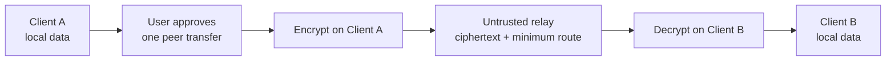

# Lico Arc

English (normative) · [简体中文（本地化）](README.zh-CN.md)

Lico Arc is an open-source client that brings local agents and devices into one
clear workspace. It supports different tools and ways of working, while keeping
the user in control. [`PRODUCT.md`](PRODUCT.md) is the product-definition
authority.

## Design ideas

- **Diverse** — work with different agents, devices, and local setups.
- **Connected** — move between local agents and trusted peer devices with less
  friction.
- **Open** — keep the source, client protocols, and contribution path visible.
- **Integrated** — give different tools one simple client experience.

## What it does

- Finds supported agents already installed on your computer.
- Starts and continues agent conversations through native adapters.
- Manages local skills, conversation backups, and usage views.
- Connects peer clients through Secure Client Mesh.
- Targets macOS, Windows, Linux, Android, and iOS. Read the
  [compatibility matrix](docs/COMPATIBILITY.md) before relying on a
  platform or feature.

Lico Arc is still in an early alpha stage. A build target or preview feature is
not the same as a fully supported release.

Optional LicoMesh collaboration is not loaded by the default client. It is
available only after the user chooses an immutable GitHub commit, separately
imports its trusted signing key, and installs and enables the plugin manually.
A local deployment starts only through a fixed, signed external runner after a
separate manual action. This repository does not bundle that server runner, so
building Lico Arc alone is not proof that LicoMesh was deployed. Installation,
enablement, and startup never authorize an external data transfer. Each exact
request or selected local file that would leave the device requires a fresh,
protected one-shot user approval.

## Privacy by design

Sensitive runtime data stays on the device. Default client scenarios do not
upload local paths, logs, conversation history, usage records, credentials, or
plaintext user content to a service. Optional external MCP requests can send
only the exact request or selected files shown in a fresh direct approval; the
named external service can read that approved content even though transport is
protected by HTTPS.

When you choose to send a message or file to another Lico Arc client, the sender
encrypts the content with the selected, verified peer keys before it leaves the
device. The receiver verifies the packet before it uses the content. Lico Arc
treats the relay as untrusted and sends it only encrypted content plus the
minimum data needed to route it. Client security does not rely on promises about
how a relay is run.



Without an exact external-service approval, protected user content can leave the
client only as an approved, end-to-end encrypted transfer addressed to another
client.

## Build from source

You need Node.js 22 or 24, Flutter stable, and Rust stable.

```bash
npm ci
npm run client:get
npm run client:analyze
npm run client:test
```

See the [user guide](docs/functionality/USER-GUIDE.md) for common flows and the
[architecture guide](docs/architecture/README.md) for component and data
boundaries.

## Documentation

- [Documentation index](docs/README.md)
- [User guide](docs/functionality/USER-GUIDE.md) ·
  [用户指南](docs/functionality/USER-GUIDE.zh-CN.md)
- [Architecture](docs/architecture/README.md) ·
  [架构](docs/architecture/README.zh-CN.md)
- [Compatibility](docs/COMPATIBILITY.md) ·
  [兼容性](docs/COMPATIBILITY.zh-CN.md)
- [Security](SECURITY.md) · [安全](SECURITY.zh-CN.md)
- [Contributing](CONTRIBUTING.md) · [参与贡献](CONTRIBUTING.zh-CN.md)

## License

Lico Arc is licensed under `GPL-3.0-or-later`. See [LICENSE](LICENSE).
