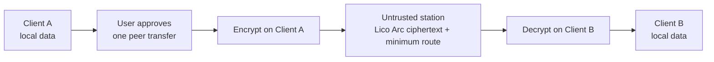

<div align="center">


# LicoUp

**Local agents and devices in one clear workspace — open source, local
first, and under your control.**

English (normative language) · [简体中文 (localized language)](README.zh-CN.md)

[](LICENSE)
[](docs/STATUS.md)
[](docs/COMPATIBILITY.md)

</div>

LicoUp is an open-source client for desktop and mobile devices that helps you
discover, operate, and reach your own agents. Its durable destination is one
secure conversation experience shared by people and visible agents.
[`PRODUCT.md`](PRODUCT.md) owns that product goal; current facts are separated
in [`docs/STATUS.md`](docs/STATUS.md) and the generated
[`docs/COMPATIBILITY.md`](docs/COMPATIBILITY.md).

## Design ideas

| Principle | Idea |
| --- | --- |
| **Diverse** | Work with different agents, devices, and local setups. |
| **Connected** | Move between local agents and trusted peer devices with less friction. |
| **Open** | Keep the source, client protocols, and contribution path visible. |
| **Integrated** | Give different tools one simple client experience. |

## What it does

- **Discovers agents** — concurrent scans of local application registries,
  package managers, executable search locations, and running OrbStack machines.
  Local routes are cached; VM routes remain transient.
- **Holds native-fidelity conversations** — use the exact agent interfaces
  whose current readiness is declared in the compatibility matrix.
- **Reaches agents in your VM** — automatically detect OpenClaw and Hermes in
  running OrbStack machines, or add another VM explicitly, then use the
  agent's official stdio protocol through the system OpenSSH client. OpenClaw
  uses ACP; Hermes uses ACP when its optional package is present and otherwise
  uses the built-in TUI Gateway JSON-RPC. Existing SSH authentication and host
  verification are required; LicoUp stores no SSH password or private key.
- **Manages skills across agents** — list, install, update from an
  explicitly configured mirror or GitHub repository, delete, and aggregate
  usage counts by time window.
- **Backs up conversations** — browse native conversation history and back
  up all or keyword-selected conversations to a local directory you choose.
- **Reports token usage** — by agent or model, defaulting to the latest
  thirty days with a selectable time window.
- **Previews endpoint-protected client transfer** — the
  [current retiring endpoint-protection Preview](docs/STATUS.md) encrypts
  messages and files on the sender's device. The client-owned adapter now
  carries its protected payload through the candidate `licoarc.relay.v1`
  five-field envelope and a bounded, untrusted BadTower transport.

## Platform support

LicoUp targets macOS, Windows, Linux, Android, and iOS.

> [!NOTE]
> LicoUp is in early alpha: a build target or preview feature is not the
> same as a fully supported release. Check the
> [compatibility matrix](docs/COMPATIBILITY.md) before relying on a
> platform or feature.

## Privacy by design

**Local first.** Sensitive runtime data stays on the device. Default client
scenarios do not upload local paths, logs, conversation history, usage
records, credentials, or plaintext user content to a service.

**Endpoint-protected peer-transfer preview.** The current source path encrypts
content with selected peer keys before network I/O, and the receiving endpoint
authenticates and verifies it before use. LicoUp treats transport as untrusted
and does not accept cryptographic algorithms, keys, or security policy from a
station. The direct Lico Arc candidate adapter has completed one bounded real
BadTower round trip with two independently initialized endpoints, including
strict negative-envelope rejection. Platform support remains `preview`; this
local acceptance is not a product release, protocol publication, support
declaration, or hosted-network operation claim.

The current retiring endpoint-protection Preview is not a Lico Arc Profile,
carries no future compatibility promise, and is to be retired directly when a
complete pinned Lico Arc Protocol Line replaces it. Lico Arc owns stable
wire-observable Pairwise Protection, Generic Message, Reliable Exchange,
negotiation, and Transport Profile semantics. LicoUp continues to own private
keys, local Provider configuration, plaintext, history, backups, user trust,
approvals, and local effects.



**Explicit external approval.** Optional external MCP requests can send
only the exact request or selected files shown in a fresh direct approval;
each transfer requires a protected one-shot user approval.
the named external service can read that approved content even though
transport is protected by HTTPS. Without an exact external-service
approval, protected user content can leave the client only as an approved,
end-to-end encrypted transfer addressed to another client.

An automatically discovered or manually configured VM is an addressed external
runtime, not a peer-encrypted LicoUp recipient. The conversation header keeps
its SSH destination visible, and pressing Send authorizes that exact prompt to
that VM. SSH protects the transport, while OpenClaw or Hermes inside the VM
receives the conversation content in order to answer.

## Build from source

| Toolchain | Requirement |
| --- | --- |
| Node.js | 22 or 24 |
| Flutter | stable |
| Rust | stable |

```bash
npm ci
npm run client:get
npm run client:analyze
npm run client:test
```

See the [user guide](docs/functionality/USER-GUIDE.md) for common flows and
the [architecture guide](docs/architecture/README.md) for component and
data boundaries.

## Repository map

| Path | Contents |
| --- | --- |
| [`apps/desktop`](apps/desktop) | Flutter desktop and mobile client |
| [`crates`](crates) | Rust workspace — native task queue, ACP/MCP adapters, and the endpoint-protection Preview implementation |
| [`packages`](packages) | Shared client contracts (JSON Schema) and native-client protocol packages |
| [`docs`](docs) | Formal documentation — architecture, functionality, protocols, ADRs |
| [`tests`](tests) | Contract and smoke tests |
| [`tools`](tools) | Build, verification, packaging, and release tooling |

## Documentation

| Topic | English | Simplified Chinese |
| --- | --- | --- |
| Index | [Documentation index](docs/README.md) | — |
| Domain language | [Context](CONTEXT.md) | — |
| Current status | [Status](docs/STATUS.md) | [当前状态](docs/STATUS.zh-CN.md) |
| User guide | [User guide](docs/functionality/USER-GUIDE.md) | [用户指南](docs/functionality/USER-GUIDE.zh-CN.md) |
| Architecture | [Architecture](docs/architecture/README.md) | [架构](docs/architecture/README.zh-CN.md) |
| Federation transport | [Lico Arc candidate station adapter](docs/protocols/licoarc-station-adapter.md) | [Lico Arc 候选通讯站 Adapter](docs/protocols/licoarc-station-adapter.zh-CN.md) |
| Compatibility | [Compatibility](docs/COMPATIBILITY.md) | [兼容性](docs/COMPATIBILITY.zh-CN.md) |
| Security | [Security](SECURITY.md) | [安全](SECURITY.zh-CN.md) |
| Contributing | [Contributing](CONTRIBUTING.md) | [参与贡献](CONTRIBUTING.zh-CN.md) |

[Product definition](PRODUCT.md) · [Changelog](CHANGELOG.md) ·
[Code of conduct](CODE_OF_CONDUCT.md)

## License

LicoUp is licensed under `AGPL-3.0-or-later`. See [LICENSE](LICENSE).
