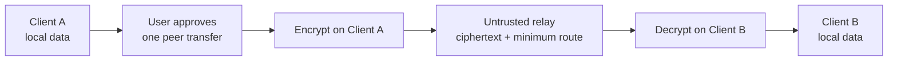

<div align="center">


# LicoUp

**Local agents and devices in one clear workspace — open source, local
first, and under your control.**

English (normative) · [简体中文](README.zh-CN.md)

[](LICENSE)
[](CHANGELOG.md)
[](docs/COMPATIBILITY.md)

</div>

LicoUp is an open-source desktop and mobile client for discovering,
operating, and securely reaching your own agents. It supports different
tools and ways of working while keeping you in control.
[`PRODUCT.md`](PRODUCT.md) is the product-definition authority.

## Design ideas

| Principle | Idea |
| --- | --- |
| **Diverse** | Work with different agents, devices, and local setups. |
| **Connected** | Move between local agents and trusted peer devices with less friction. |
| **Open** | Keep the source, client protocols, and contribution path visible. |
| **Integrated** | Give different tools one simple client experience. |

## What it does

- **Discovers local agents** — concurrent scans of application registries,
  package managers, executable search locations, and other platform-owned
  locations, registered into a local cache.
- **Holds native-fidelity conversations** — start a new conversation or
  continue an existing one exactly through each agent's official native
  interface.
- **Manages skills across agents** — list, install, update from an
  explicitly configured mirror or GitHub repository, delete, and aggregate
  usage counts by time window.
- **Backs up conversations** — browse native conversation history and back
  up all or keyword-selected conversations to a local directory you choose.
- **Reports token usage** — by agent or model, defaulting to the latest
  thirty days with a selectable time window.
- **Connects clients end to end** — Secure Client Mesh encrypts messages
  and files on the sender's device and relays only opaque envelopes through
  the independently maintained LicoTower relay infrastructure, including from
  mobile.

## Platform support

LicoUp targets macOS, Windows, Linux, Android, and iOS.

> [!NOTE]
> LicoUp is in early alpha: a build target or preview feature is not the
> same as a fully supported release. Check the
> [compatibility matrix](docs/COMPATIBILITY.md) before relying on a
> platform or feature.

## Privacy by design

**Local first.** Sensitive runtime data stays on the device. Default client
scenarios do not upload local paths, logs, conversation history, usage
records, credentials, or plaintext user content to a service.

**End-to-end peer transfer.** When you send a message or file to another
LicoUp client, the sender encrypts the content with the selected,
verified peer keys before it leaves the device. The receiver verifies the
packet before using the content. LicoUp treats the relay as untrusted and
sends it only ciphertext plus the minimum data needed to route it; client
security does not rely on promises about how a relay is run.



**Explicit external approval.** Optional external MCP requests can send
only the exact request or selected files shown in a fresh direct approval;
the named external service can read that approved content even though
transport is protected by HTTPS. Without an exact external-service
approval, protected user content can leave the client only as an approved,
end-to-end encrypted transfer addressed to another client.

## Optional LicoMesh collaboration

LicoMesh collaboration is not loaded by the default client. It is available
only after you choose an immutable GitHub commit, separately import its
trusted signing key, and install and enable the plugin manually. A local
deployment starts only through a fixed, signed external runner after a
separate manual action. This repository does not bundle that server runner,
so building LicoUp alone is not proof that LicoMesh was deployed.
Installation, enablement, and startup never authorize an external data
transfer: each exact request or selected local file that would leave the
device requires a fresh, protected one-shot user approval.

## Build from source

| Toolchain | Requirement |
| --- | --- |
| Node.js | 22 or 24 |
| Flutter | stable |
| Rust | stable |

```bash
npm ci
npm run client:get
npm run client:analyze
npm run client:test
```

See the [user guide](docs/functionality/USER-GUIDE.md) for common flows and
the [architecture guide](docs/architecture/README.md) for component and
data boundaries.

## Repository map

| Path | Contents |
| --- | --- |
| [`apps/desktop`](apps/desktop) | Flutter desktop and mobile client |
| [`crates`](crates) | Rust workspace — native task queue, ACP/MCP adapters, Secure Client Mesh |
| [`packages`](packages) | Shared client contracts (JSON Schema) and native-client protocol packages |
| [`docs`](docs) | Formal documentation — architecture, functionality, protocols, ADRs |
| [`tests`](tests) | Contract and smoke tests |
| [`tools`](tools) | Build, verification, packaging, and release tooling |

## Documentation

| Topic | English | 简体中文 |
| --- | --- | --- |
| Index | [Documentation index](docs/README.md) | — |
| User guide | [User guide](docs/functionality/USER-GUIDE.md) | [用户指南](docs/functionality/USER-GUIDE.zh-CN.md) |
| Architecture | [Architecture](docs/architecture/README.md) | [架构](docs/architecture/README.zh-CN.md) |
| Compatibility | [Compatibility](docs/COMPATIBILITY.md) | [兼容性](docs/COMPATIBILITY.zh-CN.md) |
| Security | [Security](SECURITY.md) | [安全](SECURITY.zh-CN.md) |
| Contributing | [Contributing](CONTRIBUTING.md) | [参与贡献](CONTRIBUTING.zh-CN.md) |

[Product definition](PRODUCT.md) · [Changelog](CHANGELOG.md) ·
[Code of conduct](CODE_OF_CONDUCT.md)

## License

LicoUp is licensed under `GPL-3.0-or-later`. See [LICENSE](LICENSE).
