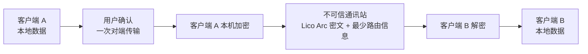

<div align="center">


**与智能体共同创造价值。**

[English（规范语言）](README.md) · 简体中文（本地化语言）

[](LICENSE)
[](docs/STATUS.zh-CN.md)
[](docs/COMPATIBILITY.zh-CN.md)

</div>

## 简介

LicoUp 是一个开源、本地优先的智能体协作客户端。当前已有证据的阶段聚焦
本机和明确配置的智能体会话；对端与跨设备能力仍处于预览状态，准确范围以
[当前状态](docs/STATUS.zh-CN.md)和[兼容性矩阵](docs/COMPATIBILITY.zh-CN.md)
为准。

当前端点保护预览会在通讯站 I/O 之前，于发送端加密已经确认的对端传输，并
由接收端进行认证。通讯站始终按不可信运输处理；这不是稳定的 Lico Arc
Profile、已发布协议、已运营网络或支持声明。

## 安装

尚未发布打包版本——请从源码构建：

| 工具链 | 要求 |
| --- | --- |
| Node.js | 22 或 24 |
| Flutter | stable |
| Rust | stable |

```bash
npm ci
npm run client:get
npm run client:analyze
npm run client:test
```

> [!NOTE]
> LicoUp 仍处于早期 Alpha：可以构建或处于预览状态，不代表已经完整支
> 持。依赖某个平台或功能之前，请先查看
> [兼容性矩阵](docs/COMPATIBILITY.zh-CN.md)。

## 产品理念

构建智能体时代的分布式协作网络——让分散在各个端点的人与智能体自由连通、并肩创造，同时将隐私与掌控权彻底留给个体。

| 原则 | 含义 |
| --- | --- |
| **多元** | 支持不同的智能体、设备和本机环境。 |
| **互联** | 在本机智能体与可信对端设备之间更低摩擦地切换。 |
| **开放** | 公开源代码、客户端协议和贡献路径。 |
| **融合** | 用一个简单的客户端体验连接不同工具。 |

## 能力

| 能力 | 说明 |
| --- | --- |
| **多智能体协作** | 使用本机和明确配置的智能体；对端与跨设备能力只按兼容性矩阵当前声明的预览范围使用。 |
| **扩展智能体** | 发现智能体本机目录中已有的技能、查看用量，并把选中的技能移入系统废纸篓。LicoUp 不下载、安装、更新或同步技能。 |
| **智能体无缝参与对话** | 通过兼容性矩阵当前明确为就绪的随附智能体接口，开始原生保真的会话。 |
| **自定义工作流** | 定义或导入 Adaptive Flywheel 策略以组织流水线、分支和有界 Agent Loop；不可变版本先把角色绑定到符合条件的智能体、模型和思考强度，再接受准确授权。 |
| **隐私与安全** | 默认本机场景让敏感运行时数据留在设备上。已确认的对端传输使用端点保护预览；已批准的外部服务只能读取为其准确授权的内容——详见下方[隐私关切](#隐私关切)。 |

## 隐私关切

**本地优先。** 敏感运行时数据留在设备上。默认客户端场景不会把本地路径、
日志、对话历史、用量记录、凭据或用户内容明文上传给服务端。

**端点保护对端传输（预览）。** 内容在离开设备前用选中对端的密钥加
密，接收端先认证、校验再使用。LicoUp 把运输路径视为不可信环境——通讯站
不提供加密算法、密钥或安全策略，其回执只是投递提示。线上可观测的协议语义由 Lico Arc
拥有；LicoUp 保留私钥、明文、历史、备份、用户信任与审批。当前预览
不是 Lico Arc Profile，完整固定 Lico Arc Protocol Line 替换它时会直
接退役。



**明确的外部确认。** 可选的外部 MCP 请求只发送本次直接确认中展示的准
确请求或选中文件，指定的外部服务可以读取你明确批准的内容。每次传输都需要
一次新的、受保护的用户确认。没有准确
确认时，受保护内容只能在确认后以端到端密文形式发给另一个客户端。

## 文档

| 主题 | English | 简体中文 |
| --- | --- | --- |
| 索引 | [Documentation index](docs/README.md) | — |
| 领域语言 | [Context](CONTEXT.md) | — |
| 当前状态 | [Status](docs/STATUS.md) | [当前状态](docs/STATUS.zh-CN.md) |
| 用户指南 | [User guide](docs/functionality/USER-GUIDE.md) | [用户指南](docs/functionality/USER-GUIDE.zh-CN.md) |
| 架构 | [Architecture](docs/architecture/README.md) | [架构](docs/architecture/README.zh-CN.md) |
| 联邦运输 | [Lico Arc candidate station adapter](docs/protocols/licoarc-station-adapter.md) | [Lico Arc 候选通讯站 Adapter](docs/protocols/licoarc-station-adapter.zh-CN.md) |
| 兼容性 | [Compatibility](docs/COMPATIBILITY.md) | [兼容性](docs/COMPATIBILITY.zh-CN.md) |
| 发布包 | [Release packages](docs/RELEASE-PACKAGES.md) | [发布包结构](docs/RELEASE-PACKAGES.zh-CN.md) |
| 安全 | [Security](SECURITY.md) | [安全](SECURITY.zh-CN.md) |
| 参与贡献 | [Contributing](CONTRIBUTING.md) | [参与贡献](CONTRIBUTING.zh-CN.md) |

[产品定义](PRODUCT.md) · [更新日志](CHANGELOG.md) ·
[行为准则](CODE_OF_CONDUCT.md) · 使用 [`AGPL-3.0-or-later`](LICENSE)
许可证
