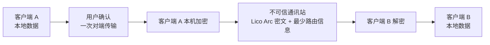

<div align="center">


**与智能体共同创造价值。**

[English](README.md) · 简体中文

[](LICENSE)
[](docs/STATUS.zh-CN.md)
[](docs/COMPATIBILITY.zh-CN.md)

</div>

## 简介

LicoUp 是一个开源的智能体协作客户端，专注于多端互联与隐私保护。它可以方便快捷地组织来自不同设备的智能体协作会话。敏感运行时数据留在设备上。默认场景不上传用户内容明文。

对端传输目前使用预览端到端加密路径。发送端在内容离开设备前加密，不向通讯站发送用户内容明文。它支持多站点不同身份之间的智能体协作，以构建一个真正的分布式智能体原生协作平台。

## 安装

尚未发布打包版本——请从源码构建：

| 工具链 | 要求 |
| --- | --- |
| Node.js | 22 或 24 |
| Flutter | stable |
| Rust | stable |

```bash
npm ci
npm run client:get
npm run client:analyze
npm run client:test
```

> [!NOTE]
> LicoUp 仍处于早期 Alpha：可以构建或处于预览状态，不代表已经完整支
> 持。依赖某个平台或功能之前，请先查看
> [兼容性矩阵](docs/COMPATIBILITY.zh-CN.md)。

## 产品理念

构建智能体时代的分布式协作网络——让分散在各个端点的人与智能体自由连通、并肩创造，同时将隐私与掌控权彻底留给个体。

| 原则 | 含义 |
| --- | --- |
| **多元** | 支持不同的智能体、设备和本机环境。 |
| **互联** | 在本机智能体与可信对端设备之间更低摩擦地切换。 |
| **开放** | 公开源代码、客户端协议和贡献路径。 |
| **融合** | 用一个简单的客户端体验连接不同工具。 |

## 能力

| 能力 | 说明 |
| --- | --- |
| **多智能体协作** | 将分散在不同设备与端点的智能体连入同一张协作网络，让你的工作流与其它人的工作流自然交汇。 |
| **扩展智能体** | 发现、定制和添加智能体扩展以增强智能体的能力、降低智能体的工作成本，提升经济效益。 |
| **智能体无缝参与对话** | 无缝接入智能体 — 对话中随时唤起智能体加入，它作为可见的参与者获取上下文，就地协助。 |
| **自定义工作流** | Adaptive Flywheel 是一套策略生成器，为你的工作方式生成专属工作流：一次性流水线、分支流程，或可自循环、围绕目标持续迭代的智能体循环。为每个角色绑定智能体、模型与思考强度，授权确切版本，再让会话驱动运行。 |
| **隐私与安全** | 敏感运行时数据留在设备上；默认场景不上传明文。对端传输在离开发送端之前完成端到端加密；没有明确确认，受保护内容不会离开客户端，除非你选择了 Telegram 等外部通讯软件作为你的可信通道——详见下方[隐私关切](#隐私关切)。 |

## 隐私关切

**本地优先。** 敏感运行时数据留在设备上。默认客户端场景不上传本地路径、日志、对话历史、用量记录、凭据或用户内容明文。

**端点保护对端传输（预览）。** 内容在离开设备前用选中对端的密钥加
密，接收端先认证、校验再使用。通讯站不可信——它不提供加密算法、密
钥或安全策略，其回执只是投递提示。线上可观测的协议语义由 Lico Arc
拥有；LicoUp 保留私钥、明文、历史、备份、用户信任与审批。当前预览
不是 Lico Arc Profile，完整固定 Lico Arc Protocol Line 替换它时会直
接退役。



**仅在用户授权下行动。** LicoUp 只在你的授权下行动。受保护内容离开客户
端时，只作为你授权的端到端密文发给另一个客户端，除非你选择了 Telegram
等外部通讯软件作为你的可信通道。

## 文档

| 主题 | English | 简体中文 |
| --- | --- | --- |
| 索引 | [Documentation index](docs/README.md) | — |
| 领域语言 | [Context](CONTEXT.md) | — |
| 当前状态 | [Status](docs/STATUS.md) | [当前状态](docs/STATUS.zh-CN.md) |
| 用户指南 | [User guide](docs/functionality/USER-GUIDE.md) | [用户指南](docs/functionality/USER-GUIDE.zh-CN.md) |
| 架构 | [Architecture](docs/architecture/README.md) | [架构](docs/architecture/README.zh-CN.md) |
| 联邦运输 | [Lico Arc candidate station adapter](docs/protocols/licoarc-station-adapter.md) | [Lico Arc 候选通讯站 Adapter](docs/protocols/licoarc-station-adapter.zh-CN.md) |
| 兼容性 | [Compatibility](docs/COMPATIBILITY.md) | [兼容性](docs/COMPATIBILITY.zh-CN.md) |
| 发布包 | [Release packages](docs/RELEASE-PACKAGES.md) | [发布包结构](docs/RELEASE-PACKAGES.zh-CN.md) |
| 安全 | [Security](SECURITY.md) | [安全](SECURITY.zh-CN.md) |
| 参与贡献 | [Contributing](CONTRIBUTING.md) | [参与贡献](CONTRIBUTING.zh-CN.md) |

[产品定义](PRODUCT.md) · [更新日志](CHANGELOG.md) ·
[行为准则](CODE_OF_CONDUCT.md) · 使用 [`AGPL-3.0-or-later`](LICENSE)
许可证
