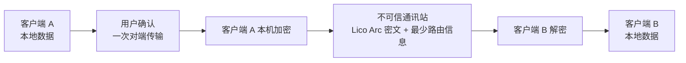

<div align="center">


# LicoUp

**把本机智能体与设备收进一个清晰的工作空间——开源、本地优先，由你掌控。**

[English（规范语言）](README.md) · 简体中文（本地化语言）

[](LICENSE)
[](docs/STATUS.zh-CN.md)
[](docs/COMPATIBILITY.zh-CN.md)

</div>

LicoUp 是一个开源的桌面与移动客户端，用于发现、操作并连接你自己的智能体。
它的长期终局是一套由人与醒目可见的智能体共享的安全会话体验。产品目标以
[`PRODUCT.zh-CN.md`](PRODUCT.zh-CN.md) 为准；当前事实分别由
[`docs/STATUS.zh-CN.md`](docs/STATUS.zh-CN.md) 与生成的
[`docs/COMPATIBILITY.zh-CN.md`](docs/COMPATIBILITY.zh-CN.md) 负责。

## 设计理念

| 原则 | 含义 |
| --- | --- |
| **多元** | 支持不同的智能体、设备和本机环境。 |
| **互联** | 在本机智能体与可信对端设备之间更低摩擦地切换。 |
| **开放** | 公开源代码、客户端协议和贡献路径。 |
| **融合** | 用一个简单的客户端体验连接不同工具。 |

## 主要能力

- **发现智能体** — 并发扫描本机应用注册表、包管理器、可执行文件搜索位置
  以及正在运行的 OrbStack 虚拟机。本机路由会被缓存，虚拟机路由只在本次
  扫描中使用。
- **原生保真对话** — 只使用兼容矩阵当前明确为就绪的准确智能体接口。
- **访问虚拟机内智能体** — 自动探测正在运行的 OrbStack 虚拟机内的
  OpenClaw 和 Hermes，也可以明确添加其他虚拟机，再通过系统 OpenSSH 客户
  端使用智能体官方 stdio 协议。OpenClaw 使用 ACP；Hermes 在可选 ACP 包
  已安装时使用 ACP，否则自动使用内置 TUI Gateway JSON-RPC。必须预先具备
  SSH 认证和主机校验；LicoUp 不保存 SSH 密码或私钥。
- **跨智能体技能管理** — 列出、安装、从显式配置的镜像或 GitHub 仓库更
  新、删除技能，并按时间窗口聚合用量计数。
- **对话备份** — 浏览原生对话历史，将全部或按关键词选中的对话备份到你选
  择的本地目录。
- **令牌用量报告** — 按智能体或模型统计，默认最近三十天，可选择时间窗
  口。
- **端点保护客户端传输预览** — [当前正在退役的端点保护预览](docs/STATUS.zh-CN.md)
  在发送端设备上加密消息和文件。客户端自有 adapter 现在通过候选
  `licoarc.relay.v1` 五字段信封与有界、不可信的 BadTower 运输承载受保护内容。

## 平台支持

LicoUp 面向 macOS、Windows、Linux、Android 和 iOS。

> [!NOTE]
> LicoUp 仍处于早期 Alpha 阶段：可以构建或处于预览状态，不代表已经完
> 整支持。依赖某个平台或功能之前，请先查看
> [兼容性矩阵](docs/COMPATIBILITY.zh-CN.md)。

## 隐私设计

**本地优先。** 敏感运行时数据留在设备上。默认客户端场景不会把本地路径、
日志、对话历史、用量记录、凭据或用户内容明文发送给服务端。

**端点保护对端传输预览。** 当前源码路径会在网络 I/O 前使用选中对端密钥
加密内容，接收端先认证、校验再使用。LicoUp 把运输路径视为不可信环境，也不
接受通讯站下发的加密算法、密钥或安全策略。直接 Lico Arc 候选 adapter 已用
两套独立初始化的端点完成一次有界的真实 BadTower 往返，并包含严格负例信封
拒绝。平台支持仍为“预览”；这次本机验收不是产品发布、协议发布、支持声明或
托管网络运营声明。

当前正在退役的端点保护预览不是 Lico Arc Profile，也不承诺未来兼容；完整固定
Lico Arc Protocol Line 替换它时会直接退役。稳定、线上可观测的 Pairwise
Protection、Generic Message、Reliable Exchange、协商与 Transport Profile
语义由 Lico Arc 拥有。LicoUp 继续拥有私钥、本地 Provider 配置、明文、历史、
备份、用户信任、审批和本地效果。



**明确的外部确认。** 可选的外部 MCP 请求只能发送本次用户直接确认中展示的
准确请求或选中文件；传输由 HTTPS 保护，但指定的外部服务可以读取用户明确
批准的内容。如果没有针对外部服务的准确确认，受保护的用户内容只能在用户
确认后，以端到端密文形式从一个客户端发给另一个客户端。

自动发现或手动配置的虚拟机属于有明确地址的外部运行环境，不是 LicoUp 对端
加密接收方。对话页会持续显示 SSH 目标；用户点击“发送”时，只授权把该条准确
提示发给该虚拟机。SSH 负责保护传输，虚拟机内的 OpenClaw 或 Hermes 会读取
对话内容以生成回复。

## 可选的 Meshrix 协作

Meshrix 协作能力不会随默认客户端加载。只有在你主动选择 GitHub 的不可变
提交、通过独立渠道导入其可信签名公钥，并手动安装和启用插件之后，它才可用。
本地部署还需要一次独立的手动操作，并且只能通过固定、已签名的外部运行器启
动。本仓库不捆绑该服务端运行器，因此只构建 LicoUp 不能证明已经部署
Meshrix。安装、启用和启动都不等于授权对外传输数据：每个将要离开设备的准
确请求或选中的本地文件，都必须取得一次新的、受保护的用户确认。

## 从源码构建

| 工具链 | 要求 |
| --- | --- |
| Node.js | 22 或 24 |
| Flutter | stable |
| Rust | stable |

```bash
npm ci
npm run client:get
npm run client:analyze
npm run client:test
```

常见操作请阅读[用户指南](docs/functionality/USER-GUIDE.zh-CN.md)，组件和
数据边界请阅读[架构说明](docs/architecture/README.zh-CN.md)。

## 仓库结构

| 路径 | 内容 |
| --- | --- |
| [`apps/desktop`](apps/desktop) | Flutter 桌面与移动客户端 |
| [`crates`](crates) | Rust 工作区——原生任务队列、ACP/MCP 适配器和端点保护预览实现 |
| [`packages`](packages) | 共享客户端契约（JSON Schema）与原生客户端协议包 |
| [`docs`](docs) | 正式文档——架构、功能、协议、ADR |
| [`tests`](tests) | 契约测试与冒烟测试 |
| [`tools`](tools) | 构建、校验、打包与发布工具 |

## 文档

| 主题 | English（规范版本） | 简体中文 |
| --- | --- | --- |
| 索引 | [Documentation index](docs/README.md) | — |
| 领域语言 | [Context](CONTEXT.md) | — |
| 当前状态 | [Status](docs/STATUS.md) | [当前状态](docs/STATUS.zh-CN.md) |
| 用户指南 | [User guide](docs/functionality/USER-GUIDE.md) | [用户指南](docs/functionality/USER-GUIDE.zh-CN.md) |
| 架构 | [Architecture](docs/architecture/README.md) | [架构](docs/architecture/README.zh-CN.md) |
| 联邦运输 | [Lico Arc candidate station adapter](docs/protocols/licoarc-station-adapter.md) | [Lico Arc 候选通讯站 Adapter](docs/protocols/licoarc-station-adapter.zh-CN.md) |
| 兼容性 | [Compatibility](docs/COMPATIBILITY.md) | [兼容性](docs/COMPATIBILITY.zh-CN.md) |
| 安全 | [Security](SECURITY.md) | [安全](SECURITY.zh-CN.md) |
| 参与贡献 | [Contributing](CONTRIBUTING.md) | [参与贡献](CONTRIBUTING.zh-CN.md) |

[产品定义](PRODUCT.md) · [更新日志](CHANGELOG.md) ·
[行为准则](CODE_OF_CONDUCT.md)

## 许可证

LicoUp 使用 `GPL-3.0-or-later` 许可证。详见 [LICENSE](LICENSE)。
