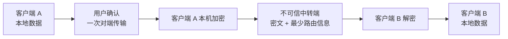

<div align="center">


# LicoUp

**把本机智能体与设备收进一个清晰的工作空间——开源、本地优先，由你掌控。**

[English（规范语言）](README.md) · 简体中文（本地化语言）

[](LICENSE)
[](CHANGELOG.md)
[](docs/COMPATIBILITY.zh-CN.md)

</div>

LicoUp 是一个开源的桌面与移动客户端，用于发现、操作并安全地连接你自己
的智能体。它支持不同的工具和工作方式，同时让你始终掌握控制权。产品定义以
[`PRODUCT.md`](PRODUCT.md) 为准。

## 设计理念

| 原则 | 含义 |
| --- | --- |
| **多元** | 支持不同的智能体、设备和本机环境。 |
| **互联** | 在本机智能体与可信对端设备之间更低摩擦地切换。 |
| **开放** | 公开源代码、客户端协议和贡献路径。 |
| **融合** | 用一个简单的客户端体验连接不同工具。 |

## 主要能力

- **发现本机智能体** — 并发扫描应用注册表、包管理器、可执行文件搜索位置
  及其他平台拥有的位置，并登记到本地缓存。
- **原生保真对话** — 通过每个智能体的官方原生界面新建对话，或精确继续既
  有对话。
- **跨智能体技能管理** — 列出、安装、从显式配置的镜像或 GitHub 仓库更
  新、删除技能，并按时间窗口聚合用量计数。
- **对话备份** — 浏览原生对话历史，将全部或按关键词选中的对话备份到你选
  择的本地目录。
- **令牌用量报告** — 按智能体或模型统计，默认最近三十天，可选择时间窗
  口。
- **端到端客户端互联** — Secure Client Mesh 在发送端设备上加密消息和文
  件，只通过独立维护的 LicoTower 中继基础设施中转不透明信封，并支持移
  动端中继。

## 平台支持

LicoUp 面向 macOS、Windows、Linux、Android 和 iOS。

> [!NOTE]
> LicoUp 仍处于早期 Alpha 阶段：可以构建或处于预览状态，不代表已经完
> 整支持。依赖某个平台或功能之前，请先查看
> [兼容性矩阵](docs/COMPATIBILITY.zh-CN.md)。

## 隐私设计

**本地优先。** 敏感运行时数据留在设备上。默认客户端场景不会把本地路径、
日志、对话历史、用量记录、凭据或用户内容明文发送给服务端。

**端到端对端传输。** 当你向另一个 LicoUp 客户端发送消息或文件时，发送
端会使用选中且已经验证的对端密钥，在内容离开设备前完成加密；接收端先校
验数据包，再使用其中的内容。LicoUp 把中转端视为不可信环境，只向它发送
密文和完成路由所需的最少信息；客户端安全不依赖中转端的运行方式或承诺。



**明确的外部确认。** 可选的外部 MCP 请求只能发送本次用户直接确认中展示的
准确请求或选中文件；传输由 HTTPS 保护，但指定的外部服务可以读取用户明确
批准的内容。如果没有针对外部服务的准确确认，受保护的用户内容只能在用户
确认后，以端到端密文形式从一个客户端发给另一个客户端。

## 可选的 LicoMesh 协作

LicoMesh 协作能力不会随默认客户端加载。只有在你主动选择 GitHub 的不可变
提交、通过独立渠道导入其可信签名公钥，并手动安装和启用插件之后，它才可用。
本地部署还需要一次独立的手动操作，并且只能通过固定、已签名的外部运行器启
动。本仓库不捆绑该服务端运行器，因此只构建 LicoUp 不能证明已经部署
LicoMesh。安装、启用和启动都不等于授权对外传输数据：每个将要离开设备的准
确请求或选中的本地文件，都必须取得一次新的、受保护的用户确认。

## 从源码构建

| 工具链 | 要求 |
| --- | --- |
| Node.js | 22 或 24 |
| Flutter | stable |
| Rust | stable |

```bash
npm ci
npm run client:get
npm run client:analyze
npm run client:test
```

常见操作请阅读[用户指南](docs/functionality/USER-GUIDE.zh-CN.md)，组件和
数据边界请阅读[架构说明](docs/architecture/README.zh-CN.md)。

## 仓库结构

| 路径 | 内容 |
| --- | --- |
| [`apps/desktop`](apps/desktop) | Flutter 桌面与移动客户端 |
| [`crates`](crates) | Rust 工作区——原生任务队列、ACP/MCP 适配器、Secure Client Mesh |
| [`packages`](packages) | 共享客户端契约（JSON Schema）与原生客户端协议包 |
| [`docs`](docs) | 正式文档——架构、功能、协议、ADR |
| [`tests`](tests) | 契约测试与冒烟测试 |
| [`tools`](tools) | 构建、校验、打包与发布工具 |

## 文档

| 主题 | English（规范版本） | 简体中文 |
| --- | --- | --- |
| 索引 | [Documentation index](docs/README.md) | — |
| 用户指南 | [User guide](docs/functionality/USER-GUIDE.md) | [用户指南](docs/functionality/USER-GUIDE.zh-CN.md) |
| 架构 | [Architecture](docs/architecture/README.md) | [架构](docs/architecture/README.zh-CN.md) |
| 兼容性 | [Compatibility](docs/COMPATIBILITY.md) | [兼容性](docs/COMPATIBILITY.zh-CN.md) |
| 安全 | [Security](SECURITY.md) | [安全](SECURITY.zh-CN.md) |
| 参与贡献 | [Contributing](CONTRIBUTING.md) | [参与贡献](CONTRIBUTING.zh-CN.md) |

[产品定义](PRODUCT.md) · [更新日志](CHANGELOG.md) ·
[行为准则](CODE_OF_CONDUCT.md)

## 许可证

LicoUp 使用 `GPL-3.0-or-later` 许可证。详见 [LICENSE](LICENSE)。
