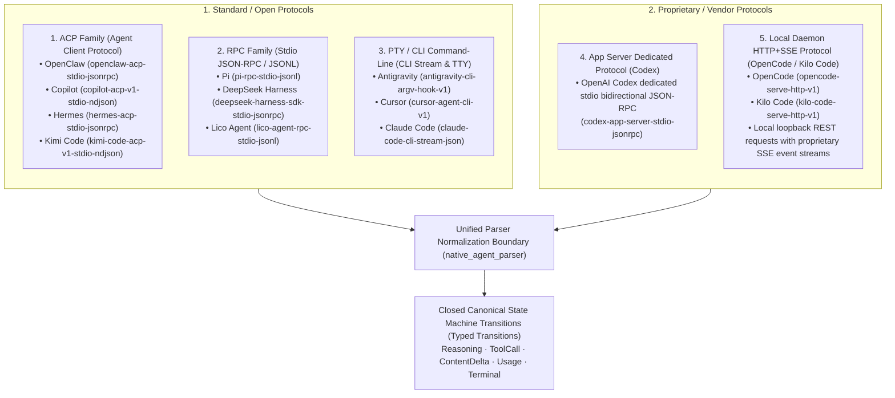
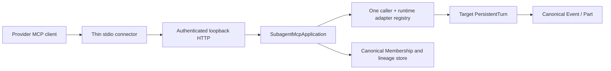

# Agent Adapters Architecture Specification

| Related Document | Language / Path | Authority |
|:---|:---|:---|
| **Normative Version** | English (Normative) | Authoritative technical specification |
| **Localization** | [简体中文](AGENT-ADAPTERS-ARCHITECTURE.zh-CN.md) | Localized Chinese projection |
| **Architecture Root** | [docs/architecture/README.md](README.md) | 4-tier client architecture overview |
| **Compatibility Matrix** | [docs/COMPATIBILITY.md](../COMPATIBILITY.md) | 13-agent support matrix & driver facts |
| **Parser ADR** | [docs/adrs/0008-native-agent-parser-and-conversation-integrity.md](../adrs/0008-native-agent-parser-and-conversation-integrity.md) | Parser isolation & settlement arbiter decision |
| **Command Identity ADR** | [docs/adrs/0007-user-terminal-agent-command-identity.md](../adrs/0007-user-terminal-agent-command-identity.md) | User terminal discovery & binding decision |
| **Rust Infrastructure** | [RUST-INFRASTRUCTURE-LAYER.md](RUST-INFRASTRUCTURE-LAYER.md) | PTY/TTY, network transport, dynamic configs |

This document defines the **taxonomy, protocol adaptation mechanisms, frame normalization, and runtime scheduling architecture for the 13 packaged Agent adapters** in LicoUp.

---

## 1. Two Primary Protocol Paradigms

LicoUp categorizes the 13 packaged agent runtimes into two major camps based on their underlying wire protocol characteristics: **Standard / Open Protocols** and **Proprietary / Vendor Protocols**:

---

## 2. Classification and Protocol Adaptation Matrix

| Protocol Camp | Channel Family | Agent ID | Wire Protocol Identifier | Transport & Mechanism | Vendor / Standard Characteristics |
|:---|:---|:---|:---|:---|:---|
| **Standard / Open** | **`acp`** | `openclaw` | `openclaw-acp-stdio-jsonrpc` | Stdio JSON-RPC | Canonical ACP negotiation, session list/load, stream events |
| | | `copilot` | `copilot-acp-v1-stdio-ndjson` | Stdio NDJSON | GitHub Copilot CLI ACP subset |
| | | `hermes` | `hermes-acp-stdio-jsonrpc` | Stdio JSON-RPC | Local ACP direct; supports remote TUI Gateway via SSH |
| | | `kimi-code` | `kimi-code-acp-v1-stdio-ndjson` | Stdio NDJSON | Kimi CLI standard ACP event stream |
| **Standard / Open** | **`rpc`** | `pi` | `pi-rpc-stdio-jsonl` | Stdio JSONL | Lightweight line-delimited JSONL RPC |
| | | `deepseek-harness` | `deepseek-harness-sdk-stdio-jsonrpc` | Stdio JSON-RPC | DeepSeek Harness standard SDK pipe |
| | | `lico-agent` | `lico-agent-rpc-stdio-jsonl` | Stdio JSONL | Lico native internal agent channel |
| **Standard / Open** | **`cli` / `stream-json`** | `claude-code` | `claude-code-cli-stream-json` | Stdio Stream JSON | Anthropic Claude Code stream JSON frames |
| | | `antigravity` | `antigravity-cli-argv-hook-v1` | PTY Pseudo Terminal / Argv | Terminal emulation, ANSI capture, command hooks |
| | | `cursor` | `cursor-agent-cli-v1` | PTY Pseudo Terminal / Argv | Cursor CLI interactive wrapper |
| **Proprietary Protocol** | **`app-server`** | **`codex`** | `codex-app-server-stdio-jsonrpc` | Stdio JSON-RPC | **OpenAI Codex Dedicated App Server Protocol**, featuring proprietary handshakes, context completions, and tool approval sequencing |
| **Proprietary Protocol** | **`serve-http`** | **`opencode`** | `opencode-serve-http-v1` | Local HTTP + SSE | **OpenCode Dedicated Daemon Protocol**, launching local HTTP server, issuing REST calls, and consuming custom SSE streams |
| | | **`kilo-code`** | `kilo-code-serve-http-v1` | Local HTTP + SSE | **Kilo Code Dedicated Server Protocol**, local loopback REST with streaming SSE |

---

## 3. Core Architectural Mechanisms and Normalization

Regardless of whether an agent speaks standard ACP, CLI PTY, or proprietary Codex/OpenCode protocols, LicoUp decouples and normalizes them through four core layers:

### ① Returned-Frame Parser Boundary (ADR 0008)
- Each runtime owns an isolated parser under `crates/licoup-native/src/platform/native_agent_parser/adapters/<agent>/`.
- Raw returned frames enter this parser **exactly once**.
- The parser outputs closed `Typed Transitions`:
  - `ThinkingDelta` / `Reasoning` (thinking/reasoning trace);
  - `ToolCallRequested` (tool invocation request & parameters);
  - `ContentDelta` (incremental text chunk);
  - `UsageReport` (token consumption record);
  - `Terminal(Completed | Failed | Cancelled)` (terminal arbiter verdict).

### ② Process Supervision & Watchdog (L3 Process Supervisor)
- Transport manages process launching, pipes, and HTTP/SSE handshakes.
- Cross-platform **Supervision Ladder**: Graceful Cancel $\to$ Grace Period $\to$ `SIGTERM` $\to$ `SIGKILL`.
- Eliminates heuristic timeouts (such as 120s guesswork); all completions require explicit protocol finish signals or EOF.

### ③ Session Continuity & In-Flight Integrity (L4 Session Guard)
- **Exact Resume Check**: Resuming sessions strictly verifies target session existence. Missing sessions fail closed immediately without silent fallback to `new`.
- **In-Flight Honesty**: Process crashes declare in-flight loss honestly to persistence.

### ④ Virtual Machine Probing & Routing
- Agents running in OrbStack or remote VMs (`machine@orb` / SSH) bridge via system `ssh -o BatchMode=yes`.
- Upper domain logic interacts identically with local and remote protocol endpoints.

---

## 4. Architectural Invariants

1. **No Vendor Protocol Parsing in Flutter**: Flutter exclusively renders persisted `ClientConversationEvent` and `EventPart` structures.
2. **No Heuristic Completion Guessing**: Drivers never guess completion (e.g. 100ms silence); L1 parsers arbitrate completion solely via explicit EOF or terminal transitions.
3. **Isolated Evolution for Proprietary Protocols**: Protocol changes in Codex or OpenCode remain isolated inside their respective `adapters/<agent>/` directory and never pollute upper domain layers.

---

## 5. Provider-Neutral Subagent Mesh

Codex, Cursor, and Antigravity additionally participate in the client-owned
[Subagent MCP](../protocols/subagent-mcp.md) as both authenticated callers and
Membership-scoped targets.

`core::mcp` is framing only. `SubagentMcpApplication` owns the frozen inbound
revision and nine-tool semantics. `McpCallerIntegration` and
`SubagentRuntimeAdapter` are the sole provider ports. Caller identity and
server-owned parent lineage enter through authenticated request context, never
tool arguments. A durable active-edge claim is committed before adapter work.

Codex keeps exact App Server thread identity and native developer instructions.
Cursor keeps exact create-chat/resume identity, prompt acknowledgement, and PTY
transport. Antigravity keeps exact Hook receipt identity, OAuth/permission
preflight, and PTY transport. Cursor and Antigravity receive generated guidance
as one ordinary unmarked ephemeral prefix; it is not Canonical Event content.

Verification has two independent routes. The upstream route proves service
health, then concurrently checks each provider's read-only standard MCP startup
surface without a custom plugin, conversation, turn, or configuration change.
Codex uses a process-local standard declaration; Cursor and Antigravity use
their supported text `mcp list` surfaces and explicitly require Installer
configuration when the owned entry is absent.
The downstream route is zero-effect by default; explicit live execution sends
one direct authenticated delegate call and uses Canonical inbound, claim,
selected Membership, and PersistentTurn dispatch facts as its oracle. The
preflight resolves Agent versions, runtime readiness, and reported model inventories through the
existing target/Agent Hub surfaces, reuses the shared verification-model
authority, and proves caller-specific service health before Conversation or
paid work. Latest-version evidence is target-keyed and spend-deduplicated before
any paid effect. Automated regression uses only hermetic fixtures; the live
route is not part of regression.
