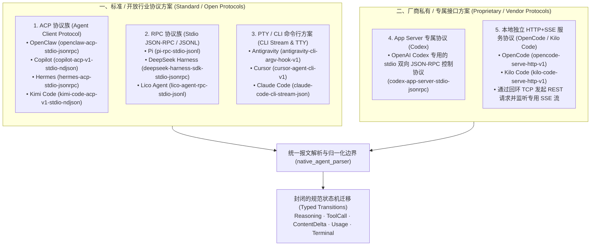

# 智能体适配器架构规范 (Agent Adapters Architecture)

| 关联文档 | 语言 / 路径 | 权威职责 |
|:---|:---|:---|
| **规范版本** | [English (Normative)](AGENT-ADAPTERS-ARCHITECTURE.md) | 智能体适配器架构英文规范 |
| **架构主文档** | [docs/architecture/README.zh-CN.md](README.zh-CN.md) | 四层顶层客户端架构与总览 |
| **兼容性矩阵** | [docs/COMPATIBILITY.zh-CN.md](../COMPATIBILITY.zh-CN.md) | 13 个智能体支持度与驱动清单事实 |
| **报文解析 ADR** | [docs/adrs/0008-native-agent-parser-and-conversation-integrity.md](../adrs/0008-native-agent-parser-and-conversation-integrity.md) | 隔离解析器与终态仲裁设计决策 |
| **命令身份 ADR** | [docs/adrs/0007-user-terminal-agent-command-identity.md](../adrs/0007-user-terminal-agent-command-identity.md) | 用户终端命令发现与启动绑定决策 |
| **Rust 基础设施层** | [RUST-INFRASTRUCTURE-LAYER.zh-CN.md](RUST-INFRASTRUCTURE-LAYER.zh-CN.md) | PTY/TTY、网络传输与动态配置 |

本文档定义 LicoUp 中 **13 个智能体（Agent）适配器的分类体系、协议适配方案、报文解析归一化与运行时调度架构**。

---

## 1. 智能体适配方案两大阵营

LicoUp 针对主流智能体的底层协议特征，将 13 个打包驱动划分为 **标准/开放行业协议方案** 与 **厂商私有/专属接口方案** 两大阵营：

---

## 2. 详细分类与适配协议矩阵

| 协议阵营 | 通道族 (Channel Family) | 智能体 ID | 运行协议标识 (Wire Protocol) | 传输媒介与通信机制 | 厂商/标准特征 |
|:---|:---|:---|:---|:---|:---|
| **标准/开放协议** | **`acp`** | `openclaw` | `openclaw-acp-stdio-jsonrpc` | Stdio JSON-RPC | 标准 ACP 协商、会话列出与加载、事件流式派发 |
| | | `copilot` | `copilot-acp-v1-stdio-ndjson` | Stdio NDJSON | GitHub Copilot CLI 的 ACP 协议子集 |
| | | `hermes` | `hermes-acp-stdio-jsonrpc` | Stdio JSON-RPC | 本地直连 ACP；支持通过 SSH 远程连接 TUI Gateway |
| | | `kimi-code` | `kimi-code-acp-v1-stdio-ndjson` | Stdio NDJSON | Kimi CLI 的标准 ACP 协议流 |
| **标准/开放协议** | **`rpc`** | `pi` | `pi-rpc-stdio-jsonl` | Stdio JSONL | 轻量化行式 JSONL RPC 交互 |
| | | `deepseek-harness` | `deepseek-harness-sdk-stdio-jsonrpc` | Stdio JSON-RPC | DeepSeek Harness 标准 SDK 交互管道 |
| | | `lico-agent` | `lico-agent-rpc-stdio-jsonl` | Stdio JSONL | Lico 内部原生标准智能体通道 |
| **标准/开放协议** | **`cli` / `stream-json`** | `claude-code` | `claude-code-cli-stream-json` | Stdio Stream JSON | Anthropic Claude Code 的流式 JSON 输出 |
| | | `antigravity` | `antigravity-cli-argv-hook-v1` | PTY 伪终端 / 进程参数 | 终端环境模拟、ANSI 捕获与命令 Hook |
| | | `cursor` | `cursor-agent-cli-v1` | PTY 伪终端 / 进程参数 | Cursor CLI 交互式命令行包装 |
| **厂商私有协议** | **`app-server`** | **`codex`** | `codex-app-server-stdio-jsonrpc` | Stdio JSON-RPC | **OpenAI Codex 私有 App Server 协议**，拥有专属的请求握手、上下文补全与工具审批序列 |
| **厂商私有协议** | **`serve-http`** | **`opencode`** | `opencode-serve-http-v1` | 本地回环 HTTP + SSE | **OpenCode 私有守护进程协议**，启动本地 HTTP 监听端口，通过 REST 触发并监听专属 SSE 事件 |
| | | **`kilo-code`** | `kilo-code-serve-http-v1` | 本地回环 HTTP + SSE | **Kilo Code 专属服务协议**，通过本地 Server 交互与流式回传 |

---

## 3. 核心架构机制与归一化设计

无论底层是标准 ACP、命令行 PTY，还是 Codex / OpenCode 的私有协议，LicoUp 均通过以下四层机制实现架构解耦与归一：

### ① 报文边界单点解析（ADR 0008）
- **每个智能体在 `crates/licoup-native/src/platform/native_agent_parser/adapters/<agent>/` 下拥有独立的解析器**；
- 原始返回帧（无论 JSON-RPC、NDJSON、SSE 还是 ANSI 字符串）**只进入一次**该解析器；
- 解析器输出且仅输出封闭的 `Typed Transition`：
  - `ThinkingDelta` / `Reasoning`（思考推理步骤）；
  - `ToolCallRequested`（工具调用请求与参数）；
  - `ContentDelta`（增量文字渲染）；
  - `UsageReport`（Token 消耗统计）；
  - `Terminal(Completed | Failed | Cancelled)`（终态裁决）。

### ② 统一进程监督与看门狗（L3 Process Supervisor）
- 底层传输只负责启动进程、管道读写与 HTTP/SSE 握手；
- 提供跨平台的 **退出监督阶梯**（Grace Period 优雅取消 $\to$ `SIGTERM` $\to$ `SIGKILL`）；
- 消除任何隐式硬编码超时（废除 120s 猜测机制），全部由协议显式 EOF 或错误帧触发终结。

### ③ 会话连续性与强校验（L4 Session Guard）
- **Exact Resume 校验**：当续接旧会话时，必须严格校验目标会话是否存在，找不到会话立即报错（Fail-Closed），严禁静默降级为新建会话；
- **In-Flight 状态声明**：进程异常退出时，诚实向持久层声明未决状态，不篡改历史。

### ④ 虚拟机发现与协议路由（Virtual Machine Routes）
- 针对运行在 OrbStack 或远程服务器上的 Agent（如 `machine@orb` 或 SSH 目标），统一通过系统原生 `ssh -o BatchMode=yes` 建立通道；
- 远程目标同样挂接对应的协议解析器（如 OpenClaw ACP 或 Hermes TUI Gateway），上层业务代码无需感知本地与远程差异。

---

## 4. 架构铁律

1. **禁止在 Flutter 端解析厂商原始协议**：Flutter 永远只消费 Rust 持久化后的 `ClientConversationEvent` 与 `EventPart`，不感知任何 ACP、SSE 或 App Server 细节。
2. **禁止驱动擅自判定完成**：严禁 13 个驱动各自猜完成（如依赖 100ms 静默），完成判定必须由 L1 解析器根据协议显式信号或传输 EOF 独占裁决。
3. **私有协议隔离演进**：Codex 与 OpenCode 等私有协议的变化只影响其对应的 `adapters/<agent>/` 模块，绝对不扩散至统一 Conversation 领域层。
