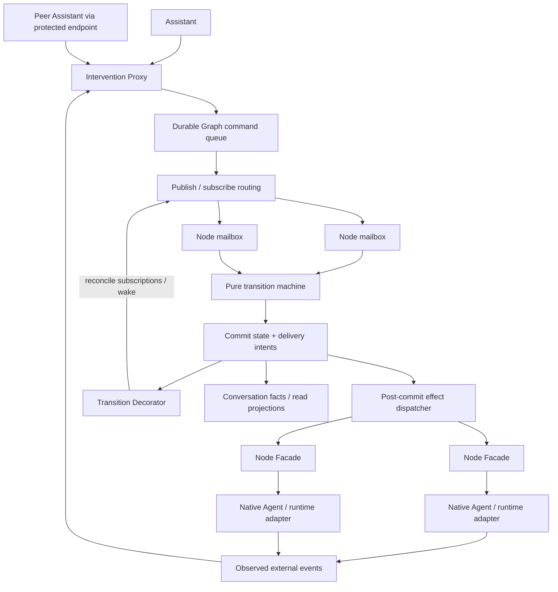

# Assistant workflow control and compiler

| Related document | Path | Authority |
| --- | --- | --- |
| Normative version | This document | Target workflow compiler, intervention and node activation design |
| Localization | [简体中文](ASSISTANT-WORKFLOW-CONTROL.zh-CN.md) | Chinese projection |
| Conversation | [Conversation domain](CONVERSATION-DOMAIN.md) | History, Membership and turn identity |
| Continuity | [Continuous Assistant](CONTINUOUS-ASSISTANT.md) | Long-lived Assistant responsibilities |
| Existing Graph | [Adaptive Flywheel](../functionality/ADAPTIVE-FLYWHEEL.md) | Current workflow format and execution contract |
| Migration | [Client update and state migration](CLIENT-UPDATE-AND-STATE-MIGRATION.md) | Independent CLI, data conversion and client admission |
| Agent backend | [Agent adapters](AGENT-ADAPTERS-ARCHITECTURE.md) | Actual native capabilities and original conversation |
| Current evidence | [Status](../STATUS.md) | Implemented and verified behavior |

**Status: compiler extraction implemented in source, 2026-09-16; runtime control
design accepted and pending.** `licoup-workflow` now owns the existing definition,
diagnostics, compiler indexes and pure transition machine. Native package import,
Assistant preflight and execution use that crate. Queue, Node Facade, successor
handoff, plan caching and new activation semantics below remain target behavior.
This source status does not claim that a distributed binary contains the change.

## 1. Design intent

An Assistant must have enough semantic control to coordinate work without
managing internal processes. It publishes tasks and interventions to named
nodes or nodes with selected characteristics. Nodes can react to external
events as well as Graph dependencies. Pausing, continuing, steering and stopping
are explicit operations with observable outcomes.

The design combines a workflow compiler with an event-driven execution system.
A Proxy admits every Assistant Graph operation into a durable queue. Publish/subscribe
routes it to selected node mailboxes. A Node Facade presents one control surface
over different Agent backends. A transition Decorator connects committed state
changes to subscriptions and notifications. Peer Assistants belonging to
different users can enter through the same Proxy and authority checks.

These patterns have specific jobs. The queue does not decide task meaning, the
Proxy does not invent agreement between users, and a backend does not decide
the Graph's topology. An Agent remains free to answer naturally; structured
commands are tool arguments and runtime facts, never an imposed reply format.

## 2. Compile definitions; execute admitted events

```mermaid
flowchart LR
  INPUT[Workflow source / proposed revision] --> FRONT[Parse and diagnose]
  FRONT --> ANALYSIS[Resolve and validate]
  ANALYSIS --> IR[Typed Graph IR]
  IR --> LOWER[Lower and index]
  LOWER --> PLAN[Immutable execution plan]
  PLAN --> MACHINE[Pure transition machine]
  QUEUE[Admitted commands and external events] --> MACHINE
  MACHINE --> COMMIT[State and effect intents committed]
  COMMIT --> BACKEND[Node Facade and native backends]
  BACKEND --> QUEUE
```

Use the compiler separation demonstrated by
[rustc's compilation overview](https://rustc-dev-guide.rust-lang.org/overview.html):
parsing, semantic representations and lowering have different responsibilities.
[LLVM IR](https://llvm.org/docs/LangRef.html) shows the value of an explicit
representation shared by analyses and backends;
[MLIR's graph rationale](https://mlir.llvm.org/docs/Rationale/MLIRForGraphAlgorithms/)
shows how representations can retain useful structure before lowering.
LicoUp adopts those boundaries, not their implementation stack or every IR tier.

| Stage / proposed module | Input and output | Responsibility |
| --- | --- | --- |
| `licoup-workflow::syntax` | Workflow source to `ParsedWorkflow`: existing `WorkflowDefinition` plus source correspondence | Decode once; preserve node/field locations for diagnostics. Package unpacking and filesystem access stay outside the compiler |
| `licoup-workflow::analysis` | Parsed definition to `AnalyzedWorkflow`: the same definition with resolved symbols and temporary graph facts | Resolve node/slot references; check guards, transition kinds, joins, reachability and legal cycle/visit semantics. Produce one ordered diagnostic path before effects |
| `licoup-workflow::ir` | Existing `WorkflowDefinition`, node, transition, guard and binding vocabulary | This is the single high-level Graph IR. Parsed/analyzed wrappers add phase information, not a second copied Graph model |
| `licoup-workflow::compile` | Analyzed definition and facts to immutable `CompiledWorkflow` | Lower resolved symbols into adjacency, predecessor, routing and join indexes. Retain source-to-node correspondence and observable effect ordering |
| `licoup-workflow::machine` | Plan + active state + admitted event to next state/effect intents | Migrate the existing pure reducer. Track visits and joins; no I/O, process launch, database access, model selection or implicit wall-clock deadline |
| Native runtime backend | Committed intents to actual effects and observed events | Proxy/queue, Node Facade, transition Decorator, storage and native adapters implement concrete execution. Live permission, budget and capability checks happen here |

`licoup-workflow` is one new, substantive crate containing the migrated existing
compiler and reducer. The old implementation exits with its callers and tests.
`licoup-application` keeps its lightweight command/result/port contract and
serialization-only dependency boundary. Native storage and execution remain
outside the pure crate; strategy selection consumes it without owning it.

`RunSnapshot`, `ReducerEvent` and `RunCommand` form the machine's state/event/effect
ABI, not another compiler IR. The overlapping checks formerly owned by
`workflow_diagnostics.rs` and `graph.rs` now use one diagnostic-producing analysis
path. Source, JSON value and typed definition entry points share that analysis;
the typed entry does not serialize and decode the definition again. Lowering
accepts only an analyzed definition, and the compiled definition is read-only.
Legacy conversion belongs to the import/data-conversion boundary; ordinary
runtime compilation must not rewrite a stored definition.

The native plan provider owns a bounded process-local cache of shared immutable
plans keyed by existing revision/semantics identity. Active references count
toward its memory use. Prepare a missing plan outside the write transaction;
at commit, check the run still names that immutable revision. Do not recompile
for each event or persist a second executable format. More elaborate incremental
candidate analysis is deferred until edit latency justifies it.

Static validity is not runtime authority. Compilation may establish that a
binding or operation has a valid shape; it cannot establish that a user still
has permission, an Agent remains available or a budget remains sufficient.
Any optimization must preserve visible commands, event provenance, joins and
effect order. No speculative model call, duplicated effect, dropped intervention
or reordered cancellation is permitted as a compiler optimization.

Compile a proposed revision independently. Its eventual admission checks the
expected current revision through the Proxy. An active run remains bound to
its immutable plan. A changed definition creates a successor revision/run and
an atomic intent handoff in the owning Graph store; already started effects
remain with their original run. Ordinary steering does not require recompiling
the Graph. A new revision does not inherit an old whole-Graph authorization for
different effects.

### Causal inputs, handoff and execution versions

The compiler retains data dependencies as well as control edges. At visit admission,
bind predecessor result identities and shared-resource versions; an invocation must
not silently read a later global context. Shared writes use an explicit merge,
compare-and-set or resource constraint. Resolve conflicts locally without a graph-wide
batch barrier. A result reference grants no access to its content.

Successor admission and command claim/start checks share the owning store's atomic
boundary. Compare owner, revision, visit/generation and execution state so an old
owner cannot claim after its scan or start from a cached permit after handoff commits.
Transfer only declared unstarted intents. In-flight effects retain their original run;
a successor may explicitly reference their authenticated results with current read
authority. An old visit cannot satisfy a new join or cause replay of an old effect.

Definition identity alone does not identify lowering, join or reducer semantics.
Resuming a checkpoint must bind the execution semantics and its compatibility rules.
Use a compatible interpreter, a tested migration, or retain the original owner/version
until a safe boundary. Do not introduce a second authoritative compiled format. These
runtime requirements remain pending after the pure compiler extraction.

## 3. The runtime control structure

The queue is part of the existing local execution authority and durable stores.
It is not a new server deployment or a universal bus for every product event.
Reuse existing command/event identities, tables and native execution handles.
Memory channels carry wakeups and bounded work; durable records remain the
authority when a process or observer disappears.

### Proxy: one admitted path, explicit conflicts

Every local or peer Assistant operation that mutates a Graph or its nodes enters
the Proxy. Ordinary Conversation work need not construct a Graph. CLI, MCP and GUI map
to the same application operation. Remote peers first pass the endpoint's
identity and trust boundary. The Proxy validates the principal, Graph scope,
operation, target selector and expected revision, then durably admits the
command. It never directly calls an Agent or bypasses the queue.

`ActorClaim` is a claim shape, not peer authentication. The endpoint adapter
constructs an internal, non-serializable verified principal from its protected
session; a remote payload cannot choose `LocalAdmin`, provider identity or a
Membership as proof of authority. Preserve the existing late run-owner checks
and extend the authorization owner with operation-scoped grants. Conversation
Membership, Assistant designation and permission to control a Graph are separate
facts. Grants may cover normal collaboration without approval on every request.

Read access also remains scoped: list, search, inspect, export and subscription
results are filtered by the current principal's authority. Do not expose the
local administrative Conversation facade unchanged to peers. Subscribe creation,
each activation and result delivery are authorized at their actual use; a
subscription cannot broadcast private content to arbitrary callback locations.

One execution authority owns each Graph's mutation order. Peer Assistants are
authorized publishers, not competing writers to the same database. Independent
Graphs can proceed concurrently. Within one Graph, short state commits are
ordered; long Agent invocations are not performed under that serialization
lock. Offline peers may retain pending requests but cannot claim admission or
start a competing copy of the Graph.

The active data-root host generation owns the Graph store and command dispatch.
Handoff drains or reaches an actual recoverable boundary, persists outstanding
intents and releases ownership before the next generation takes over. A lease
observation alone cannot fence out a still-active host or declare work failed.

Queue order solves concurrent mutation order, not semantic disagreement:

| Request relation | Handling |
| --- | --- |
| Same logical request redelivered | Bind the existing request identity to the verified principal and command content; return its recorded result. Reusing that identity for different content is a conflict |
| Independent nodes or additive messages | Admit independently and retain actual publication order and authorship |
| Replacement or structural edit based on an old revision | Return a typed conflict with the relevant current revision; the author must rebase or publish a new proposal |
| Contradictory exclusive controls on the same node/invocation | The first matching control revision is admitted; a stale competing revision conflicts. Preserve author and precondition, without silently overwriting an accepted decision |
| Steer races with completion | If completion commits first, steer reports that the exact invocation settled. If steer is admitted first, delivery still reports the backend's actual outcome; it cannot guarantee intervention took effect before completion |
| Stop/cancel races with resume or new submit | Stop-requested is monotonic for that invocation. Later steer/resume cannot resurrect it; a new task needs its own identity and an admitting scope, not an implicit restart |
| Resume arrives while pause is being negotiated | A matching explicit control may withdraw a local drain request before native pause is accepted. Otherwise report the pending transition and retain an explicitly requested follow-up resume; never claim Running before the relevant backend observation |
| Revoked permission or stale target generation | Reject that delivery before effect; publication earlier in time does not preserve authority |
| An explicit decision gate or participant-declared semantic disagreement | Keep an attributable pending decision for authorized participants. Do not classify prompt text to manufacture disagreement or ask a human about every technical conflict |

A definition revision identifies immutable Graph semantics; a control revision
identifies exclusive transitions in the relevant run/node/invocation scope;
output sequence is a reading cursor. A control command uses its relevant
control revision, not every token sequence or an unrelated node's progress.
Authorization and budget use their existing owners. Labels such as `frontend` or `codex`
select recipients; they do not grant authority.

### Publish/subscribe: routing has precise recipients

Selectors address explicit node IDs or indexed characteristics: active lifecycle
state, actual adapter identity, declared work role and supported operations.
Use existing registry identity for adapter facts and explicit configuration for
work-role tags. Do not infer tags from an Agent's prose or let a tag override
permissions.

A one-shot publication freezes its matched recipient IDs/generations at
durable admission. Each recipient gets its own delivery identity and outcome;
later matching nodes do not silently receive it. Recheck live state and
permission before each effect. If a selected Running node finishes before
steer is applied, report the state change; do not silently start a new task.

A persistent subscription is a separate explicit operation with scope,
predicate, activation rule and durable cursor. It may match future node/state
events until removed. State entry activates the relevant subscription;
state exit releases it. Control subscriptions remain available during pause
and stop negotiation. Waiting nodes may subscribe for relevant external input.
Paused nodes retain control, result and reconciliation delivery by default;
only an explicitly declared and authorized activation rule can resume them.
Stop-requested nodes cannot start new work from a data subscription. A
subscription creates work only when its rule and runtime admission allow it.

Broadcast to all matches and dispatch to one eligible worker are distinct
delivery modes. The caller chooses one; a work request is not multiplied across
every matching Agent by accident. New invocation admission remains subject to
the shared budget. Each node receives an explicit per-target outcome if only
part of a broadcast can proceed.

Maintain indexes by the selected characteristics, updating only entries affected
by a committed transition. Exact delivery is proportional to the addressed
nodes; filtered delivery intersects relevant index sets and visits matches.
Avoid scanning all historical nodes for every completion. Bound queue entries
and bytes, with separate control/data capacity and fair service; no global priority stream
may starve all background work.

### Node Facade: uniform operations, truthful capabilities

The facade maps node identity to the existing Membership/native-session/runtime
binding. It does not create a second Agent catalog or transcript. Non-Agent
runtime nodes can implement the same control surface through their own adapter.

| Semantic operation | Required behavior |
| --- | --- |
| Submit | Accept a new task for the addressed node only after dependency, permission and resource admission |
| Steer | Deliver intervention to the exact in-flight invocation when the native backend supports it; otherwise expose a safe-boundary follow-up or unsupported result |
| Pause / drain | Stop admitting new node work, continue accepting results and controls, and reach a safe boundary; true in-flight suspension is claimed only with native support |
| Resume | Resume the admitted waiting state or native suspended invocation using the actual supported capability |
| Stop / cancel | Cooperatively request the defined scope of termination; preserve requested, acknowledged and effect-unknown facts separately |
| Observe | Return current state, capabilities and durable progress cursor without starting or extending paid work |

The surface is uniform; capabilities are not fabricated. One native session
has one writer across all facades/entry aliases. Unsupported steering cannot be
implemented by killing and recreating the process. Process signals remain a
lower-level explicitly authorized recovery capability, not normal graph control.

### Transition Decorator: hook after durable state change

Wrap the transition application boundary, not every Agent output or Widget.
The pure machine returns a next state and effect/subscription intents. The
owning transaction commits state and those intents together. After commit the
Decorator publishes transition notifications and reconciles external event
subscriptions. It does not call network/model code inside the transaction or
recursively reenter the reducer from a callback.

External events come back through queue admission with source identity, cursor
and target generation. Subscribe plus catch-up closes the gap between state
commit and live registration. After a crash, reconcile subscription intent and
replay from the durable cursor; do not rely on an in-memory listener list. A
duplicate event cannot create a second logical delivery. Cross-store handoffs
use existing identities and durable reconciliation, not a claimed transaction
over unrelated stores.

This is how a paused/waiting node can be activated by a relevant external event
without polling a model or keeping the whole Graph inside a blocking loop.
Results from old visits remain historical facts and cannot activate a new visit.

## 4. Graceful lifecycle and recovery

Lifecycle below describes control semantics; map it to the existing typed state
model during implementation instead of keeping parallel status flags.

| Transition | Admission and remaining work |
| --- | --- |
| Ready to running | A task or declared activation is admitted; its effect is recorded before execution |
| Running to pause requested | New work for the scope stops. In-flight work may finish; supported native pause can be requested. Results and resume/stop controls still flow |
| Pause requested to paused | The relevant safe boundary is actually observed; this is not inferred from elapsed time |
| Paused/waiting to running | An authorized resume or matching activation is admitted, preserving node/session identity |
| Any active state to stop requested | Prevent new work in scope; request supported cooperative cancellation or drainage according to the command |
| Stop requested to stopped | Owned work has actually stopped or drained. Unresolved external effects remain explicit and recoverable |
| Host loss or unknown effect | Reconcile the original native invocation and durable command; do not convert an already started effect into blind retry |

The Assistant can publish control to one node, all running nodes, all nodes
using an adapter, or a declared work-role subset. Graceful graph pause/stop
collects per-node outcomes; one unavailable backend does not fabricate success
or block unrelated Graphs. There is no fixed deadline that force-kills work.
Observational and transport waits may expire without settling the domain task.

A one-shot selector freezes its recipients. Graph-scope pause/cancel also establishes
a scope admission barrier: newly ready nodes and future activations in that scope
cannot start while it applies. Reporting that control was admitted or new work was
blocked does not prove an operating-system process actually paused. Unsupported pause
is reported as such, and authenticated late results still settle their original effect.
Revocation and execution isolation follow the [security boundary](SECURITY-AND-DATA-BOUNDARY.md).

Accepted and started receipts must follow the relevant durable transaction commit.
The store must state whether its guarantee covers process loss or power loss and bind
that statement to its writer, WAL, synchronous and checkpoint settings. Configuration
and process-kill tests alone are not power-loss evidence; no cross-store atomicity is
implied. Control responsiveness follows the [native interaction boundary](CLIENT-NATIVE-INTERACTION.md).

An execution completion is applied immediately after durable receipt. In a
Graph with A→C and independent B, C can start while B still runs. Only an
explicit join waits for its required branches and visit. Queue publication
acknowledgement, node admission and effect completion are different facts,
as illustrated by the separation of publisher and consumer acknowledgements
in [RabbitMQ's documentation](https://www.rabbitmq.com/docs/confirms).
LicoUp does not gain external exactly-once effects merely by adding a queue.

## 5. Host, migration tool and peer boundary

The independent local host survives GUI exit and owns execution. A reconnecting
GUI reads the same facts; it does not replay business commands to reconstruct
its display. The running host keeps its matching read-only code and runtime
resources while an update candidate is staged. An incompatible candidate waits
for controlled handoff rather than replacing live resources or taking ownership.

The independent Node.js migration CLI participates in this refactor under its
[existing migration contract](CLIENT-UPDATE-AND-STATE-MIGRATION.md). It needs a
consistent source: request maintenance/drain through the same control path,
wait for actual safe ownership release, then acquire the data-root lock and
convert stores. It can operate without an installed client and ships any
required authorized native helper. Historical bidirectional codecs remain
maintained assets. Current pending commands, subscriptions, source cursors,
unknown effects and successor handoffs are part of its data contracts.

The workspace now pins **Rust 1.95.0**, including member MSRV declarations and
the matching CI action revision. Compiler, native host, protocol SDK integration
and any tool-shipped native helper use that baseline. A source pin does not prove
that a future SDK/helper or every target platform has compiled or run.

Peer control uses the actual protected endpoint boundary before the local
Proxy. No new peer-visible message protocol is defined here. A transport
receipt is not Proxy admission, node acceptance or task completion. Trust and
revocation remain effective at use, and membership does not imply permission
to steer every node. Concurrent-user support must test conflicting controls,
not just demonstrate two users can connect.

## 6. Implementation and acceptance boundaries

Migrate complete functional units: pure compiler/machine; durable Proxy/queue
and routing; facade/native controls; transition hooks and event ingress; host
handoff and migration-tool integration. Shared IR/control types are agreed
first. Pure compilation, runtime ports using controlled nodes, platform
adapters and CLI conversion can then be developed independently. The integration
owner alone changes shared roots and public schema outputs.

Required observable cases include:

- Compile valid branches/joins/cycles; report invalid references at the source;
  preserve effects and diagnostics across lowering and revision reuse.
- Start C after A without waiting for independent B; deliver a published control
  to each admitted target once; report targets that changed state or authority.
- Pause, resume and stop through actual capabilities without killing a process
  to simulate unsupported control; accept controls while body output is busy.
- Crash between transition commit and listener registration, or after an effect
  before outcome recording; restore subscriptions and reconcile unknown effects.
- Submit stale and contradictory peer operations; retain authorship and visible
  conflicts without silent last-writer replacement or a second Graph owner.
- Convert current data with the independent CLI, including pending delivery and
  unknown-effect records; prove the selected older/newer target can open its
  representable data and preserve unsupported state for later recovery.
- Change runtime version while work is active; preserve original code/resources,
  identity, fees and pending controls until the observed handoff boundary.

Use the existing compiler/reducer/store/native tests and targeted integration
fixtures. Tests of the new design are required during implementation; this
architecture document alone supplies no runtime or performance evidence.
