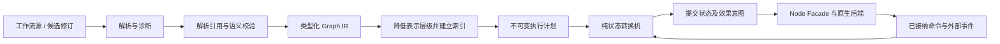
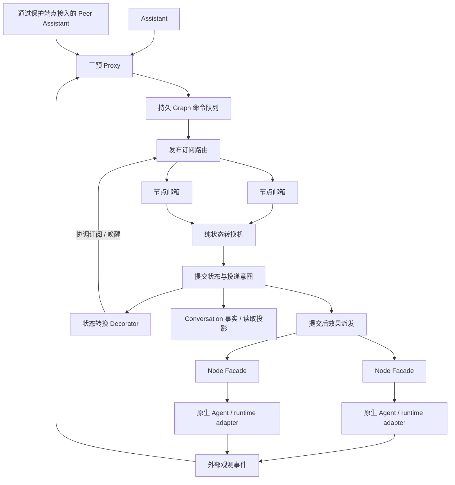

# Assistant 工作流控制与编译器

| 相关文档 | 路径 | 权威范围 |
| --- | --- | --- |
| 规范版本 | [English](ASSISTANT-WORKFLOW-CONTROL.md) | 工作流编译器、干预与节点激活的目标设计 |
| 本地化 | 本文 | 中文投影 |
| Conversation | [Conversation 领域](CONVERSATION-DOMAIN.md) | 历史、Membership 与回合身份 |
| 连续服务 | [Continuous Assistant](CONTINUOUS-ASSISTANT.md) | Assistant 长期责任 |
| 现有 Graph | [Adaptive Flywheel](../functionality/ADAPTIVE-FLYWHEEL.md) | 当前工作流格式与执行合同 |
| 数据迁移 | [客户端更新与状态迁移](CLIENT-UPDATE-AND-STATE-MIGRATION.md) | 独立 CLI、数据转换与客户端准入 |
| Agent 后端 | [Agent 适配器](AGENT-ADAPTERS-ARCHITECTURE.md) | 真实原生能力与原始对话 |
| 当前证据 | [Status](../STATUS.md) | 已实现、已验证的行为 |

**状态：2026-09-16 编译器提取已落入源码；运行时控制设计已接受、尚待实施。** `licoup-workflow` 已拥有现有定义、诊断、编译索引和纯状态转换机；native 包导入、Assistant 预检和执行接入该 crate。下文的队列、Node Facade、后继交接、计划缓存及新激活语义仍为目标，不表示分发二进制已有这些变更。

## 1. 设计意图

Assistant 应有充分的语义操作空间来协调工作，无需管理内部进程。它向指定节点或符合特征的节点发布任务和干预。节点既可被 Graph 依赖激活，也能响应外部事件。暂停、继续、转向和停止都有明确操作及可观察结果。

架构由工作流编译器和事件驱动执行系统组成。Proxy 将所有 Assistant Graph 操作准入到持久消息队列；发布订阅将其路由到目标节点邮箱；Node Facade 统一不同 Agent 后端的控制表面；状态转换 Decorator 将已提交的状态变化连接到订阅与通知。不同用户的 Peer Assistant 通过同一代理及权限边界协作。

每个模式都有具体职责：队列不替用户决定任务含义，代理不能凭空建立多用户共识，后端不决定 Graph 拓扑。Agent 仍可自然回复；结构化命令属于工具参数和运行事实，不是强制回复格式。

## 2. 编译定义，执行已接纳事件

参考 [rustc 编译流程](https://rustc-dev-guide.rust-lang.org/overview.html) 区分解析、语义表示与 lowering；参考 [LLVM IR](https://llvm.org/docs/LangRef.html) 用明确表示连接分析和后端；参考 [MLIR 的图算法设计](https://mlir.llvm.org/docs/Rationale/MLIRForGraphAlgorithms/) 在降低表示层级前保留所需结构。采用这些职责边界，不引入其技术栈或机械复制所有 IR 层。

| 阶段 / 目标模块 | 输入与输出 | 职责 |
| --- | --- | --- |
| `licoup-workflow::syntax` | 工作流源 → `ParsedWorkflow`：现有 `WorkflowDefinition` 加来源对应 | 边界解码一次，保留节点/字段诊断位置；解包和文件 I/O 留在编译器外 |
| `licoup-workflow::analysis` | 已解析定义 → `AnalyzedWorkflow`：同一定义加已解析符号和临时图事实 | 解析节点/slot 引用，检查 guard、转换类型、join、可达性和循环/visit 语义；效果前通过一个入口给出有序诊断 |
| `licoup-workflow::ir` | 现有 `WorkflowDefinition`、节点、边、guard 和 binding 词汇 | 唯一高层 Graph IR；解析/分析包装只增加阶段信息，不复制第二图模型 |
| `licoup-workflow::compile` | 已分析定义及事实 → 不可变 `CompiledWorkflow` | 将已解析符号降低为邻接、前驱、路由和 join 索引；保留源节点对应及可观察效果顺序 |
| `licoup-workflow::machine` | 执行计划 + 活跃状态 + 已接纳事件 → 新状态/效果意图 | 迁入现有纯 reducer，管理 visit 和 join；不做 I/O、启动进程、访问数据库、选模或设隐式执行截止 |
| native 运行时后端 | 已提交意图 → 实际效果及观测事件 | Proxy/队列、Node Facade、转换 Decorator、存储和原生 adapter 落实执行；当前权限、预算与能力在此准入 |

`licoup-workflow` 是一个完整承接现有编译器/reducer 的实际核心 crate，旧实现及调用/测试一起迁移。`licoup-application` 保留仅序列化依赖的轻量请求/结果/ports 契约。具体存储和执行留在 native；策略消费内核，不拥有内核。

`RunSnapshot`、`ReducerEvent`、`RunCommand` 是 machine 的状态/事件/效果 ABI，不是另一份编译 IR。原 `workflow_diagnostics.rs` 和 `graph.rs` 的重叠校验已合为一个产生诊断的语义分析入口。源码、JSON value 和 typed definition 共用分析；typed 入口不再序列化后重复解码。lowering 只接受已分析定义，编译后的定义只读。历史转换属于导入/数据转换边界，普通运行期编译不能改写已存定义。

native plan provider 按已有 revision/semantics 身份维护有界、进程内共享不可变计划缓存，活跃引用也计内存。缺少计划时在写事务外准备，提交时检查 run 仍绑定该不可变 revision。不每事件重编译，不持久化第二执行格式；复杂候选增量分析等实际编辑延迟证明需要再引入。

静态合法不等于运行授权。编译可以证明绑定或操作形状有效，不能证明用户权限仍在、Agent 当前可用或预算仍足够。优化必须保留可见命令、事件来源、join 和效果顺序；不得把推测模型调用、重复效果、丢弃干预或重排取消当作编译优化。

候选修订可独立编译，最终经 Proxy 按预期当前版本准入。活跃 run 固定不可变计划；定义变化通过后继 revision/run 和原 Graph store 中的原子意图交接承接，已开始效果留在原 run。普通 steer 不重编译整图；不同效果的新修订不能继承旧整图授权。

### 因果输入、交接与执行版本

编译器保留数据依赖和控制边。visit 接纳时绑定前驱结果身份与共享资源版本，调用不得
静默读取更新的全局 context。共享写入使用显式合并、CAS 或资源约束，局部解决冲突，
不恢复整图批次屏障。结果引用不授予内容读取权。

successor 接纳与命令认领/启动检查共用原 store 的原子边界，核对 owner、revision、
visit/generation 和执行状态，阻止旧 owner 扫描后抢领或凭缓存 permit 在交接提交后
启动效果。仅转移明确的未开始意图；在途效果仍属原 run，新 run 可在当前读取授权下
显式引用其认证结果。旧 visit 不得满足新 join，也不得重放旧效果。

定义身份不能标识 lowering、join 和 reducer 的执行语义。checkpoint 恢复必须绑定
执行语义及兼容规则，采用兼容解释器、受测迁移或保留原 owner/version 到安全边界。
不另建第二份权威 compiled 格式。纯编译器迁出后，这些运行期要求仍待实施。

## 3. 运行期控制结构

队列属于现有本地执行权威和持久域，不增加服务部署或覆盖所有产品事件的全局总线。复用已有命令/事件身份、表和原生执行句柄。内存通道传唤醒与有界工作；进程或观察者消失时，以持久记录为准。

### Proxy：所有操作准入同一路径，冲突有明确含义

所有本地及 Peer Assistant 对 Graph/所属节点的修改均经 Proxy，普通 Conversation 工作无需创建 Graph。CLI/MCP/GUI 映射到同一用例；远端先通过端点身份和信任边界。Proxy 验证发起者、Graph 范围、操作、目标选择器和预期版本后持久接纳；不能直接调用 Agent 或绕队列执行。

`ActorClaim` 只是声明形状，不是 Peer 身份认证。端点适配器从受保护会话构造不可序列化的内部 verified principal；远端载荷不能自选 `LocalAdmin`、provider 或 Membership 作为授权证明。保留现有运行归属的晚检查，并在原授权属主增加操作范围 grant。Conversation 成员、Assistant designation 和 Graph 控制权是不同事实；正常协作可由持续授权覆盖，无需每次批准。

读取也有范围：list/search/inspect/export/订阅结果按当前 principal 权限过滤，不能把本地管理 facade 原样暴露给 Peer。订阅创建、每次激活、结果交付均在实际使用时准入；订阅不能把私人内容广播到任意 callback 地址。

每张 Graph 只有一个执行权威确定变更顺序。Peer Assistant 是获准发布者，不是竞争写同一数据库的宿主。独立 Graph 可并行；单图只序列化短状态提交，不在锁内等待长 Agent 调用。离线 Peer 可保留待发请求，但不能声称已准入或启动竞争副本。

活动数据根的宿主 generation 拥有 Graph store 与派发；交接需排空或到达真实可恢复边界，保存未决意图、释放所有权后下一 generation 才接管。租约观察本身不能排除仍活跃的宿主，也不能判工作失败。

队列顺序解决并发写入顺序，不能自动解决语义分歧：

| 请求关系 | 处理规则 |
| --- | --- |
| 同一逻辑请求重复投递 | 原请求身份绑定已验证 principal 和命令内容，返回已记录结果；同身份不同内容返回冲突 |
| 独立节点操作或追加消息 | 可独立准入，保留实际发布顺序和作者 |
| 基于旧 revision 的替换/结构修改 | 返回类型化冲突及相关当前版本，由发起者重定基线或发布新提案 |
| 同节点/同 invocation 的互斥控制相矛盾 | 首个匹配控制 revision 的操作被接纳，过期竞争版本返回冲突；保留作者与前置，不静默覆盖 |
| steer 与完成竞争 | 完成先提交则报告准确 invocation 已结算；steer 先接纳仍须报告原生实际结果，不能保证转向一定在完成前生效 |
| stop/cancel 与 resume 或新 submit 竞争 | 该 invocation 的 StopRequested 单调，后续 steer/resume 不能使其复活；新任务需新身份及允许准入的作用域，不隐式重启 |
| 请求暂停期间收到 resume | 控制版本匹配且原生 pause 尚未接纳时，可撤回本地排空请求；否则报告协商中并保留明确请求的后续 resume，不能在所需原生观察前显示已运行 |
| 权限撤销或目标 generation 过期 | 效果前拒绝该投递，较早发布不能保留已撤销权限 |
| 明确 decision gate 或参与者声明实际语义分歧 | 保存有来源的待决事项，交有权参与者解决；不分类 prompt 制造分歧，也不为每个技术冲突请求人类 |

definition revision 表示不可变图语义，control revision 表示相应 run/node/invocation 范围的互斥转换，output sequence 只作读取游标。控制命令不使用每个 token 序号或无关节点进度作前置。权限和预算沿现有属主；`frontend`、`codex` 等标签只选收件者，不授予权限。

### 发布订阅：精确区分收件者与订阅寿命

选择器可以指定节点 ID，或按已索引特征过滤：真实生命周期状态、实际 adapter 身份、声明的工作角色和支持的操作。adapter 身份来自已有 registry，工作角色来自明确配置；不从 Agent 散文猜标签，不用标签绕过权限。

一次发布在持久准入时固定匹配的节点 ID/generation，为每个收件者记录投递身份和结果；后来才匹配的节点不会自动收到旧命令。执行前重检状态和权限。选中的 Running 节点若在 steer 前结束，如实报告状态变化，不能悄悄新建任务。

持续订阅是单独的明确操作，带作用域、谓词、激活规则和持久游标，可在被移除前匹配未来节点/状态事件。进入状态激活对应订阅，离开状态释放；暂停和停止协商期间仍保留控制订阅。Waiting 可订阅相关外部输入；Paused 默认只保留控制、结果和对账投递，只有明确声明且获准的激活规则才能恢复；StopRequested 不得被数据订阅启动新工作。规则与运行准入共同决定订阅能否产生工作。

向所有匹配节点广播与从匹配节点中选一个工作者，是不同投递模式，由调用方明确选择；不能把一次委派意外放大成所有 Agent 同时执行。新 invocation 仍受共享预算约束；广播只能部分推进时，每个目标都有明确结果。

按特征维护索引，只在已提交状态变化时更新受影响项。精确投递的工作量随收件者增长；过滤时先交集相关索引，再访问匹配项，不每次扫描所有历史节点。队列同时有条目/字节界限，控制与正文容量分开，公平服务保证后台也能推进。

### Node Facade：操作统一，能力如实

外观将节点身份映射到现有 Membership/native-session/runtime 绑定，不新建 Agent 目录或对话历史。非 Agent 的 runtime 节点也可经自己的 adapter 实现同一控制表面。

| 语义操作 | 必须兑现的行为 |
| --- | --- |
| Submit | 依赖、权限和资源准入后，向指定节点接纳新任务 |
| Steer | 原生支持时转向准确在途 invocation，否则给出安全边界后续输入或不支持结果 |
| Pause / drain | 停止新工作准入，继续接收结果和控制并到达安全边界；只有原生支持才声明在途真正挂起 |
| Resume | 用实际能力恢复已接纳的等待状态或原生挂起调用 |
| Stop / cancel | 按请求范围协作终止，分别保留已请求、已确认和效果未知事实 |
| Observe | 返回状态、能力和持久进度游标，不启动或延长付费工作 |

表面统一不意味着虚构能力。同一原生 session 跨所有外观及入口仍只有一个写者。不支持 steer 时不能用杀进程再新建模拟；进程信号属于更底层的显式获准恢复能力，不是常规 Graph 控制。

### 状态转换 Decorator：持久提交后 Hook

装饰器包装状态转换应用边界，不包装每条输出或每个 Widget。纯状态机返回新状态与效果/订阅意图；所属事务一起提交。提交后由 Decorator 发布转换通知、协调外部事件订阅；不在事务内调用模型/网络，也不让 callback 递归重入 reducer。

外部事件带来源身份、游标及目标 generation，经队列准入回来。“订阅 + 补读”消除提交和实时注册之间的缺口。重启从持久订阅意图和游标恢复，不依赖内存监听列表；重复事件不能创造第二逻辑投递。跨库交接使用已有身份和持久对账，不虚构跨所有 store 的同一事务。

这样等待或暂停节点可以被相关外部事件激活，不必轮询模型，也不必让整个 Graph 困在一个阻塞循环。旧 visit 的结果仍可保存为历史，不能激活新 visit。

## 4. 优雅启停与恢复

下表定义控制语义；实施时映射到现有类型化状态模型，不保留两套平行状态标记。

| 状态转换 | 准入与剩余工作 |
| --- | --- |
| 就绪 → 运行 | 接纳任务或声明的激活，执行前保存效果记录 |
| 运行 → 请求暂停 | 停止范围内新工作；在途可收敛，支持时请求原生暂停；结果及 resume/stop 控制仍流动 |
| 请求暂停 → 已暂停 | 实际观察到所需安全边界，不按经过时间推定 |
| 已暂停/等待 → 运行 | 获准 resume 或匹配激活被接纳，保留节点和会话身份 |
| 任一活跃状态 → 请求停止 | 阻止范围内新工作，按命令请求支持的协作取消或排空 |
| 请求停止 → 已停止 | 所属工作实际停止或排空；未决外部效果仍明确保留、可恢复 |
| 宿主丢失/效果未知 | 对账原 native invocation 与持久命令，不把已开始效果变成盲重试 |

Assistant 可以给单节点、所有运行节点、指定 adapter 节点或角色子集发布控制。整图暂停/停止汇总逐节点结果；某后端不可用不能伪造成功，也不阻塞无关 Graph。没有固定期限强杀工作；观察与传输等待可结束，但不结算领域任务。

完成一经持久接收立即应用。A→C 加独立 B 的图中，C 可以在 B 仍运行时启动；只有明确 join 等待其必要分支和 visit。队列发布确认、节点准入、效果完成分别记录；[RabbitMQ 的确认说明](https://www.rabbitmq.com/docs/confirms) 也区分发布者与消费者各自的确认范围。增加队列并不使任意外部效果自动获得 exactly-once 保证。

一次性选择器冻结接收者；Graph scope 暂停/取消还须在权威接纳边界阻止作用域内新就绪
节点和未来激活。控制已接纳、新工作已阻止、OS 进程实际暂停是不同事实；不支持暂停
须如实报告，认证的迟到结果仍结算原效果。撤权和执行隔离沿[安全边界](SECURITY-AND-DATA-BOUNDARY.zh-CN.md)。

Accepted/started 回执必须在对应持久事务提交后发出。store 明确承受进程丢失还是还
承受断电，并绑定 writer、WAL、synchronous 与 checkpoint 配置。配置和杀进程测试
不能证明断电恢复，也不代表跨 store 原子性。控制响应沿[原生交互边界](CLIENT-NATIVE-INTERACTION.md)。

## 5. 宿主、迁移工具与 Peer 边界

独立本地宿主在 GUI 退出后继续拥有执行。重连 GUI 读取原事实，不重放业务命令补界面。运行宿主保留匹配的只读代码及资源，更新候选独立暂存；不兼容时等待受控交接，不覆盖活跃资源或争抢所有权。

独立 Node.js 迁移 CLI 依[现有迁移合同](CLIENT-UPDATE-AND-STATE-MIGRATION.md) 纳入本次改造。它需要一致源数据：通过同一控制路径请求维护/排空，等到真实安全所有权释放后取得数据根锁，再转换各 store。没有安装客户端时也可运行，需要的原生 helper 随工具提供且遵守授权。历史双向转换 codec 是永久维护资产；未决命令、订阅、来源游标、未知效果和后继交接进入对应数据合同。

workspace 已固定 **Rust 1.95.0**，包含成员 MSRV 声明及对应 CI action 修订。编译器、native 宿主、协议 SDK 接入及迁移工具自带 helper 共用此基线。源码固定不能证明未来 SDK/helper 或全部目标平台已编译和运行。

Peer 控制先通过真实保护端点，再进入本地 Proxy；本文不定义另一套对端消息协议。传输收据不等于 Proxy 准入、节点接纳或任务完成。信任和撤销在实际动作处生效；拥有成员身份不代表能控制所有节点。多用户支持须验证矛盾控制，不只演示两人能连上。

## 6. 实施与验收边界

按完整功能单元迁移：纯编译器/状态机；持久 Proxy/队列/路由；Facade/原生控制；转换 Hook/事件接入；宿主交接/迁移工具。先确定共享 IR 与控制类型，之后纯编译、受控节点的 runtime 端口、平台 adapter 和 CLI 转换可各自开发。共享根及公共 schema 生成物只由集成人写入。

必须验证的外部行为：

- 合法分支/join/循环可编译，非法引用有源位置；lowering 和 revision 复用保留效果及诊断。
- A 完成即启动 C，不等独立 B；控制对每个接纳目标只产生一次逻辑投递，状态/权限变化有明确结果。
- pause/resume/stop 用真实能力，不杀进程模拟不支持操作；正文繁忙时仍可接纳控制。
- 状态提交后、监听注册前崩溃，以及效果发生后、结果保存前崩溃；订阅可恢复、未知效果先对账。
- Peer 的旧版本和矛盾操作保留作者及可见冲突，不静默覆盖或启动第二 Graph owner。
- CLI 转换当前数据及未决投递/未知效果；目标旧版/新版可打开其可表达数据，额外状态可恢复。
- 在途更新保留原代码/资源、身份、费用与待决控制，直到实际交接边界。

沿现有 compiler/reducer/store/native 测试和定向集成夹具验收。实施时需要这些测试；架构文档本身不提供运行或性能通过证据。
