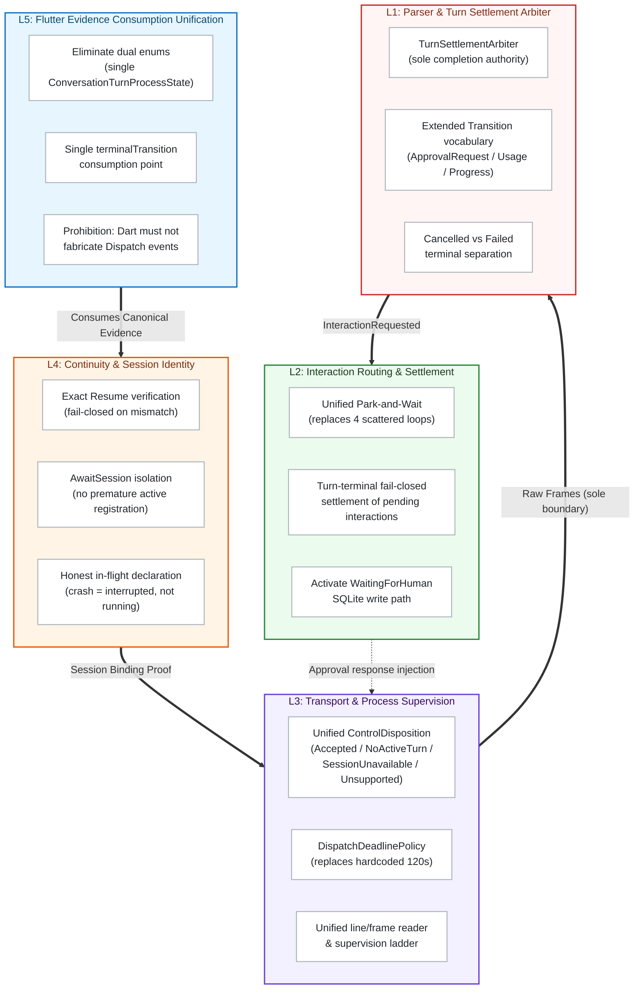
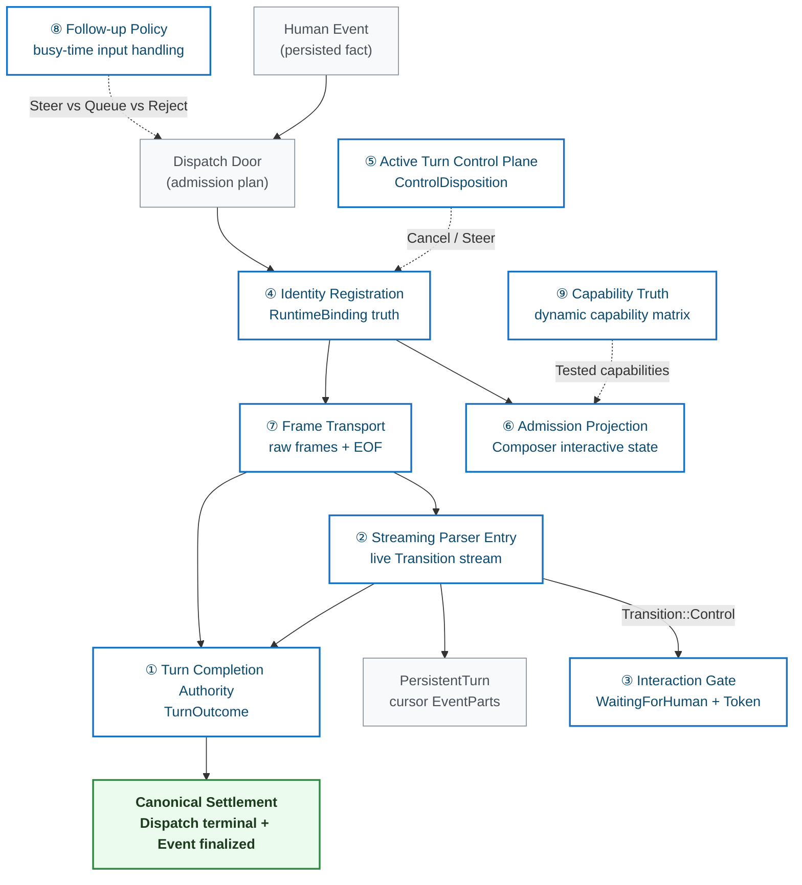
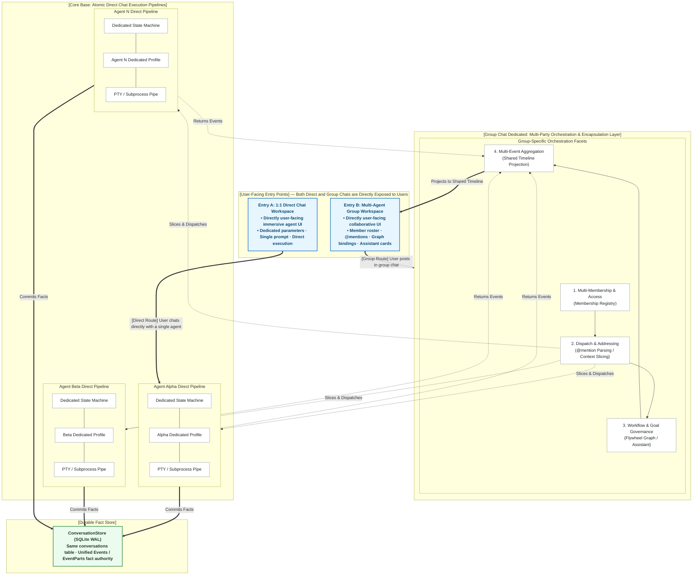
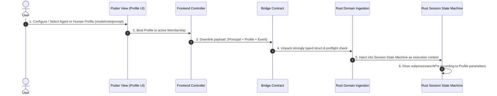
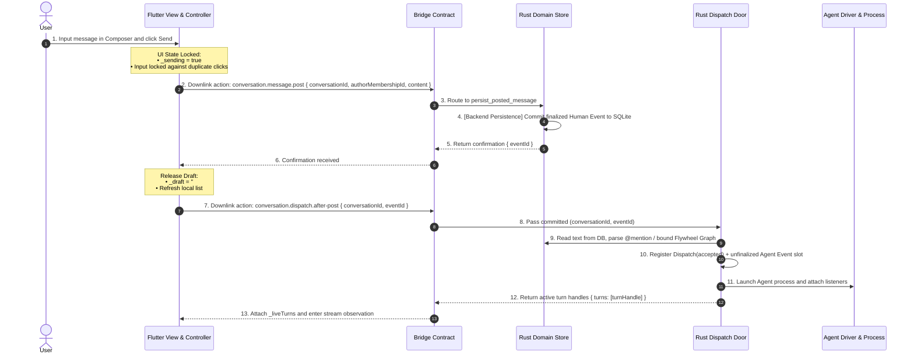
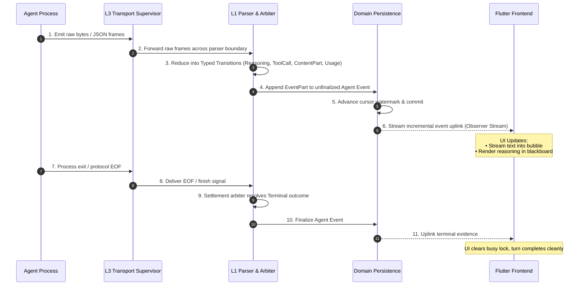
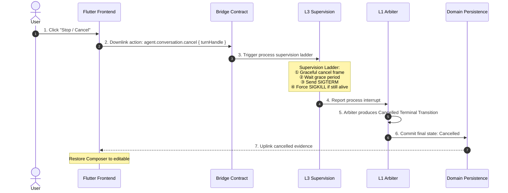

# Canonical Conversation Vertical Domain Architecture Specification

| Related Document | Language / Path | Authority |
|:---|:---|:---|
| **Normative Version** | English (Normative) | Authoritative technical specification |
| **Localization** | [简体中文](CONVERSATION-DOMAIN.zh-CN.md) | Localized Chinese projection |
| **Architecture Root** | [docs/architecture/README.md](README.md) | 4-tier client architecture overview |
| **Rust Infrastructure** | [RUST-INFRASTRUCTURE-LAYER.md](RUST-INFRASTRUCTURE-LAYER.md) | Database, config, secrets, network, and PTY |
| **Agent Adapters** | [AGENT-ADAPTERS-ARCHITECTURE.md](AGENT-ADAPTERS-ARCHITECTURE.md) | 13-agent taxonomy & protocol normalization |
| **Bridge Interaction** | [CLIENT-NATIVE-INTERACTION.md](CLIENT-NATIVE-INTERACTION.md) | Frontend-backend RPC / FFI frame contract |
| **Product Charter** | [PRODUCT.md](../../PRODUCT.md) | Durable one-conversation product destination |

In LicoUp, **Conversation is formally established as an End-to-End Vertical Architecture Slice**, rather than an isolated module tucked inside Rust. It cuts vertically across all four horizontal architectural tiers, connecting user presentation, bridging contracts, domain state machines, infrastructure subsystems, and the native operating system.

This document unifies the **four-tier vertical breakdown, bidirectional frontend-backend binding model, atomic direct chat base with group orchestration encapsulation, dedicated Profile abstraction, state machine driven execution, synchronized progress reflection, and end-to-end sequence lifecycles**.

---

## 1. Vertical Slice Architecture

```mermaid
flowchart TB
    %% Styling & visual definitions
    classDef t1 fill:#e8f4fd,stroke:#1971c2,stroke-width:2px,color:#0c4a6e;
    classDef t2 fill:#fff4e6,stroke:#e8590c,stroke-width:2px,color:#7c2d12;
    classDef t3_d fill:#f3f0ff,stroke:#6741d9,stroke-width:2px,color:#3b0764;
    classDef t4 fill:#f1f3f5,stroke:#495057,stroke-width:2px,color:#212529;
    classDef box fill:#ffffff,stroke:#adb5bd,stroke-width:1.5px,color:#212529;
    classDef coreBox fill:#ffffff,stroke:#2b8a3e,stroke-width:2px,color:#1e3a1f,font-weight:bold;

    subgraph TIER1["[Tier 1] Flutter Presentation & Application Layer"]
        direction TB
        subgraph T1_VIEWS["UI Components & Views"]
            direction LR
            V_COMPOSER["Composer Input<br/>(Send Lock · Drafts)"]:::box
            V_PROFILE["Profile Edit & Echo<br/>(Role & Avatars)"]:::box
            V_APPROVAL["Approval Modal<br/>(Sanitized Summaries)"]:::box
            V_STREAM["Bubble Stream Workspace<br/>(Markdown · History)"]:::box
            V_BLACKBOARD["Process Blackboard & Progress<br/>(Reasoning · State Mirror)"]:::box
        end
        UI_CTRL["ClientConversationController (Debounce · Progress Sync)"]:::coreBox
        V_COMPOSER --> UI_CTRL
        V_PROFILE --> UI_CTRL
        V_APPROVAL --> UI_CTRL
        UI_CTRL --> V_STREAM
        UI_CTRL --> V_BLACKBOARD
    end

    subgraph TIER2["[Tier 2] Bridging Contract Layer (Contract Layer)"]
        direction LR
        RPC_DESK["Desktop JSON-RPC<br/>(licoup.stdio.v1 Frames)"]:::box
        RPC_MOBILE["Mobile C-ABI FFI<br/>(Platform Bridges Commands)"]:::box
        RPC_OBSERVER["Bidirectional Observer Stream<br/>(Streaming Parts · State Steps)"]:::box
    end

    subgraph TIER3["[Tier 3] Rust Domain Core & Infrastructure Layer"]
        direction TB
        subgraph T3_DOMAIN["3.1 Conversation Domain Core"]
            direction LR
            D_INGEST["Domain Ingestion & Preflight"]:::box
            D_DISPATCH["Dispatch Door"]:::box
            D_FSM["Session State Machine"]:::coreBox
            D_PARSER["L1 Parser & Settlement Arbiter<br/>(native_agent_parser)"]:::box
            D_INTERACT["L2 Interaction & Approval Gate"]:::box
            D_INGEST --> D_DISPATCH --> D_FSM
            D_FSM --> D_PARSER
            D_FSM --> D_INTERACT
        end

        subgraph T3_INFRA["3.2 Infrastructure & Boundary Gateway"]
            direction LR
            I_DB["Database Storage<br/>(SQLite WAL · Transactions)"]:::box
            I_PTY["PTY/TTY Console Module<br/>(Pseudo Terminal · Winsize)"]:::box
            I_NET["Network Transport<br/>(HTTP/SSE · SSH Tunnels)"]:::box
            I_CONF["Dynamic Config System<br/>(Agent Manifests · Env)"]:::box
            I_SEC["Secret Custody Facade<br/>(Key Derivation · Crypto)"]:::box
        end
        D_FSM -->|"Persistence Calls"| I_DB
        D_FSM -->|"Pipes & Pseudo Consoles"| I_PTY
        D_FSM -->|"Network Requests"| I_NET
        D_DISPATCH -->|"Env Resolution"| I_CONF
        D_FSM -->|"Key Operations"| I_SEC
        I_PTY -->|"Raw Frames"| D_PARSER
        I_NET -->|"Stream Frames"| D_PARSER
    end

    subgraph TIER4["[Tier 4] Native OS Adaptation Layer"]
        direction LR
        N_PTY["Terminal Subsystem<br/>(POSIX openpty / Win ConPTY)"]:::box
        N_PROC["OS Processes & Signals<br/>(SIGINT / SIGTERM / SIGKILL)"]:::box
        N_SEC["Native Hardware Keyrings<br/>(macOS Keychain / WinCred / Keystore / Enclave)"]:::box
    end

    %% Tier connections
    UI_CTRL ==>|"① Downlink Actions"| RPC_DESK
    UI_CTRL ==>|"① Mobile Invocation"| RPC_MOBILE
    RPC_DESK ==>|"② Unpack (Principal+Profile+Event)"| D_INGEST
    RPC_MOBILE ==>|"② Unpack (Principal+Profile+Event)"| D_INGEST

    I_PTY ==>|"③ System PTY Attach"| N_PTY
    I_PTY ==>|"③ Process Supervision"| N_PROC
    I_SEC ==>|"③ Hardware Keyring"| N_SEC

    N_PTY ==>|"④ Console Output"| I_PTY
    D_PARSER ==>|"⑤ Uplink Typed Stream"| RPC_OBSERVER
    RPC_OBSERVER ==>|"⑥ Sync Progress Mirror"| UI_CTRL

    class TIER1 t1;
    class TIER2 t2;
    class TIER3 t3_d;
    class TIER4 t4;
```



---

## 2. L1-L5 Five-Layer Target Architecture

Based on systematic audits of 16 reports covering 50+ cataloged defects, the root cause of conversation flow interruptions is **authority fragmentation — multiple independent synthesizers competing for write authority over the same product** (e.g., "is the turn complete?", "current progress prefix", "is the system waiting for human input?"). The target architecture introduces 5 dedicated layers, each with exclusive ownership of specific products:



| Layer | Exclusive Products | Design Principle |
|:---|:---|:---|
| **L5** Flutter Evidence Unification | Single `terminalTransition` consumption; unified state enum | The frontend must only consume canonical evidence produced by the backend; it must never derive or fabricate any lifecycle facts |
| **L4** Continuity & Session Identity | `RuntimeBinding` truth; `UnverifiedBinding` on unproven open | Session resumption must pass real native identity verification; unverified bindings must never be reported as bound |
| **L3** Transport & Process Supervision | `ControlDisposition`; `DeadlinePolicy`; supervision ladder | The transport layer is solely responsible for frame boundaries and process lifecycle; it must never embed business-semantic decisions |
| **L2** Interaction Routing & Settlement | `WaitingForHuman` + one-time Token; fail-closed settlement | On turn termination, all pending interactions must be settled fail-closed; abandoned pending states are forbidden |
| **L1** Parser & Settlement Arbiter | `TurnOutcome`; extended `Transition` vocabulary | Turn completion must be determined by explicit protocol termination signals; silence-based inference or default timeouts must not substitute |

---

## 3. Nine Dedicated Synthesizers (One Product, One Authority)

The core design invariant is: **every observable product in the conversation pipeline must be owned by exactly one synthesizer**. No two code paths may race to determine the same truth.



| # | Synthesizer | Exclusive Product | Synthesis Rule | Design Principle |
|:---|:---|:---|:---|:---|
| **①** | Turn Completion Authority | `TurnOutcome ∈ {still-open, completed, failed, cancelled}` | Protocol termination × Transport EOF × Cancel confirmation × Explicit deadline | Completion must be synthesized from explicit protocol termination signals; silence-based inference or default policies must not substitute |
| **②** | Streaming Parser Entry | Live `Transition` stream + cursor `EventPart` | Driver bytes → Adapter Parser → sole emitter into `PersistentTurn` | Live streaming and terminal settlement must share the same Transition stream; split parsing stories are forbidden |
| **③** | Interaction Gate | `TurnState::WaitingForHuman` + one-time opaque Token (no clock expiry) | Intercept `Control` action, park turn as `still-open`; resume on valid Token response | Pending interactions must never be force-closed by external timeouts; they await explicit user response or fail-closed settlement on turn termination |
| **④** | Identity Registration | `RuntimeBinding` (conversationId × membershipId × dispatchId ↔ adapter-private session) | Full-key exact match for all control/steer/attach | Session identity must never be folded or partially matched; all control operations require full-key verification |
| **⑤** | Active Turn Control Plane | `ControlDisposition ∈ {accepted, no-active-turn, unknown-session, unsupported, transport-unavailable}` | Accept cancel → write `cancel-requested` → await completion authority settlement | Control results must return precise disposition types; different failure causes must not be folded into one error |
| **⑥** | Admission Projection | Composer state (`CanSend \| ReadOnlyLoading \| CanSteer`) | `open` yields `Prepared` only; `send` with verified identity yields `Bound` | Admission state must reflect true binding progress; unverified preparation must never be reported as bound |
| **⑦** | Frame Transport | Standard frames + EOF + over-limit signals | Extract from Stdio/HTTP byte stream | The transport layer is solely responsible for frame boundary extraction; stateful business-semantic parsing must not be mixed in |
| **⑧** | Follow-up Policy | Busy-time input handling (native Steer vs DirectTurn queue vs Reject) | Determined by adapter capability truth + current turn state | User input during active turns must have an explicit disposition path; silent discard is forbidden |
| **⑨** | Capability Truth | Dynamic capability matrix | Derived from control plane tests, parser evidence, and resume probes | Capability declarations must be based on runtime-tested results; static configuration guessing must not substitute |

---

## 4. Four-Tier Vertical Breakdown

As a vertical slice, Conversation defines concrete components and duties across all four horizontal layers:

### ① Tier 1: Flutter Presentation & Application Layer
- **Views & Interactions**:
  - `Composer`: Rich-text editing, send debouncing, and multimodal attachment staging.
  - `AgentConversationWorkspace`: Reactive bubble streaming, pagination, and Markdown rendering.
  - `ProcessBlackboard`: Reasoning steps visualization, tool call progress bars, and diagnostics.
  - `ApprovalModal`: One-shot human approval modal and parameter summaries.
- **Profile Management & Echo**:
  - UI display, editing, avatar/name configuration, and custom prompts for Human and Agent Profiles.
- **Application Controller**:
  - `ClientConversationController` manages reactive interaction state (`_sending`, `_liveTurns`, `draft`, `_dispatchPending`).
- **Progress Reflection**:
  - Listens to backend state machine transitions, reflecting phase updates on the UI progress bar and blackboard in strict lockstep.

### ② Tier 2: Bridging Contract Layer
- **Communication Protocol**:
  - Desktop: `licoup.stdio.v1` strongly typed JSON-RPC method frames.
  - Mobile: C-ABI memory-safe FFI commands.
- **Data Carrier Guarantee**:
  - Losslessly transfers `(Principal + Profile + Event)` payloads.
  - Exposes bidirectional Observer streams for incremental events and terminal evidence.
- **Boundary Constraint**:
  - Prohibits raw CLI argument array (`argv`) pass-through.

### ③ Tier 3: Rust Domain & Infrastructure Layer
- **Domain Ingestion Layer**:
  - Receives `(Human/Agent + Profile + Event)` payloads from the bridge.
  - Validates permissions, checks Membership, and resolves Dispatch targets.
- **Session Manager & Strict State Machine**:
  - **Core Orchestration Engine**: Drives turn lifecycles deterministically.
  - **Controlled Calls**: Converts incoming RPC events into safe function calls targeting Rust Infrastructure and Native OS adapters under state machine constraints.
- **L1 Parser & Settlement Arbiter (`native_agent_parser`)**:
  - Normalizes multiple agent protocols (ACP/RPC/PTY/Codex/OpenCode) into typed transitions.
- **L2 Interaction Routing (`native_agent_interaction`)**:
  - Manages tool approval tokens and fail-closed settlements.
- **Rust Infrastructure Backing**:
  - `ConversationStore` (SQLite WAL): Exclusive persistence for chat history and EventParts.
  - `DynamicConfig`: Runtime loading of scan manifests and agent configurations.
  - `SecretCustody`: Unified session key derivation and credential management.
  - `NetworkTransport` & `PTY/TTY`: Streaming HTTP connections and virtual console pipes.

### ④ Tier 4: Native OS Adaptation Layer
- **Terminal & Pipes**:
  - macOS/Linux POSIX PTY (`openpty`, `termios`, `winsize`) and Windows ConPTY / Named Pipes.
- **Supervision & Signals**:
  - OS-level signal handling (`SIGINT`, `SIGTERM`, `SIGKILL`) and process exit reaping.
- **Platform Hardware Custody**:
  - OS Keychains (macOS Keychain, WinCred, D-Bus Secret, Android Keystore, iOS Secure Enclave).

---

## 5. Bidirectional Binding Model & Layer Responsibilities

### 5.1 Bidirectional Interaction Model
Frontend-backend interaction strictly follows **Bidirectional Binding** and Single Source of Truth (SSoT) principles:
- **Downlink Action Flow**: The frontend (Flutter) captures user intent and sends strongly typed request frames (`conversation.message.post`, `interaction.respond`, `agent.conversation.cancel`) as the action initiator down to the protocol layer.
- **Uplink Authoritative Flow**: The backend (Rust functional core) acts as the sole authoritative fact store, driving domain logic, durable persistence, and underlying pipeline scheduling. It pushes live state transitions, streaming deltas (`EventParts`), terminal verdicts, and approval requests reactively to the frontend via Observer streams.

### 5.2 Layer Responsibilities & Boundary Invariants

| Layer | Primary Duties | Data & Control Boundary Invariants |
|:---|:---|:---|
| **Presentation Layer**<br>(Flutter Views & Controllers) | 1. Captures user inputs, gestures, and form interactions;<br>2. Debounces and locks interactive UI state (`_sending = true`, clearing drafts);<br>3. Packs user actions into typed Dart request envelopes;<br>4. Listens to Observer streams to update the process blackboard and chat bubbles;<br>5. Renders sanitized summaries and one-time interactive approval cards. | **State Mirror Invariant**: Serves as a pure rendering mirror of the backend state machine. Updates UI solely from authoritative stream facts; does not maintain local SQLite duplicates, and never fabricates or infers lifecycle facts. |
| **Contract Layer**<br>(Bridging Protocols) | 1. Encodes and decodes bidirectional structured JSON-RPC method frames;<br>2. Manages cross-process (stdio) and cross-language (FFI) memory safety boundaries;<br>3. Provides typed error protection for timeouts and disconnections. | **Stateless Channel Invariant**: Serves as a pure, stateless transport channel passing typed requests and streams without hosting stateful domain logic. |
| **Domain & Infrastructure Layer**<br>(Rust Functional Core & Infra) | 1. Exclusive persistence authority (sole reader/writer of SQLite/WAL);<br>2. Exclusive dispatch admission authority (resolves `@mention`, group strategy, and memberships);<br>3. Exclusive completion arbiter (L1 normalization and terminal verdict);<br>4. Exclusive process lifecycle supervisor (startup, input pipes, Grace Period ladder, SIGTERM/KILL);<br>5. Exclusive interaction routing (one-time scoped token generation and fail-closed settlement). | **Fact Authority Invariant**: Operates as the system's sole authoritative fact source. Every event exposed to the frontend is backed by an immutable persisted record; strictly enforces Exact Resume session identity invariants. |

---

## 6. Direct Chat Base & Group Orchestration Architecture

In product and domain architecture design:
1. **Direct Chat (1:1) is directly user-facing**: Provides an immersive single-agent workspace (dedicated model tuning, system prompts, and direct session state machines);
2. **Group Chat is also directly user-facing**: Provides a collaborative multi-human and multi-agent workspace (member rosters, @mentions, Flywheel graph bindings, and Assistant cards);
3. **Underlying Architectural Invariant**: **Direct Chat is the core atomic execution building block, while Group Chat is an Orchestration & Coordination Encapsulation Layer layered atop multiple underlying direct chat execution pipelines**.



### Direct Route vs Group Route Comparison:

| Architectural Dimension | 1:1 Direct Chat (Direct User Service) | Multi-Agent Group Chat (Orchestration Encapsulation) | Design Principles |
|:---|:---|:---|:---|
| **User Entry Point** | **Dedicated Direct Workspace**: Immersive focus, single-agent parameters, and prompt configurations. | **Dedicated Group Workspace**: Member rosters, @mention auto-complete, Assistant cards, strategy versions. | Both UI entries serve users directly with composable components. |
| **Dispatch Path** | **Direct Path**: User post $\to$ bypasses group orchestration $\to$ immediately activates agent FSM and PTY. | **Orchestrated Path**: User post $\to$ group dispatch door (@mention/graph) $\to$ slices & dispatches to $N$ direct pipelines. | Direct chat optimizes for zero-latency execution; group chat optimizes for context coordination. |
| **Pipeline Reuse** | Exclusively uses 1 direct chat execution pipeline (FSM + Profile + PTY/Stream). | Reuses and concurrently orchestrates $N$ direct pipelines for pipelined or parallel execution. | **The direct chat execution pipeline is the sole underlying execution engine**. Group chat does not reinvent execution. |
| **Timeline Projection** | Single timeline committed to SQLite and streamed directly to UI. | EventParts from underlying pipelines are merged by the aggregator and projected into the shared timeline. | **Unified Durable Store**: Both share the exact same `conversations` and `events` schema. |

---

## 7. Human / Agent Dedicated Profile Abstraction

In the Conversation architecture, **every participant—whether Human or Agent—must and does have a dedicated Profile data encapsulation**.



- **Full-Stack Lifecycle**:
  - **Frontend**: Full editing and live echo (avatars, display names, context preferences, security levels).
  - **Contract Layer**: Transmitted losslessly as strongly typed schema fields.
  - **Backend**: Ingested by the domain layer to drive state machine transitions and execution policies.

---

## 8. State Machine Driven Controlled Invocations

The Session Manager executes a **strict Finite State Machine (FSM)**. All underlying infrastructure and native calls **must and can only be invoked within specific state machine phases**:

```mermaid
stateDiagram-v2
    [*] --> Submitted: User Post (RPC Post)
    
    state Submitted {
        note right of Submitted: [Controlled Call] SQLite: Write finalized Human Event
    }
    
    Submitted --> Accepted: Dispatch Admission (Dispatch After-Post)
    
    state Accepted {
        note right of Accepted: [Controlled Call] DynamicConfig: Resolve binaries & env
    }
    
    Accepted --> Processing: Launch Process / Connect Stream
    
    state Processing {
        note right of Processing: [Controlled Call] PTY / Network: Open pipes & attach listeners
    }
    
    Processing --> Streaming: L1 Parser Emits Content
    
    state Streaming {
        note right of Streaming: [Controlled Call] SQLite: Append EventPart & Stream Uplink
    }
    
    Streaming --> WaitingForHuman: L1 Detects Tool Approval Request
    
    state WaitingForHuman {
        note right of WaitingForHuman: [Controlled Call] L2 Interaction: Park Token & Prompt UI Modal
    }
    
    WaitingForHuman --> Processing: User Approves
    
    Streaming --> Completed: Explicit Finish / EOF Received
    Processing --> Failed: Process Crash / Unrecoverable Error
    Processing --> Cancelled: User Cancels
    
    state Completed {
        note right of Completed: [Controlled Call] SQLite Finalize · Graceful Process Exit
    }
    state Failed {
        note right of Failed: [Controlled Call] SQLite Write Error Code · Process Reaped
    }
    state Cancelled {
        note right of Cancelled: [Controlled Call] L3 Supervision Ladder (Grace → SIGTERM → SIGKILL)
    }

    Completed --> [*]
    Failed --> [*]
    Cancelled --> [*]
```

---

## 9. Synchronized State Machine Progress Reflection

To eliminate phantom UI locks and state drift, the architecture mandates **strict one-to-one synchronization between backend state machine phases and frontend UI reflection**:

| Backend State (Rust State) | Trigger & Controlled Action | Frontend UI Reflection (Flutter) |
|:---|:---|:---|
| **`Submitted`** | Human message written to SQLite | Clears composer draft, locks send button, marks bubble as "Sent" |
| **`Accepted`** | Dispatch door accepts Membership and returns handle | Attaches `_liveTurns`, activates blackboard, progress bar enters **"Preparing"** |
| **`Processing`** | PTY launched or stream connection opened | Blackboard shows **"Connecting to Agent"**, renders thinking spinner |
| **`Streaming / Reasoning`** | L1 parser emits Reasoning / ToolCall / ContentPart | Blackboard expands reasoning steps, streams text into bubble, progress bar shows **"Generating"** |
| **`WaitingForHuman`** | L1 detects tool call requiring user approval; L2 parks token | Progress bar turns **Yellow (Waiting)**, pops up interactive approval modal |
| **`Completed`** | L1 arbiter resolves normal completion; Event finalized | Progress bar turns **Green (Completed)**, collapses blackboard to summary, unlocks composer |
| **`Failed`** | Process crash or unrecoverable error | Progress bar turns **Red (Failed)**, displays diagnostic error code with retry option |
| **`Cancelled`** | User cancels; L3 reaps process via ladder | Progress bar turns **Grey (Cancelled)**, preserves partial output, restores composer |

> **Synchronization Invariant**: **The frontend progress bar and blackboard are a real-time mirror of the backend state machine**. When the backend advances one step, it emits a `Typed Transition`; the frontend reacts immediately. The frontend never fabricates its own progression.

---

## 10. End-to-End Standard Sequence Flows

### ① User Message Two-Phase Dispatch Flow



---

### ② Realtime Stream Generation & Attachment Flow



---

### ③ Blocking Human-in-the-Loop Approval Flow

```mermaid
sequenceDiagram
    autonumber
    participant Driver as Agent Process
    participant L1 as L1 Parser
    participant L2 as L2 Interaction Router
    participant Domain as Domain Persistence
    participant UI as Flutter Frontend
    actor User as User

    Driver->>L1: 1. Tool execution requested
    L1->>L2: 2. Detected as InteractionRequested; issue scoped one-shot Token
    L2->>Domain: 3. Set turn state to WaitingForHuman
    Domain-->>UI: 4. Uplink approval card event (sanitized parameter summary)
    Note over UI: Popup interactive approval card
    
    User->>UI: 5. Click "Approve" or "Reject"
    UI->>L2: 6. Downlink action: interaction.respond { token, approved: true/false }
    Note over L2: Validate Token authenticity & single-use invariant
    L2->>Driver: 7. Inject response into Agent stdin
    L2->>Domain: 8. Resume turn state to Processing
    Domain-->>UI: 9. Uplink resumed state
```

---

### ④ Turn Cancellation & Failure Safety Flow



---

## 11. Error Handling & Consistency Invariants

1. **Observer Disconnection $\ne$ Turn Failure**:
   - UI navigation or window minimization disconnecting the Observer stream **never cancels the underlying Agent turn**.
   - Rust core preserves in-flight progress; reopening the view with `conversationId` and the last watermark replays all subsequent `EventParts` cleanly.
2. **No Frontend Guesswork**:
   - Network dropouts, crashes, or timeouts must be explicitly diagnosed and committed by Rust L1/L3 as typed error codes. Flutter strictly renders localized messages matching those codes.
