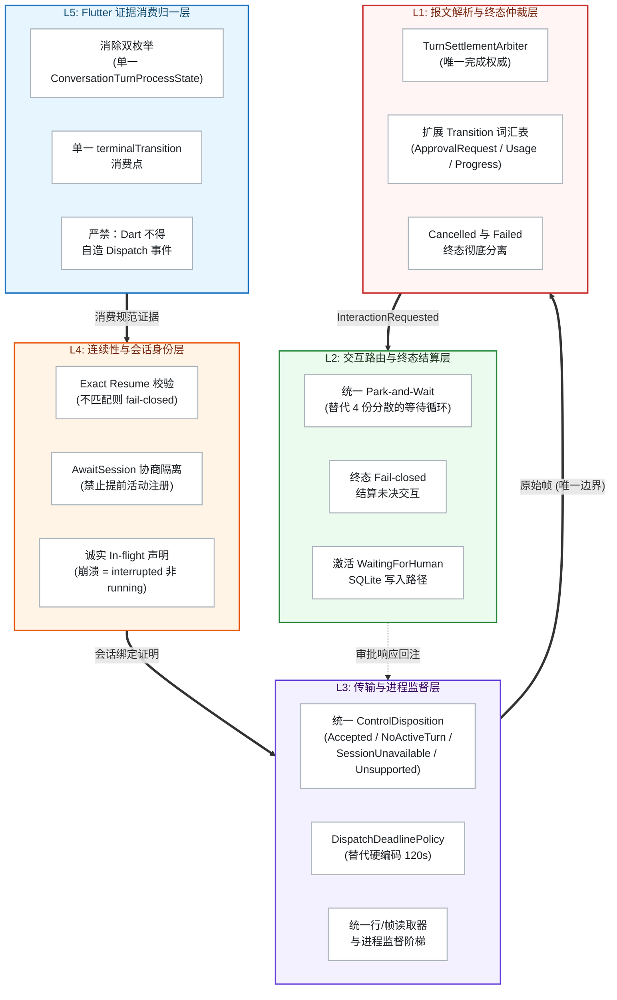
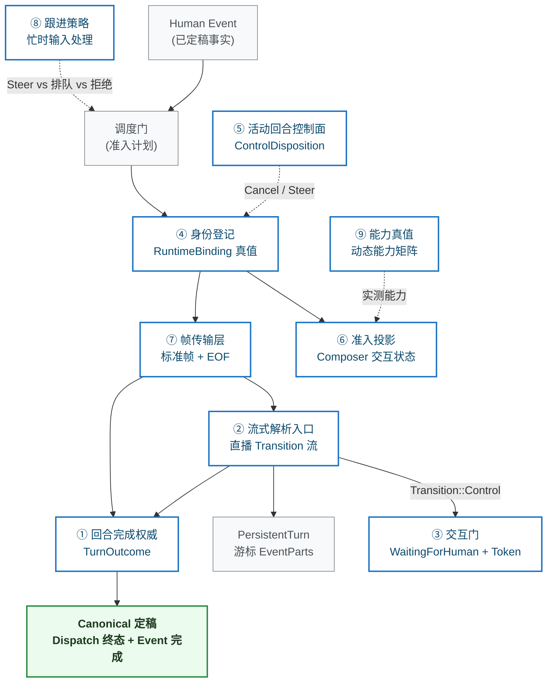
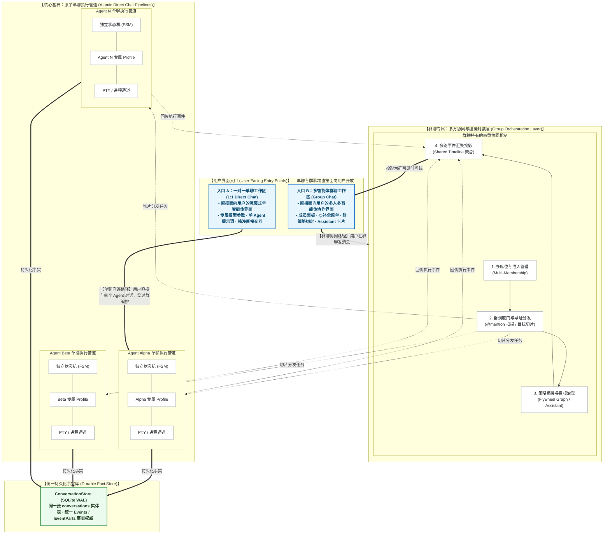
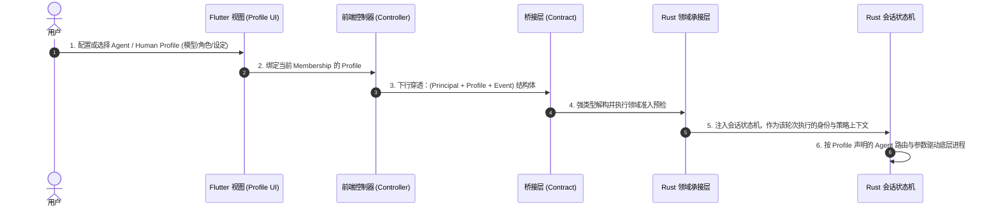
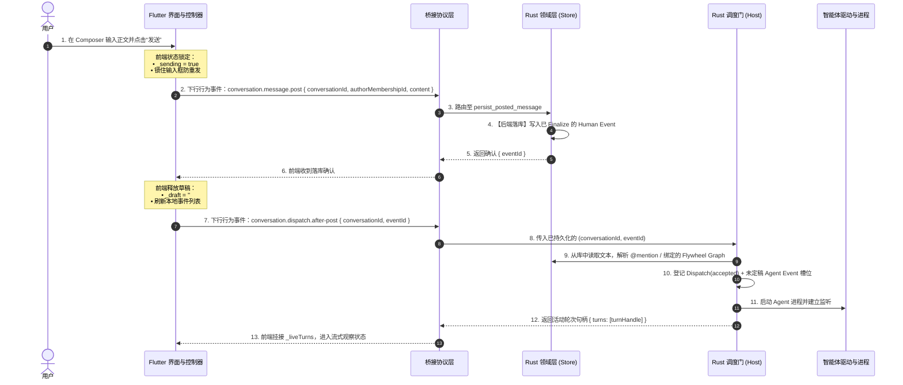
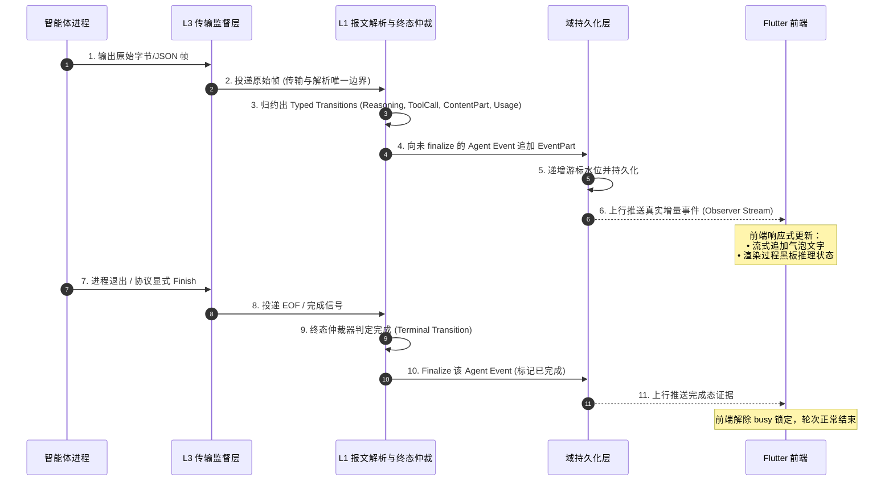
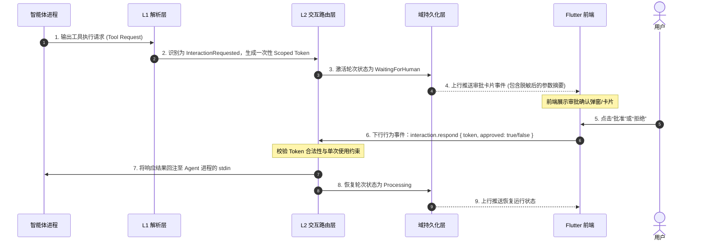
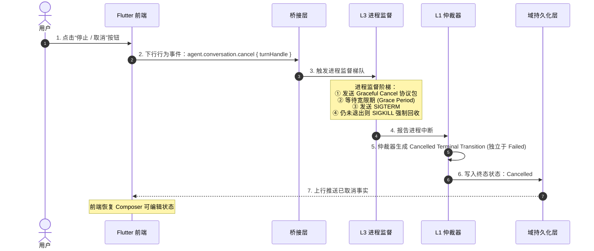

# 统一 Conversation 垂直领域架构规范

| 关联文档 | 语言 / 路径 | 权威职责 |
|:---|:---|:---|
| **规范版本** | [English (Normative)](CONVERSATION-DOMAIN.md) | 统一 Conversation 垂直架构英文规范 |
| **架构主文档** | [docs/architecture/README.zh-CN.md](README.zh-CN.md) | 四层顶层客户端架构与总览 |
| **Rust 基础设施层** | [RUST-INFRASTRUCTURE-LAYER.zh-CN.md](RUST-INFRASTRUCTURE-LAYER.zh-CN.md) | 数据库、动态配置、密钥管理、网络与 PTY 规范 |
| **智能体适配器** | [AGENT-ADAPTERS-ARCHITECTURE.zh-CN.md](AGENT-ADAPTERS-ARCHITECTURE.zh-CN.md) | 13 驱动分类、标准与私有协议归一化 |
| **桥接协议规范** | [CLIENT-NATIVE-INTERACTION.md](CLIENT-NATIVE-INTERACTION.md) | 前后端 RPC / FFI 协议格式与帧规范 |
| **产品定义** | [PRODUCT.zh-CN.md](../../PRODUCT.zh-CN.md) | 长期「一个 Conversation」产品目标与理念 |

在 LicoUp 中，**Conversation（智能体对话）被正式确立为一个端到端的垂直业务架构（End-to-End Vertical Architecture Slice）**，而非仅仅局限于 Rust 内部的一个孤立模块。它自上而下纵向贯穿四个水平架构层级，连接用户交互、通信协议、领域状态机、基础设施与底层操作系统。

本文档完整定义智能体对话的**垂直四层分解、前后端双向绑定模型、单聊基石与群聊协同封装、Profile 抽象、严格状态机驱动、进度同步反射及端到端生命周期时序**。

---

## 1. 垂直切片全景架构

```mermaid
flowchart TB
    %% 样式与视觉定义
    classDef t1 fill:#e8f4fd,stroke:#1971c2,stroke-width:2px,color:#0c4a6e;
    classDef t2 fill:#fff4e6,stroke:#e8590c,stroke-width:2px,color:#7c2d12;
    classDef t3_d fill:#f3f0ff,stroke:#6741d9,stroke-width:2px,color:#3b0764;
    classDef t4 fill:#f1f3f5,stroke:#495057,stroke-width:2px,color:#212529;
    classDef box fill:#ffffff,stroke:#adb5bd,stroke-width:1.5px,color:#212529;
    classDef coreBox fill:#ffffff,stroke:#2b8a3e,stroke-width:2px,color:#1e3a1f,font-weight:bold;

    subgraph TIER1["【第 1 层】Flutter 用户外观与应用层 (Presentation Layer)"]
        direction TB
        subgraph T1_VIEWS["用户交互与呈现组件 (UI Views)"]
            direction LR
            V_COMPOSER["Composer 输入框<br/>(发送拦截 · 草稿)"]:::box
            V_PROFILE["Profile 编辑回显<br/>(角色设定 · 头像)"]:::box
            V_APPROVAL["审批确认弹窗<br/>(脱敏参数 · 卡片)"]:::box
            V_STREAM["气泡流式工作区<br/>(Markdown · 历史)"]:::box
            V_BLACKBOARD["过程黑板 & 进度条<br/>(推理步骤 · 状态镜像)"]:::box
        end
        UI_CTRL["ClientConversationController 交互控制器 (状态防抖 · 进度反射)"]:::coreBox
        V_COMPOSER --> UI_CTRL
        V_PROFILE --> UI_CTRL
        V_APPROVAL --> UI_CTRL
        UI_CTRL --> V_STREAM
        UI_CTRL --> V_BLACKBOARD
    end

    subgraph TIER2["【第 2 层】Bridging Contract 桥接协议层 (Contract Layer)"]
        direction LR
        RPC_DESK["桌面端 JSON-RPC<br/>(licoup.stdio.v1 方法帧)"]:::box
        RPC_MOBILE["移动端 C-ABI FFI<br/>(Platform Bridges 命令)"]:::box
        RPC_OBSERVER["双向 Observer 事件流<br/>(实时 Parts · 状态机步进)"]:::box
    end

    subgraph TIER3["【第 3 层】Rust 领域核心与基础设施层 (Rust Functional Core & Infrastructure)"]
        direction TB
        subgraph T3_DOMAIN["3.1 对话领域业务核心 (Domain Core)"]
            direction LR
            D_INGEST["领域承接与预检<br/>(Domain Ingestion)"]:::box
            D_DISPATCH["调度门寻址<br/>(Dispatch Door)"]:::box
            D_FSM["核心会话状态机<br/>(Session State Machine)"]:::coreBox
            D_PARSER["L1 报文解析与终态仲裁<br/>(native_agent_parser)"]:::box
            D_INTERACT["L2 交互审批路由<br/>(Interaction Gate)"]:::box
            D_INGEST --> D_DISPATCH --> D_FSM
            D_FSM --> D_PARSER
            D_FSM --> D_INTERACT
        end

        subgraph T3_INFRA["3.2 基础设施与对外交互层 (Infrastructure Gateway)"]
            direction LR
            I_DB["数据库存储模块<br/>(SQLite WAL · 事务 · 索引)"]:::box
            I_PTY["PTY/TTY 伪终端模块<br/>(虚拟终端 · 窗口同步)"]:::box
            I_NET["网络通信模块<br/>(HTTP/SSE 流 · SSH 隧道)"]:::box
            I_CONF["动态配置系统<br/>(Agent 清单 · 环境变量)"]:::box
            I_SEC["密钥管理门面<br/>(会话建钥 · 加解密抽象)"]:::box
        end
        D_FSM -->|"持久化调用"| I_DB
        D_FSM -->|"终端与进程管道"| I_PTY
        D_FSM -->|"网络请求"| I_NET
        D_DISPATCH -->|"检索环境"| I_CONF
        D_FSM -->|"凭据操作"| I_SEC
        I_PTY -->|"原始帧"| D_PARSER
        I_NET -->|"流式帧"| D_PARSER
    end

    subgraph TIER4["【第 4 层】Native 原生系统适配层 (Native OS Layer)"]
        direction LR
        N_PTY["终端设备子系统<br/>(POSIX openpty / Win ConPTY)"]:::box
        N_PROC["操作系统进程与信号<br/>(SIGINT / SIGTERM / SIGKILL)"]:::box
        N_SEC["系统原生硬件凭据库<br/>(macOS Keychain / WinCred / Keystore / Enclave)"]:::box
    end

    %% 层与层之间的连接
    UI_CTRL ==>|"① 下行用户行为"| RPC_DESK
    UI_CTRL ==>|"① 移动端调用"| RPC_MOBILE
    RPC_DESK ==>|"② 传递 (Principal+Profile+Event)"| D_INGEST
    RPC_MOBILE ==>|"② 传递 (Principal+Profile+Event)"| D_INGEST

    I_PTY ==>|"③ 系统 PTY 挂接"| N_PTY
    I_PTY ==>|"③ 进程监督"| N_PROC
    I_SEC ==>|"③ 硬件存储"| N_SEC

    N_PTY ==>|"④ 终端输出"| I_PTY
    D_PARSER ==>|"⑤ 状态与增量推流"| RPC_OBSERVER
    RPC_OBSERVER ==>|"⑥ 进度反射刷新"| UI_CTRL

    class TIER1 t1;
    class TIER2 t2;
    class TIER3 t3_d;
    class TIER4 t4;
```



---

## 2. L1-L5 五层目标架构 (Target Architecture)

基于对 16 份审计报告、50+ 编目缺陷的系统性分析，对话流程中断的根因是**权威分裂——多个独立合成器争夺同一产物的写权限**（如"回合是否结束"、"当前进度前缀"、"是否正在等待用户交互"等）。目标架构引入 5 个专属层，每层独占特定产物的生产权威：



| 层 | 独占产物 | 设计原则 |
|:---|:---|:---|
| **L5** Flutter 证据消费归一 | 单一 `terminalTransition` 消费；统一状态枚举 | 前端仅消费后端产出的规范证据，严禁自行推导或合成任何生命周期事实 |
| **L4** 连续性与会话身份 | `RuntimeBinding` 真值；未校验时返回 `UnverifiedBinding` | 会话恢复必须经过真实原生身份校验，未经校验的绑定严禁报告为已绑定 |
| **L3** 传输与进程监督 | `ControlDisposition`; `DeadlinePolicy`; 监督阶梯 | 传输层仅负责帧边界与进程生命周期，严禁在传输层内嵌入业务语义判定 |
| **L2** 交互路由与终态结算 | `WaitingForHuman` + 一次性 Token；fail-closed 结算 | 轮次终结时必须以 fail-closed 方式结算所有未决交互，严禁遗弃挂起状态 |
| **L1** 报文解析与终态仲裁 | `TurnOutcome`；扩展 `Transition` 词汇表 | 轮次完成判定必须基于协议显式终结信号，严禁以静默推断或缺省超时替代 |

---

## 3. 九个独占合成器规范 (One Product, One Authority)

核心设计不变量：**对话管道中的每一个可观测产物，必须且只能由一个合成器独占生产**。任何两条代码路径都不允许竞争判定同一真值。



| # | 合成器 | 独占产物 | 合成规则 | 设计原则 |
|:---|:---|:---|:---|:---|
| **①** | 回合完成权威 | `TurnOutcome ∈ {still-open, completed, failed, cancelled}` | 协议终结 × 传输 EOF × 取消确认 × 显式 deadline | 完成判定必须基于协议显式终结信号合成，不得以静默推断或缺省策略替代 |
| **②** | 流式解析入口 | 直播 `Transition` 流 + 游标 `EventPart` | Driver 字节 → Adapter Parser → 唯一发射器 → `PersistentTurn` | 直播与终态必须共享同一条 Transition 流，不得存在分裂的两套解析故事 |
| **③** | 交互门 | `TurnState::WaitingForHuman` + 一次性不透明 Token（无时钟过期） | 拦截 `Control` 动作，挂起回合保持 `still-open`；凭合法 Token 应答后恢复 | 未决交互不得被任何外部超时强行关闭，必须等待用户显式响应或轮次终结时 fail-closed 结算 |
| **④** | 身份登记 | `RuntimeBinding`（conversationId × membershipId × dispatchId ↔ adapter-private session） | 全键精确比对 control/steer/attach | 会话身份不得折叠或部分匹配，所有控制操作必须经过完整键校验 |
| **⑤** | 活动回合控制面 | `ControlDisposition ∈ {accepted, no-active-turn, unknown-session, unsupported, transport-unavailable}` | 接收 Cancel → 写入 `cancel-requested` → 等待完成权威收口 | 控制操作结果必须返回精确的处置类型，不得将不同失败原因折叠为同一错误 |
| **⑥** | 准入投影 | Composer 交互状态（`CanSend \| ReadOnlyLoading \| CanSteer`） | `open` 仅产生 `Prepared`（未绑定）；`send` 校验身份后产出 `Bound` | 准入状态必须反映真实绑定进度，不得将未校验的准备态报告为已绑定 |
| **⑦** | 帧传输层 | 标准帧 + EOF + 超限信号 | 从 Stdio/HTTP 字节流解出帧 | 传输层仅负责帧边界提取，不得混入有状态的业务语义解析 |
| **⑧** | 跟进策略 | 忙时输入处理（原生 Steer vs DirectTurn 排队 vs 拒绝） | 由适配器能力真值 + 当前 turn 状态决定 | 用户在轮次执行期间的输入必须有明确的处置路径，不得静默丢弃 |
| **⑨** | 能力真值 | 动态能力矩阵 | 依据控制面、解析器、Resume 实测生成 | 能力声明必须基于运行时实测结果，不得依赖静态配置猜测 |

---

## 4. 垂直四层逐层架构分解

Conversation 作为一个垂直业务切片，在水平四层中均有明确的职责与组件划分：

### ① 第 1 层：Flutter 用户外观与应用层（Presentation Layer）
- **视图交互与呈现**：
  - `Composer`（富文本输入、发送拦截、多模态附件暂存、防抖）；
  - `AgentConversationWorkspace`（会话气泡流式展示、历史翻页、Markdown 渲染）；
  - `ProcessBlackboard`（过程黑板，展示思考推理过程、工具调用进度条与诊断日志）；
  - `ApprovalModal`（一次性人机交互审批确认卡片，展示脱敏后的参数摘要）。
- **Profile 前端管理与回显**：
  - 支持 Human 与 Agent 专属 Profile 的实时展示、编辑、头像/名称设置与个性化 Prompt 配置。
- **响应式状态管理**：
  - `ClientConversationController` 维护前端交互状态机（`_sending`, `_liveTurns`, `draft`, `_dispatchPending`）。
- **进度与状态同步反射**：
  - 监听后端推送的状态机步进事件，**后端状态机前进一个阶段，前端进度条与黑板立即反射对应的阶段刷新**。

### ② 第 2 层：Bridging Contract 桥接协议层（Contract Layer）
- **通信通道**：
  - 桌面端：`licoup.stdio.v1` 强类型 JSON-RPC 方法帧；
  - 移动端：C-ABI 跨语言内存安全 FFI 命令。
- **数据穿透保证**：
  - 完整透传 `(Principal + Profile + Event)` 强类型数据载荷；
  - 建立双向 Observer 事件流通道，实时回传后端状态机步进、增量文本与终态证据。
- **边界约束**：
  - 严格阻断任意 CLI 参数数组（argv）穿透，防止未校验数据破坏后端状态机。

### ③ 第 3 层：Rust 领域与基础设施层（Rust Domain & Infrastructure Layer）
- **领域承接层（Domain Ingestion Layer）**：
  - 接收协议层传入的 `(Human/Agent + Profile + Event)` 组合；
  - 执行权限校验、Membership 席位匹配与 Dispatch 计划生成，将其转换为 Rust 内部可执行的领域任务。
- **会话管理模块与严格状态机（Session Manager & State Machine）**：
  - **核心调度与生命周期中枢**：独占驱动对话回合的状态演进；
  - **严格受控调用**：在状态机的严格约束下，将上游 RPC 事件转换为对 Rust 基础设施层与 Native 原生系统适配层的安全函数调用。
- **L1 报文解析与终态仲裁 (`native_agent_parser`)**：
  - 归约 13 个智能体的多源报文（ACP/RPC/PTY/Codex/OpenCode），输出规范的 `Typed Transitions`。
- **L2 交互路由与挂起结算 (`native_agent_interaction`)**：
  - 管理工具调用审批 Token 挂起与 Fail-Closed 结算。
- **Rust 基础设施底层支持**：
  - `ConversationStore`（SQLite WAL）：唯一持久化读写聊天事实与 EventPart；
  - `DynamicConfig`：动态加载 Agent 扫描路径与自定义运行时环境；
  - `SecretCustody`：统一会话密钥管理；
  - `NetworkTransport` & `PTY/TTY`：流式 HTTP 接收与虚拟终端交互。

### ④ 第 4 层：Native 原生系统适配层（Native OS Layer）
- **底层终端与进程管道**：
  - macOS/Linux POSIX PTY (`openpty`, `termios`, `ioctl`) 与 Windows ConPTY / Named Pipes；
- **进程监督与信号回收**：
  - 操作系统级信号响应（`SIGINT`, `SIGTERM`, `SIGKILL`）与进程退出状态回收；
- **平台安全凭据**：
  - 系统硬件密钥库（Keychain / WinCred / D-Bus Secret / Keystore / Secure Enclave）存取。

---

## 5. 前后端双向绑定模型与分层职责划分

### 5.1 双向交互模型
前后端交互架构遵循严格的**双向绑定（Bidirectional Binding）**与单一事实源原则：
- **下行指令链路（Downlink Action Flow）**：前端（Flutter）负责捕获用户的交互意图并生成强类型请求（如：输入发送、取消轮次、审批确认/拒绝、切换会话等），作为交互发起方下发至协议层。
- **上行事实链路（Uplink Authoritative Flow）**：后端（Rust 核心）作为系统状态与数据的唯一权威，负责执行业务逻辑、安全持久化与底层管道调度，并通过 Observer 事件流向前端实时推送真实的状态机阶段迁移、增量流式数据块（Delta/Part）、终态证据与交互挂起请求。

### 5.2 分层职责与边界原则

| 架构分层 | 核心职责 | 数据与控制边界原则 |
|:---|:---|:---|
| **前端外观与应用层**<br>(Presentation Layer) | 1. 捕获用户键盘、手势与表单输入；<br>2. 前端交互状态防抖与锁（如发送期间锁住输入框、清空草稿）；<br>3. 将用户行为打包为 Dart 强类型请求；<br>4. 监听后端 Observer 事件流并响应式更新过程黑板与气泡；<br>5. 渲染安全摘要与一次性交互审批卡片。 | **状态镜像原则**：作为后端状态机的呈现镜像，完全基于后端推流的规范证据更新 UI；不持有本地 SQLite 副本，不自行推导或伪造生命周期事实。 |
| **桥接协议层**<br>(Contract Layer) | 1. 结构化 JSON-RPC 方法帧双向编码与解码；<br>2. 跨进程（stdio）与跨语言（FFI）边界内存安全传递；<br>3. 方法调用超时与通道断开的类型化错误保护。 | **无状态通道原则**：作为纯净的数据传输通道，透传类型化请求与事件流，不承载有状态业务逻辑。 |
| **Rust 领域与基础设施层**<br>(Functional Core & Infra) | 1. 独占数据持久化权威（SQLite/WAL 唯一读写方）；<br>2. 独占调度门准入权（解析 `@mention`、群策略与 Membership）；<br>3. 独占生命周期裁决权（L1 统一完成谓词与终态仲裁）；<br>4. 独占进程生命周期管理（启动、输入管道、Grace Period 监督、SIGTERM/KILL）；<br>5. 维护交互路由（一次性 Token 挂起与 Fail-Closed 结算）。 | **事实权威原则**：作为全系统生命周期与数据的唯一事实源，所有向前端暴露的事件均具备持久化事实依据；严格保证 Exact Resume 会话身份一致性。 |

---

## 6. 单聊独立入口与群聊协同编排架构 (Direct Chat & Group Orchestration)

在产品与领域架构设计上：
1. **单聊（Direct Chat）直接面向用户开放**：提供沉浸式的一对一智能体交互工作区（独立模型参数、单 Agent 提示词与直连会话状态机）；
2. **群聊（Group Chat）同样直接面向用户开放**：提供多人与多智能体协作工作区（成员列表、@补全、策略图绑定与 Assistant 卡片）；
3. **架构底层复用关系**：**单聊是底层执行引擎的核心原子基石，群聊是在多个底层单聊执行管道之上的「多方协同与编排封装层」**。



### 单聊直连路径 vs 群聊协同路径机制对比：

| 架构维度 | 一对一单聊（直接面向用户的独立服务） | 多智能体群聊（协同编排封装层） | 协同机制与设计原则 |
|:---|:---|:---|:---|
| **用户界面入口** | **独立单聊工作区**：沉浸式体验、单一 Agent 参数调优与系统 Prompt 设置。 | **独立群聊工作区**：多成员列表、@ 补全菜单、Assistant 卡片、策略版本绑定器。 | 两套界面均直接对用户提供交互服务，界面组件按需组合。 |
| **调度执行路径** | **直连执行路径**：用户发消息 $\to$ 绕过群编排 $\to$ 直接激活该 Agent 的单聊状态机与 PTY 通道。 | **编排分发路径**：用户发消息 $\to$ 经群调度门（@mention / Graph） $\to$ 分发给一个或多个底层单聊管道执行。 | 单聊追求最低延迟与直接交互；群聊追求上下文精准切片与多 Agent 协同。 |
| **底层管道复用** | 直接独占使用 1 条底层单聊执行管道（FSM + Profile + 进程/PTY）。 | 复用并并发调度 $N$ 条底层单聊执行管道，实现流水线交接或并行推理。 | **单聊执行引擎是全系统唯一的执行底座**，群聊绝不重新造轮子。 |
| **事件聚合投影** | 单一时间线直接写入 SQLite 并推流回单聊界面。 | 各底层管道产生的 `EventPart` 经群聚合器有序汇聚，投影为全局可见的群历史流。 | **统一持久化事实**：底层共用同一张 `conversations` 表与 `events` 索引。 |

---

## 7. Human / Agent 专属 Profile 抽象与全链路流向

在 Conversation 体系中，**无论是人类（Human）还是智能体（Agent），都必须且必然拥有一份专属的 Profile 数据封装抽象**。



- **全链路贯穿能力**：
  - **前端**：具备完整的展示、编辑与回显能力（支持头像、显示名、上下文偏好、安全级别）；
  - **协议层**：作为结构化字段无损穿透 RPC / FFI 边界；
  - **后端**：由 Rust 领域承接层接纳，作为状态机驱动底层 Agent 执行的输入依据。

---

## 8. 严格状态机驱动与底层受控调用映射

会话管理模块内部运行着一个**严格的有限状态机（Finite State Machine, FSM）**。所有的底层基础设施与原生层调用，**都必须且只能在特定的状态机阶段由状态机受控触发**：

```mermaid
stateDiagram-v2
    [*] --> Submitted: 用户发起 (RPC Post)

    state Submitted {
        note right of Submitted: 【受控调用】SQLite: 写入定稿 Human Event
    }

    Submitted --> Accepted: 调度门准入 (Dispatch After-Post)

    state Accepted {
        note right of Accepted: 【受控调用】DynamicConfig: 检索可执行文件与环境
    }

    Accepted --> Processing: 进程/连接启动

    state Processing {
        note right of Processing: 【受控调用】PTY / Network: 启动进程、打开管道并建立流监听
    }

    Processing --> Streaming: L1 解析到数据

    state Streaming {
        note right of Streaming: 【受控调用】SQLite: 追加 EventPart · 上行推流
    }

    Streaming --> WaitingForHuman: L1 识别到交互审批请求

    state WaitingForHuman {
        note right of WaitingForHuman: 【受控调用】L2 交互路由: 生成 Token 挂起，通知前端弹窗
    }

    WaitingForHuman --> Processing: 用户响应批准

    Streaming --> Completed: 收到显式 Finish / EOF
    Processing --> Failed: 进程异常崩溃 / 校验失败
    Processing --> Cancelled: 用户取消

    state Completed {
        note right of Completed: 【受控调用】SQLite Finalize · L3 进程优雅退出
    }
    state Failed {
        note right of Failed: 【受控调用】SQLite 写入错误码 · L3 进程回收
    }
    state Cancelled {
        note right of Cancelled: 【受控调用】L3 进程监督阶梯 (Grace → SIGTERM → SIGKILL)
    }

    Completed --> [*]
    Failed --> [*]
    Cancelled --> [*]
```

---

## 9. 前端进度条/过程黑板与后端状态机的同步反射机制

为了彻底消除前端“自造状态”导致的假死与信息漂移，系统强制执行 **前后端状态机严格一对一同步反射机制**：

| 后端状态机阶段 (Rust State) | 触发条件与底层行为 | 前端反射行为 (Flutter UI Reflection) |
|:---|:---|:---|
| **`Submitted`** | 人类消息成功写入 SQLite | 前端清空 Composer 草稿，锁住发送按钮，消息气泡显示“已发送” |
| **`Accepted`** | 调度门确认 Membership，生成轮次句柄 | 前端挂接 `_liveTurns`，过程黑板亮起，进度条进入 **“准备执行”** 阶段 |
| **`Processing`** | 底层 PTY 启动或网络连接建立 | 过程黑板显示 **“正在连接智能体”**，显示思考中动画 |
| **`Streaming / Reasoning`** | L1 解析器持续产出 Reasoning / ToolCall / ContentPart | 过程黑板流式展开推理步骤，气泡实时打字渲染，进度条指示 **“正在生成”** |
| **`WaitingForHuman`** | L1 识别到工具调用需要用户确认，L2 挂起 Token | 进度条变为 **黄色等待状态**，界面居中弹出审批确认卡片与参数摘要 |
| **`Completed`** | L1 终态仲裁判定正常完成，Event 被 Finalize | 进度条变为 **绿色完成状态**，过程黑板折叠为可回溯摘要，解锁 Composer |
| **`Failed`** | 进程崩溃或 L1 判定不可恢复错误 | 进度条变为 **红色失败状态**，黑板展示带错误码的诊断详情与重试入口 |
| **`Cancelled`** | 用户点击取消，L3 完成进程梯队回收 | 进度条变为 **灰色取消状态**，保留已接收部分，恢复 Composer 可编辑 |

> **同步铁律**：**前端进度条与黑板只是后端状态机的实时镜像（Mirror Reflection）**。后端每推进一步，产生一个规范的 `Typed Transition`，前端监听后立即反射刷新；前端绝不脱离后端状态机擅自修改进度。

---

## 10. 端到端标准时序流

### ① 用户发消息与两阶段调度流

用户发消息采用「**第一阶段：落盘定稿；第二阶段：调度准入**」的双重保障机制，确保用户输入绝不丢失：



---

### ② 实时流式数据生成与挂接流



---

### ③ 阻塞式人机审批交互流（Human-in-the-Loop）



---

### ④ 轮次取消与异常安全流



---

## 11. 异常处理与一致性保障

1. **观察者断开不等于终态失败**：
   - Flutter UI 页面切换或窗口最小化导致 Observer 流断开，**绝不代表底层 Agent 轮次被取消或失败**。
   - Rust 核心层保持进程内进度；当 Flutter 重新进入页面时，只需传入 `conversationId` 和游标即可无缝重放自最后可见水位以来的所有 EventPart。
2. **拒绝前端推导，一切以 Rust 提交的证据为准**：
   - 任何网络抖动、进程崩溃或超时，必须先由 Rust L1 / L3 产生明确类型化错误并写入 SQLite，Flutter 端只消费该错误码并呈现对应的本地化提示，杜绝 Dart 侧“猜测性报错”。
