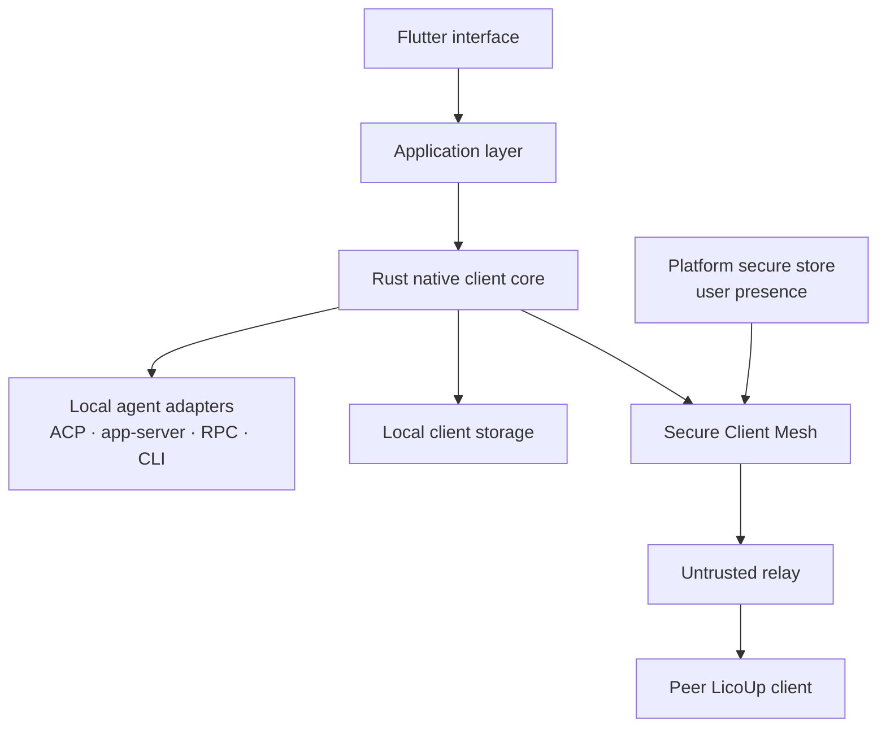
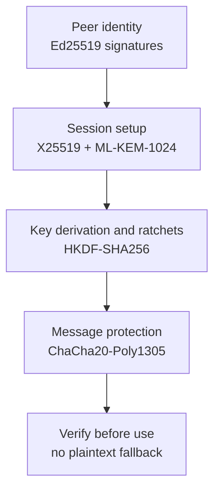
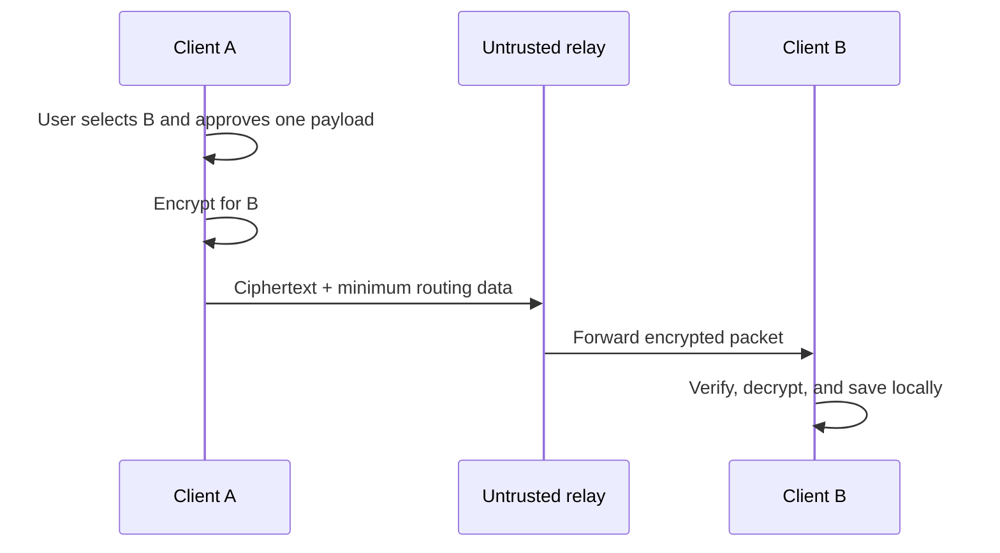

# LicoUp Architecture

English (normative) · [简体中文](README.zh-CN.md) · [Documentation](../README.md) · [Project](../../README.md)

[`PRODUCT.md`](../../PRODUCT.md) owns the current product boundary and the
approved north star. Current component and dependency facts are owned by the
Rust/Flutter module trees, `apps/desktop/packaging.modules.json`, and the
architecture verifier under `apps/desktop/scripts/client-architecture/`. This
document is their public architectural projection.

LicoUp is a local-first client. Flutter owns the interface. Rust owns the
native client core, local adapters, bounded work, and Secure Client Mesh.

## Design ideas

- **Diverse** — adapters let different agents and devices join the client.
- **Connected** — local tools and peer clients share a clear flow.
- **Open** — source and client contracts can be reviewed and extended.
- **Integrated** — one application layer keeps the interface independent from
  each adapter.

## Components

| Area | Responsibility |
| --- | --- |
| Flutter interface | Navigation, views, user choices, and safe summaries |
| Application layer | Client flows and adapter-independent rules |
| Rust native core | Local tasks, protocols, validation, and encryption |
| Agent adapters | Translate supported native agent interfaces |
| Platform bridges | Secure storage, user presence, and platform launch work |
| Secure Client Mesh | Client-owned end-to-end encryption and peer trust |

## Built-in capability boundaries

The default client contains only the foundations and local-first scenarios in
this table. Each row owns a narrow contract and a dedicated regression module;
one scenario does not reach into another scenario's storage or interface.

| Capability | Owned boundary |
| --- | --- |
| Rust task queue | Bounded multi-producer FIFO work, backpressure, disconnect handling, and worker lifecycle for local jobs |
| ACP adapter | Agent session negotiation, native continuation, streamed events, permission waits, cancellation, and sanitized errors |
| MCP adapter | Bounded MCP/JSON-RPC validation, request-ID preservation, response forwarding, and one-shot approval for external effects |
| Agent discovery | Concurrent probes of platform application sources, package managers, executable locations, and configured agent roots; normalized results are cached locally |
| Adapter plugin management | One native catalog for packaged native, bundled ACP, and explicitly installable LicoUp bridges; lifecycle actions are confirmed and limited to LicoUp-owned state |
| Agent conversations | New and native continued sessions plus the process-local [Local Bridge](../protocols/local-bridge.md) for wakeable progress, native steer, and exact-session safe-boundary follow-up |
| Skill management | Local install/update/delete workflows, configured-source scheduling, and invocation counters grouped by time window |
| Conversation management | Local all-conversation or exact-keyword backup to a user-selected directory |
| Usage statistics | Local token aggregation by agent or model with immutable historical day/model rollups, current-day event details, a 90-day scan cache, 30-day default display, and selectable 7/30/90 display windows |
| Secure Client Mesh | Pairing, trust, encrypted peer messages/files, replay protection, and opaque relay envelopes |

Optional collaboration is not part of this default composition.

The current agent and platform adaptation targets are generated in
[Compatibility](../COMPATIBILITY.md).

## Platform adapter boundary

The shared Rust and Flutter layers remain platform-neutral. Native hosts own
only the platform operation that cannot be portable:

| Platform | Native adapter ownership |
| --- | --- |
| macOS | Application discovery, Keychain/user-presence bridge, packaging, and launch |
| Windows | Application discovery, Credential Manager custody, client authorization sessions, packaging, and launch |
| Ubuntu | Package/application discovery, Secret Service or explicit memory-only custody, packaging, and launch |
| Android | Package discovery, Keystore/BiometricPrompt bridge, Rust FFI lifecycle, install, and launch |
| iOS | Application container integration, Keychain/LocalAuthentication bridge, Rust FFI lifecycle, install, and launch |

Source support, ordinary builds, physical-device security evidence, GitHub
Release artifacts, and store publication are separate claims. The current
[compatibility matrix](../COMPATIBILITY.md) records them without
promoting simulator or source checks into physical-device or release proof.

## Secure Client Mesh layers

The current protocol uses one fixed, required security profile. Each algorithm
has one job. Security is not measured by the number of algorithms that can be
turned on.

The profile combines algorithms only when they have different roles and a
reviewed combination rule. The signed handshake fixes the profile used by the
session. Derived keys have clear labels, so a key for one job is not reused for
another job. A missing or failed security check never enables plaintext.

## Current platform key custody

The current client checks the platform before it selects local key storage. It
uses an available OS secret store or an explicit memory-only store. Memory-only
keys are lost on restart, so the client requires pairing and new keys again. A
storage failure never enables plaintext communication.

Current platform adapters protect sealed secret data. They do not expose a
general external crypto-provider interface.
The client has no runtime crypto-patch loader.

Moving the same sealed key data to another local store does not change the
fixed wire-security profile. The current storage interface can return key data
to the native core, so an OS store must not be described as proof that every
protocol key is hardware-backed or non-exportable. Platform support claims need
current measured evidence.

## Optional collaboration boundary

LicoMesh collaboration is a separately installed plugin. It is absent from
default startup and navigation until the user installs and enables it. Source
selection binds a normalized GitHub repository to an exact immutable commit.
Before package download, the user imports the trusted signing key through a
separate action; a key bundled with the package or returned by the same download
is never a trust root. Changing the repository, key, or fixed runner identity
requires removal and a new direct authorization.

The package signature covers the fixed runner identity and digest, contract
versions, source commit, and a complete path/length/digest inventory. Package
inspection and every start verify the protected trust record, signature, and
inventory again. The authoritative record also binds the exact approved commit,
package, inventory, runner, contracts, target, and deployment generation, so an
older validly signed package cannot replace the approved artifact. Selected
components are copied into an immutable snapshot; writable runtime data lives
outside that loadable tree. The client never runs package scripts, hooks,
user-provided arguments, or inherited environment variables.

A deployment starts only after a separate manual action, using the fixed signed
external runner on loopback. The verified runner and assembled snapshot are
passed as locked immutable objects rather than reopened from writable paths.
The client binds the process executable and start identity to a runtime lease
and verified health/capability response. Stop and uninstall act only on that
verified identity and fail closed on mismatch. The source tree does not bundle
a LicoMesh server runner: these controls establish a client deployment
capability, not evidence that a real server artifact was obtained, started,
released, or published.

MCP external effects use a separate bounded authorization flow. The bridge may
stage an exact preview, but it performs no exchange and cannot approve it. The
authenticated client UI shows the destination, purpose, request body, and every
selected file. The native command requests fresh platform user presence for the
canonical digest and then atomically claims the matching short-lived preview
exactly once before exchange. The digest binds the direction, destination,
purpose, protocol revision, session, and exact request body. Caller-supplied
flags or ordinary state files are not proof of approval. The operation fails
closed after expiry, cancellation, reuse, mutation, rollback, or when a platform
user-presence authority is unavailable.

Installation, enablement, startup, a schedule, or an agent request cannot grant
external-transfer permission. Each exact request and each selected local file
that would leave the device requires its own protected one-shot approval.

## Data boundary

The client follows these rules:

- Sensitive runtime data stay on the device.
- Local paths, logs, histories, usage records, credentials, and raw runtime
  data stay on the device.
- Default client scenarios do not upload sensitive runtime data or plaintext
  user content to a service.
- An optional external MCP request can contain only the exact body and files in
  its protected one-shot approval. HTTPS protects transport, but the named
  external service can read the approved content.
- Without such an exact external-service approval, protected content leaves
  only as ciphertext addressed to a named peer client.
- The sender encrypts before network I/O. The receiver verifies before use.
- The relay is outside the trusted client boundary. Client security does not
  depend on its storage policy or operator claims.
- Keys are held through platform security tools. Protected key use asks for
  user presence when the platform supports it.
- Logs and test reports contain safe summaries, not raw user content.

## Repository map

| Path | Purpose |
| --- | --- |
| `apps/desktop/` | Flutter desktop and mobile client |
| `crates/licoup-native/` | Rust client core and command |
| `packages/contracts/client/` | Client-owned schemas |
| `tests/` | Contract and boundary tests with synthetic data |
| `tools/` | Reusable build and verification tools |

Plans, temporary scripts, local skills, raw evidence, and runtime data are local
work materials. They are not part of the public source tree.
