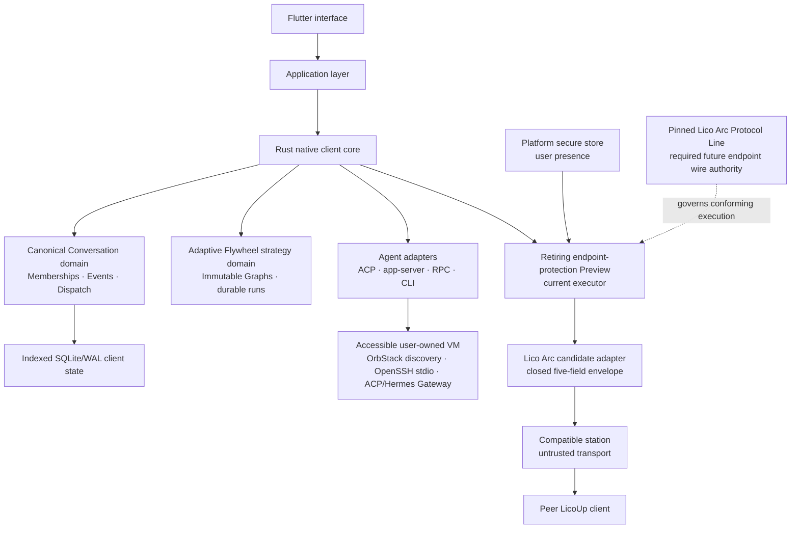
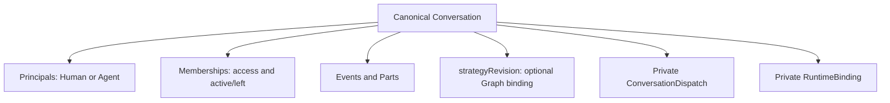
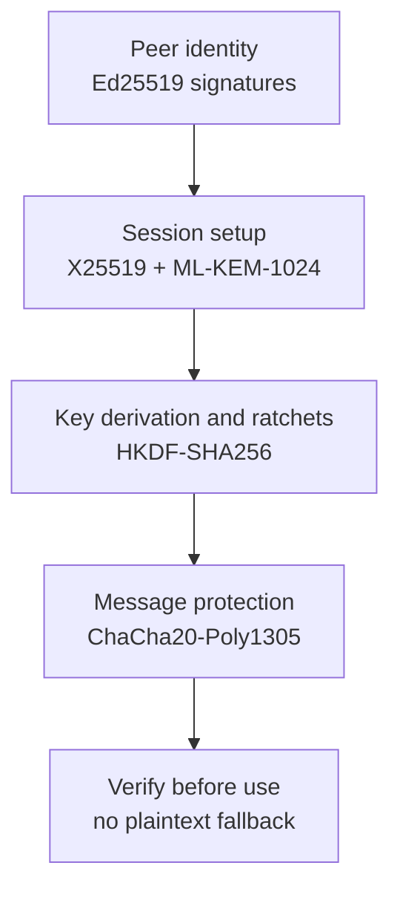
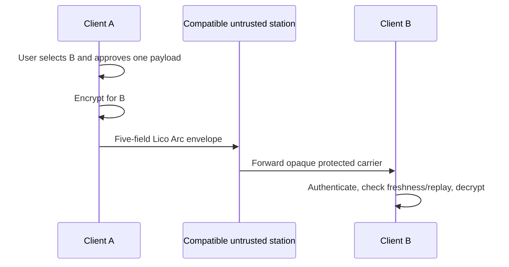

# LicoUp Architecture

English (normative) · [简体中文](README.zh-CN.md) · [Documentation](../README.md) · [Project](../../README.md)

[`PRODUCT.md`](../../PRODUCT.md) owns the durable product goal and boundary.
[`../STATUS.md`](../STATUS.md) owns current status. Current component and
dependency facts are owned by the
Rust/Flutter module trees, `apps/desktop/packaging.modules.json`, and the
architecture verifier under `apps/desktop/scripts/client-architecture/`. This
document is their public architectural projection.

LicoUp is a local-first client. Flutter owns the interface. Rust owns the
native client core, local and accessible VM adapters, bounded work,
and the [current retiring endpoint-protection Preview](../STATUS.md)
implementation. Lico Arc Protocol, not this client repository, owns stable
endpoint wire semantics.

## Design ideas

- **Diverse** — adapters let different agents and devices join the client.
- **Connected** — local tools and peer clients share a clear flow.
- **Open** — source and client contracts can be reviewed and extended.
- **Integrated** — one application layer keeps the interface independent from
  each adapter.

## Components

| Area | Responsibility |
| --- | --- |
| Flutter interface | Navigation, views, user choices, and safe summaries |
| Application layer | Client flows and adapter-independent rules |
| Rust native core | Local tasks, protocols, validation, and encryption |
| Conversation domain | Sole durable authority for direct/group chat, Human/Agent Memberships, structured Events, and Membership-scoped dispatch; native runtime locations stay private |
| Adaptive Flywheel strategy domain | Immutable package revisions, JSON Graph validation, bindings, exact authorization, durable run reduction, and bounded effect scheduling independent from Conversation history |
| Agent adapters | Translate supported local interfaces and discovered or explicit OpenClaw/Hermes VM protocol connections |
| Platform bridges | Secure storage, user presence, and platform launch work |
| Endpoint-protection Preview | Current LicoUp executor, local key/Provider custody, peer trust, approval, and retiring endpoint implementation; it is not stable protocol authority |
| Lico Arc Protocol Line | Owns wire-observable Pairwise Protection, Generic Message, Reliable Exchange, negotiation, and Transport Profile semantics |
| Lico Arc adapter | Strict candidate outer-envelope codec and four bounded station transport operations |

## Conversation authorities

[`PRODUCT.md`](../../PRODUCT.md) owns the one-conversation destination. The
Canonical Conversation store in
`crates/licoup-native/src/domain/client_conversation/` owns implemented
direct/group chat facts. Native agent history, Adaptive Flywheel graphs, and
Delivery Plans are adjacent authorities. They are not copies of that
Conversation, and this section does not replace their owning documents.

| Authority | Owns | Relation |
| --- | --- | --- |
| Canonical Conversation | Human/Agent entry, Memberships, ordered Events | Sole durable chat store. Direct and group are the same type; only `isGroup` and Membership count differ |
| [Native history catalog](../protocols/semantic-conversation.md) | Read-only adapter sessions assembled as semantic conversation | One-to-one Agent workspace list/replay. Not Canonical `conversation.list`. Native locations stay private on Membership RuntimeBindings |
| [Adaptive Flywheel](../functionality/ADAPTIVE-FLYWHEEL.md) | Immutable Graph revision, bindings, authorization, durable run reduction | Independent of Conversation history. A group may bind `strategyRevision`; actor effects project back as Membership Events. Graph/run is not a second transcript |
| [Delivery Plan](../protocols/subagent-mcp.md) | Plan and Checkpoint lifecycle | Dispatches through Conversation Memberships. Adaptive Flywheel remains the Agent/model route selector |

| Record | Meaning |
| --- | --- |
| Principal | Peer identity. `kind` is human or agent; an Agent also has `agentId` |
| Membership | That Principal's seat in one Conversation. Dispatch keys are `conversationId` + `membershipId` |
| Event / EventPart | The only visible history. Message, membership-changed, and availability Events carry text, reasoning, tool, artifact, diagnostic, and metadata Parts. Streaming appends Parts on an unfinalized Event |
| `strategyRevision` | Optional authorized Flywheel Graph on the Conversation. Not a transcript |
| ConversationDispatch | Private Membership-scoped Agent execution. Native paths stay out of the public contract |
| RuntimeBinding | Private adapter session bound to a Membership. Hidden from UI, MCP, and export |

Addressing selects Memberships; it is not a second protocol. An `@mention`, a
strategy actor slot, a Delivery route, and a Subagent
`conversationId + membershipId` all name existing Agent Memberships. In this
model DirectTurn is a mention dispatch cause on ConversationDispatch, not a
second send, execute, or display stack.

There is one dispatch door. After a human Event is persisted, dispatch runs
with conversation and event identity alone: native resolves mentioned
Memberships from the stored Event text, and a bound strategy is the same door
addressed by binding rather than by text. The dispatch completion authority is
the only writer of terminal Event, dispatch state, and mention turn state; a
strategy run start or resume registers its entry Membership turn before the
drive thread starts, returns that handle in the same response, and abandons an
unrun entry with a typed code. A Subagent delegation streams frames into the
same Conversation dispatch scope and settles through the same authority.
Services constructed without the persistent host runtime reject dispatch-type
and run actions with the typed transport rejection instead of opening
unattended turns.

The dropped `conversation_roles` table is not a current store. Adaptive
Flywheel is a user-imported Graph, not an MCP Role pool or round-robin Role
flywheel.

Group panes render Canonical Conversation Events. One-to-one Agent panes
render the native catalog plus live PersistentTurn. Shared bubble widgets do
not merge those authorities.

## Built-in capability boundaries

The default client contains only the foundations and local-first scenarios in
this table. Each row owns a narrow contract and a dedicated regression module;
one scenario does not reach into another scenario's storage or interface.

| Capability | Owned boundary |
| --- | --- |
| Rust task queue | Bounded multi-producer FIFO work, backpressure, disconnect handling, and worker lifecycle for local jobs |
| ACP adapter | Agent session negotiation, native continuation, session listing/loading, streamed events, permission waits, cancellation, and sanitized errors |
| MCP adapter | Bounded MCP/JSON-RPC validation, request-ID preservation, response forwarding, and one-shot approval for external effects |
| Agent discovery | Concurrent probes of the Agent Scan Path Manifest only (named Agent binaries, config, and history). PATH, personal library roots, photo/music libraries, and network volumes are never walked. Third-party Agent binaries are not executed during unused-agent discovery or cold start. Opening an Agent's conversation interface refreshes that Agent's native model catalog from its CLI or named store. Home is taken from the environment; macOS firmlink-equivalent home paths classify the same way. Unused-agent probes classify other-app containers lexically and do not stat them. Token usage is not scanned until Monitoring is opened |
| Adapter plugin management | One native catalog for packaged native, bundled ACP, and explicitly installable LicoUp bridges; lifecycle actions are confirmed and limited to LicoUp-owned state |
| Agent conversations | Direct and group chat share the canonical Conversation model. Human and Agent Principals participate through explicit Memberships. One client-local CLI host per portable data root and owning LicoUp process owns every accepted packaged-adapter turn over private local IPC. It survives replaceable observer and stdio-proxy lifetimes, then exits when the owning LicoUp process exits. New and native continued sessions keep process-local, wakeable progress in that host; an active turn uses native steer when supported, otherwise an exact-session safe-boundary follow-up. Replaceable observers attach by Conversation-scoped handle and process-local cursor; committed Conversation Events provide exact replay below each active turn's disposable 16 MiB cache floor. Observer loss is not cancel or steer. Native sessions remain adapter-owned execution details bound privately to a Membership. A local [Subagent MCP](../protocols/subagent-mcp.md) dispatches only by `conversationId + membershipId` and never exposes native continuation paths |
| Adaptive Flywheel | The catalog stays empty until a ZIP import. Imported ZIP packages contain root `workflow.json` plus optional `scripts/`; the Graph decides pipeline or Agent Loop behavior. Immutable revisions own bindings and exact authorization, while durable runs expose bounded ready-frontier scheduling and explicit terminal or recovery states. There is no Better Plan installation action and no ordinal Conversation compatibility path |
| Skill management | Read-only discovery of existing local skills, recoverable removal to the system Trash, and invocation counters grouped by time window; no download, install, update, or synchronization channel |
| Conversation management | Indexed list/get/event paging and search plus bounded canonical import/export; third-party native history is never rewritten |
| Delivery Plan | Persisted Plans and Checkpoints own delivery eligibility and progression. The Conversation runtime claims the complete eligible frontier in stable order, opens each Agent effect as a Membership-scoped PersistentTurn through the process-owned Conversation host, and advances a checkpoint only after terminal settlement. Adaptive Flywheel remains the sole Agent/model route-selection authority |
| Usage statistics | Local token aggregation by agent or model with immutable historical day/model rollups, current-day event details, path-free Plan/Task/dispatch rollups, exact-coverage facts, a 90-day scan cache, 30-day default display, and selectable 7/30/90 display windows |
| Endpoint-protection Preview | Current pairing, trust, encrypted peer messages/files, replay protection, endpoint-authenticated results, and Lico Arc candidate carriage; this retiring implementation has no future compatibility promise |

Optional collaboration is absent from default startup and navigation. The
client imports its trusted signing key through a separate action that is never
a trust root by itself, then verifies the immutable package source and fixed
signed external runner on loopback before an explicit start.

The delivery view consumes one safe native ledger projection. LicoUp owns Plan
scheduling and checkpoint progression; Adaptive Flywheel owns route selection;
and Conversation Memberships own Agent dispatch. Native continuation locations
remain private adapter bindings. The projection keeps only safe codes,
localized role and state labels, Agent/model labels, numeric Token counts,
exact-or-estimated coverage, and Plan hierarchy. It excludes prompts, replies,
tool payloads, summaries, compaction, cache controls, and a second client-owned
context model. Retention is bounded to active deliveries and the newest twenty
terminal rollups.

The current agent and platform adaptation targets are generated in
[Compatibility](../COMPATIBILITY.md). Station-wire and operation status is
recorded in [Status](../STATUS.md).

## VM discovery and native-protocol boundary

For OpenClaw and Hermes, the desktop client enumerates running local OrbStack
machines with a bounded command and checks a fixed set of official and common
executable locations. It reads no guest configuration or history. Machine
names and returned absolute paths are validated before Rust creates a transient
`machine@orb` route; automatic VM routes are excluded from discovery caches.
The scan has fixed time, output, machine-count, and concurrency bounds.

For another VM, Flutter collects the host, optional port/user, guest executable,
and absolute guest working directory. Rust validates a closed connection shape
and stores it only with the canonical manual target. Passwords, private keys,
command fragments, relative guest directories, and unknown fields are rejected.

The native core starts the platform's system `ssh` executable in batch mode
with strict host-key checking, no TTY, forwarding, local command, environment
forwarding, or connection multiplexing. It passes one fixed, shell-quoted
guest command. OpenClaw starts ACP. Hermes starts ACP when its optional package
passes the fixed capability check; otherwise automatic discovery starts the
installer environment's Python with `tui_gateway.entry`. Both protocols use
bounded JSON-RPC over stdin/stdout. Local collaboration MCP descriptors are not
sent to the guest. Conversation discovery and readback use the selected
protocol's session list/load operations; the client does not scan, mount, or
copy the guest history store. The UI keeps the SSH destination visible whenever
that target is selected.

## Platform adapter boundary

The shared Rust and Flutter layers remain platform-neutral. Native hosts own
only the platform operation that cannot be portable:

| Platform | Native adapter ownership |
| --- | --- |
| macOS | Application discovery, Keychain/user-presence bridge, packaging, and launch |
| Windows | Application discovery, Credential Manager custody, client authorization sessions, packaging, and launch |
| Ubuntu | Package/application discovery, Secret Service or explicit memory-only custody, packaging, and launch |
| Android | Package discovery, Keystore/BiometricPrompt bridge, Rust FFI lifecycle, install, and launch |
| iOS | Application container integration, Keychain/LocalAuthentication bridge, Rust FFI lifecycle, install, and launch |

Source support, ordinary builds, physical-device security evidence, GitHub
Release artifacts, and store publication are separate claims. The current
[compatibility matrix](../COMPATIBILITY.md) records them without
promoting simulator or source checks into physical-device or release proof.
Caller-supplied flags or ordinary state files are not proof of approval;
protected operations require the platform-owned authorization session.

For an external MCP effect, the bridge may stage an exact preview, but it
performs no exchange and cannot approve it. The native command requests fresh
platform user presence for the canonical digest, then atomically claims the
matching short-lived preview exactly once before exchange.

## Current retiring endpoint-protection Preview layers

The current retiring endpoint-protection Preview uses one fixed security
profile. This section inventories that implementation; it does not define a
Lico Arc Profile or promise future wire compatibility. The preview is to be
retired directly rather than retained as a compatibility mode when a complete
pinned Lico Arc Protocol Line replaces it. Each current algorithm has one
job. Security is not measured by the number of algorithms that can be turned
on.

The profile combines algorithms only when they have different roles and a
reviewed combination rule. The signed handshake fixes the profile used by the
session. Derived keys have clear labels, so a key for one job is not reused for
another job. A missing or failed security check never enables plaintext.

## Current platform key custody

The current client checks the platform before it selects local key storage. It
uses an available OS secret store or an explicit memory-only store. Memory-only
keys are lost on restart, so the client requires pairing and new keys again. A
storage failure never enables plaintext communication.

Current platform adapters protect sealed secret data. They do not expose a
general external crypto-provider interface.
The client has no runtime crypto-patch loader.

Moving the same sealed key data to another local store does not change the
selected wire profile. Private-key custody and local Provider selection remain
LicoUp concerns; the wire-observable profile and negotiation rules belong to
the pinned Lico Arc Protocol Line. The current storage interface can return key
data to the native core, so an OS store must not be described as proof that
every protocol key is hardware-backed or non-exportable. Platform support
claims need current measured evidence.

Installation, enablement, startup, a schedule, or an agent request cannot grant
external-transfer permission. Each exact request and each selected local file
that would leave the device requires its own protected one-shot approval.

## Data boundary

The transport edge is transport adaptation, not a client-service trust
relationship. The current preview pairs and negotiates only with the peer
endpoint. A stable implementation must instead execute the Pairwise
Protection and negotiation semantics of one pinned Lico Arc Protocol Line.
Choosing a relay address or using its delivery interface does not pair LicoUp
with that relay, make the relay an identity authority, or delegate any security
decision to it.

Lico Arc Protocol owns the wire-observable Pairwise Protection, Generic
Message, Reliable Exchange, negotiation, and Transport Profile contracts.
LicoUp owns their local execution, private keys, Provider configuration,
plaintext, history, backups, user trust, approvals, and local effects. The
current retiring endpoint-protection Preview is not a Lico Arc Profile and
will not be retained as a future compatibility surface.

The current client-owned adapter pins the candidate `licoarc.relay.v1` outer
contract. Its public object contains exactly `contractVersion`, `envelopeId`,
`mailboxId`, `ciphertext`, and `expiresAt`; the client rejects unknown fields
and unsupported versions. The encrypted carrier binds those routing fields as
authenticated data and keeps the private header and protected content inside
the ciphertext field.

The BadTower HTTP adapter has four transport operations: lease one mailbox,
send one envelope, receive a bounded envelope set, and delete one envelope.
The adapter is an implementation boundary owned by LicoUp, not a station SDK,
protocol authority, or trusted product integration. A bounded local
acceptance has exercised this path through an actual BadTower candidate with
two freshly initialized endpoints. See [Status](../STATUS.md) for the exact
verification and release boundaries.

The client treats all relay output as attacker-controlled. LicoUp never
accepts an encryption algorithm, key, trust root, or security policy from a
relay.
Delivery acknowledgements, leases, timestamps, and queue state reported by a
relay are transport hints only. They do not prove peer identity, packet
freshness, non-replay, integrity, or final receipt. LicoUp makes those decisions
from its endpoint-owned end-to-end state and accepts a final receipt only when
the peer-authenticated protocol state supports it.

The client follows these rules:

- Sensitive runtime data stay on the device.
- Local paths, logs, histories, usage records, credentials, and raw runtime
  data stay on the device.
- Default client scenarios do not upload sensitive runtime data or plaintext
  user content to a service.
- An optional external MCP request can contain only the exact body and files in
  its protected one-shot approval. HTTPS protects transport, but the named
  external service can read the approved content.
- Without such an exact external-service approval, protected content leaves
  the client only as ciphertext addressed to a named peer client, unless you
  choose Telegram or another external messenger as a trusted channel.
- The sender encrypts before network I/O. The receiver authenticates and
  verifies before use.
- The station is outside the trusted client boundary. Client security does not
  depend on its storage policy or operator claims.
- Only ciphertext and the minimum routing fields cross the station boundary.
  Private keys, local trust and approval policy, protocol-defined freshness and
  replay state, and authenticated final-receipt state remain endpoint-held.
- Keys are held in an available OS secret store or an explicit memory-only
  store. Protected key use asks for user presence when the platform supports
  it.
- Logs and test reports contain safe summaries, not raw user content.

## Repository map

| Path | Purpose |
| --- | --- |
| `apps/desktop/` | Flutter desktop and mobile client |
| `crates/licoup-native/` | Rust client core and command |
| `packages/contracts/client/` | Client-owned schemas |
| `tests/` | Contract and boundary tests with synthetic data |
| `tools/` | Reusable build and verification tools |

Plans, temporary scripts, local skills, raw evidence, and runtime data are local
work materials. They are not part of the public source tree.
