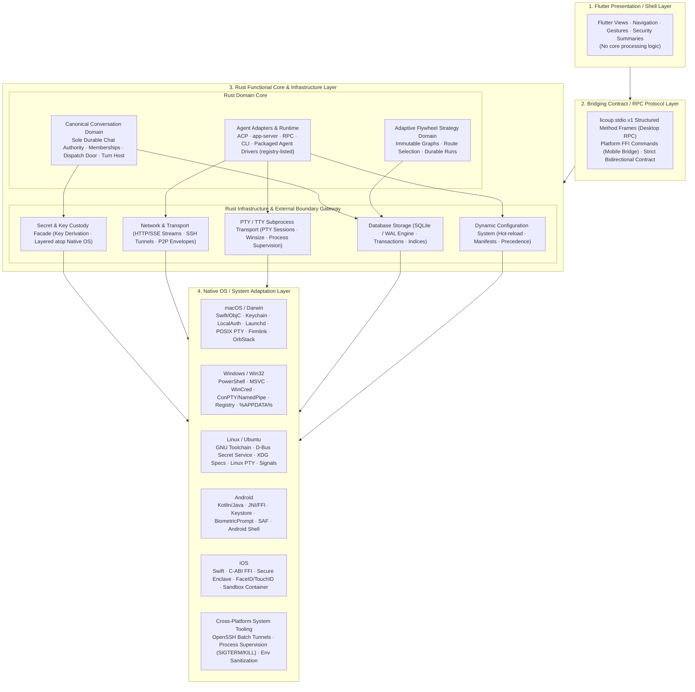
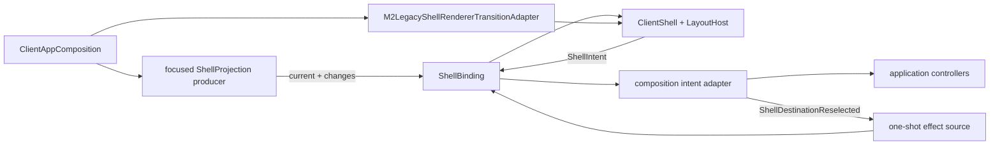

# LicoUp Architecture

| Related Document | Language / Path | Authority |
|:---|:---|:---|
| **Normative Version** | English (Normative) | Authoritative technical architecture specification |
| **Localization** | [简体中文](README.zh-CN.md) | Localized Chinese projection |
| **Product Goal** | [PRODUCT.md](../../PRODUCT.md) | Durable product goal, design philosophy, and promises |
| **Current Status** | [STATUS.md](../STATUS.md) | Current implementation facts and release evidence |
| **Compatibility Matrix** | [COMPATIBILITY.md](../COMPATIBILITY.md) | Platform and agent support matrix (projected from the runtime adapter registry) |
| **Domain Vocabulary** | [CONTEXT.md](../../CONTEXT.md) | Unified domain vocabulary definitions |
| **Documentation Index** | [docs/README.md](../README.md) | Complete documentation table of contents |

[`PRODUCT.md`](../../PRODUCT.md) owns the durable product goal and boundary. [`../STATUS.md`](../STATUS.md) owns current status. Current component and dependency facts are owned by the Rust/Flutter module trees, `apps/desktop/packaging.modules.json`, and the architecture verifier under `apps/desktop/scripts/client-architecture/`. This document is their public architectural projection.

---

## Security and Public-Source Boundary

[Security & Data Boundaries](SECURITY-AND-DATA-BOUNDARY.md) owns the detailed mechanics. This entry preserves their cross-document invariants:

- A Compatible untrusted station is transport only. The sender emits a Five-field Lico Arc envelope; peer identity, freshness, replay rejection, and authenticated final receipt remain endpoint decisions.
- Local paths, logs, histories, usage records, credentials, and raw runtime data stay on the device. Only approved protected peer content and the protocol's minimal routing fields cross the station boundary.
- Current platform key custody uses operating-system secure storage when available or explicit memory-only custody. Caller-supplied flags or ordinary state files are not proof of approval; protected effects require a platform-held authorization session.
- For an approved peer transfer, the sender encrypts before network I/O; the relay never receives plaintext or endpoint keys.
- Optional collaboration is absent from default startup and navigation. Its signing key is imported through a separate action and is never a trust root derived from package download; execution uses the fixed signed external runner on loopback.
- The bridge may stage an exact preview, but it performs no exchange and cannot approve it. A native command requests fresh platform user presence for the canonical digest, then atomically claims the matching short-lived preview exactly once.
- The client accepts no executable crypto patches from a relay or service, and there is no runtime crypto-patch loader.

Agent conversations remain Rust-hosted. New and native continued sessions keep process-local, wakeable progress; an active turn uses native steer when supported, otherwise an exact-session safe-boundary follow-up. Observer loss is not cancellation or settlement. Subagent MCP addresses only canonical Conversation and Membership identities, while native continuation locations remain private.

---

## Horizontal Tiers & Vertical Domain Slices

LicoUp is structured across **Horizontal Platform Tiers** and **Vertical Domain Slices**:

### 1. Four Horizontal Platform Tiers
1. **Tier 1: Flutter Presentation / Shell Layer** — Pure user appearance, navigation, and interaction views without core business processing logic (any legacy processing logic will be progressively decoupled downward).
2. **Tier 2: Bridging Contract / RPC Protocol Layer** — Bidirectional communication contract between Flutter and Rust (`licoup.stdio.v1` structured method frames and mobile platform FFI commands), strictly precluding raw CLI argument array pass-through.
3. **Tier 3: Rust Functional Core & Infrastructure Layer** — Explicitly bifurcated into:
   - **Rust Domain Core**: Hosts `Canonical Conversation` (dispatch door & turn host), `Adaptive Flywheel` (strategy graphs and route selection), and `Agent Adapters & Runtime` (registry-listed agent vendor protocols and dispatch).
   - **Rust Infrastructure & External Boundary Gateway**: Serves as the clear boundary between internal domain logic and the external physical world, encompassing **Database Storage (SQLite WAL)**, **Dynamic Configuration**, **Secret & Key Custody Facade (Layered atop Native OS)**, **Network & Transport**, and **PTY / TTY & Subprocess Management**.
4. **Tier 4: Native OS / System Adaptation Layer** — Low-level operating system and platform script/API adaptations (macOS Keychain/PTY/launchd; Windows WinCred/ConPTY/PowerShell; Linux Secret Service/XDG; Android JNI/Keystore/SAF; iOS Secure Enclave/FaceID, etc.).

### 2. Vertical Domain Slices
Vertical business capabilities such as **Conversation** operate as end-to-end vertical architectural slices cutting across Flutter presentation views, bridging contracts, Rust domain dispatching, infrastructure persistence, and native operating system environments.

Lico Arc Protocol, not this client repository, owns stable endpoint wire semantics.

---

## Four-tier Architecture Component Diagram



---

## Tier and Module Responsibilities

| Tier | Architectural Module | Responsibility Boundary |
|:---|:---|:---|
| **Tier 1: Flutter Presentation Layer** | Flutter User Interface (Shell / UI) | Navigation, views, user interactions, visual styling, and security summaries. Must not contain core business processing logic. |
| **Tier 2: Bridging Contract Layer** | RPC / FFI Communication Contract | Governs Flutter ↔ Rust contract. Desktop uses `licoup.stdio.v1` structured method frames, mobile uses C-ABI FFI commands; strictly prohibits CLI argument array pass-through. |
| **Tier 3: Rust Domain Core** | Canonical Conversation Domain | Sole durable authority for direct/group chat, Human/Agent Memberships, structured Events, and Membership-scoped dispatch; native runtime locations stay private. |
| | Adaptive Flywheel Strategy Domain | Immutable package revisions, JSON Graph validation, bindings, exact authorization, durable run reduction, and bounded effect scheduling independent from Conversation history. |
| | Agent Adapters & Runtime | Translates the registry-listed local agent interfaces (ACP, app-server, CLI, RPC) and discovered VM protocol connections. |
| **Tier 3: Rust Infrastructure Layer** | Database Storage (SQLite WAL) | Sole persistence engine providing ACID transactions, typed migrations, and compound indexed query access. |
| | Dynamic Configuration System | Runtime config parsing, dynamic reload/perception, deterministic precedence (CLI > Env > Manifest > Platform defaults). |
| | Secret & Key Custody Facade | Unified security facade directly layered atop Tier 4 Native OS keyrings (Keychain/WinCred/Keystore/Secure Enclave). |
| | Network & Transport | HTTP/SSE streaming client, system batch SSH tunnels, P2P encrypted envelope transport, and connection lifecycles. |
| | PTY / TTY Subprocess Transport | Cross-platform pseudo-terminal abstraction, window size synchronization, ANSI streaming, and process supervision ladders (Grace $\to$ SIGTERM $\to$ SIGKILL). |
| **Tier 4: Native OS Adaptation Layer** | macOS / iOS Adaptation | Swift/ObjC bridge, Keychain secure storage, `LocalAuthentication` biometric confirmation, Launchd autostart, APFS/Firmlink path normalization, OrbStack CLI discovery. |
| | Windows Adaptation | PowerShell/Cmd script wrapping, WinCred credential management, ConPTY pseudo console and named pipes, registry autostart, wide-character paths. |
| | Linux / Ubuntu Adaptation | GNU toolchain, D-Bus Secret Service (with ephemeral fallback), XDG Base Directory/Autostart specs, POSIX PTY, and signal supervisor. |
| | Android Adaptation | Kotlin/Java host integration, `android_ffi.rs` lifecycle bridge, Android Keystore, `BiometricPrompt`, SAF storage, and Android Shell sandbox interaction. |
| | Cross-Platform Tooling & Sandbox | OpenSSH batch tunnels, `process_supervisor.rs` supervision ladders (Grace Period $\to$ SIGTERM $\to$ SIGKILL), and environment variable sanitization allowlists. |

---

## Native OS Adaptation Boundary

The shared Rust functional core and Flutter presentation layer remain platform-neutral. Tier 4 "Native OS Adaptation Layer" owns the low-level operating system APIs, scripts, and platform-specific toolchains:

| Platform / Tooling Domain | Native System Adaptation Responsibilities |
|:---|:---|
| **macOS (Darwin / Swift / Unix)** | 1. **Security & Presence**: `Security.framework` (Keychain Services) and `LocalAuthentication.framework` (Touch ID / Apple Watch auth);<br>2. **Daemons & Autostart**: `~/Library/LaunchAgents/` launchd plist management and `launchctl bootstrap / bootout` scheduling;<br>3. **Terminal & Sandbox**: POSIX PTY (`openpty`, `termios`, `ioctl(TIOCSCTTY)`, `winsize`), APFS Firmlink system and data volume mapping;<br>4. **VM Probing**: OrbStack local Unix Domain Socket probing and `orb` CLI discovery. |
| **Windows (Win32 / PowerShell / MSVC)** | 1. **Credentials & Storage**: Windows Credential Manager (WinCred `CredReadW`/`CredWriteW`) secure custody;<br>2. **Terminal & Console**: Windows Pseudo Console API (ConPTY: `CreatePseudoConsole`) and Windows Named Pipes;<br>3. **Autostart & Registry**: Windows Registry Run key (`HKCU\Software\Microsoft\Windows\CurrentVersion\Run`) and Task Scheduler;<br>4. **Script Wrapping**: PowerShell / Cmd script wrapping (`Get-Command`, `.cmd`/`.ps1`), safe argument quoting, and wide-character path resolution. |
| **Linux / Ubuntu (GNU / POSIX / D-Bus)** | 1. **Secret Service**: D-Bus Freedesktop Secret Service spec (libsecret / GNOME Keyring / KWallet) with ephemeral in-memory fallback;<br>2. **System Standards**: XDG Base Directory spec (`$XDG_DATA_HOME`, `$XDG_CONFIG_HOME`) and XDG Autostart (`~/.config/autostart/*.desktop`);<br>3. **Terminal & Processes**: Linux PTY (`forkpty`, `ptsname`, `grantpt`), standard signal trapping, and `/proc` process-tree tracking. |
| **Android (Kotlin / Java / Android Shell)** | 1. **Host & Lifecycle**: `android_ffi.rs` JNI bridge, managing lifecycle across Android Activity/Service events and memory trimming;<br>2. **Hardware Keys & Auth**: Android Keystore System and `BiometricPrompt` hardware fingerprint/face confirmation;<br>3. **Storage & Shell**: Storage Access Framework (SAF), app private sandbox directories, and Android Toybox/Termux Shell sandbox interaction. |
| **iOS (Swift / ObjC / C-ABI FFI)** | 1. **FFI Integration**: `ios_ffi.rs` C-ABI memory-safe bridge, managing single-process restricted execution lifecycle;<br>2. **Hardware Storage & Auth**: Apple Secure Enclave hardware Keychain access and `LocalAuthentication` (Face ID / Touch ID);<br>3. **Sandbox & Container**: `NSApplicationSupportDirectory` sandbox paths and background execution constraints handling. |
| **Cross-Platform System Tooling** | 1. **Network Tunnels**: OpenSSH batch mode (`ssh -o BatchMode=yes -o StrictHostKeyChecking=yes`) interactive-free secure tunnels;<br>2. **Process Supervision**: `process_supervisor.rs` supervision ladders (Grace Period $\to$ SIGTERM $\to$ SIGKILL) and environment variable sanitization allowlists. |

---

## Domain Architecture Index

To maintain clarity across the four primary architectural tiers, detailed domain-specific designs are separated into dedicated documents:

| Architecture Domain | Architectural Tier | Specification Document | Domain Responsibilities |
|:---|:---|:---|:---|
| **Client-Native Interaction** | Tier 2: Bridging Contract Layer | [CLIENT-NATIVE-INTERACTION.md](CLIENT-NATIVE-INTERACTION.md) | `licoup.stdio.v1` structured method frames and mobile FFI command contracts |
| **Canonical Conversation Vertical** | Vertical Slice (Tiers 1 ~ 4) | [CONVERSATION-DOMAIN.md](CONVERSATION-DOMAIN.md) | Bidirectional binding, direct chat base with group orchestration encapsulation, state machine & end-to-end flows |
| **Agent Adapters & Runtime Architecture** | Tier 3: Rust Functional Core | [AGENT-ADAPTERS-ARCHITECTURE.md](AGENT-ADAPTERS-ARCHITECTURE.md) | Registry-derived driver taxonomy, standard protocols (ACP/RPC/PTY) vs proprietary (Codex/OpenCode) normalization |
| **Rust Infrastructure & Boundaries** | Tier 3: Infra & Boundary Gateway | [RUST-INFRASTRUCTURE-LAYER.md](RUST-INFRASTRUCTURE-LAYER.md) | Database (SQLite WAL), dynamic config, secret custody facade, transport, PTY/TTY |
| **Adaptive Flywheel** | Tier 3: Rust Functional Core | [ADAPTIVE-FLYWHEEL.md](../functionality/ADAPTIVE-FLYWHEEL.md) | Immutable Graph revisions, route selection, and durable run reduction |
| **Subagent MCP** | Tier 3: Rust Functional Core | [subagent-mcp.md](../protocols/subagent-mcp.md) | Assistant goal ownership, profile facts, and temporary Graph admission |
| **Semantic Conversation** | Tier 3: Rust Functional Core | [semantic-conversation.md](../protocols/semantic-conversation.md) | Registry-listed agent protocol translations, native catalog discovery, and read-only replay |
| **Security & Data Boundaries** | Tier 3: Rust Functional Core | [SECURITY-AND-DATA-BOUNDARY.md](SECURITY-AND-DATA-BOUNDARY.md) | VM discovery isolation, endpoint protection preview, platform secret custody, zero-trust data |
| **Platform System Bridges** | Tier 4: Native OS Adaptation | `crates/licoup-native/src/platform/` | Low-level OS APIs and system tooling for macOS, Windows, Linux, Android, iOS |

---

## Repository Structure

| Path | Purpose |
|:---|:---|
| `apps/desktop/` | Flutter desktop and mobile client (Tier 1 and parts of Tier 2) |
| `crates/licoup-native/` | Rust client core, commands, and platform bridges (Tier 3 and Tier 4) |
| `crates/licoup-conversation/` | (Target, placeholder — not yet a workspace member) Extracted Conversation domain crate |
| `crates/licoup-agent-runtime/` | (Target, placeholder — not yet a workspace member) Extracted Agent Runtime and adapter crate |
| `crates/licoup-platform-bridges/` | Native platform ABI and handle management (Tier 4) |
| `crates/licoup-endpoint-core/` | Endpoint identity, key custody, crypto foundations |
| `crates/licoup-protocol-bindings/` | Protocol type definitions |
| `crates/licoup-client-state/` | Client state management contracts |
| `crates/licoup-agent-adapters/` | Agent adapter trait definitions |
| `crates/lico-catalog-convergence/` | Catalog convergence logic |
| `packages/contracts/client/` | Client-owned schemas (Tier 2) |
| `tests/` | Contract and boundary tests with synthetic data |
| `tools/` | Reusable build and validation tools |

Plans, temporary scripts, local skills, raw evidence, and runtime data belong to local working materials and do not enter public source.

---

## Current Architecture Debt & Migration Status

> This section documents known structural problems and the approved migration path.
> It is maintained alongside the living codebase and updated as migration progresses.

### Known Structural Problems (as of 2026-08-24)

| Problem | Severity | Location | Impact |
|:---|:---|:---|:---|
| **God Object `ClientController`** | Critical | `apps/desktop/lib/src/application/controller/` | The shell boundary is migrated, but 27 explicitly allowlisted frontend feature files still import it. Those paths are bounded migration debt. |
| **Mixin abuse as decomposition** | High | `application/controller/`, `application/features/agents/conversation/` | All 24 mixins in the app sit on a single inheritance chain; shared `this` means no encapsulation. |
| **Monolithic Rust crate** | High | `crates/licoup-native/` (~299K lines) | `domain/` has 48 entries, `core/` 52, `platform/` 85 (72K lines). Compilation slow, boundaries unclear. Largest files: `client_conversation/store.rs` (6.6K lines), `ffi/commands/mod.rs` (5.2K). |
| **Contracts layer bloat** | Medium | `apps/desktop/lib/src/contracts/` (93 files, 15.7K lines) | Mixes models, interfaces, parsing logic, and generated code in one layer. |
| **Giant Widget files** | Medium | `frontend/features/` | `canonical_group_conversation_pane.dart` (2603 lines), `agent_conversation_workspace.dart` (1390 lines). |
| **Vestigial backend layer** | Low | `apps/desktop/lib/src/backend/` (2.1K lines) | Too thin to provide real abstraction; also fabricates domain events in Dart (`dispatch.lane.bound`). |
| **Manual JSON-RPC method surface** | High | `platform/native_client/` ↔ Rust `bin/licoup/stdio_rpc/` | Method names hand-duplicated on both sides (25 Rust vs 23 Dart; two methods unreachable from Dart); codegen covers FFI data types only, not stdio frames. Dart routes some calls by argv-shape sniffing. |

### Implemented Presentation Boundary (M0–M2)

M0–M2 is implemented. `ClientShell` consumes the renderer-independent
`ShellBinding`; `LicoApp` selects only `ShellAppearance`; selected shell slices
rebuild below the static root scaffold. The bounded
`M2LegacyShellRendererTransitionAdapter` is the only composition edge that
constructs the unchanged controller-based destination and chrome widgets.



The first-round directory map is exact:

| Path | Implemented responsibility |
|:---|:---|
| `packages/presentation_contract/lib/` | SDK-only projection, intent, effect, and trace primitives |
| `apps/desktop/lib/src/presentation/shell/` | Stable immutable shell semantics and `ShellBinding` |
| `apps/desktop/lib/src/projections/adapters/` | Legacy read-side adapter |
| `apps/desktop/lib/src/projections/shell/` | Focused shell and effect producers |
| `apps/desktop/lib/src/frontend/binding/` | Flutter subscriptions, renderer port, and bounded frame timing |
| `apps/desktop/lib/src/frontend/shell/` | Controller-free shell renderer |
| `apps/desktop/lib/src/composition/` | Lifecycle, intent wiring, and the bounded M2 transition adapter |

Verified post-migration facts: 27 frontend `ClientController` importers, zero
under `frontend/shell`, zero bounded frontend repository/native-bridge imports,
and one pre-existing Flutter import under `contracts/presentation`. The last is
deferred with the long-term directory, theme/notifier, feature, and conversation
migrations. M2 does not migrate conversation rendering or introduce Riverpod,
hooks, a second layout authority, or a new wire contract.

### Target Architecture (Migration Destination)

#### Foundational Principle: CLI is the Product, Flutter is a Display Adapter

The Rust native host (`licoup-cli`) is a **complete semantic client** that runs independently
of any UI. It owns all conversation state, agent runtime, persistence, authorization, and
protocol execution. Flutter's sole responsibility is to **send user events** and **faithfully
render projected state**. Flutter contains zero business logic.

This architecture directly supports the product's IM destination: the same Rust host that
today processes local agent conversations will tomorrow also process messages from remote
peer endpoints via Lico Arc — with Flutter unchanged.

See [CONVERSATION-VERTICAL-CONTRACT.md](CONVERSATION-VERTICAL-CONTRACT.md) for the precise
L1-L6 interface specification.

#### Flutter App — Thin Display Shell (`apps/desktop/lib/src/`)

```
src/
├── events/              # L1: User gesture → typed ConversationCommand mapping
├── projections/         # Projection stream decoders (codegen from schema)
├── display/             # L6: Pure rendering of projected state
│   ├── conversation/    # Conversation message list, composer, streaming
│   ├── agent_hub/       # Agent discovery and management display
│   ├── settings/        # Settings panel display
│   ├── targets/         # Target list display
│   └── ...              # Other display panels
├── protocol/            # L2: stdio frame management, connection state
└── shared/              # Reusable widgets, theme, l10n
```

**Key decisions:**
- **No state management framework needed** — Flutter does not manage state. It consumes
  a `Stream<Projection>` from Rust and renders it. `StreamBuilder` + `ValueListenableBuilder`
  are sufficient.
- **Keep stdio JSON-RPC** — CLI process independence is a core product feature (host survives
  GUI crash). Add **codegen** from a shared schema to enforce type safety.
- **God Controller decomposition** — Replace with thin event sender + per-domain projection
  stream consumers. Not 24 mixins, not Riverpod providers — just streams.
- **No business logic in Flutter** — Send button disabled? Read that from projected
  `TurnState`. Never infer, never fabricate.

#### Rust Crates (Target Decomposition)

```
crates/
├── licoup-native/              # Host binary + FFI entry points
│   ├── src/bin/                # licoup-cli, lico-gateway, lico-agent, etc.
│   └── src/ffi/                # Mobile platform FFI (Android/iOS)
├── licoup-conversation/        # L3: Conversation domain (state machine, events, projections)
├── licoup-agent-runtime/       # L4+L5: Agent adapters + settlement arbiter
├── licoup-endpoint-core/       # Endpoint identity, key derivation, crypto
├── licoup-protocol-bindings/   # L2: Wire protocol types + frame codec
├── licoup-client-state/        # Client state management (quotas, persistence)
├── licoup-platform-bridges/    # OS-specific bridges (Keychain, WinCred, etc.)
├── licoup-agent-adapters/      # Agent adapter trait definitions
└── lico-catalog-convergence/   # Catalog management
```

**Key decisions:**
- `licoup-conversation` owns L3 exclusively: Conversation state machine, Event store,
  Projection emission. Source-agnostic (handles local and future remote events identically).
- `licoup-agent-runtime` owns L4+L5: adapter dispatch, protocol translation, settlement.
  Adapters REPORT signals; settlement DECIDES outcomes.
- `licoup-native` remains the binary host that composes these crates.
- Crate boundaries enforce: conversation logic cannot depend on adapter details, and
  adapters cannot decide conversation outcomes.

### Flutter Rendering Performance — Maintenance Requirements

LicoUp is a desktop-class agent conversation client with streaming content, real-time status updates, and complex layout compositions. Flutter rendering performance is a first-class architectural concern.

#### Mandatory Practices

1. **Measure before optimizing**: Always profile in `--profile` mode on target hardware. Use Flutter DevTools Timeline View to identify actual bottlenecks (build, layout, or paint phase).

2. **Minimize widget rebuild scope**: Use `const` constructors aggressively; split large widgets into focused components so only data-dependent subtrees rebuild. Bind widgets to the narrowest projected-state slice (`ValueListenableBuilder` / `ListenableBuilder` on per-domain projections) so only the exact data slice that changed rebuilds.

3. **Keep `build()` methods cheap**: No side effects, no I/O, no heavy computation in build. Target < 100 lines per build method. Extract complex layout into separate Widget classes.

4. **Use `RepaintBoundary`**: Isolate expensive paint regions (conversation message lists, streaming content areas, chart/usage panels) so repaints don't cascade.

5. **Lazy-build long lists**: Always use `ListView.builder` / `SliverList` with `itemBuilder` for conversation histories. Decode images at display size using `cacheWidth`/`cacheHeight`.

6. **Benchmark critical paths**: Integration tests using `flutter_driver` / `integration_test` with `Timeline.summary` to track frame build times, rasterization jank, and startup duration.

#### Tools

| Tool | Purpose | Usage |
|:---|:---|:---|
| **Flutter DevTools Performance View** | Frame timeline, rebuild counter, CPU flame chart | `flutter run --profile` then open DevTools |
| **PerformanceOverlay widget** | Real-time UI/GPU thread frame times on-screen | Enable in debug/profile builds |
| **DevTools Widget Rebuild Tracker** | Identify widgets rebuilding unnecessarily | Enable "Track Widget Rebuilds" in DevTools |
| **DevTools Memory View** | Heap profiling, leak detection, snapshot comparison | Monitor during long conversation sessions |
| **`flutter test --profile`** | Performance regression in CI | Gate PR merges on frame budget compliance |
| **Impeller** (default since Flutter 3.x) | Hardware-accelerated rendering engine | Enabled by default; profile with `--enable-impeller` flag if needed |

#### Performance Budget

| Metric | Target | Measurement |
|:---|:---|:---|
| Frame build time | < 8ms (targeting 120fps displays) | DevTools Timeline |
| Frame raster time | < 8ms | DevTools Timeline |
| App cold start to first frame | < 2s on target hardware | integration_test Timeline |
| Conversation message streaming | Zero jank during token-by-token rendering | Manual profile + DevTools |
| Widget rebuild count per frame | < 50 widgets for typical interactions | DevTools Rebuild Tracker |

#### When to Investigate

- Any frame exceeding 16ms in the DevTools timeline
- Conversation streaming causing visible stutter
- Navigation transitions dropping below 60fps
- Memory growth > 50MB during a single conversation session

---

### Migration Strategy

The migration direction is decided (see Key decisions above and
[CONVERSATION-VERTICAL-CONTRACT.md](CONVERSATION-VERTICAL-CONTRACT.md)); detailed
sequencing, task boundaries, and progress live in the local plan workspace, not in
this document.

1. **Protocol codegen first** — extend the existing `schemas/client_bridge`
   generation pipeline to cover stdio method frames, commands, and state deltas on
   both sides. stdio JSON-RPC stays: CLI process independence is a product feature.
   No flutter_rust_bridge, no second wire.

2. **Feature extraction** (feature-by-feature, least-coupled first) — migrate
   `settings` first, then `agent_hub`, `skill_hub`, `targets`, then `conversation`
   (most complex, last). Each migration: extract events/projections → move widgets
   into `display/` → delete old code. No state-management framework: per-domain
   projection consumers over `ChangeNotifier`/`Stream` primitives.

3. **Rust crate extraction** — add `licoup-conversation` and
   `licoup-agent-runtime` to the workspace (currently placeholder directories
   outside the workspace), extract L3 from `licoup-native/src/domain/` and L4+L5
   from `licoup-native/src/platform/`, and reduce `licoup-native` to the binary
   host + FFI shell.

The legacy directory tree, the architecture verifier allowlist, and the target
tree must switch atomically per migrated feature; a false "done" claim in either
direction is a defect. Superseded structures are deleted in the same change, never
kept as a parallel doctrine.
