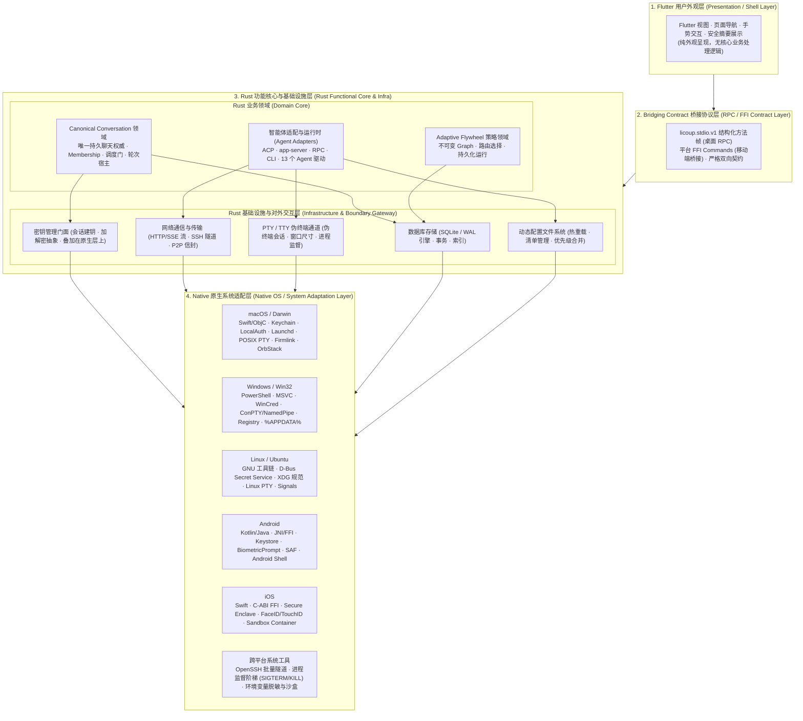

# LicoUp 架构

| 关联文档 | 语言 / 路径 | 权威职责 |
|:---|:---|:---|
| **规范版本** | [English (Normative)](README.md) | 架构事实英文规范 |
| **产品定义** | [PRODUCT.zh-CN.md](../../PRODUCT.zh-CN.md) | 长期产品目标、设计理念与产品承诺 |
| **当前状态** | [STATUS.zh-CN.md](../STATUS.zh-CN.md) | 当前实现状态与发布证据 |
| **兼容性矩阵** | [COMPATIBILITY.zh-CN.md](../COMPATIBILITY.zh-CN.md) | 平台与 13 个智能体支持度 |
| **领域词汇** | [CONTEXT.md](../../CONTEXT.md) | 统一领域词汇与定义 |
| **文档索引** | [docs/README.md](../README.md) | 完整文档索引目录 |

长期产品目标与边界由 [PRODUCT.zh-CN.md](../../PRODUCT.zh-CN.md) 负责，当前状态由 [STATUS.zh-CN.md](../STATUS.zh-CN.md) 负责。当前组件和依赖事实由 Rust/Flutter 模块树、`apps/desktop/packaging.modules.json` 以及 `apps/desktop/scripts/client-architecture/` 下的架构验证器负责。本文件是这些来源的公开架构投影。

---

## 安全与公开源码边界

[安全与数据边界](SECURITY-AND-DATA-BOUNDARY.zh-CN.md) 负责详细机制；本入口保留以下跨文档不变量：

- 兼容且不可信的通讯站只承担传输。发送端发出五字段 Lico Arc 信封；对端身份、新鲜性、重放拒绝与经认证的最终回执仍由端点判定。
- 本地路径、日志、历史、用量记录、凭据和原始运行时数据留在设备上。只有已批准的受保护对端内容与协议所需的最小路由字段可跨越通讯站边界。
- 当前平台密钥保管在可用时使用操作系统安全存储，否则明确使用仅内存保管。调用方参数和普通状态文件都不能证明用户已经批准；受保护效果需要平台持有的授权会话。
- 客户端不接受通讯站或服务端提供的可执行加密补丁，也没有运行时加密补丁加载器。

Agent 对话继续由 Rust 宿主管理。新会话和原生续接会话在进程内保持可唤醒进度；活动轮次在适配器支持时使用原生 steer，否则只在同一精确会话的安全边界继续下一轮。观察者断开既不代表取消，也不代表终结。Subagent MCP 只使用规范 Conversation 与 Membership 身份寻址，原生续接位置始终保持私有。

---

## 水平分层与垂直领域切片

LicoUp 的整体系统由 **水平平台分层（Horizontal Tiers）** 与 **垂直业务切片（Vertical Domain Slices）** 共同构成：

### 1. 水平平台四层体系
1. **第 1 层：Flutter 用户外观层（Flutter Presentation / Shell Layer）** — 纯用户外观与交互呈现，不承担核心业务处理逻辑（现有残留逻辑后续逐步下移剥离）。
2. **第 2 层：Bridging Contract 桥接协议层（Bridging Contract / RPC Protocol Layer）** — 负责 Flutter 与 Rust 间结构化 RPC 交互（`licoup.stdio.v1` 方法帧及移动端 FFI Command），定义严格前后端契约，杜绝 CLI 参数数组穿透。
3. **第 3 层：Rust 功能核心与基础设施层（Rust Functional Core & Infrastructure Layer）** — 内部清晰划分为：
   - **Rust 业务领域（Domain Core）**：包含 `Canonical Conversation`（调度门与轮次宿主）、`Adaptive Flywheel`（策略 Graph 与路由决策）以及 `Agent Adapters`（13 个智能体协议与运行时调度）。
   - **Rust 基础设施与对外交互层（Infrastructure & External Boundary）**：作为应用内外部世界的清晰交界线，包含 **数据库存储（SQLite WAL）**、**动态配置文件**、**密钥管理门面（叠加在原生层之上）**、**网络通信与传输** 以及 **PTY/TTY 伪终端与子进程管理** 五大底层对外模块。
4. **第 4 层：Native 原生系统适配层（Native OS / System Adaptation Layer）** — 底层操作系统与平台专用脚本/API 适配（macOS Keychain/PTY/launchd；Windows WinCred/ConPTY/PowerShell；Linux Secret Service/XDG；Android JNI/Keystore/SAF；iOS Secure Enclave/FaceID 等）。

### 2. 垂直业务切片（Vertical Slices）
如 **Conversation（智能体对话）** 本身是一个端到端的垂直架构，纵向贯穿了 Flutter 界面交互、桥接协议、Rust 领域调度、底层数据库/网络/PTY 基础设施以及操作系统底层环境。

稳定端点线路语义由 Lico Arc Protocol 而不是本客户端仓库负责。

---

## 四层架构组件全景图

---

## 层次与模块职责边界

| 层次 | 架构模块 | 职责边界 |
|:---|:---|:---|
| **第 1 层：Flutter 用户外观层** | Flutter 用户界面 (Shell / UI) | 负责页面渲染、导航、用户交互、外观呈现与安全摘要展示。不包含核心业务处理逻辑（现有少量残留逻辑后续逐步下移）。 |
| **第 2 层：Bridging Contract 桥接协议层** | 前后端通信契约 (RPC / FFI) | 负责 Flutter 与 Rust 间双向通信契约。桌面端承载 `licoup.stdio.v1` 结构化方法帧，移动端承载 C-ABI FFI 命令；严格杜绝 CLI 参数数组穿透。 |
| **第 3 层：Rust 业务领域 (Domain Core)** | 统一 Conversation 领域 | 单聊/群聊、Human/Agent Membership、结构化 Event 与按 Membership 派发的唯一持久化权威；原生运行时位置保持私有。 |
| | Adaptive Flywheel 策略领域 | 独立于 Conversation 历史的不可变包版本、JSON Graph 校验、绑定、准确授权、持久化运行归约与有界效果调度。 |
| | 智能体适配器与运行时 | 转换 13 个受支持的本机智能体接口（ACP、app-server、CLI、RPC）及虚拟机发现协议连接。 |
| **第 3 层：Rust 基础设施 (Infrastructure)** | 数据库存储 (SQLite WAL) | 唯一数据持久化引擎，提供 ACID 事务、强类型迁移、复合索引检索。 |
| | 动态配置文件系统 | 运行时配置解析、热重载/动态感知、确定性优先级合并（CLI > 环境变量 > 用户清单 > 系统默认）。 |
| | 密钥管理门面 | 统一安全凭据与加解密门面，直接叠加在第 4 层原生密钥库（Keychain/WinCred/Keystore/Secure Enclave）之上。 |
| | 网络通信与传输 | HTTP/SSE 流式客户端、系统原生 Batch SSH 隧道、P2P 加密信封传输与连接生命周期。 |
| | PTY / TTY 伪终端通道 | 跨平台伪终端抽象、窗口尺寸同步、ANSI 序列流式捕获与进程退出监督阶梯（Grace $\to$ SIGTERM $\to$ SIGKILL）。 |
| **第 4 层：Native 原生系统适配层** | macOS / iOS 适配 | Swift/ObjC 桥接、Keychain 安全存储、`LocalAuthentication` 生物认证、Launchd 自启动、APFS/Firmlink 路径规范化、OrbStack CLI 探测。 |
| | Windows 适配 | PowerShell/Cmd 脚本安全包装、WinCred 凭据管理、ConPTY 伪控制台与命名管道、注册表自启动、宽字符环境。 |
| | Linux / Ubuntu 适配 | GNU 工具链、D-Bus Secret Service（与 Ephemeral 内存回退）、XDG Base Directory/Autostart、POSIX PTY 与信号监督。 |
| | Android 适配 | Kotlin/Java 宿主交互、`android_ffi.rs` 生命周期、Android Keystore、`BiometricPrompt`、SAF 存储与 Android Shell 交互。 |
| | 通用系统工具与沙盒 | OpenSSH 批处理模式隧道、`process_supervisor.rs` 进程阶梯监督（Grace $\to$ SIGTERM $\to$ SIGKILL）、安全环境变量脱敏。 |

---

## Native 原生系统适配边界

共享 Rust 功能核心和 Flutter 外观层保持跨平台中立。第 4 层「Native 原生系统适配层」负责不同操作系统与平台底层的专用脚本、API 与工具链对接：

| 平台 / 工具域 | 原生系统适配具体职责 |
|:---|:---|
| **macOS (Darwin / Swift / Unix)** | 1. **安全与在场**：`Security.framework` (Keychain Services) 与 `LocalAuthentication.framework` (Touch ID / Apple Watch 授权)； 2. **守护与自启动**：`~/Library/LaunchAgents/` 下的 launchd plist 管理与 `launchctl bootstrap / bootout` 调度； 3. **终端与沙盒**：POSIX PTY (`openpty`, `termios`, `ioctl(TIOCSCTTY)`, `winsize`)、APFS Firmlink 系统卷与数据卷映射； 4. **虚拟机探测**：OrbStack 本地 Unix Domain Socket 探测与 `orb` CLI 发现。 |
| **Windows (Win32 / PowerShell / MSVC)** | 1. **凭据与存储**：Windows Credential Manager (WinCred `CredReadW`/`CredWriteW`) 安全密钥保管； 2. **终端与控制台**：Windows Pseudo Console API (ConPTY: `CreatePseudoConsole`) 与 Windows Named Pipes 命名管道； 3. **启动与注册表**：Windows 注册表自启动键 (`HKCU\Software\Microsoft\Windows\CurrentVersion\Run`) 与任务计划程序； 4. **脚本包装**：PowerShell / Cmd 脚本包装 (`Get-Command`, `.cmd`/`.ps1`)、参数安全转义与宽字符路径解析。 |
| **Linux / Ubuntu (GNU / POSIX / D-Bus)** | 1. **密钥服务**：D-Bus Freedesktop Secret Service 规范（libsecret / GNOME Keyring / KWallet）及无环境时的内存临时存储（Ephemeral Store）； 2. **系统规范**：XDG Base Directory 规范（`$XDG_DATA_HOME`, `$XDG_CONFIG_HOME`）与 XDG Autostart (`~/.config/autostart/*.desktop`)； 3. **终端与进程**：Linux PTY (`forkpty`, `ptsname`, `grantpt`)、标准信号捕获与 `/proc` 进程树观测。 |
| **Android (Kotlin / Java / Android Shell)** | 1. **宿主与生命周期**：`android_ffi.rs` JNI 桥接，响应 Android Activity/Service 的初始化、前后台切换与内存管理； 2. **硬件密钥与认证**：Android Keystore System 与 `BiometricPrompt` 硬件级指纹/人脸在场确认； 3. **存储与 Shell**：Storage Access Framework (SAF)、应用沙盒私有存储目录与 Android Toybox/Termux Shell 隔离交互。 |
| **iOS (Swift / ObjC / C-ABI FFI)** | 1. **FFI 交互**：`ios_ffi.rs` C-ABI 内存安全桥接，管理 iOS 单进程受限运行环境下的运行时生命周期； 2. **硬件级存储与认证**：Apple Secure Enclave 硬件 Keychain 存取与 `LocalAuthentication` (Face ID / Touch ID)； 3. **沙盒与容器**：`NSApplicationSupportDirectory` 沙盒路径规范化与后台执行限制处理。 |
| **跨平台通用系统工具** | 1. **网络隧道**：OpenSSH 批处理模式（`ssh -o BatchMode=yes -o StrictHostKeyChecking=yes`）无交互式安全隧道； 2. **进程监督**：`process_supervisor.rs` 监督阶梯（Grace Period $\to$ SIGTERM $\to$ SIGKILL）与环境变量安全脱敏白名单。 |

---

## 细分领域架构索引

为了保持四大架构分层的清晰性，各个细分功能领域拥有独立的架构与协议文档：

| 细分领域 | 所属层级 | 架构 / 协议文档 | 职责概述 |
|:---|:---|:---|:---|
| **前后端交互契约** | 第 2 层：桥接协议层 | [CLIENT-NATIVE-INTERACTION.md](CLIENT-NATIVE-INTERACTION.md) | `licoup.stdio.v1` 结构化方法帧与移动端 FFI 命令契约 |
| **统一 Conversation 垂直领域** | 垂直切片 (第 1 ~ 4 层) | [CONVERSATION-DOMAIN.zh-CN.md](CONVERSATION-DOMAIN.zh-CN.md) | 前后端双向绑定、单聊基石与群聊协同封装、状态机驱动与端到端时序流 |
| **智能体适配器与运行时架构** | 第 3 层：功能核心层 | [AGENT-ADAPTERS-ARCHITECTURE.zh-CN.md](AGENT-ADAPTERS-ARCHITECTURE.zh-CN.md) | 13 智能体驱动分类、标准协议(ACP/RPC/PTY)与私有协议(Codex/OpenCode)归一化 |
| **Rust 基础设施与对外交互层** | 第 3 层：基础设施与边界 | [RUST-INFRASTRUCTURE-LAYER.zh-CN.md](RUST-INFRASTRUCTURE-LAYER.zh-CN.md) | 数据库存储 (SQLite WAL)、动态配置、密钥管理、网络传输、PTY/TTY |
| **Adaptive Flywheel 策略** | 第 3 层：功能核心层 | [ADAPTIVE-FLYWHEEL.zh-CN.md](../functionality/ADAPTIVE-FLYWHEEL.zh-CN.md) | 不可变 Graph 版本、路由决策与持久化运行归约 |
| **下属智能体 MCP** | 第 3 层：功能核心层 | [subagent-mcp.zh-CN.md](../protocols/subagent-mcp.zh-CN.md) | Assistant 目标闭环、Profile 事实与临时 Graph 准入机制 |
| **语义对话与历史编目** | 第 3 层：功能核心层 | [semantic-conversation.md](../protocols/semantic-conversation.md) | 13 个 Agent 协议转换、厂商历史目录发现与只读回放 |
| **安全与数据边界** | 第 3 层：功能核心层 | [SECURITY-AND-DATA-BOUNDARY.zh-CN.md](SECURITY-AND-DATA-BOUNDARY.zh-CN.md) | 虚拟机探测隔离、端点保护预览、平台密钥保管与数据零信任 |
| **原生系统平台桥接** | 第 4 层：原生适配层 | `crates/licoup-native/src/platform/` | macOS、Windows、Linux、Android、iOS 底层 OS API 与工具链实现 |

---

## 仓库结构

| 路径 | 用途 |
|:---|:---|
| `apps/desktop/` | Flutter 桌面与移动客户端（第 1 层与部分第 2 层） |
| `crates/licoup-native/` | Rust 客户端核心、命令与平台桥接（第 3 层与第 4 层） |
| `crates/licoup-platform-bridges/` | 原生平台 ABI 与句柄管理（第 4 层） |
| `packages/contracts/client/` | 客户端自有 Schema（第 2 层） |
| `tests/` | 使用合成数据的契约和边界测试 |
| `tools/` | 可复用的构建与验证工具 |

计划、临时脚本、本地技能、原始证据和运行时数据属于本地工作材料，不进入公开源码。
