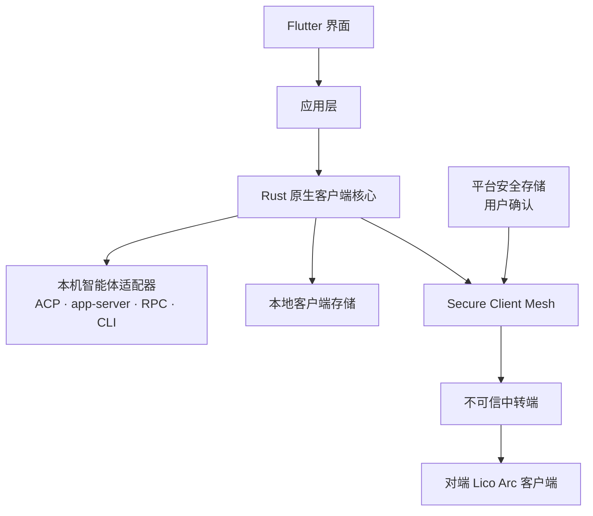
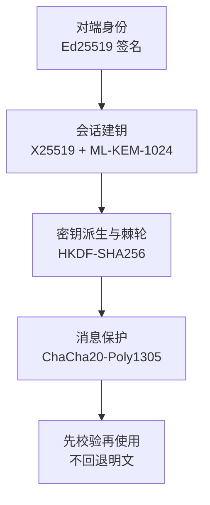
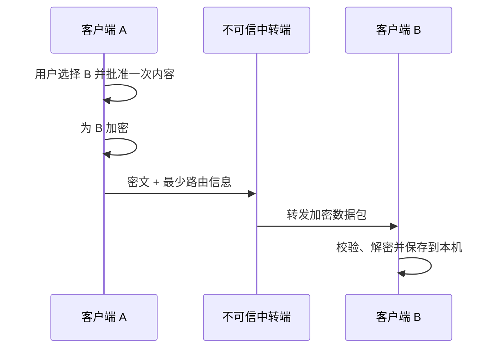

# Lico Arc 架构

[English（规范版本）](README.md) · 简体中文（本地化） · [文档索引](../README.md) · [项目首页](../../README.zh-CN.md)

产品边界由 `PRODUCT.md` 负责。当前组件和依赖事实由 Rust/Flutter 模块树、
`apps/desktop/packaging.modules.json` 以及
`apps/desktop/scripts/client-architecture/` 下的架构验证器负责。本文件是这些来源的
公开架构投影。

Lico Arc 是一个本地优先的客户端。Flutter 负责界面，Rust 负责原生客户端核心、
本机适配器、有界任务和 Secure Client Mesh。

## 设计理念

- **多元** — 通过适配器连接不同智能体和设备。
- **互联** — 让本机工具与对端客户端使用清晰的连接流程。
- **开放** — 源代码和客户端契约都可以检查和扩展。
- **融合** — 用统一应用层隔离界面与具体适配器。

## 组件

| 区域 | 职责 |
| --- | --- |
| Flutter 界面 | 导航、视图、用户选择和安全摘要 |
| 应用层 | 客户端流程和与适配器无关的规则 |
| Rust 原生核心 | 本地任务、协议、校验和加密 |
| 智能体适配器 | 转换受支持的智能体原生接口 |
| 平台桥接 | 安全存储、用户确认和平台启动 |
| Secure Client Mesh | 客户端自有的端到端加密与对端信任 |

## 内置能力边界

默认客户端只包含下表中的基础能力和本地优先场景。每一行都有窄接口和专属回归模块；
任何一个场景都不能直接访问另一个场景的存储或界面。

| 能力 | 独立职责 |
| --- | --- |
| Rust 任务队列 | 本机任务的有界多生产者 FIFO、背压、断开处理和工作线程生命周期 |
| ACP 适配 | 智能体会话协商、原生继续对话、事件流、权限等待、取消和脱敏错误 |
| MCP 适配 | 有界 MCP/JSON-RPC 校验、请求 ID 保持、响应转发，以及外部动作的一次性审批 |
| 智能体发现 | 并发探测平台应用来源、包管理器、可执行文件位置和已配置智能体目录；结果归一化后只缓存在本机 |
| 适配插件管理 | 用一个原生目录管理随附原生通道、随附 ACP 通道和明确可安装的 Lico Arc 桥接；生命周期操作需要确认且只能修改 Lico Arc 自有状态 |
| 智能体对话 | 新建和原生继续会话，并通过进程内 [Local Bridge](../protocols/local-bridge.zh-CN.md) 提供可唤醒进度、原生 steer 和准确会话的安全轮次续接 |
| 技能管理 | 本机安装、更新、删除，已配置来源的定时检查，以及按时间窗口统计真实调用次数 |
| 对话管理 | 把全部对话或准确关键词匹配结果备份到用户选择的本地目录 |
| 用量统计 | 依据本机记录按智能体或模型聚合 Token；默认 30 天并支持自选窗口 |
| Secure Client Mesh | 配对、信任、对端消息/文件加密、防重放和不透明中转信封 |

可选协作不属于默认组合。

当前智能体与平台适配目标由[兼容性文档](../COMPATIBILITY.zh-CN.md)生成。

## 平台适配边界

共享 Rust 和 Flutter 层保持平台无关。各原生宿主只负责不能移植的平台动作：

| 平台 | 原生适配器职责 |
| --- | --- |
| macOS | 应用发现、Keychain/用户在场桥接、打包和启动 |
| Windows | 应用发现、Credential Manager 密钥保管、客户端授权会话、打包和启动 |
| Ubuntu | 软件包/应用发现、Secret Service 或明确的仅内存密钥保管、打包和启动 |
| Android | 软件包发现、Keystore/BiometricPrompt 桥接、Rust FFI 生命周期、安装和启动 |
| iOS | 应用容器集成、Keychain/LocalAuthentication 桥接、Rust FFI 生命周期、安装和启动 |

源码适配、普通构建、真机安全证据、GitHub Release 制品和应用商店发布是彼此独立的
结论。当前[兼容性状态](../COMPATIBILITY.zh-CN.md)分别记录这些结论，绝不把
模拟器或源码检查提升成真机或发布证明。

## Secure Client Mesh 分层

当前协议使用一个固定且必需的安全配置。每种算法只负责一个明确任务，安全性不以开启的
算法数量衡量。

只有当不同算法承担不同职责，并且组合规则已经过检查时，协议才会组合它们。签名握手会
固定本次会话使用的安全配置。派生密钥有清晰标签，不能把一个任务的密钥复用于另一个
任务。任何安全检查缺失或失败，都不能开启明文通信。

## 当前平台密钥保管

当前客户端会先检查平台能力，再选择本机密钥存储。系统安全存储可用时使用系统存储，
否则明确使用内存临时存储。内存密钥会在重启后丢失，因此客户端需要重新配对并创建新密钥。
存储失败不会开启明文通信。

当前平台适配器保护密封后的秘密数据。客户端还没有通用的外部加密提供者接口。
客户端没有运行时加密补丁加载器。

把同一份密封密钥数据移动到另一种本机存储，不会改变固定的线上安全配置。当前存储接口
仍可以把密钥数据返回原生核心，因此不能把系统存储直接描述成所有协议密钥都由硬件保护
或不可导出的证明。平台支持声明必须有当前测量证据。

## 可选协作边界

LicoMesh 协作是独立安装的插件。用户完成安装并主动启用前，默认启动和导航不会加载它。
来源选择会把规范化 GitHub 仓库绑定到一个准确、不可变的提交。下载软件包前，用户必须
通过独立操作导入可信签名公钥；软件包自带或同一次下载返回的公钥不能成为信任根。仓库、
公钥或固定运行器身份变化时，必须先移除，再取得新的用户直接授权。

软件包签名覆盖固定运行器的身份和摘要、契约版本、来源提交，以及完整的路径、长度和摘要
清单。检查软件包和每次启动时都会重新校验受保护的信任记录、签名和清单。权威记录还会
绑定准确获批的提交、软件包、清单、运行器、契约、目标和部署代次，因此即使旧软件包具有
有效签名，也不能替换当前获批制品。选中的组件会进入不可变快照；可写运行数据与可加载
目录物理分离。客户端不会执行软件包脚本、钩子、用户提供的参数，也不会继承外部环境变量。

本地部署只能在一次独立手动操作后，通过固定且已签名的外部运行器在回环地址启动。已验证
运行器和组装快照会作为锁定的不可变对象传递，运行器不会从可写路径重新打开它们。客户端
把进程可执行文件和启动身份绑定到运行租约以及已验证的健康/能力响应。停止和卸载只对该
已验证身份生效；身份不一致时关闭失败。本源码树不捆绑 LicoMesh 服务端运行器：这些控制
证明客户端具备受控部署能力，不证明已经获得、启动、发布或上架真实服务端制品。

MCP 对外动作使用独立的有界授权流程。bridge 只能提交准确预览，不能进行交换或自行批准。
经过认证的客户端界面会显示目标、用途、请求正文和每个选中文件；原生命令随后针对规范
摘要请求一次新的平台用户在场确认，并在交换前原子消费匹配的短期预览，且只能消费一次。
摘要会绑定方向、目标、用途、协议版本、会话和准确请求正文。
调用方参数和普通状态文件都不能证明用户已经批准。过期、取消、复用、内容变化、回滚，
或平台无法提供用户在场授权
时，操作都会关闭失败。

安装、启用、启动、定时任务或智能体请求都不能授予对外传输权限。每个准确请求和每个
将要离开设备的选中本地文件都必须分别取得一次新的、受保护的用户确认。

## 数据边界

客户端遵守以下规则：

- 本地路径、日志、历史、用量记录、凭据和原始运行时数据留在设备上。
- 默认客户端场景不会把敏感运行时数据或用户内容明文发送给服务端。
- 可选的外部 MCP 请求只能包含受保护一次性确认中展示的准确正文和文件。HTTPS 保护传输，
  但指定的外部服务可以读取用户批准的内容。
- 如果没有针对外部服务的准确确认，受保护内容离开客户端时必须是密文，并发给指定的
  对端客户端。
- 发送端先加密，再进行网络传输；接收端先校验，再使用内容。
- 中转端不在可信客户端边界内。客户端安全不依赖中转端的存储策略或运营承诺。
- 密钥通过平台安全工具保管。平台支持时，使用受保护密钥需要用户确认。
- 日志和测试报告只保留安全摘要，不保存原始用户内容。

## 仓库结构

| 路径 | 用途 |
| --- | --- |
| `apps/desktop/` | Flutter 桌面与移动客户端 |
| `crates/lico-client-native/` | Rust 客户端核心和命令 |
| `packages/contracts/client/` | 客户端自有 Schema |
| `tests/` | 使用合成数据的契约和边界测试 |
| `tools/` | 可复用的构建与验证工具 |

计划、临时脚本、本地技能、原始证据和运行时数据属于本地工作材料，不进入公开源码。
