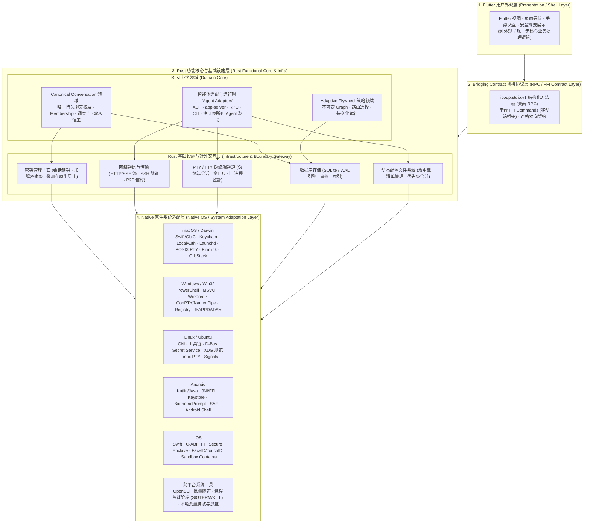
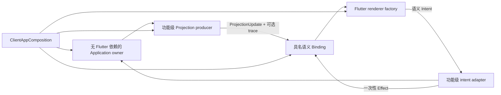

# LicoUp 架构

| 关联文档 | 语言 / 路径 | 权威职责 |
|:---|:---|:---|
| **规范版本** | [English (Normative)](README.md) | 架构事实英文规范 |
| **产品定义** | [PRODUCT.zh-CN.md](../../PRODUCT.zh-CN.md) | 长期产品目标、设计理念与产品承诺 |
| **当前状态** | [STATUS.zh-CN.md](../STATUS.zh-CN.md) | 当前实现状态与发布证据 |
| **兼容性矩阵** | [COMPATIBILITY.zh-CN.md](../COMPATIBILITY.zh-CN.md) | 平台与智能体支持度（由运行时适配器注册表投影） |
| **领域词汇** | [CONTEXT.md](../../CONTEXT.md) | 统一领域词汇与定义 |
| **文档索引** | [docs/README.md](../README.md) | 完整文档索引目录 |

长期产品目标与边界由 [PRODUCT.zh-CN.md](../../PRODUCT.zh-CN.md) 负责，当前状态由 [STATUS.zh-CN.md](../STATUS.zh-CN.md) 负责。当前组件和依赖事实由 Rust/Flutter 模块树、`apps/desktop/packaging.modules.json` 以及 `apps/desktop/scripts/client-architecture/` 下的架构验证器负责。本文件是这些来源的公开架构投影。

---

## 安全与公开源码边界

[安全与数据边界](SECURITY-AND-DATA-BOUNDARY.zh-CN.md) 负责详细机制；本入口保留以下跨文档不变量：

- 兼容且不可信的通讯站只承担传输。发送端发出五字段 Lico Arc 信封；对端身份、新鲜性、重放拒绝与经认证的最终回执仍由端点判定。
- 本地路径、日志、历史、用量记录、凭据和原始运行时数据留在设备上。只有已批准的受保护对端内容与协议所需的最小路由字段可跨越通讯站边界。
- 当前平台密钥保管在可用时使用操作系统安全存储，否则明确使用仅内存保管。调用方参数和普通状态文件都不能证明用户已经批准；受保护效果需要平台持有的授权会话。
- 对已批准的端到端传输，发送方在任何网络 I/O 前完成加密；通讯站永远拿不到明文或端点密钥。
- 可选协作在默认启动和导航不会加载。必须通过独立操作导入可信签名公钥，不能从软件包下载推导信任；执行固定使用回环地址上的已签名外部 runner。
- bridge 可以暂存准确预览，但不会执行交换，也不能批准预览。原生命令随后针对规范摘要请求一次新的平台用户在场确认，并原子地、仅一次认领匹配的短期预览。
- 客户端不接受通讯站或服务端提供的可执行加密补丁，也没有运行时加密补丁加载器。

Agent 对话继续由 Rust 宿主管理。新会话和原生续接会话在进程内保持可唤醒进度；活动轮次在适配器支持时使用原生 steer，否则只在同一精确会话的安全边界继续下一轮。观察者断开既不代表取消，也不代表终结。Subagent MCP 只使用规范 Conversation 与 Membership 身份寻址，原生续接位置始终保持私有。

---

## 水平分层与垂直领域切片

LicoUp 的整体系统由 **水平平台分层（Horizontal Tiers）** 与 **垂直业务切片（Vertical Domain Slices）** 共同构成：

### 1. 水平平台四层体系
1. **第 1 层：Flutter 用户外观层（Flutter Presentation / Shell Layer）** — 纯用户外观与交互呈现，不承担核心业务处理逻辑（现有残留逻辑后续逐步下移剥离）。
2. **第 2 层：Bridging Contract 桥接协议层（Bridging Contract / RPC Protocol Layer）** — 负责 Flutter 与 Rust 间结构化 RPC 交互（`licoup.stdio.v1` 方法帧及移动端 FFI Command），定义严格前后端契约，杜绝 CLI 参数数组穿透。
3. **第 3 层：Rust 功能核心与基础设施层（Rust Functional Core & Infrastructure Layer）** — 内部清晰划分为：
   - **Rust 业务领域（Domain Core）**：包含 `Canonical Conversation`（调度门与轮次宿主）、`Adaptive Flywheel`（策略 Graph 与路由决策）以及 `Agent Adapters`（注册表所列智能体协议与运行时调度）。
   - **Rust 基础设施与对外交互层（Infrastructure & External Boundary）**：作为应用内外部世界的清晰交界线，包含 **数据库存储（SQLite WAL）**、**动态配置文件**、**密钥管理门面（叠加在原生层之上）**、**网络通信与传输** 以及 **PTY/TTY 伪终端与子进程管理** 五大底层对外模块。
4. **第 4 层：Native 原生系统适配层（Native OS / System Adaptation Layer）** — 底层操作系统与平台专用脚本/API 适配（macOS Keychain/PTY/launchd；Windows WinCred/ConPTY/PowerShell；Linux Secret Service/XDG；Android JNI/Keystore/SAF；iOS Secure Enclave/FaceID 等）。

### 2. 垂直业务切片（Vertical Slices）
如 **Conversation（智能体对话）** 本身是一个端到端的垂直架构，纵向贯穿了 Flutter 界面交互、桥接协议、Rust 领域调度、底层数据库/网络/PTY 基础设施以及操作系统底层环境。

稳定端点线路语义由 Lico Arc Protocol 而不是本客户端仓库负责。

---

## 四层架构组件全景图



---

## 层次与模块职责边界

| 层次 | 架构模块 | 职责边界 |
|:---|:---|:---|
| **第 1 层：Flutter 用户外观层** | Flutter 用户界面 (Shell / UI) | 负责页面渲染、导航、用户交互、外观呈现与安全摘要展示。不包含核心业务处理逻辑（现有少量残留逻辑后续逐步下移）。 |
| **第 2 层：Bridging Contract 桥接协议层** | 前后端通信契约 (RPC / FFI) | 负责 Flutter 与 Rust 间双向通信契约。桌面端承载 `licoup.stdio.v1` 结构化方法帧，移动端承载 C-ABI FFI 命令；严格杜绝 CLI 参数数组穿透。 |
| **第 3 层：Rust 业务领域 (Domain Core)** | 统一 Conversation 领域 | 单聊/群聊、Human/Agent Membership、结构化 Event 与按 Membership 派发的唯一持久化权威；原生运行时位置保持私有。 |
| | Adaptive Flywheel 策略领域 | 独立于 Conversation 历史的不可变包版本、JSON Graph 校验、绑定、准确授权、持久化运行归约与有界效果调度。 |
| | 智能体适配器与运行时 | 转换注册表所列的本机智能体接口（ACP、app-server、CLI、RPC）及虚拟机发现协议连接。 |
| **第 3 层：Rust 基础设施 (Infrastructure)** | 数据库存储 (SQLite WAL) | 唯一数据持久化引擎，提供 ACID 事务、强类型迁移、复合索引检索。 |
| | 动态配置文件系统 | 运行时配置解析、热重载/动态感知、确定性优先级合并（CLI > 环境变量 > 用户清单 > 系统默认）。 |
| | 密钥管理门面 | 统一安全凭据与加解密门面，直接叠加在第 4 层原生密钥库（Keychain/WinCred/Keystore/Secure Enclave）之上。 |
| | 网络通信与传输 | HTTP/SSE 流式客户端、系统原生 Batch SSH 隧道、P2P 加密信封传输与连接生命周期。 |
| | PTY / TTY 伪终端通道 | 跨平台伪终端抽象、窗口尺寸同步、ANSI 序列流式捕获与进程退出监督阶梯（Grace $\to$ SIGTERM $\to$ SIGKILL）。 |
| **第 4 层：Native 原生系统适配层** | macOS / iOS 适配 | Swift/ObjC 桥接、Keychain 安全存储、`LocalAuthentication` 生物认证、Launchd 自启动、APFS/Firmlink 路径规范化、OrbStack CLI 探测。 |
| | Windows 适配 | PowerShell/Cmd 脚本安全包装、WinCred 凭据管理、ConPTY 伪控制台与命名管道、注册表自启动、宽字符环境。 |
| | Linux / Ubuntu 适配 | GNU 工具链、D-Bus Secret Service（与 Ephemeral 内存回退）、XDG Base Directory/Autostart、POSIX PTY 与信号监督。 |
| | Android 适配 | Kotlin/Java 宿主交互、`android_ffi.rs` 生命周期、Android Keystore、`BiometricPrompt`、SAF 存储与 Android Shell 交互。 |
| | 通用系统工具与沙盒 | OpenSSH 批处理模式隧道、`process_supervisor.rs` 进程阶梯监督（Grace $\to$ SIGTERM $\to$ SIGKILL）、安全环境变量脱敏。 |

---

## Native 原生系统适配边界

共享 Rust 功能核心和 Flutter 外观层保持跨平台中立。第 4 层「Native 原生系统适配层」负责不同操作系统与平台底层的专用脚本、API 与工具链对接：

| 平台 / 工具域 | 原生系统适配具体职责 |
|:---|:---|
| **macOS (Darwin / Swift / Unix)** | 1. **安全与在场**：`Security.framework` (Keychain Services) 与 `LocalAuthentication.framework` (Touch ID / Apple Watch 授权)；<br>2. **守护与自启动**：`~/Library/LaunchAgents/` 下的 launchd plist 管理与 `launchctl bootstrap / bootout` 调度；<br>3. **终端与沙盒**：POSIX PTY (`openpty`, `termios`, `ioctl(TIOCSCTTY)`, `winsize`)、APFS Firmlink 系统卷与数据卷映射；<br>4. **虚拟机探测**：OrbStack 本地 Unix Domain Socket 探测与 `orb` CLI 发现。 |
| **Windows (Win32 / PowerShell / MSVC)** | 1. **凭据与存储**：Windows Credential Manager (WinCred `CredReadW`/`CredWriteW`) 安全密钥保管；<br>2. **终端与控制台**：Windows Pseudo Console API (ConPTY: `CreatePseudoConsole`) 与 Windows Named Pipes 命名管道；<br>3. **启动与注册表**：Windows 注册表自启动键 (`HKCU\Software\Microsoft\Windows\CurrentVersion\Run`) 与任务计划程序；<br>4. **脚本包装**：PowerShell / Cmd 脚本包装 (`Get-Command`, `.cmd`/`.ps1`)、参数安全转义与宽字符路径解析。 |
| **Linux / Ubuntu (GNU / POSIX / D-Bus)** | 1. **密钥服务**：D-Bus Freedesktop Secret Service 规范（libsecret / GNOME Keyring / KWallet）及无环境时的内存临时存储（Ephemeral Store）；<br>2. **系统规范**：XDG Base Directory 规范（`$XDG_DATA_HOME`, `$XDG_CONFIG_HOME`）与 XDG Autostart (`~/.config/autostart/*.desktop`)；<br>3. **终端与进程**：Linux PTY (`forkpty`, `ptsname`, `grantpt`)、标准信号捕获与 `/proc` 进程树观测。 |
| **Android (Kotlin / Java / Android Shell)** | 1. **宿主与生命周期**：`android_ffi.rs` JNI 桥接，响应 Android Activity/Service 的初始化、前后台切换与内存管理；<br>2. **硬件密钥与认证**：Android Keystore System 与 `BiometricPrompt` 硬件级指纹/人脸在场确认；<br>3. **存储与 Shell**：Storage Access Framework (SAF)、应用沙盒私有存储目录与 Android Toybox/Termux Shell 隔离交互。 |
| **iOS (Swift / ObjC / C-ABI FFI)** | 1. **FFI 交互**：`ios_ffi.rs` C-ABI 内存安全桥接，管理 iOS 单进程受限运行环境下的运行时生命周期；<br>2. **硬件级存储与认证**：Apple Secure Enclave 硬件 Keychain 存取与 `LocalAuthentication` (Face ID / Touch ID)；<br>3. **沙盒与容器**：`NSApplicationSupportDirectory` 沙盒路径规范化与后台执行限制处理。 |
| **跨平台通用系统工具** | 1. **网络隧道**：OpenSSH 批处理模式（`ssh -o BatchMode=yes -o StrictHostKeyChecking=yes`）无交互式安全隧道；<br>2. **进程监督**：`process_supervisor.rs` 监督阶梯（Grace Period $\to$ SIGTERM $\to$ SIGKILL）与环境变量安全脱敏白名单。 |

---

## 细分领域架构索引

为了保持四大架构分层的清晰性，各个细分功能领域拥有独立的架构与协议文档：

| 细分领域 | 所属层级 | 架构 / 协议文档 | 职责概述 |
|:---|:---|:---|:---|
| **前后端交互契约** | 第 2 层：桥接协议层 | [CLIENT-NATIVE-INTERACTION.md](CLIENT-NATIVE-INTERACTION.md) | `licoup.stdio.v1` 结构化方法帧与移动端 FFI 命令契约 |
| **统一 Conversation 垂直领域** | 垂直切片 (第 1 ~ 4 层) | [CONVERSATION-DOMAIN.zh-CN.md](CONVERSATION-DOMAIN.zh-CN.md) | 前后端双向绑定、单聊基石与群聊协同封装、状态机驱动与端到端时序流 |
| **智能体适配器与运行时架构** | 第 3 层：功能核心层 | [AGENT-ADAPTERS-ARCHITECTURE.zh-CN.md](AGENT-ADAPTERS-ARCHITECTURE.zh-CN.md) | 由注册表推导的驱动分类、标准协议(ACP/RPC/PTY)与私有协议(Codex/OpenCode)归一化 |
| **Rust 基础设施与对外交互层** | 第 3 层：基础设施与边界 | [RUST-INFRASTRUCTURE-LAYER.zh-CN.md](RUST-INFRASTRUCTURE-LAYER.zh-CN.md) | 数据库存储 (SQLite WAL)、动态配置、密钥管理、网络传输、PTY/TTY |
| **Adaptive Flywheel 策略** | 第 3 层：功能核心层 | [ADAPTIVE-FLYWHEEL.zh-CN.md](../functionality/ADAPTIVE-FLYWHEEL.zh-CN.md) | 不可变 Graph 版本、路由决策与持久化运行归约 |
| **下属智能体 MCP** | 第 3 层：功能核心层 | [subagent-mcp.zh-CN.md](../protocols/subagent-mcp.zh-CN.md) | Assistant 目标闭环、Profile 事实与临时 Graph 准入机制 |
| **语义对话与历史编目** | 第 3 层：功能核心层 | [semantic-conversation.md](../protocols/semantic-conversation.md) | 注册表所列 Agent 协议转换、厂商历史目录发现与只读回放 |
| **安全与数据边界** | 第 3 层：功能核心层 | [SECURITY-AND-DATA-BOUNDARY.zh-CN.md](SECURITY-AND-DATA-BOUNDARY.zh-CN.md) | 虚拟机探测隔离、端点保护预览、平台密钥保管与数据零信任 |
| **原生系统平台桥接** | 第 4 层：原生适配层 | `crates/licoup-native/src/platform/` | macOS、Windows、Linux、Android、iOS 底层 OS API 与工具链实现 |

---

## 仓库结构

| 路径 | 用途 |
|:---|:---|
| `apps/desktop/` | Flutter 桌面与移动客户端（第 1 层与部分第 2 层） |
| `crates/licoup-native/` | Rust 客户端核心、命令与平台桥接（第 3 层与第 4 层） |
| `crates/licoup-conversation/` | （目标占位，尚非 workspace 成员）抽取后的 Conversation 领域 crate |
| `crates/licoup-agent-runtime/` | （目标占位，尚非 workspace 成员）抽取后的 Agent Runtime 与 adapter crate |
| `crates/licoup-platform-bridges/` | 原生平台 ABI 与句柄管理（第 4 层） |
| `crates/licoup-endpoint-core/` | 端点身份、密钥保管与加密基础 |
| `crates/licoup-protocol-bindings/` | 协议类型定义 |
| `crates/licoup-client-state/` | 客户端状态管理契约 |
| `crates/licoup-agent-adapters/` | 智能体适配器 trait 定义 |
| `crates/lico-catalog-convergence/` | 目录收敛逻辑 |
| `packages/contracts/client/` | 客户端自有 Schema（第 2 层） |
| `tests/` | 使用合成数据的契约和边界测试 |
| `tools/` | 可复用的构建与验证工具 |

计划、临时脚本、本地技能、原始证据和运行时数据属于本地工作材料，不进入公开源码。

---

## 当前架构债务与迁移状态

> 本节记录已知结构性问题与已批准的迁移路径。
> 它与活跃代码库同步维护，并随迁移推进更新。

### 已知结构性问题（截至 2026-08-24）

| 问题 | 严重度 | 位置 | 影响 |
|:---|:---|:---|:---|
| **Application 编排器宽度** | 中 | `apps/desktop/lib/src/application/controller/` | `ClientController` 仍是内部、无 Flutter 依赖的生命周期与编排聚合；renderer 禁止导入它，功能级组合仅暴露语义 Binding。 |
| **以 mixin 充当分解** | 高 | `application/controller/`、`application/features/agents/conversation/` | 应用全部 24 个 mixin 位于同一条继承链；共享 `this` 意味着没有封装。 |
| **单体 Rust crate** | 高 | `crates/licoup-native/`（约 299K 行） | `domain/` 48 项、`core/` 52 项、`platform/` 85 项（72K 行）。编译慢、边界不清。最大文件：`client_conversation/store.rs`（6.6K 行）、`ffi/commands/mod.rs`（5.2K 行）。 |
| **契约层膨胀** | 中 | `apps/desktop/lib/src/contracts/`（93 个文件, 15.7K 行） | 模型、接口、解析逻辑与生成代码混在同一层。 |
| **大型 Flutter 界面文件** | 中 | `frontend/features/`、`display/conversation/` | 原 2.6K 行 Canonical pane 已拆分为聚焦文件（最大叶文件 572 行）。仍较大的功能文件包括 `adaptive_flywheel_multi_capsule_section.dart`（1626）、`settings_panel.dart`（1184）、`agent_conversation_composer_capsules.dart`（1135）与 `agent_conversation_workspace.dart`（1132）。 |
| **残留后端层** | 低 | `apps/desktop/lib/src/backend/`（2.1K 行） | 太薄，无法提供真正抽象；还会在 Dart 中伪造领域事件（`dispatch.lane.bound`）。 |
| **手工 JSON-RPC 方法面** | 高 | `platform/native_client/` ↔ Rust `bin/licoup/stdio_rpc/` | 方法名在两侧手工重复（Rust 25 个 vs Dart 23 个；两个方法从 Dart 不可达）；codegen 只覆盖 FFI 数据类型，不覆盖 stdio 帧。Dart 部分调用按 argv 形状嗅探路由。 |

### 已实现的 Presentation Boundary（M3–M6）

终态 M3–M6 边界已经实现。Flutter renderer 消费具名、不可变的语义
Binding；功能级 producer 只读取最小 Application owner，并抑制相等投影。
Application 状态使用同步 Dart stream，不依赖 Flutter notifier 或生命周期类型。
M2 Shell 过渡 adapter 与迁移 allowlist 已移除。



首轮目录图精确如下：

| 路径 | 已实现职责 |
|:---|:---|
| `packages/presentation_contract/lib/` | 仅依赖 SDK 的 projection、intent、effect 与 trace 原语 |
| `apps/desktop/lib/src/presentation/` | 十三个稳定具名 Binding，以及对应的不可变 Projection/Intent/Effect 语义 |
| `apps/desktop/lib/src/projections/<feature>/` | 从作用域 Application signal 到语义投影、带相等抑制的 adapter |
| `apps/desktop/lib/src/frontend/binding/` | Flutter 投影/effect 观察与有界因果帧遥测 |
| `apps/desktop/lib/src/frontend/` | 仅依赖 Binding 的 renderer；Flutter 局部状态仍由 renderer 持有 |
| `apps/desktop/lib/src/composition/features/<feature>/` | intent/effect adapter 与具体 producer 所有权 |
| `apps/desktop/lib/src/composition/` | Application owner、语义 Binding、遥测、布局 registry 与 renderer factory 的唯一汇合点 |

六个全局状态平面分别独立供给：Appearance、Locale、Layout、Environment、
Navigation 与 Status。主题构造只观察 Appearance，locale 解析只观察 Locale；
其余平面仅在 `MaterialApp` 下方重建。每个当前 destination 都通过且仅通过
一个具名 Binding 构造；共享 Conversation、Targets、Search 与 Chrome 能力
仍保持显式边界。

终态核验计数为：Application Flutter 导入为零、Application notifier/listenable
依赖为零、前端实现层导入为零、前端 `ClientController` 导入为零、稳定
Presentation 实现层导入为零。Binding 目录包含十三个具名 Binding。因果遥测
仅在本机内存中有界运行，不含内容，也不会跨越原生或网络边界。renderer 优化
仍属于按 profiling 驱动的 M7 工作，只有在测得瓶颈后才实施；M3–M6 不改变
token、布局、动效、Conversation 权威或线路行为。

### 目标架构（迁移终点）

#### 基本原则：CLI 即产品，Flutter 是显示适配器

Rust 原生宿主（`licoup-cli`）是**完整的语义客户端**，可独立于任何 UI 运行。
它拥有全部会话状态、智能体运行时、持久化、授权与协议执行。Flutter 的唯一职责是
**发送用户事件**并**忠实渲染投影状态**。Flutter 不包含任何业务逻辑。

这一架构直接支撑产品的 IM 终局：今天处理本机智能体会话的同一个 Rust 宿主，
未来也将通过 Lico Arc 处理来自远端对等端点的消息——Flutter 无需改动。

精确的 L1-L6 接口规范见 [CONVERSATION-VERTICAL-CONTRACT.md](CONVERSATION-VERTICAL-CONTRACT.md)。

#### Flutter 应用——薄显示壳（`apps/desktop/lib/src/`）

```
src/
├── events/              # L1: 用户手势 → 类型化 ConversationCommand 映射
├── projections/         # 投影流解码器（由 schema codegen 生成）
├── display/             # L6: 纯渲染投影状态
│   ├── conversation/    # 会话消息列表、composer、流式
│   ├── agent_hub/       # 智能体发现与管理显示
│   ├── settings/        # 设置面板显示
│   ├── targets/         # 目标列表显示
│   └── ...              # 其他显示面板
├── protocol/            # L2: stdio 帧管理、连接状态
└── shared/              # 可复用组件、主题、l10n
```

**关键决策：**
- **无需状态管理框架**——生产 Application owner 发布同步 Dart signal，功能 producer
  暴露 `ProjectionSource<T>`，Flutter 通过 `ProjectionBuilder` 渲染最窄语义切片。
  Flutter 只拥有 widget 局部控件与临时交互状态。
- **保留 stdio JSON-RPC**——CLI 进程独立性是核心产品特性（宿主可在 GUI 崩溃后存活）。
  从共享 schema 增加 **codegen** 以强制类型安全。
- **上帝控制器分解**——替换为薄事件发送器 + 按领域的投影流消费者。不是 24 个 mixin，
  也不是 Riverpod providers——只是流。
- **Flutter 无业务逻辑**——发送按钮禁用？从投影的 `TurnState` 读取。永不推断，
  永不伪造。

#### Rust Crate（目标分解）

```
crates/
├── licoup-native/              # 宿主二进制 + FFI 入口
│   ├── src/bin/                # licoup-cli、lico-gateway、lico-agent 等
│   └── src/ffi/                # 移动平台 FFI（Android/iOS）
├── licoup-conversation/        # L3: Conversation 领域（状态机、事件、投影）
├── licoup-agent-runtime/       # L4+L5: 智能体适配器 + settlement 仲裁器
├── licoup-endpoint-core/       # 端点身份、密钥派生、加密
├── licoup-protocol-bindings/   # L2: 线协议类型 + 帧 codec
├── licoup-client-state/        # 客户端状态管理（配额、持久化）
├── licoup-platform-bridges/    # 系统桥接（Keychain、WinCred 等）
├── licoup-agent-adapters/      # 智能体适配器 trait 定义
└── lico-catalog-convergence/   # 目录管理
```

**关键决策：**
- `licoup-conversation` 独占 L3：Conversation 状态机、Event store、投影发射。
  与来源无关（本机与未来远端事件以同样方式处理）。
- `licoup-agent-runtime` 独占 L4+L5：适配器调度、协议转换、settlement。
  适配器**上报**信号；settlement **裁决**结果。
- `licoup-native` 仍是组合这些 crate 的二进制宿主。
- crate 边界强制：conversation 逻辑不能依赖适配器细节，适配器不能决定会话结果。

### Flutter 渲染性能——维护要求

LicoUp 是桌面级智能体会话客户端，含流式内容、实时状态更新与复杂布局。
Flutter 渲染性能是一等架构关注点。

#### 强制实践

1. **先测量再优化**：始终在目标硬件上以 `--profile` 模式分析。用 Flutter DevTools
   Timeline 视图定位真实瓶颈（build、layout 或 paint 阶段）。

2. **最小化组件重建范围**：激进使用 `const` 构造器；把大组件拆成聚焦子组件，
   只让数据相关的子树重建。通过 `ProjectionBuilder` 绑定最窄语义切片；
   Appearance、Locale、Layout、Environment、Navigation 与 Status 的独立 source
   阻止无关 Shell 状态相互失效。

3. **保持 `build()` 廉价**：build 中无副作用、无 I/O、无重计算。每个 build 方法
   目标 < 100 行。复杂布局拆成独立 Widget。

4. **使用 `RepaintBoundary`**：隔离昂贵绘制区域（会话消息列表、流式内容区、
   图表/用量面板），避免重绘级联。

5. **长列表懒构建**：会话历史始终用 `ListView.builder` / `SliverList` + `itemBuilder`。
   图片按显示尺寸解码（`cacheWidth`/`cacheHeight`）。

6. **关键路径基准**：用 `flutter_driver` / `integration_test` + `Timeline.summary`
   的集成测试跟踪帧构建时间、光栅化卡顿与启动耗时。

#### 工具

| 工具 | 用途 | 用法 |
|:---|:---|:---|
| **Flutter DevTools 性能视图** | 帧时间线、重建计数、CPU 火焰图 | `flutter run --profile` 后打开 DevTools |
| **PerformanceOverlay widget** | 屏幕上实时显示 UI/GPU 线程帧时长 | 在 debug/profile 构建中启用 |
| **DevTools Widget 重建跟踪器** | 识别不必要重建的组件 | 启用 "Track Widget Rebuilds" |
| **DevTools 内存视图** | 堆分析、泄漏检测、快照对比 | 长会话期间持续监控 |
| **`flutter test --profile`** | CI 性能回归 | 以帧预算合规性把关 PR 合并 |
| **Impeller**（Flutter 3.x 起默认） | 硬件加速渲染引擎 | 默认启用；必要时用 `--enable-impeller` 分析 |

#### 性能预算

| 指标 | 目标 | 测量 |
|:---|:---|:---|
| 帧构建时间 | < 8ms（面向 120fps 显示器） | DevTools Timeline |
| 帧光栅化时间 | < 8ms | DevTools Timeline |
| 冷启动到首帧 | 目标硬件上 < 2s | integration_test Timeline |
| 会话消息流式 | 逐 token 渲染零卡顿 | 手动 profile + DevTools |
| 每帧组件重建数 | 典型交互 < 50 个组件 | DevTools 重建跟踪器 |

#### 何时排查

- DevTools 时间线中任何超过 16ms 的帧
- 会话流式渲染出现可见卡顿
- 导航动画跌破 60fps
- 单次会话期间内存增长 > 50MB

---

### 迁移策略

迁移方向已定（见上方关键决策与
[CONVERSATION-VERTICAL-CONTRACT.md](CONVERSATION-VERTICAL-CONTRACT.md)）；
详细排序、任务边界与进度放在本地计划工作区，而不是本文档。

1. **协议 codegen 优先**——扩展现有 `schemas/client_bridge` 生成管线，
   覆盖两侧的 stdio 方法帧、命令与状态增量。stdio JSON-RPC 保留：
   CLI 进程独立性是产品特性。不引入 flutter_rust_bridge，不引入第二条线路。

2. **Presentation 功能抽取（已在 M3–M6 完成）**——每个 destination 现在都消费
   具名不可变 Binding。Application owner 使用同步 Dart stream；功能 producer
   将其映射为带相等抑制的语义投影，Flutter 只观察这些投影。M2 adapter、
   controller renderer port、notifier presentation 路径与迁移 allowlist 已在同一迁移中删除。

3. **Rust crate 抽取**——把 `licoup-conversation` 与 `licoup-agent-runtime`
   加入 workspace（当前是 workspace 外的占位目录），从 `licoup-native/src/domain/`
   抽取 L3、从 `licoup-native/src/platform/` 抽取 L4+L5，把 `licoup-native`
   缩减为二进制宿主 + FFI 外壳。

旧目录树、架构验证器 allowlist 与目标树必须按已迁移功能原子切换；
任何方向上的虚假"完成"声明都是缺陷。被取代的结构在同一变更中删除，
绝不作为并行教义保留。
