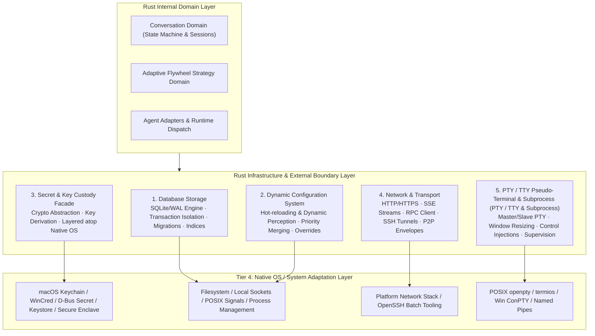

# Rust Infrastructure & External Boundary Layer Specification

| Related Document | Language / Path | Authority |
|:---|:---|:---|
| **Normative Version** | English (Normative) | Authoritative technical specification |
| **Localization** | [简体中文](RUST-INFRASTRUCTURE-LAYER.zh-CN.md) | Localized Chinese projection |
| **Architecture Root** | [docs/architecture/README.md](README.md) | 4-tier client architecture overview |
| **Conversation Domain** | [CONVERSATION-DOMAIN.md](CONVERSATION-DOMAIN.md) | Canonical conversation store, memberships, and dispatch |
| **Native Adaptation** | `crates/licoup-native/src/platform/` | Low-level OS APIs and platform scripts |
| **Security & Data** | [SECURITY-AND-DATA-BOUNDARY.md](SECURITY-AND-DATA-BOUNDARY.md) | Data flow boundaries and zero-trust rules |

This document defines the **Infrastructure and External Boundary Layer** residing within **Tier 3: Rust Functional Core Layer**. This layer interacts directly with the underlying operating system, local filesystem, terminal devices, network, and external processes, acting as the explicit **boundary interface between LicoUp's internal domain logic and the external physical world**.

---

## 1. Architectural Positioning & Component Flow

---

## 2. Five Core Underlying Modules

### Module 1: Database Storage
- **Core Responsibility**: Owns ACID persistence for all durable client facts (Canonical Conversations, Memberships, Events/EventParts, workflow logs, and token usage records).
- **Implementation Highlights**:
  - SQLite with WAL (Write-Ahead Logging) mode for concurrent reads and resilient write throughput.
  - Strongly typed, sequential migration pipeline ensuring schema integrity.
  - Compound indices (`conversation_id + event_sequence`) supporting low-latency pagination and replay.
- **Invariants**:
  - **Exclusive Access**: The SQLite database is opened exclusively by the Rust core process. Flutter never accesses SQLite files directly.

### Module 2: Dynamic Configuration
- **Core Responsibility**: Manages client configuration, user preferences, agent scan manifests, proxy settings, and feature flags.
- **Implementation Highlights**:
  - **Dynamic Perception**: Reloads and applies configuration file changes without restarting the Rust core process.
  - **Deterministic Precedence**: Adheres to strict override rules (CLI flags > Environment variables > User config manifest > Platform defaults).
  - **Path Normalization**: Handles XDG standard paths, APFS Firmlinks, and Windows wide-character paths cleanly.

### Module 3: Secret & Key Custody (Layered atop Native OS)
- **Core Responsibility**: Provides a unified, type-safe, platform-agnostic facade for secret custody, key management, and cryptographic primitives.
- **Implementation Highlights**:
  - **Layered Native Integration**: Directly overlays on Tier 4 Native OS adaptations:
    - macOS: `Security.framework` (Keychain Services)
    - Windows: Windows Credential Manager (WinCred)
    - Linux: D-Bus Freedesktop Secret Service (libsecret / GNOME Keyring / KWallet)
    - Android: Android Keystore System
    - iOS: Apple Secure Enclave Hardware Keychain
  - **Ephemeral In-Memory Fallback**: When system secure storage is unavailable, explicitly falls back to ephemeral memory storage (discarded on process exit).
- **Invariants**:
  - Hides platform-specific C-ABI and FFI complexity from upper domain code, exposing only closed, typed key handles.

### Module 4: Network & Transport
- **Core Responsibility**: Manages all network communications crossing host or process boundaries.
- **Implementation Highlights**:
  - **HTTP / SSE Client**: High-throughput, backpressure-aware client for SSE streaming and vendor APIs.
  - **Secure Batch SSH Tunnels**: Launches system SSH in batch mode (`ssh -o BatchMode=yes -o StrictHostKeyChecking=yes`) for VM and remote agent bridges.
  - **P2P Encrypted Envelopes**: Implements `licoarc.relay.v1` 5-field envelope framing and zero-trust relay interactions.
- **Invariants**:
  - Manages byte/frame IO and connection lifecycles without inspecting semantic business state.

### Module 5: PTY / TTY Pseudo-Terminal & Subprocess Management
- **Core Responsibility**: Provides virtual terminal emulation, window size synchronization, ANSI stream capture, and interactive character injections for CLI agents (e.g. Antigravity CLI, Cursor CLI, Claude Code).
- **Implementation Highlights**:
  - **Unified Cross-Platform Abstraction**: Exposes type-safe asynchronous PTY Master/Slave channel handles.
  - **Native OS Bridge Integration**:
    - **macOS / Linux**: POSIX PTY APIs (`openpty`, `forkpty`, `termios`, `ioctl(TIOCSCTTY, winsize)`).
    - **Windows**: Windows Pseudo Console API (ConPTY: `CreatePseudoConsole`) and Windows Named Pipes.
  - **Window Resize & Control Plane Synchronization**: Listens to UI viewport resize events and injects `winsize` / `SIGWINCH`.
  - **Supervision Ladder**: Interacts with `process_supervisor.rs` for strict process lifecycle reclamation (Graceful Ctrl+C $\to$ Grace Period $\to$ SIGTERM $\to$ SIGKILL).
- **Invariants**:
  - PTY/TTY manages stream channels only; semantic transition extraction remains the sole responsibility of L1 `native_agent_parser`.

---

## 3. Design Characteristics

1. **Explicit Boundary Separation**:
   - Domain logic (Conversation state machines, Flywheel graphs, Agent routing) remains pure. All physical world interactions (disk, OS keyrings, networks, PTY/TTY devices, subprocess pipes) are strictly encapsulated in this Infrastructure layer.
2. **Ports & Adapters (Dependency Inversion)**:
   - Upper layers depend on traits defined here. Contract and unit tests substitute in-memory test doubles (Mock DB, Ephemeral Secret Store, Mock PTY) for ultra-fast hermetic testing.
