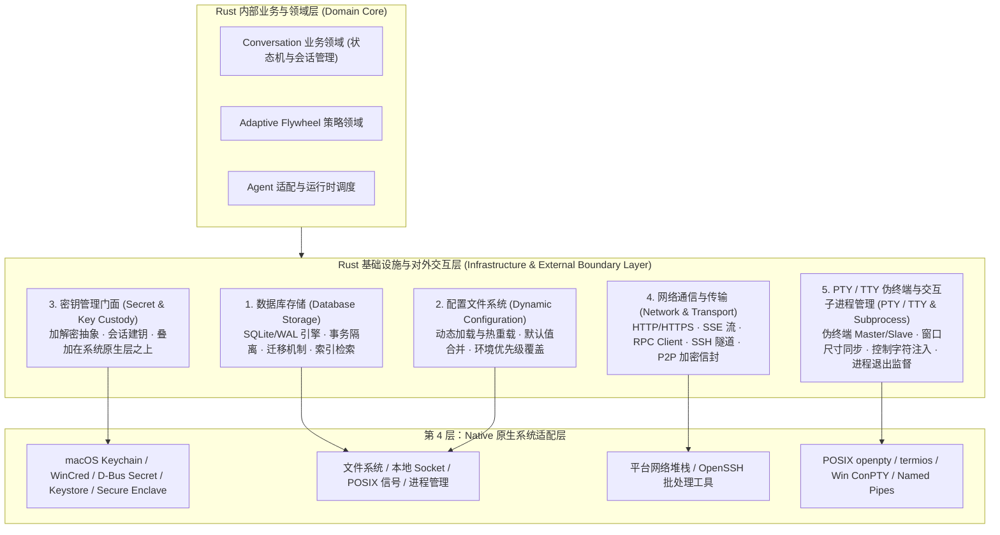

# Rust 基础设施与对外交互层规范

| 关联文档 | 语言 / 路径 | 权威职责 |
|:---|:---|:---|
| **规范版本** | [English (Normative)](RUST-INFRASTRUCTURE-LAYER.md) | 基础设施与对外交互层英文规范 |
| **架构主文档** | [docs/architecture/README.zh-CN.md](README.zh-CN.md) | 四层顶层客户端架构与总览 |
| **Conversation 垂直领域** | [CONVERSATION-DOMAIN.zh-CN.md](CONVERSATION-DOMAIN.zh-CN.md) | 统一聊天存储、Membership 与调度门 |
| **原生系统适配** | `crates/licoup-native/src/platform/` | 各操作系统底层 API、脚本与工具链 |
| **安全与数据边界** | [SECURITY-AND-DATA-BOUNDARY.zh-CN.md](SECURITY-AND-DATA-BOUNDARY.zh-CN.md) | 数据流动规则与零信任通信边界 |

本文档定义 **第 3 层：Rust 功能核心层** 中的「基础设施与对外交互层（Infrastructure & External Boundary Layer）」。这一层直接与底层操作系统、文件系统、终端设备、网络或外部进程环境交互，构成了 LicoUp 应用内部核心业务与外部物理世界的**清晰交界线**。

---

## 1. 架构定位与组件流向

---

## 2. 五大核心底层模块规范

### 模块一：数据库存储（Database Storage）
- **核心职责**：负责 LicoUp 所有业务事实（统一 Conversation 聊天事实、Membership 席位、Event/EventPart、工作流运行日志、用量统计）的本地 ACID 持久化。
- **技术实现**：
  - 基于 SQLite 引擎与 WAL（Write-Ahead Logging）模式，实现并发读写与高吞吐；
  - 提供强类型的迁移（Migration）流水线，确保模式升级的一致性；
  - 维护复合索引（`conversation_id + event_sequence` 等），支撑快速分页检索与游标重放；
- **边界约束**：
  - **独占写入**：SQLite 数据库文件仅由 Rust 核心进程独占打开与维护，严禁前端 Flutter 绕过 Rust 直接读写 SQLite 文件。

### 模块二：配置文件（动态加载）（Dynamic Configuration）
- **核心职责**：管理客户端的运行时配置、用户偏好、Agent 扫描路径清单、代理设置与功能开关。
- **技术实现**：
  - **动态感知与热重载**：支持在不重启 Rust 核心进程的前提下，动态重载与感知外部配置文件变更；
  - **确定性优先级合并**：遵循严格的配置覆盖优先级（CLI 参数 > 环境变量覆盖 > 用户配置清单 > 系统平台默认配置）；
  - **路径规范化**：解析 XDG 标准路径、APFS Firmlink 系统卷映射与 Windows 宽字符路径。

### 模块三：密钥管理（叠加在系统原生层之上）（Secret & Key Custody）
- **核心职责**：为业务层（端点保护、P2P 加密信封、敏感 Token 存取）提供统一、类型安全且平台无关的密钥保管与加解密门面。
- **技术实现**：
  - **原生安全存储集成**：向下直接叠加在第 4 层 Native 原生系统适配之上，优先利用系统级硬件与凭据库：
    - macOS：`Security.framework` (Keychain Services)
    - Windows：Windows Credential Manager (WinCred API)
    - Linux：D-Bus Freedesktop Secret Service（libsecret / GNOME Keyring / KWallet）
    - Android：Android Keystore System
    - iOS：Apple Secure Enclave 硬件 Keychain
  - **内存临时回退（Ephemeral Fallback）**：当系统安全存储不可用时，显式降级为内存临时存储（进程退出即销毁，严禁回退明文写盘）。
- **边界约束**：
  - 向上层隐藏底层操作系统具体的 C-ABI 与 FFI 调用细节，仅暴露封闭的密钥句柄与安全操作接口。

### 模块四：网络通信与传输（Network & Transport）
- **核心职责**：管理所有跨越本地主机边界或跨进程的网络与数据传输。
- **技术实现**：
  - **HTTP / SSE Client**：高吞吐、支持反压的流式 HTTP 客户端，用于接收 Agent 厂商 SSE 帧与 API 通信；
  - **安全批处理 SSH 隧道**：以 Batch 模式启动系统原生 SSH（`ssh -o BatchMode=yes -o StrictHostKeyChecking=yes`），用于虚拟机与远程 Agent 接入；
  - **P2P 加密信封传输**：实现 `licoarc.relay.v1` 五字段信封编解码与零信任通讯站交互。
- **边界约束**：
  - 传输层只负责有界字节/帧 IO 与连接生命周期管理，不参与报文内容语义解析或业务状态机决策。

### 模块五：PTY / TTY 伪终端与交互子进程管理（PTY / TTY & Subprocess）
- **核心职责**：为交互式命令行 Agent（如 Antigravity CLI、Cursor CLI、Claude Code 等）提供真实终端仿真环境、winsize 窗口尺寸同步、ANSI 序列流式捕获与控制字符交互。
- **技术实现**：
  - **统一跨平台抽象**：向上层提供类型安全的异步 PTY Master/Slave 通道读写句柄；
  - **底层系统适配对接**：
    - **macOS / Linux**：调用 POSIX PTY API（`openpty`, `forkpty`, `termios`, `ioctl(TIOCSCTTY, winsize)`），支持原始终端模式与信号捕获；
    - **Windows**：调用 Windows Pseudo Console API (ConPTY: `CreatePseudoConsole`) 与 Windows Named Pipes 命名管道，建立全功能控制台包装；
  - **终端窗口尺寸与控制面同步**：监听前端 UI 视图尺寸变化并向 PTY 注入 `winsize` / `SIGWINCH`；
  - **进程监督阶梯**：结合 `process_supervisor.rs`，提供 Graceful Ctrl+C $\to$ 等待宽限期 $\to$ SIGTERM $\to$ SIGKILL 的严格生命周期回收。
- **边界约束**：
  - PTY/TTY 仅负责虚拟终端与进程字符流管道的可靠收发，具体的报文解析与完成裁决交由上层 L1 `native_agent_parser` 负责。

---

## 3. 对外交互层的核心设计特征

1. **内外部世界的明确交界线**：
   - 内部业务（Conversation 状态机、Flywheel 策略、Agent 路由）保持纯粹的领域逻辑计算，**所有对物理世界的操作（读写磁盘、调用 OS 凭据库、发起网络请求、读写虚拟终端 PTY/TTY 与子进程管道）全部下沉并收敛到本基础设施层**。
2. **易于测试与隔离替换（Ports & Adapters / 依赖倒置）**：
   - 业务领域依赖于本层定义的抽象接口（Trait），在契约测试与边界测试中可无缝挂接合成内存存储（Mock DB / Ephemeral Secret Store / Mock PTY），实现不依赖外部环境的极速回归。
