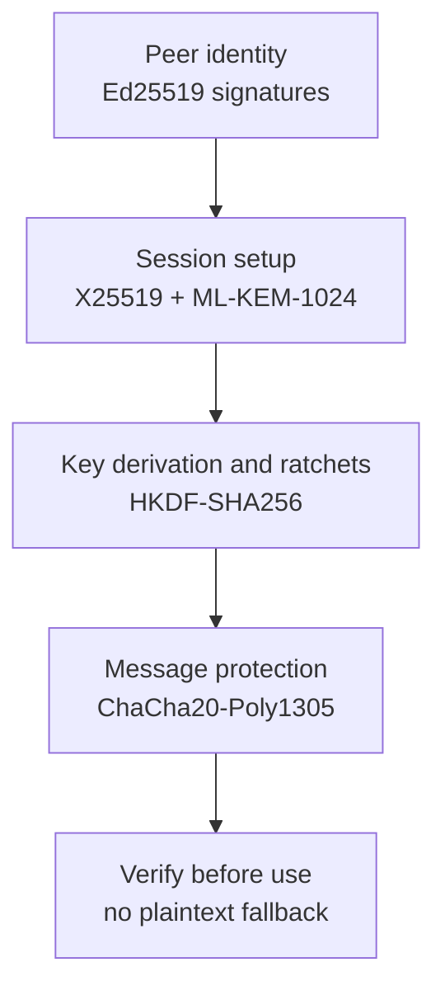
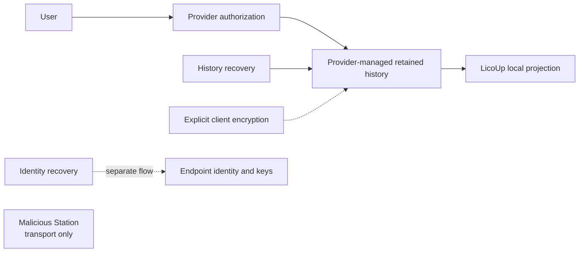
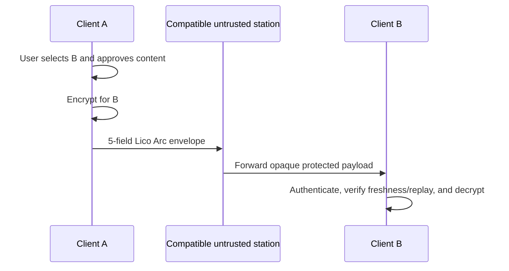

# Security Architecture and Data Boundaries

English (Normative) · [简体中文](SECURITY-AND-DATA-BOUNDARY.zh-CN.md) · [Back to Architecture README](README.md)

This document defines LicoUp client security boundaries, data flow rules, virtual machine integration isolation, and endpoint encryption standards.

## 1. Virtual Machine Discovery and Remote Protocol Boundaries

For OpenClaw and Hermes, the desktop client enumerates running local OrbStack VMs via bounded commands and checks fixed official and standard binary locations; it does not read VM configuration or history. Rust validates the VM name and returned absolute path before creating a temporary `machine@orb` route. Discovered VM routes do not enter the discovery cache.

For other VMs, Flutter collects hostname, optional port/user, in-VM binary, and absolute working directory; Rust validates a closed connection structure and persists it only in authoritative manual targets. Passwords, private keys, command fragments, relative directories, and unknown fields are rejected.

The native core starts the platform system `ssh` executable in batch mode with strict host-key checking, no TTY, no forwarding, no local command execution, no environment forwarding, and no connection multiplexing:
```bash
ssh -o BatchMode=yes -o StrictHostKeyChecking=yes <user>@<host> <command>
```
It passes one fixed, shell-quoted guest command. Both ACP and Hermes TUI gateway protocols use bounded JSON-RPC over stdin/stdout.

## 2. Retiring Endpoint-Protection Preview Layers

The current retiring endpoint-protection Preview uses a fixed security profile:



Algorithms are combined only when they have distinct roles and validated compositions. The profile locks during the initial handshake. Missing or failed security checks strictly prohibit fallback to plaintext communication.

## 3. Platform Secret Custody

The client probes platform capabilities and selects system secure storage when available, otherwise explicitly falling back to ephemeral in-memory storage. Private key custody and local Provider selection remain LicoUp responsibilities; wire-observable profiles and negotiation belong to the fixed Lico Arc Protocol Line.

## 4. Provider-Managed History and Recovery

Provider-managed cloud history is a separate source from the local Canonical
Conversation store. After provider authorization, retained history is readable
by default; the default history read does not call a recovery key. Client-side
encryption for this history is an explicit opt-in and is not silently enabled
by the default path.

History recovery restores every retained object that the authorized provider
still makes available. Provider access rules continue to apply, so recovery cannot
bypass access or recreate objects that are missing, deleted, expired, or
otherwise unavailable. Identity recovery material is separately authenticated
and never locks default history reads. Replacement-device recovery prepares
identity authority and the complete available history before one atomic
caller-owned commit; identity material cannot restore missing history.

LicoUp never routes this history through or stores it at a Station; malicious
Stations remain outside the history path. This path makes no mandatory notary
or endpoint attestation/evidence promise; any evidence LicoUp shows remains
local and scoped to the operation that produced it.



## 5. Data Boundaries and Rules



The client strictly adheres to these data boundaries:
- **Data Locality**: Local paths, logs, canonical history, local projections, usage records, credentials, and raw runtime data stay on-device. Provider-managed history remains with its authorized provider; LicoUp does not use a Station as its storage.
- **Plaintext Control**: Default scenarios never send sensitive runtime data or user content in plaintext to servers.
- **Controlled Disclosure**: External MCP requests contain only exact text and files shown in one-shot user confirmations.
- **Ciphertext in Transit**: Content leaving the client without explicit external service confirmation must be encrypted for the designated peer.
- **Encrypt-then-Send, Verify-then-Use**: Senders encrypt before network transmission; receivers authenticate and verify freshness/anti-replay before consumption.
- **Zero-Trust Stations**: Compatible stations are outside the trusted boundary and outside LicoUp's history path. Private keys and approval policies stay entirely with endpoints.
- **Safe Summaries**: Logs and reports retain only security summaries, never raw user content or secret keys.
