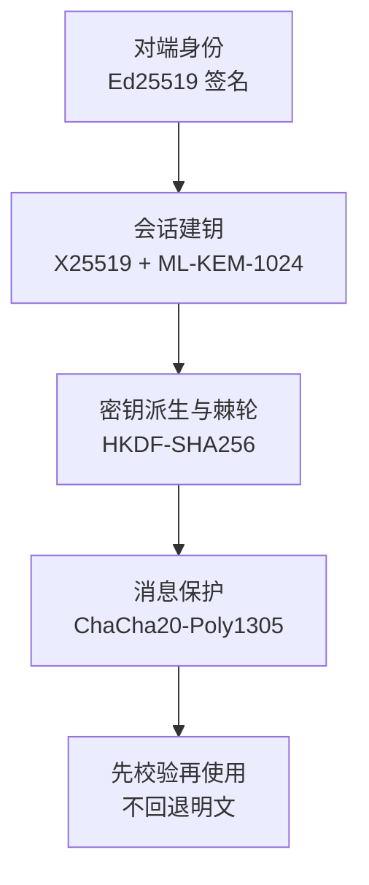
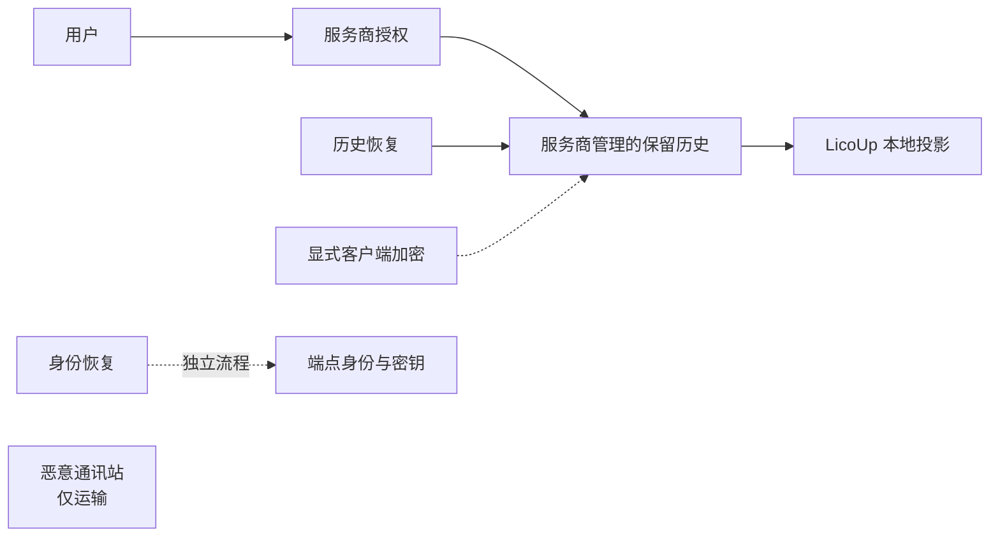
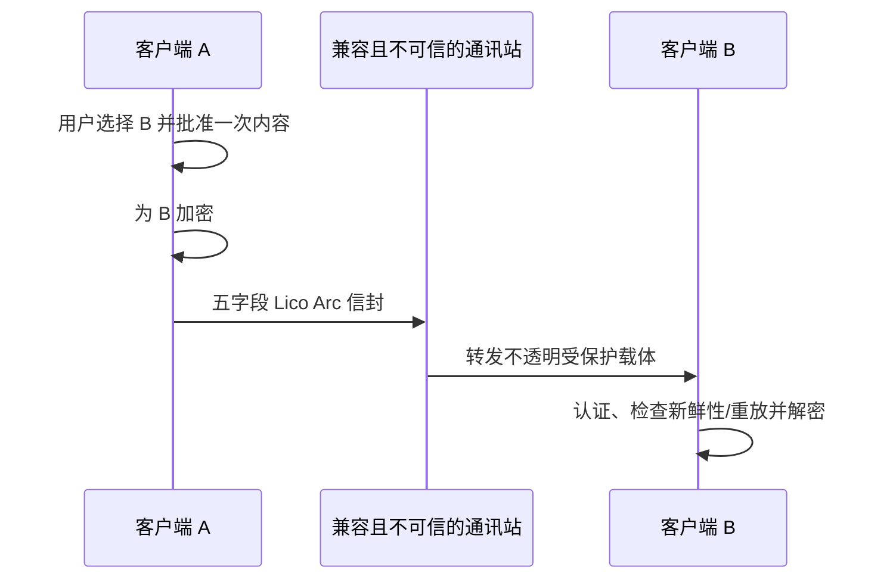

# 安全架构与数据边界

[English (Normative)](SECURITY-AND-DATA-BOUNDARY.md) · 简体中文（本地化） · [返回架构主文档](README.zh-CN.md)

本文档定义 LicoUp 客户端的安全边界、数据流动规则、虚拟机集成隔离以及端点加密规范。

## 1. 虚拟机发现与远程协议边界

对于 OpenClaw 和 Hermes，桌面客户端通过有界命令枚举本机正在运行的 OrbStack 虚拟机，并检查固定的官方及常见可执行文件位置；它不会读取虚拟机配置或历史。Rust 会先校验虚拟机名和返回的绝对路径，再创建临时的 `machine@orb` 路由；自动发现的虚拟机路由不会进入发现缓存。扫描具有固定的时间、输出、虚拟机数量和并发上限。

对于其他虚拟机，Flutter 收集主机名、可选端口/用户、虚拟机内程序以及绝对工作目录；Rust 校验封闭的连接结构，只把它保存在权威手动目标中。密码、私钥、命令片段、相对虚拟机目录和未知字段都会被拒绝。

原生核心以 batch 模式启动平台系统 `ssh`，强制主机密钥校验，关闭 TTY、转发、本地命令、环境转发和连接复用：
```bash
ssh -o BatchMode=yes -o StrictHostKeyChecking=yes <user>@<host> <command>
```
它只传入一条经过 shell 引号保护的固定虚拟机命令。OpenClaw 启动 ACP；Hermes 在可选 ACP 包通过固定能力检查时启动 ACP，否则自动发现会用安装器虚拟环境的 Python 启动 `tui_gateway.entry`。两种协议都通过 stdin/stdout 交换有界 JSON-RPC。本机协作 MCP 描述不会发送到虚拟机。会话发现和回读使用所选协议的会话列出/加载操作；客户端不会扫描、挂载或复制虚拟机历史存储。

## 2. 端点保护预览分层

当前正在退役的端点保护预览使用一个固定安全配置：



只有当不同算法承担不同职责，并且组合规则已经过检查时，协议才会组合它们。签名握手会固定本次会话使用的安全配置。派生密钥有清晰标签，不能把一个任务的密钥复用于另一个任务。任何安全检查缺失或失败，都不能开启明文通信。

## 3. 平台密钥保管

当前客户端会先检查平台能力，再选择本机密钥存储。系统安全存储可用时使用系统存储，否则明确使用内存临时存储。内存密钥会在重启后丢失，因此客户端需要重新配对并创建新密钥。存储失败不会开启明文通信。

当前平台适配器保护密封后的秘密数据。私钥保管与本地 Provider 选择由 LicoUp 负责；线上可观测的 profile 与协商规则属于固定的 Lico Arc Protocol Line。平台支持声明必须有当前测量证据。

## 4. 服务商管理的历史与恢复

服务商管理的云端历史与本地规范 Conversation 存储是两个不同的来源。取得服务商
授权后，保留的历史默认可读；默认历史读取不会调用恢复密钥。该历史的客户端加密
必须显式选择，默认路径不会静默启用。

历史恢复会还原获得授权的服务商仍然提供的全部保留对象。服务商访问规则继续
生效，因此恢复不能绕过访问控制，也不能重新创建缺失、删除、过期或其他不可用的
对象。身份恢复材料会单独认证，且永远不会锁住默认历史读取。替换设备恢复会先准备
身份权威与完整可用历史，再交给调用方一次性原子提交；身份材料不能恢复缺失历史。

LicoUp 不会通过通讯站路由或在通讯站存储这些历史；恶意通讯站始终位于历史路径
之外。这条路径不要求或承诺公证服务或端点证明/证据；LicoUp 展示的任何证据都
保持在本地，并且只对产生它的操作有效。



## 5. 数据边界与规则



客户端严格遵守以下数据安全规则：
- **数据驻留**：本地路径、日志、规范历史、本地投影、用量记录、凭据和原始运行时数据留在设备上。服务商管理的历史保留在获得授权的服务商处；LicoUp 不把通讯站用作它的存储。
- **明文控制**：默认客户端场景不会把敏感运行时数据或用户内容明文发送给服务端。
- **受控披露**：可选的外部 MCP 请求只能包含受保护一次性确认中展示的准确正文和文件。
- **密文传输**：如果没有针对外部服务的准确确认，受保护内容离开客户端时必须是密文，并发给指定的对端客户端。
- **先密后传、先验后用**：发送端先加密，再进行网络传输；接收端先认证、校验新鲜性与防重放，再使用内容。
- **通讯站零信任**：通讯站不在可信客户端边界内，也不进入 LicoUp 的历史路径。只有对端通讯所需的密文和最少路由字段可以跨越通讯站边界。私钥、本地信任与审批策略、新鲜性状态由端点完全持有。
- **摘要日志**：日志和测试报告只保留安全摘要，严禁保存原始用户内容与密钥明文。
