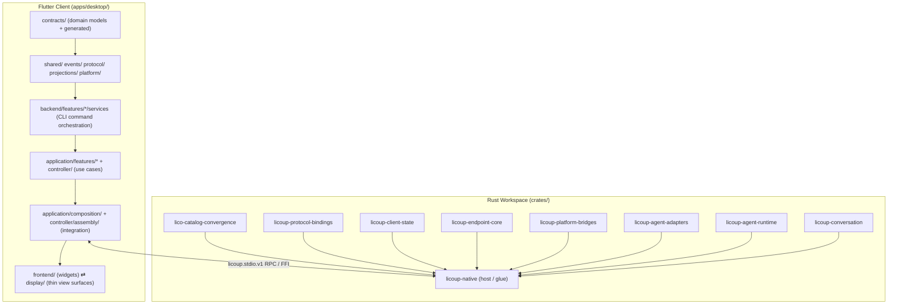

# LicoUp Parallel Development Map

| Related Document | Language / Path | Authority |
|:---|:---|:---|
| **Normative Version** | English (Normative) | Authoritative parallel development map |
| **Localization** | [简体中文](PARALLEL-DEVELOPMENT-MAP.zh-CN.md) | Localized Chinese projection |
| **Architecture** | [docs/architecture/README.md](../architecture/README.md) | Authoritative architecture tiers and vertical slices |
| **Contribution Rules** | [CONTRIBUTING.md](../../CONTRIBUTING.md) | Commit identity, gate, and agent contribution rules |
| **Runbook** | [docs/RUNBOOK.md](../RUNBOOK.md) | Operational checklists and gate execution |
| **Documentation Index** | [docs/README.md](../README.md) | Complete documentation table of contents |

This map tells a developer — especially an autonomous coding agent — which
upcoming feature work can proceed **in parallel** with another developer or
agent currently editing the same repository. It records the repository's
parallel-safety facts: which directories share no files, which crates are
leaves, and which files are global integration bottlenecks that must not be
edited by two parties at once.

It is a **process map**, not an architecture specification. All architectural
facts are owned by `docs/architecture/README.md` and its children; all
contribution rules are owned by `CONTRIBUTING.md`. This document only maps
where work can safely run concurrently.

---

## 1. Repository Topology

LicoUp is a hybrid repository with two independent build systems:

- **Rust workspace** — `crates/` (10 members, 9 of which are `licoup-native`
  plus 8 leaf crates and `trybuild`).
- **Flutter client** — `apps/desktop/` (presentation, application, backend
  services, and platform layers).

Shared tooling lives in `tools/` (Node scripts) and `tests/` (contract,
product-e2e, smoke, replay-corpus suites). `docs/`, `schemas/`, `brand/`, and
`packages/` are low-churn, cross-cutting directories.

The two build systems are **independent**: editing Flutter code does not
require rebuilding Rust, and vice versa. The only cross-language surface is the
RPC contract (`licoup.stdio.v1` frames, mobile FFI commands) and the generated
bridge contracts under `apps/desktop/lib/src/contracts/generated/` and
`crates/licoup-native/src/ffi/generated/`.

---

## 2. Parallel-Safety Model

Three facts determine whether two work items can run in parallel:

1. **File disjointness** — the two changes touch no common files. This is the
   only hard requirement.
2. **Contract stability** — if a change alters a public API (a leaf crate's
   exported types, an application-layer gateway interface, a bridge contract),
   every consumer of that API must be updated. Contract-breaking work is
   serial by nature.
3. **Build-system isolation** — Rust workspace and Flutter client rebuild
   independently, so cross-language work rarely conflicts at the file level.

Rules of thumb:

- **Parallel-safe**: changes confined to one vertical domain slice whose files
  live in that domain's own directories, changes to a single leaf crate, UI-only
  changes, and test-only changes in a domain's own test directory.
- **Parallel-unsafe**: any two changes that both touch a global integration
  file (see Section 5), two changes to the same leaf crate's public API, and
  two changes to the same generated contract file.
- **Serial by dependency**: a change that consumes a new API must land after
  the change that introduces it. The repository convention is to define the
  contract in the owning leaf crate or gateway interface first, then integrate
  in `licoup-native` / `application/composition`.

---

## 3. Rust Workspace: Leaf Crates and the Native Host

All eight leaf crates depend on **no other workspace crate** and are each
consumed by exactly one crate: `licoup-native`. There is no dependency between
any two leaf crates.

| Crate | Workspace dependencies | Parallel-safety |
|:---|:---|:---|
| `lico-catalog-convergence` | none | Leaf: internal changes are isolated; public API changes ripple into `licoup-native` only |
| `licoup-protocol-bindings` | none | Leaf (same rule) |
| `licoup-client-state` | none | Leaf (same rule) |
| `licoup-endpoint-core` | none | Leaf (same rule) |
| `licoup-platform-bridges` | none | Leaf (same rule) |
| `licoup-agent-adapters` | none | Leaf (same rule) |
| `licoup-agent-runtime` | none | Leaf (same rule) |
| `licoup-conversation` | none | Leaf (same rule); host-neutral by design, does not depend on `licoup-agent-runtime` |
| `licoup-native` | **all 8** | Single sink: every cross-crate integration point lands here; treat as a serial integration lane |

Parallel strategy for the Rust workspace:

- **Eight leaf crates can be developed concurrently** as long as their public
  APIs are treated as frozen contracts for the duration, or each
  contract-breaking change is paired with the corresponding `licoup-native`
  call-site update in the same change set.
- **`licoup-native` is the integration bottleneck.** Its
  `src/ffi/commands/` (20 command modules), `src/platform/` (agent drivers,
  local services, gateway runtime, secure mesh platform), and `src/domain/`
  (28 domain modules) are the only places where the leaf crates are wired
  together. Two changes to `licoup-native` that touch different command
  modules (`ffi/commands/secure_mesh.rs` vs `ffi/commands/agent_conversation.rs`)
  are file-disjoint and parallel-safe; two changes that both touch
  `build_command_table()` in `ffi/commands/mod.rs` are not.
- **The eight leaf crates are `publish = false` and several are stubs** —
  treat their exported types as the contract surface and extend them in the
  owning crate, never by reaching across crates from `licoup-native`.

---

## 4. Flutter Client: Vertical Domain Slices

The Flutter client is organized as **vertical domain slices** crossing the
layers `contracts/` → `platform/` → `backend/features/*/services/` →
`application/features/*` → `frontend/features/*` / `display/`.

Each domain owns its directories in every layer it spans — files from
`skill_hub`, `mobile_relay`, and `targets` never overlap:

| Domain slice | `application/features/` | `backend/features/` | `frontend/features/` | `display/` | Notes |
|:---|:---|:---|:---|:---|:---|
| **agents / conversations** | `agents/`, `conversations/` | `agents/`, `conversations/` | `agents/`, `conversations/` | `conversation/` (real pane implementation) | Largest slice; spans all layers |
| **mobile_relay / secure_mesh** | `mobile_relay/` | `mobile_relay/` | `mobile_relay/` | — | Includes controllers, pairing, approval cards |
| **skill_hub** | `skill_hub/` | `skill_hub/` | `skill_hub/` | — | Full vertical slice |
| **settings** | `settings/` | `settings/` | `settings/` | `settings/` | Update, resource usage, log export |
| **targets** | `targets/` | — | `targets/` | `targets/` | |
| **agent_hub** | `agent_hub/` | — | `agent_hub/` | `agent_hub/` | |
| **layout** | `layout/` | — | `layout/` | — | Presentation layout registry |
| **plugin_management** | `plugin_management/` | — | `plugin_management/` | — | Adapter plugins + optional collaboration |
| **models** | `models/` | — | `models/` | — | LLM gateway lifecycle |
| **navigation** | `navigation/` | — | (shell hooks) | — | |
| **catalog_convergence** | `catalog_convergence/` | — | (settings status card) | — | |
| **mcp** | `mcp/` | — | — | — | Application-layer only |
| **messaging** | `messaging/` | — | — | — | Application-layer only |

Within one slice, layer boundaries are the natural seams: the application-layer
gateway interfaces in `application/features/<domain>/contracts/` are the
contracts that `backend/` services and `composition/` adapters must honor.
Freeze the gateway interface, and each layer's implementation can proceed in
parallel.

Highest-parallelism, lowest-risk work: single-layer domains (`mcp`,
`messaging`, `models`), pure UI work in `frontend/features/`, and thin
`display/` re-export surfaces.

---

## 5. Global Integration Bottlenecks (Do Not Parallelize)

The following files are touched by nearly every domain. Two concurrent changes
must never both edit them; assign them to one owner or serialize them:

| File | Why it is a bottleneck |
|:---|:---|
| `apps/desktop/lib/src/application/controller/client_controller.dart` | Root controller aggregating all domains |
| `apps/desktop/lib/src/application/composition/built_in_layout_composition.dart` | Sole file allowed to assemble renderer ownership surface bundles |
| `apps/desktop/lib/src/application/controller/assembly/*_component_assembly.dart` | Per-domain assembly points, but co-located and cross-referenced |
| `apps/desktop/lib/src/application/controller/client_component_assembly.dart` | Component assembly root |
| `crates/licoup-native/src/ffi/commands/mod.rs` | `build_command_table()` central command registry |
| `crates/licoup-native/src/ffi/mod.rs`, `crates/licoup-native/src/domain/mod.rs`, `crates/licoup-native/src/platform/mod.rs` | Module declaration surfaces |
| `apps/desktop/lib/src/contracts/generated/*` and `crates/licoup-native/src/ffi/generated/*` | Generated bridge contracts — regenerate serially, never hand-edit |
| `tools/verify-documentation.mjs`, `tools/verify-client-boundary.mjs` | Central verification gates |
| `docs/README.md` | Documentation index — every new doc adds a line here |

The Rust module declaration files (`domain/mod.rs`, `platform/mod.rs`,
`ffi/mod.rs`) are small but conflict-prone: adding a new domain module in
`licoup-native` requires editing `domain/mod.rs`, which every other
domain-adding change also touches. Prefer staging module additions so only one
agent adds a new top-level module at a time.

---

## 6. Cross-Language and Generated-Contract Rules

- The Flutter–Rust boundary is the **bridge contract**: `licoup.stdio.v1`
  structured frames on desktop, platform FFI commands on mobile. Changing a
  command shape is a cross-language contract change: the Rust
  `ffi/commands/*` implementation, the Dart-side generated contract, and the
  composition adapter must land together (or in a strictly ordered pair of
  change sets).
- **Generated files** (`contracts/generated/`, `ffi/generated/`) are produced
  by `npm run client:contracts:generate`. They must not be hand-edited. Two
  parallel changes that both regenerate will conflict; regenerate serially
  after each side's contract change lands.
- When a feature needs a new bridge method, define the frame/command contract
  first (in the owning crate's `ffi/commands/` module or the contract
  generator input), then let the Rust and Flutter sides implement against the
  frozen contract in parallel.

---

## 7. Test Suites and Their Parallelism

Tests are organized by domain and are file-disjoint just like source:

- **Flutter widget/unit tests** — `apps/desktop/test/` (215+ files) mirror the
  domain slices: `agent_conversation_*`, `secure_mesh_*`, `skill_hub_*`,
  `mobile_relay_*`, `optional_collaboration_*`, plus per-slice subdirectories
  (`messaging/`, `layout/`, `agent_usage_timeline/`, `goldens/`).
- **Rust tests** — `crates/licoup-native/tests/` (integration cases per
  capability) and in-crate `#[cfg(test)]` modules (e.g.
  `platform/*/tests.rs`, `tests/` subdirectories under each platform driver).
- **Contract and product tests** — `tests/contract/` and `tests/product-e2e/`
  exercise the CLI and bridge contracts; they are the slowest and most
  environment-dependent suites.

Parallel test strategy is already defined by
[ADR 0006: Capability-aware parallel client regression](../adrs/0006-capability-aware-parallel-regression.md)
and `CONTRIBUTING.md` — it governs **parallel test execution** (shared
foundation first, then parallel frontend/backend, then parallel
platform/agent frontier) with capacity caps and no-shell constraints.

For parallel development, the rule is: a domain's tests live in that domain's
test directories, so test work parallelizes with the same boundaries as source
work. The one shared exception is `apps/desktop/test/flutter_test_config.dart`
and any golden-file manifest updates — treat them as serial.

---

## 8. Concrete Parallel Work Combinations

### 8.1 Ready to parallelize (file-disjoint today)

| Work item A | Work item B | Why they do not conflict |
|:---|:---|:---|
| Rust leaf crate change (e.g. `licoup-conversation` internals) | Any other leaf crate change | No leaf depends on another leaf |
| `licoup-native` agent driver work (`src/platform/cursor_driver/`) | `licoup-native` secure mesh work (`src/core/secure_mesh_*` / `src/platform/secure_mesh_*`) | Disjoint platform directories |
| `licoup-native` `ffi/commands/secure_mesh.rs` | `licoup-native` `ffi/commands/agent_conversation.rs` | Disjoint command modules (avoid `mod.rs` registry edits at the same time) |
| Flutter `mobile_relay` slice (application + frontend + backend) | Flutter `skill_hub` slice | Zero overlapping files across all layers |
| Flutter `agents` slice UI (`frontend/features/agents/`) | Flutter `settings` slice | Disjoint feature directories |
| `application/features/mcp` (single-layer) | `application/features/messaging` (single-layer) | Application-layer only, disjoint |
| Flutter UI work in `frontend/features/*` | Rust work in any `crates/*` | Independent build systems; only bridge contracts couple them |
| Domain test work (`apps/desktop/test/skill_hub_*` etc.) | Any other domain test work | Test files mirror domain slices |

### 8.2 Require sequencing (do not parallelize)

| Work item A | Work item B | Why they conflict |
|:---|:---|:---|
| Two changes adding new modules to `licoup-native` `domain/mod.rs` / `platform/mod.rs` | each other | Both edit the same module declaration file |
| Two changes regenerating `contracts/generated/` | each other | Generated files are single-writer |
| Two changes editing `client_controller.dart` / `built_in_layout_composition.dart` | each other | Global integration files |
| A leaf-crate public API change | Any `licoup-native` work consuming that API | Consumer must land after (or with) the API change |
| A bridge-contract shape change (Rust `ffi/commands/*` + Dart contract) | Any other bridge-contract change | Cross-language contract is single-writer |

---

## 9. Working with Another Active Agent

When you detect that another developer or agent is currently modifying the
repository:

1. **Check the map first** — identify which slice the other party's change
   set touches (by file paths), then pick work that is file-disjoint per
   Sections 3–4 and 8.1.
2. **Never share the bottleneck files** (Section 5). If your planned change
   touches one, either wait for the other party or coordinate explicitly.
3. **Prefer contract-first changes** — introduce or extend a gateway
   interface / leaf-crate contract, then integrate. This turns serial
   dependency into two parallel implementations against a frozen contract.
4. **Respect the contribution identity rules** of
   [CONTRIBUTING.md](../../CONTRIBUTING.md): every commit carries exactly one
   verified human identity; an agent may assist but never replace, overwrite,
   or claim the developer's authorship, and repository hooks must not be
   bypassed.
5. **Verify before handing off** — run the relevant gates for your slice
   (`npm run repo:docs` for documentation, `npm run client:test` /
   `client:native:test` for code) so the integration point is never
   double-broken. Gate details live in [docs/RUNBOOK.md](../RUNBOOK.md).
