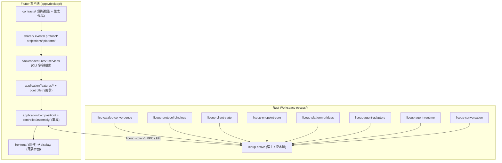

# LicoUp 并行开发地图

| 关联文档 | 语言 / 路径 | 权威性 |
|:---|:---|:---|
| **规范版本** | [English (Normative)](PARALLEL-DEVELOPMENT-MAP.md) | 权威并行开发地图 |
| **本地化** | 简体中文（本文件） | 中文投影 |
| **架构** | [docs/architecture/README.md](../architecture/README.md) | 权威架构分层与纵向切片 |
| **贡献规则** | [CONTRIBUTING.md](../../CONTRIBUTING.md) | 提交身份、门禁与智能体贡献规则 |
| **运维手册** | [docs/RUNBOOK.md](../RUNBOOK.md) | 运维清单与门禁执行 |
| **文档索引** | [docs/README.md](../README.md) | 完整文档目录 |

本地图帮助开发者——尤其是正在仓库中工作的自主编码智能体——判断**即将开发的功能可以和哪些功能并行进行**，特别是当发现此刻有另一个开发者或智能体正在修改同一仓库时。它记录仓库的并行安全事实：哪些目录零文件重叠、哪些 crate 是叶子、哪些文件是全局集成瓶颈、绝不能由两方同时修改。

这是一份**流程地图**，不是架构规范。所有架构事实归 `docs/architecture/README.md` 及其子文档所有；所有贡献规则归 `CONTRIBUTING.md` 所有。本文档只标注哪些工作可以安全地并发进行。

---

## 1. 仓库拓扑

LicoUp 是混合仓库，包含两套相互独立的构建系统：

- **Rust workspace** — `crates/`（10 个成员：`licoup-native`、8 个叶子 crate 与 `trybuild`）。
- **Flutter 客户端** — `apps/desktop/`（展示层、应用层、后端服务与平台层）。

共享工具位于 `tools/`（Node 脚本）与 `tests/`（contract、product-e2e、smoke、replay-corpus 套件）。`docs/`、`schemas/`、`brand/`、`packages/` 是低变更率的横切目录。

两套构建系统**相互独立**：修改 Flutter 代码无需重建 Rust，反之亦然。唯一的跨语言面是 RPC 契约（`licoup.stdio.v1` 帧、移动端 FFI 命令）以及 `apps/desktop/lib/src/contracts/generated/` 与 `crates/licoup-native/src/ffi/generated/` 下的生成桥接契约。

---

## 2. 并行安全模型

三项事实决定两个工作项能否并行：

1. **文件不相交** — 两个改动不触碰任何共同文件。这是唯一硬性要求。
2. **契约稳定** — 若改动改变了公开 API（叶子 crate 的导出类型、应用层网关接口、桥接契约），该 API 的所有消费者都必须同步更新。破坏契约的工作本质上只能串行。
3. **构建系统隔离** — Rust workspace 与 Flutter 客户端独立重建，跨语言工作很少在文件层面冲突。

经验法则：

- **可并行**：改动局限于某个纵向功能域切片（文件只在该域自己的目录里）、单个叶子 crate 的内部改动、纯 UI 改动、以及该域自身测试目录内的测试改动。
- **不可并行**：任何两个同时触碰全局集成文件（见第 5 节）的改动、同一叶子 crate 公开 API 的两处改动、同一生成契约文件的两处改动。
- **按依赖串行**：消费新 API 的改动必须晚于引入该 API 的改动。仓库惯例是先在所属叶子 crate 或网关接口中定义契约，再在 `licoup-native` / `application/composition` 中集成。

---

## 3. Rust Workspace：叶子 crate 与原生宿主

全部 8 个叶子 crate **不依赖任何其他 workspace crate**，且各自恰好只有一个消费者：`licoup-native`。任意两个叶子 crate 之间没有任何依赖。

| Crate | workspace 依赖 | 并行安全性 |
|:---|:---|:---|
| `lico-catalog-convergence` | 无 | 叶子：内部改动相互隔离；公开 API 改动只波及 `licoup-native` |
| `licoup-protocol-bindings` | 无 | 叶子（同规则） |
| `licoup-client-state` | 无 | 叶子（同规则） |
| `licoup-endpoint-core` | 无 | 叶子（同规则） |
| `licoup-platform-bridges` | 无 | 叶子（同规则） |
| `licoup-agent-adapters` | 无 | 叶子（同规则） |
| `licoup-agent-runtime` | 无 | 叶子（同规则） |
| `licoup-conversation` | 无 | 叶子（同规则）；刻意保持宿主中立，不依赖 `licoup-agent-runtime` |
| `licoup-native` | **全部 8 个** | 唯一汇聚点：所有跨 crate 集成都落在这里；视为串行集成通道 |

Rust workspace 并行策略：

- **8 个叶子 crate 可以并发开发**，前提是把它们的公开 API 视为冻结契约，或者每个破坏契约的改动在同一个变更集内同步更新 `licoup-native` 中的调用点。
- **`licoup-native` 是集成瓶颈。** 它的 `src/ffi/commands/`（20 个命令模块）、`src/platform/`（智能体驱动、本地服务、网关运行时、secure mesh 平台层）、`src/domain/`（28 个领域模块）是叶子 crate 被接线的唯一场所。两个改动若触碰 `licoup-native` 的不同命令模块（如 `ffi/commands/secure_mesh.rs` 与 `ffi/commands/agent_conversation.rs`），文件不相交、可并行；若都触碰 `ffi/commands/mod.rs` 的 `build_command_table()`，则不可并行。
- **8 个叶子 crate 均为 `publish = false`，其中若干还是桩实现** — 把导出的类型当作契约面，扩展请在所属 crate 内进行，绝不从 `licoup-native` 跨 crate 伸手。

---

## 4. Flutter 客户端：纵向功能域切片

Flutter 客户端按**纵向功能域切片**组织，贯穿 `contracts/` → `platform/` → `backend/features/*/services/` → `application/features/*` → `frontend/features/*` / `display/` 各层。

每个功能域在它跨越的每一层都拥有自己的目录 — `skill_hub`、`mobile_relay`、`targets` 的文件从不重叠：

| 功能域切片 | `application/features/` | `backend/features/` | `frontend/features/` | `display/` | 备注 |
|:---|:---|:---|:---|:---|:---|
| **agents / conversations** | `agents/`、`conversations/` | `agents/`、`conversations/` | `agents/`、`conversations/` | `conversation/`（真实 pane 实现） | 最大切片；贯穿全部层 |
| **mobile_relay / secure_mesh** | `mobile_relay/` | `mobile_relay/` | `mobile_relay/` | — | 含控制器、配对、批准卡 |
| **skill_hub** | `skill_hub/` | `skill_hub/` | `skill_hub/` | — | 完整纵向切片 |
| **settings** | `settings/` | `settings/` | `settings/` | `settings/` | 更新、资源用量、日志导出 |
| **targets** | `targets/` | — | `targets/` | `targets/` | |
| **agent_hub** | `agent_hub/` | — | `agent_hub/` | `agent_hub/` | |
| **layout** | `layout/` | — | `layout/` | — | 展示布局注册表 |
| **plugin_management** | `plugin_management/` | — | `plugin_management/` | — | 适配器插件 + optional collaboration |
| **models** | `models/` | — | `models/` | — | LLM 网关生命周期 |
| **navigation** | `navigation/` | — | （shell 钩子） | — | |
| **catalog_convergence** | `catalog_convergence/` | — | （settings 内状态卡） | — | |
| **mcp** | `mcp/` | — | — | — | 仅应用层 |
| **messaging** | `messaging/` | — | — | — | 仅应用层 |

单个切片内部，层边界就是天然接缝：`application/features/<domain>/contracts/` 中的应用层网关接口是 `backend/` 服务与 `composition/` 适配器必须遵守的契约。冻结网关接口后，各层实现即可并行推进。

并行度最高、风险最低的工作：单层功能域（`mcp`、`messaging`、`models`）、`frontend/features/` 下的纯 UI 工作、以及 `display/` 的薄 re-export 展示面。

---

## 5. 全局集成瓶颈（不可并行化）

以下文件几乎被每个功能域触碰。任何两个并发改动都绝不能同时编辑它们；指定一个负责人或串行处理：

| 文件 | 为什么是瓶颈 |
|:---|:---|
| `apps/desktop/lib/src/application/controller/client_controller.dart` | 聚合所有功能域的根控制器 |
| `apps/desktop/lib/src/application/composition/built_in_layout_composition.dart` | 唯一允许组装 renderer 所有权 surface bundle 的文件 |
| `apps/desktop/lib/src/application/controller/assembly/*_component_assembly.dart` | 按域拆分的组装点，但集中存放且互相引用 |
| `apps/desktop/lib/src/application/controller/client_component_assembly.dart` | 组件组装根 |
| `crates/licoup-native/src/ffi/commands/mod.rs` | `build_command_table()` 中央命令注册表 |
| `crates/licoup-native/src/ffi/mod.rs`、`crates/licoup-native/src/domain/mod.rs`、`crates/licoup-native/src/platform/mod.rs` | 模块声明面 |
| `apps/desktop/lib/src/contracts/generated/*` 与 `crates/licoup-native/src/ffi/generated/*` | 生成桥接契约 — 必须串行重新生成，绝不手改 |
| `tools/verify-documentation.mjs`、`tools/verify-client-boundary.mjs` | 中央验证门禁 |
| `docs/README.md` | 文档索引 — 每份新文档都在这里加一行 |

Rust 模块声明文件（`domain/mod.rs`、`platform/mod.rs`、`ffi/mod.rs`）很小但极易冲突：在 `licoup-native` 新增领域模块需要编辑 `domain/mod.rs`，而任何其他新增模块的改动也会碰它。建议错峰新增模块：同一时间只允许一个智能体新增顶层模块。

---

## 6. 跨语言与生成契约规则

- Flutter–Rust 边界是**桥接契约**：桌面端 `licoup.stdio.v1` 结构化帧、移动端平台 FFI 命令。修改命令形状就是跨语言契约变更：Rust `ffi/commands/*` 实现、Dart 侧生成契约与 composition 适配器必须一起落地（或按严格顺序的两个变更集）。
- **生成文件**（`contracts/generated/`、`ffi/generated/`）由 `npm run client:contracts:generate` 产出，不得手改。两个并行改动若都触发重新生成会冲突；应在一方契约变更落地后串行重新生成。
- 功能需要新桥接方法时，先定义帧/命令契约（在所属 crate 的 `ffi/commands/` 模块或契约生成器输入中），再让 Rust 与 Flutter 两侧基于冻结契约并行实现。

---

## 7. 测试套件与并行性

测试按功能域组织，与源码一样文件不相交：

- **Flutter widget/单元测试** — `apps/desktop/test/`（215+ 文件）镜像功能域切片：`agent_conversation_*`、`secure_mesh_*`、`skill_hub_*`、`mobile_relay_*`、`optional_collaboration_*`，另有按切片划分的子目录（`messaging/`、`layout/`、`agent_usage_timeline/`、`goldens/`）。
- **Rust 测试** — `crates/licoup-native/tests/`（按能力的集成用例）与 crate 内 `#[cfg(test)]` 模块（如 `platform/*/tests.rs`、各平台驱动下的 `tests/` 子目录）。
- **契约与产品测试** — `tests/contract/` 与 `tests/product-e2e/` 覆盖 CLI 与桥接契约；它们最慢、最依赖环境。

并行**测试执行**策略已由 [ADR 0006：能力感知的并行客户端回归](../adrs/0006-capability-aware-parallel-regression.md) 与 `CONTRIBUTING.md` 定义（先共享基础，再并行 frontend/backend，再并行 platform/Agent frontier），含容量上限与无 shell 约束。

对并行开发而言规则是：某功能域的测试位于该域自己的测试目录，因此测试工作与源码工作遵循同样的并行边界。唯一的共享例外是 `apps/desktop/test/flutter_test_config.dart` 与任何 golden 文件清单更新 — 视为串行。

---

## 8. 具体的并行工作组合

### 8.1 现在即可并行（当前文件不相交）

| 工作项 A | 工作项 B | 为什么互不冲突 |
|:---|:---|:---|
| Rust 叶子 crate 改动（如 `licoup-conversation` 内部） | 任意其他叶子 crate 改动 | 叶子之间互不依赖 |
| `licoup-native` 智能体驱动工作（`src/platform/cursor_driver/`） | `licoup-native` secure mesh 工作（`src/core/secure_mesh_*` / `src/platform/secure_mesh_*`） | platform 目录不相交 |
| `licoup-native` `ffi/commands/secure_mesh.rs` | `licoup-native` `ffi/commands/agent_conversation.rs` | 命令模块不相交（避免同时改 `mod.rs` 注册表） |
| Flutter `mobile_relay` 切片（application + frontend + backend） | Flutter `skill_hub` 切片 | 全部层零文件重叠 |
| Flutter `agents` 切片 UI（`frontend/features/agents/`） | Flutter `settings` 切片 | 功能目录不相交 |
| `application/features/mcp`（单层） | `application/features/messaging`（单层） | 仅应用层，不相交 |
| `frontend/features/*` 的 Flutter UI 工作 | 任意 `crates/*` 的 Rust 工作 | 构建系统独立；仅桥接契约耦合 |
| 功能域测试工作（`apps/desktop/test/skill_hub_*` 等） | 任意其他功能域测试工作 | 测试文件镜像功能域切片 |

### 8.2 需要排序（不可并行）

| 工作项 A | 工作项 B | 为什么冲突 |
|:---|:---|:---|
| 两个都向 `licoup-native` `domain/mod.rs` / `platform/mod.rs` 新增模块的改动 | 彼此 | 都编辑同一模块声明文件 |
| 两个都重新生成 `contracts/generated/` 的改动 | 彼此 | 生成文件是单写者 |
| 两个都编辑 `client_controller.dart` / `built_in_layout_composition.dart` 的改动 | 彼此 | 全局集成文件 |
| 叶子 crate 公开 API 改动 | 任何消费该 API 的 `licoup-native` 工作 | 消费者必须晚于（或随）API 改动落地 |
| 桥接契约形状改动（Rust `ffi/commands/*` + Dart 契约） | 任何其他桥接契约改动 | 跨语言契约是单写者 |

---

## 9. 与另一个活跃智能体协同

当发现另一个开发者或智能体正在修改仓库时：

1. **先查本地图** — 按文件路径判断对方的变更集属于哪个切片，然后按第 3–4 节与 8.1 选择文件不相交的工作。
2. **绝不共享瓶颈文件**（第 5 节）。若你的计划改动触碰瓶颈文件，要么等待对方，要么显式协调。
3. **优先做契约优先的改动** — 先引入或扩展网关接口 / 叶子 crate 契约，再集成。这把串行依赖变成两个基于冻结契约的并行实现。
4. **遵守 [CONTRIBUTING.md](../../CONTRIBUTING.md) 的提交身份规则**：每个提交恰好携带一个已验证的人类身份；智能体可以协助，但绝不能取代、覆盖或冒认开发者的作者身份，仓库 hooks 不得绕过。
5. **交接前先验证** — 运行你所属切片的门禁（文档用 `npm run repo:docs`，代码用 `npm run client:test` / `client:native:test`），确保集成点不会被双重破坏。门禁细节见 [docs/RUNBOOK.md](../RUNBOOK.md)。
