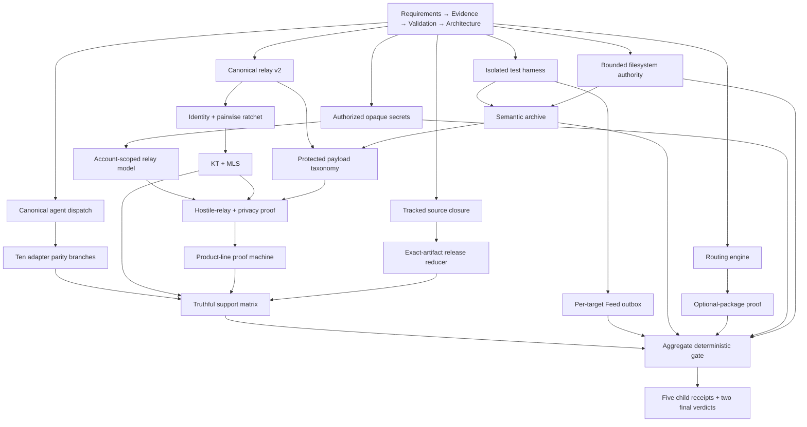

# LicoArc End-to-End Release Architecture

## Plan tree

```text
client-release/                         platform-neutral product and proof authority
├── Requirements.md                     one release and product contract
├── Decisions.md                        owner decisions D1-D17
├── Evidence.md                         fresh, redacted blocker ledger
├── Validation.md                       executable proof matrix
├── Architecture.md                     ownership and dependency model
├── Checkpoints.json                    shared implementation DAG and two reducers
├── macos/                              Keychain, distribution ZIP, Developer ID
├── android/                            Keystore, APK, authorized physical device
├── linux/                              glibc/musl, Secret Service, VM/node matrix
├── ios/                                Keychain/LocalAuthentication, signed iOS build
└── windows/                            DPAPI/Hello, PE targets, signed installers
```

The parent owns product semantics, shared Rust and Dart behavior, evidence policy, target authority, and aggregation. Each child owns only its native custody, toolchain, exact artifact, installation, launch, channel, and update proof. Child final validation checks the completed parent architecture contract and the shared implementation Nodes it consumes. Parent final validation reads all child terminal receipts; this is the cross-plan dependency edge that Better Plan cannot encode as an in-file UUID prerequisite.

Specified-conversation continue lives only in this parent tree: read-only `conversations list|stream`, exact-id `agent conversation send` behind the readiness reducer, and adapter Strategy drivers. Claude Code exact-resume, Antigravity public transport, and mid-run inject are blocked leaves in `Checkpoints.json` with recorded reasons; they must not gain parallel plan directories.

## Runtime layers and dependency direction

```text
Flutter interface and accessibility
        ↓ commands / immutable view state
Dart application orchestration
        ↓ typed ports; no native secret values
Shared Rust domain and protocol core
        ↓ narrow platform traits
Platform custody, filesystem, process, network and release adapters
        ↓ allowlisted digest receipts only
Evidence ledger → selected-target reducer → publication decision
                └→ product-line proof machine → independent audit → claim decision
```

Dependencies point downward. Platform implementations cannot define product security policy. Release scripts observe canonical catalogs and reducers; they do not invent support states. Generated reports are outputs and never feed their own readiness decision.

## Single authorities

| Concern | Current authority after migration | Required state model |
| --- | --- | --- |
| Agent session dispatch | One application port with per-adapter backend strategies | immutable request plus explicit open/send/stream/cancel/cleanup outcome |
| Feed fan-out | Transactional outbox keyed by `(dispatchId, targetId)` | per-target pending/running/succeeded/failed/retryable; aggregate derived only |
| Conversation rendering | One five-layer semantic model | thread, execution, artifacts, audit, raw; raw opt-in only |
| Routing | One validated policy snapshot and deterministic engine | accepted/rejected candidates with reason; message-boundary revision |
| Accounts and secrets | account-scoped metadata plus opaque native handles | no credential in Dart or bridge payload; one authorized session per user action |
| Filesystem mutation | bounded Rust operations and atomic no-follow adapters | containment, owner, journal, digest and crash state |
| Relay envelope | one v2 serializer/deserializer and canonical registry | six-field outer envelope; encrypted typed inner context |
| Pairwise state | shared Rust Double Ratchet owner | monotonic counters, bounded skipped/replay ledgers, durable atomic state |
| Group and directory trust | OpenMLS plus typed external KT authority | authenticated membership, fresh signed tree head, consistency and gossip |
| Capability and custody | stable enum-indexed acyclic graph | measured facts → deterministic closure → exact claims |
| Release artifact | target catalog plus immutable lineage receipt | source, invocation, profile, target, artifact, publication and update digests |
| Readiness | separate selected-target and product-line reducers | explicit blocker codes; no shared catch-all `releaseReady` boolean |

## Dependency graph



The macOS, Android, and Linux child terminals are prerequisites of the initial five-node topology receipt. iOS and Windows may remain outside a selected release, but both are mandatory inputs to the product-line claim. The parent final Node must reject a selected target whose child final receipt is absent and must reject the product-line claim until all five child finals, external KT, trusted-server boundary, and independent audit pass.

## Algorithms and data structures

- Capability dependencies use stable enum indices, adjacency lists, Kahn cycle detection, and one cached topological order. Closure is one deterministic `O(V+E)` scan. `BTreeSet` or stable enum order keeps receipts reproducible; a general graph package or dense bitset adds no value at the current catalog size.
- Feed uses a bounded transactional outbox map keyed by the composite delivery key and a queue ordered by next attempt. Idempotency eliminates duplicate work; per-target state removes the global mutable completion race.
- Routing evaluates one immutable policy snapshot per message. Candidate normalization and stable tie-breaking avoid repeated provider probes and make explanations reproducible. Capability probes are cached only for their bounded revision/TTL.
- Relay replay, skipped-key, capability-proof, ACP reference, archive-job, and retry ledgers are bounded, expiry-aware, and keyed by public digests. No unbounded plaintext collection is retained.
- Safe archive extraction streams entries and accounts for count, depth, compressed bytes, expanded bytes, per-file bytes, and deadline. Every destination component is opened or inspected no-follow before commit.
- Artifact and evidence lineage is content-addressed. Reducers consume typed immutable receipts rather than scanning prose or trusting timestamps.

## Protocol parameters and proof boundary

The canonical relay outer shape is the current six-field v2 format: schema, non-semantic delivery id, direction-specific opaque mailbox token, encrypted header, authenticated ciphertext, and bounded padding/bucket metadata as defined by the serializer. Stable endpoint, session, message, operation, payload-kind, and file identifiers remain encrypted. Directional mailbox tokens rotate on a bounded window with one previous-window overlap; exact constants must be generated from one current registry and verified against wire bytes.

Pairwise protocol behavior follows the Signal Double Ratchet security model; group behavior delegates RFC 9420 mechanics to OpenMLS; directory consistency follows RFC 9162 with a pinned external log key, persisted checkpoints, and gossip/witness evidence. The client supplies product policy and authenticated credentials, not a second protocol implementation.

## Complete migration rules

The implementation Nodes remove, in the same change that establishes their replacements:

- the removed v1/ten-field envelope registry and every parser, fixture, gate, and document that recognizes it;
- provider-keyed account records, secret-bearing bridge DTOs, CLI credential arguments, fake-success deletion, and silent ordinary-store fallbacks;
- global Feed completion state, aggregate-only results, synchronous unbounded attachment embedding, and tests that prove only one target;
- flattened or provider-specific conversation rendering and obsolete shell, tab-bar, usage, `Future client`, and text-token verifier contracts;
- parallel route resolvers, disabled-but-loaded optional routing resources, raw session/history persistence, and source-different package profiles;
- unsafe archive, export, skill-install, journal, and rename fallbacks plus tests that fail before the vulnerable operation executes;
- artifact aliases, split receipt kinds, validation-only identity promotion, transient-upload publication claims, and destructive validation commands.

No compatibility layer remains after the new authority is accepted. External protocol version tolerance may exist only at an explicitly typed boundary with a documented expiry and cannot restore a retired internal model.

