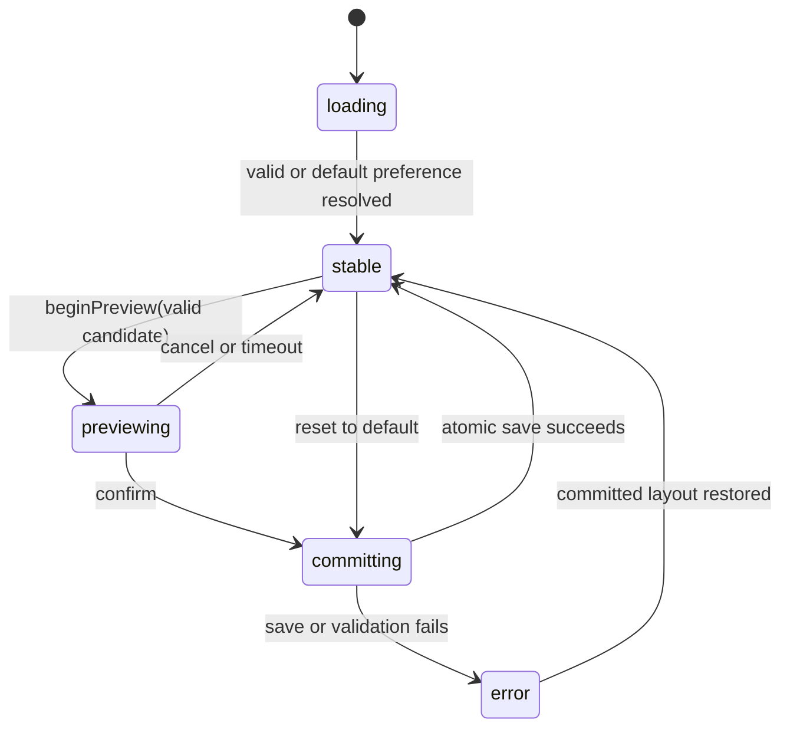

# Layout Management Foundation Architecture

## Plan family and dependency tree

`layout-management` owns the platform-neutral runtime. Renderer and integration work are separate children because they have different files, interaction constraints, and proof targets.

```text
Layout Management Foundation
├── Desktop Layout Profiles
└── Mobile Layout Profiles
```

- Foundation owns immutable contracts, semantic destinations, catalog validation, surface-aware resolution, the selection transaction, typed presentation preferences, bounded state/focus interfaces, host interfaces, fixture-based tests, and a final integration join after both renderer children finish.
- Desktop owns only `workbench/desktop` and `studio/desktop` bundles, their layout-neutral presentation ports, profile assets, tests, and goldens.
- Mobile owns only `workbench/mobile` and `studio/mobile` bundles, mobile presentation ports, lifecycle/restoration fixtures, profile assets, tests, and goldens.
- The foundation plan's integration join Node is the sole owner of the built-in composition root, app/controller wiring, Settings selection UI, old-shell removal, documentation convergence, aggregate verification, desktop rebuild/open, and independent Android verification.

Foundation core modules do not import a built-in profile. Desktop and mobile may prepare sibling profile bundles in parallel after the core host interface is proven. The parent integration join starts only after all four required surface bundles are proven. This removes the former semantic cycle in which foundation attempted to validate real bundles before child implementation.

## Runtime layers and files

### Pure presentation contracts

- `lib/src/contracts/presentation/layout_profile.dart` — validated `LayoutProfileId`, immutable `LayoutProfileDescriptor`, localized metadata keys, unique-default metadata, style identity, and safe validation codes.
- `lib/src/contracts/presentation/layout_environment.dart` — `LayoutRuntimeSurface` (`desktop`, `mobile`), `LayoutViewportClass` (`compact`, `medium`, `expanded`), the immutable surface viewport policy (`desktop = {medium, expanded}`, `mobile = {compact, medium}`), constraints, input capabilities, safe insets, text scale, and reduced-motion facts.
- `lib/src/contracts/presentation/layout_variant.dart` — immutable `LayoutVariantKey(profileId, surface, viewport)` and coverage manifest keyed by semantic destination.
- `lib/src/contracts/presentation/layout_state_namespace.dart` — validated profile/surface/destination-local presentation-state addresses that cannot carry arbitrary paths or business identifiers.
- `lib/src/contracts/presentation/layout_selection.dart` — immutable manager state, resolution values, operation status, and bounded user-safe error codes.
- `lib/src/contracts/presentation/presentation_preferences.dart` — the one current document containing `layoutProfileId`, `appearancePresetId`, and `localePreference`.
- `lib/src/contracts/presentation/semantic_destination.dart` — the canonical current destination identity and surface capability metadata. Existing `ClientSection` ownership moves here rather than being aliased or duplicated.

Contracts import no application, frontend, platform, or backend implementation.

### Application layer

- `lib/src/application/features/layout/layout_catalog.dart` owns immutable profile metadata and an immutable map of coverage manifests. Construction validates semantic IDs, exactly one default, the complete required `(profile, surface, viewport, destination)` product, and deterministic ordering. The class is implemented in foundation and instantiated with fixture manifests until the parent integration join supplies built-ins.
- `lib/src/application/features/layout/layout_resolver.dart` performs O(1) lookup by `LayoutVariantKey`. One cache entry holds only the active `(selection, environment class, catalog revision)` result.
- `lib/src/application/features/layout/layout_manager.dart` is the only selection state owner and exposes `initialize`, `beginPreview`, `confirmPreview`, `cancelPreview`, and `resetLayout`.
- `lib/src/application/features/layout/layout_state_store.dart` owns bounded presentation-only state keyed by `(profile, surface, destination, surfaceId)`. Keys are accepted only when declared by the immutable catalog.
- `lib/src/application/features/navigation/semantic_destination_catalog.dart` resolves aliases and surface visibility before rendering. It exposes commands through narrow interfaces and does not import profile widgets.

`ClientController` will compose the manager at integration, but profiles never receive or import `ClientController`.

### Platform layer

- `lib/src/platform/presentation/presentation_preferences_repository.dart` owns one serialized mutation tail and canonical JSON encoding. Each mutation loads the last committed typed value, applies one field update, writes a sibling temporary file with flush, and atomically renames it.
- `lib/src/platform/appearance/appearance_preset_catalog_service.dart` retains only appearance-preset discovery and validation. Preference persistence leaves the appearance service completely.

There is one current key, `layoutProfileId`. The retired `shellLayoutId` key is ignored and omitted by the next canonical write; no dual reader, compatibility wrapper, or parallel store remains.

### Frontend foundation

- `lib/src/frontend/layout/layout_surface_bundle.dart` is the only public interface a renderer child implements. A bundle contains its pure manifest, one surface identity, exact variant/destination builders, preview builder, visual tokens, styled component recipes, owned asset namespace, and restoration namespace.
- `lib/src/frontend/layout/layout_definition.dart` is the immutable aggregate produced by the parent integration join after combining the desktop and mobile bundles for one profile. Profiles do not construct or mutate this aggregate.
- `lib/src/frontend/layout/layout_registry.dart` validates immutable aggregate definitions against the pure catalog and exposes O(1) lookup. Foundation tests it only with local fixtures.
- `lib/src/frontend/layout/layout_host.dart` resolves one active definition/variant, installs layout scope and tokens, and builds only the active profile. Feature state and commands enter through typed layout-neutral ports.
- `lib/src/frontend/layout/layout_scope.dart` exposes the resolved profile/surface/viewport and scoped restoration namespace without global mutable state.
- `lib/src/frontend/layout/layout_visual_tokens.dart` is a `ThemeExtension` for typography scale, density, spacing, radius, elevation, navigation measurements, and motion. Appearance colors remain in `LicoThemeColors`.
- `lib/src/frontend/layout/layout_component_kit.dart` defines role contracts only. Every profile owns the styled implementations of navigation, panels, cards, fields, dialogs, and status surfaces.
- `lib/src/frontend/layout/layout_focus_coordinator.dart` captures a semantic focus target before replacement and restores the equivalent target or the destination's primary landmark.

### Renderer ownership

```text
frontend/layout/profiles/
├── workbench/
│   ├── desktop/   # desktop child only
│   └── mobile/    # mobile child only
└── studio/
    ├── desktop/   # desktop child only
    └── mobile/    # mobile child only
```

Each surface directory exports exactly one `LayoutSurfaceBundle`. Shells, destination adapters, styled components, tokens, previews, assets, restoration keys, tests, and goldens stay below that boundary. The two profile roots do not import each other. Surface bundles do not edit a central registry.

The parent integration join alone owns `lib/src/frontend/layout/built_in_layout_composition.dart`, which imports the four bundle entry points exactly once and projects them into:

1. one pure descriptor/coverage catalog;
2. one immutable widget registry;
3. ordered Settings metadata.

There is no second manual list. Composition fails before the shell is shown if descriptors, surfaces, variants, destinations, defaults, style identities, or registry keys disagree.

## Hard isolation contract

Profile code may import only:

- `contracts/presentation`;
- declared layout-neutral feature state/command ports;
- localization keys;
- frontend layout interfaces;
- explicitly style-free leaf primitives.

Profile code may not import:

- another profile directory;
- `ClientController` or a service locator;
- `frontend/shell` or retired shell code;
- backend or platform implementations;
- a shared styled widget/component implementation;
- another profile's assets, tokens, restoration IDs, tests, or goldens.

`verify-layout-boundaries.mjs` owns path manifests and import rules, checks that sibling Node owned paths do not overlap, and ensures only the integration composition file imports bundle entry points. A deterministic change-impact self-test modifies a fixture profile manifest and proves the sibling profile's source manifest and golden digest are unchanged. Runtime registries and profile state maps are immutable after startup; inactive profiles are neither mounted nor observable.

## Deliberate patterns

- **Registry + Factory** earns its cost because complete widget families need exact discovery without ID branches. Registration has one parent-integration-owned composition root; profile Nodes export bundles instead of mutating the registry.
- **Strategy** applies only to profile shells, destination composition, previews, styled component recipes, and surface variants. Business commands and domain models remain shared.
- **State machine / Command** governs preview and persistence because asynchronous notify-then-save can diverge from disk or allow stale completions.
- **Repository** owns presentation preferences because a serialized typed source of truth prevents competing read-modify-write snapshots.
- **ThemeExtension** owns non-color layout tokens because it composes with the existing appearance palette and supports bounded interpolation.
- Plain immutable records, maps, and explicit constructors remain pattern-free where a local value or function is sufficient. There is no service locator, remote plugin runtime, widget DSL, code generation layer, or layout-by-theme class matrix.

## Selection state machine



State carries `committedId`, optional `previewId`, `effectiveId`, status, current surface/viewport, one monotonic operation epoch, and a bounded safe error code. It carries no path, conversation, device, backend, credential, or secret data.

Preview is memory-only. Confirm persists before promotion. A newer epoch invalidates stale completion. Cancel, timeout, or failure restores the committed definition and semantic focus. Reset uses the same commit path. Rapid selection requests coalesce to one preview/commit operation.

## Surface-aware adaptive resolution

Profile identity, runtime surface, and responsive viewport are independent axes:

```text
selected profile: workbench
runtime surface: mobile
available constraints/input: medium + touch + keyboard inset
resolved variant key: (workbench, mobile, medium)
persisted value: workbench
```

`desktop/medium` and `mobile/medium` are different keys. `LayoutBuilder` supplies local constraints; `MediaQuery.sizeOf` is used only for app-window size. Device marketing names and orientation do not select a profile. Resize, rotation, folding, and input changes recalculate a variant but never write preferences.

Viewport classification is surface-bounded: desktop widths resolve to `medium` below the expanded breakpoint and `expanded` above it; mobile widths resolve to `compact` below the medium breakpoint and `medium` above it. The bundle still responds continuously to its local constraints inside that class. This deliberately avoids unsupported keys, width-driven surface changes, and any cross-surface fallback.

## Appearance composition

`AppearancePresetConfig` resolves palette and brightness. The active surface bundle resolves non-color tokens and styled component recipes. The parent integration join composes them once:

```text
appearance palette + layout tokens + accessibility/input facts
    -> ThemeData / LayoutScope
    -> active profile surface bundle
```

Changing a layout preserves the appearance preset. A profile cannot define another palette authority. Built-in profile tokens must work with every valid appearance palette.

## State continuity and memory policy

- Domain, permission, selected destination, selected conversation, draft, and active operation state live above `LayoutHost` in application/frontend feature ports.
- Scroll, pane, tab, expansion, and other presentation state use validated profile/surface/destination restoration namespaces.
- Semantic focus is captured and restored; widget instances are not retained as the state model.
- Only the active profile is built. No all-profile `IndexedStack`, whole-tree `GlobalKey`, or inactive profile listener is allowed.
- The state map is bounded by catalog-declared namespaces and drops removed definitions before release.

## Algorithms, complexity, and concurrency

- Catalog validation: `O(P × S × V × D)` once per immutable catalog revision.
- Profile, variant, destination, and registry lookup: O(1) immutable maps.
- Active resolution cache: one bounded tuple, invalidated only by selection, surface/viewport, accessibility/input facts, or catalog revision.
- Preference updates: one serialized mutation tail and atomic replacement; no stale concurrent snapshots.
- Rendering: one active bundle, const/style-free leaf reuse, profile-scoped rebuilds below `LayoutHost`, and no catalog scan in `build`.
- Transition memory: at most the active tree and one bounded outgoing tree during allowed animation; reduced-motion replaces directly.

## Privacy and product boundary

Descriptors and previews contain public presentation metadata only. Evidence never records local paths, conversations, device identity, accounts, secrets, ciphertext, or backend runtime data. Layout selection cannot alter authorization, capability readiness, relay behavior, native command execution, packaging, release, or store status.

## Complete migration owner

The parent integration join removes, in one convergence:

- `contracts/appearance/shell_layout.dart` and `ShellLayoutIds`;
- `ClientController.shellLayoutId` and `setShellLayout`;
- `loadShellLayoutId` / `saveShellLayoutId` and the retired JSON key;
- direct profile checks in shell and feature widgets;
- `_mobileShell`, fixed bottom navigation, and old desktop shell builders;
- numbered labels, old-path tests, contradictory documentation, and source-string verifier assumptions;
- unregistered chrome retained only for retired behavior.

`workbench` and `studio` are the only current profile identities. They replace old paths rather than wrapping or aliasing them.
