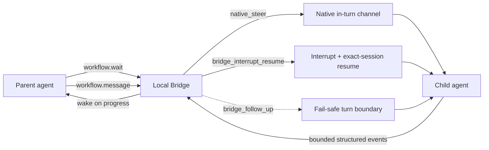

# LicoUp Local Bridge

English (normative) · [简体中文](local-bridge.zh-CN.md) · [Architecture](../architecture/README.md)

Authority: `packages/contracts/client/lico-up-orchestrator-ipc.schema.json`,
`crates/licoup-native/src/platform/orchestrator_ipc/`, and
`crates/licoup-native/src/domain/agent_orchestration/`. Update this
projection when those contracts or their verification change.

LicoUp Local Bridge is the process-local Level 2 control plane for child
agent conversations. It is embedded in the persistent orchestrator owner; it
does not add another daemon. Native agent mechanisms remain authoritative.
The bridge supplies wakeable progress and ordered message admission where a
native protocol does not provide the complete contract.

## Implemented contract

- `workflow.wait` is a bounded long-poll. It returns the workflow identity,
  monotonic cursor, child/step identity, lifecycle state, delivery mode, and
  output byte progress without retaining child text.
- `workflow.message` is idempotent and accepted only while a child dispatch is
  active. The desktop stages message text in the owner-private artifact store;
  IPC and MCP use only an opaque handle plus digest.
- A native in-turn channel is always preferred. Codex App Server `turn/steer`,
  Claude Code streaming input, and Pi RPC `steer` are acknowledged by the
  native protocol before `native_steer` is reported.
- The other eight agents use `bridge_interrupt_resume`. Local Service adapters
  call the native session abort endpoint; ACP adapters send `session/cancel`;
  supervised CLI adapters use their owned active-turn handle. The bridge then
  resumes the exact native session with the admitted message.
- `bridge_follow_up` is the fail-safe when a message arrives before a native
  session binding exists or an interrupt is rejected. It preserves the message
  for the same session's next safe boundary and never claims current-turn
  delivery.

## Bounded concurrency

| Boundary | Implemented bound |
| --- | --- |
| Workflow dispatch | 32 concurrent workflows; one ordered single-flight runner per workflow with coalesced reruns |
| Blocking work | 32 bounded blocking workers on a 2–8 thread Tokio runtime |
| IPC | 32 connections, 16 handler lanes; waits do not own mutation lanes |
| Desktop stdio | 8 lazy command lanes and 8 separate lazy wait lanes |
| Codex MCP | 8 workers and 32 queued tool calls |
| Per workflow | 16 pending messages and 128 retained metadata events |
| Wait | 30 seconds maximum per call |

Different workflows can progress concurrently. Operations for the same
workflow remain ordered. A concurrent wake-up is coalesced and replayed instead
of being lost when a single-flight runner is about to become idle.

## Privacy and failure behavior

The live bridge stores no prompt, response, reasoning, tool arguments, path, or
provider payload. It retains only bounded workflow/step/agent identifiers,
monotonic cursors, state, delivery mode, and output byte counts. Artifact bytes
stay in the owner-private local store and are verified by digest before use.
Queue saturation, missing continuity, invalid artifacts, and unavailable native
control all produce explicit fail-closed receipts. A rejected native control
request retains one digest-bound bridge reservation; it is never copied into a
second queue entry.

The per-agent mechanisms are projected from the native driver inventory in
[Compatibility](../COMPATIBILITY.md#agent-adapter-targets).
