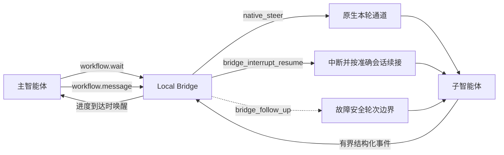

# Lico Arc Local Bridge

[English（规范版本）](local-bridge.md) · 简体中文（本地化） · [架构](../architecture/README.zh-CN.md)

权威来源：`packages/contracts/client/lico-arc-orchestrator-ipc.schema.json`、
`crates/lico-client-native/src/platform/orchestrator_ipc/` 和
`crates/lico-client-native/src/domain/agent_orchestration/`。这些契约或验证发生变化时，
应同步更新本投影。

Lico Arc Local Bridge 是子智能体对话的进程内 Level 2 控制面。它嵌入持久编排
服务的唯一所有者进程，不会再增加一个守护进程。智能体原生机制始终优先；当原生
协议不能提供完整契约时，Local Bridge 补齐可唤醒进度和有序消息接入。

## 已实现契约

- `workflow.wait` 是有界长轮询。返回工作流标识、单调游标、子智能体/步骤标识、
  生命周期状态、投递方式和输出字节进度，但不保存子智能体正文。
- `workflow.message` 具备幂等性，只在子任务正在执行时接收。桌面端先把消息正文
  写入仅所有者可读的私有制品库；IPC 与 MCP 只传递不透明句柄和摘要。
- 始终优先使用原生本轮通道。Codex App Server `turn/steer`、Claude Code
  streaming input 和 Pi RPC `steer` 都必须收到原生协议回执，之后才报告
  `native_steer`。
- 其余 8 个智能体使用 `bridge_interrupt_resume`。Local Service 适配器调用原生
  会话 abort，ACP 适配器发送 `session/cancel`，受监管 CLI 使用自己持有的活动轮
  句柄；之后 Bridge 把已接收消息送入同一个原生会话继续执行。
- 当消息早于原生会话绑定到达，或中断被拒绝时，才使用故障安全的
  `bridge_follow_up`。它在同一会话的下一个安全边界送达，且不会声明本轮生效。

## 有界并发

| 边界 | 已实现上限 |
| --- | --- |
| 工作流分派 | 最多 32 个工作流并发；每个工作流只有一个有序单飞执行器，并合并重跑请求 |
| 阻塞任务 | 2–8 个 Tokio 线程，最多 32 个有界阻塞任务 |
| IPC | 32 个连接、16 条处理通道；等待不占用变更通道 |
| 桌面 stdio | 8 条懒加载命令通道和 8 条独立懒加载等待通道 |
| Codex MCP | 8 个工作线程、32 个排队工具调用 |
| 单个工作流 | 16 条待处理消息、128 条元数据事件 |
| 单次等待 | 最长 30 秒 |

不同工作流可以并发推进，同一工作流内保持有序。当单飞执行器即将空闲时收到并发
唤醒，唤醒会被合并并再次执行，不会丢失。

## 隐私与失败语义

Local Bridge 不保存提示词、回复正文、推理、工具参数、路径或供应商原始载荷；只
保留有界的工作流/步骤/智能体标识、单调游标、状态、投递方式和输出字节数。制品
正文留在仅所有者可读的本机私有存储中，使用前按摘要校验。队列满、会话接续缺失、
制品无效或原生控制不可用都会返回明确的关闭式错误。原生控制被拒绝时，只保留一条
按摘要绑定的 Bridge 预留消息，不会复制到第二条队列记录。

逐智能体机制由原生驱动清单投影到[兼容性文档](../COMPATIBILITY.zh-CN.md#智能体适配目标)。
