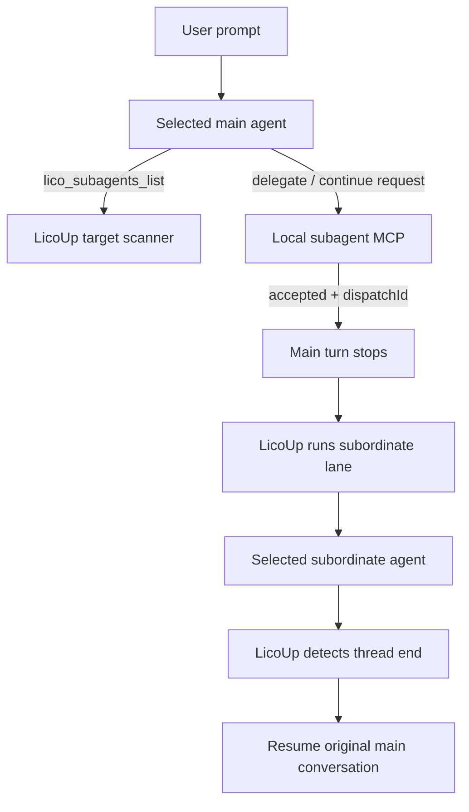

# LicoUp Subagent MCP

English (normative) · [简体中文](subagent-mcp.zh-CN.md) · [Architecture](../architecture/README.md)

Authority: `crates/licoup-native/src/bin/lico-subagent-mcp.rs`, the native target
scanner, and the shared conversation lane. Update this projection when those
implementations or their verification change.

LicoUp provides subordinate agents to one main agent. With the Codex plugin
installed, the main agent owns planning and follows the saved Adaptive Flywheel
role assignments. Code engineering uses one shared Designer and two explicit
lanes: Backend Worker to Backend Reviewer, and Frontend Worker to Frontend
Reviewer. If the plugin is missing or unavailable, the local fallback scheduler
retains the same Designer and Worker-to-Reviewer execution topology. Both paths
use only local conversation file locations as cross-agent continuation handles.

The Adaptive Flywheel has one persistence authority:
`adaptive-flywheel.toml` in private client state. The desktop editor and MCP
read the same TOML document. Its model selections are validated against the
current target scan. Codex is sourced from App Server `model/list`; Cursor and
Pi use their native model-list commands; other adapters use their verified
local configuration, provider cache, or dedicated native scanner. Historical
observations may enrich a catalog only when explicitly enabled and do not
replace a successful native response.

## Implemented contract

Steel rule: the main agent does not probe subordinates and subordinates do not
report directly to the main agent. The main agent only requests work from
LicoUp. After LicoUp acknowledges the request, the main turn stops. LicoUp runs
the subordinate, detects completion, projects peer speech into the Lico group
mirror when applicable, and resumes the original main conversation.

- `lico_subagents_list` returns scanned targets that currently expose
  `runtime.message.send`. A main-agent framework may appear with
  `sameFramework: true`; selecting it creates a distinct subordinate
  conversation and never resumes the suspended main conversation. The MCP
  excludes the non-conversation editor target. Its bounded
  `codeEngineeringStrategy` projection reports the saved shared Designer and
  separate frontend/backend Worker and Reviewer assignments without exposing
  executable paths or the raw TOML document. The list is a catalog for choosing
  whom to request; readiness remains LicoUp-owned.
- `lico_subagent_probe` is a LicoUp-owned disposable readiness check. Main
  agents must not use it to drive subordinates. Ordinary probes intersect the
  scanned target's model catalog with LicoUp's embedded measured price table
  and choose the cheapest available route. `exactModel` and
  `exactReasoningEffort` are reserved for acceptance of that exact route.
  Persistent history created by the probe is moved to the operating-system
  Trash. Claude Code's non-persistent path instead requires a fresh scan
  proving no history was created. Cursor and Antigravity use exact native
  session cleanup that moves their per-session storage leaves to Trash. A
  fresh scan must prove disappearance before the probe can pass. Transport,
  response, cleanup, and cleanup-verification failures all fail closed. The
  receipt is redacted and never exposes a disposable conversation path.
- `lico_subagent_delegate` accepts a LicoUp-owned handoff and returns
  immediately with `accepted: true`, `dispatchId`, `sessionMode`, and
  `state: accepted`. It does not wait for the subordinate turn and does not
  copy subordinate output. The main agent chooses `sessionMode`:
  - `new` (default): start a fresh subordinate session; `conversationPath` must
    be omitted.
  - `resume`: continue an exact prior subordinate conversation; requires
    `conversationPath`.
  LicoUp runs the subordinate in the background, records handoff state under
  client-state, optionally projects peer bubbles in the Lico group room, then
  resumes the original main conversation (via `mainConversationPath` or the
  latest resolvable main session). Delegation and continuation require one
  lifecycle `role`: `designer`, `worker`, or `reviewer`. Worker and Reviewer
  calls may identify the `backend` or `frontend` lane; a matching saved
  assignment is selected first. Before transport, LicoUp injects the same
  probe-and-cleanup acceptance contract into every Reviewer prompt, regardless
  of the target framework or whether that framework has a LicoUp skill
  installed.
- Delegation and continuation accept an explicit `timeoutMs` from 1 second to
  30 minutes. The process deadline remains mandatory and bounded.
- Native approval settings are explicit per call. `allowAll` and the closed
  `permissionMode` allowlist may be used only for user-authorized work with an
  exact canonical working directory; they approve agent tools but do not add
  an operating-system sandbox. For ACP agents, an explicit `allowAll: true`
  may select only a request-provided one-shot allow option; persistent grants,
  missing allow options, and implicit authorization still fail closed.
- High-volume native tool traces can use explicit stdout/stderr event budgets,
  capped at 64 MiB and 4 MiB. These bytes remain inside the native transport;
  the MCP still returns only a conversation handoff. Recoverable timeout and
  event-budget errors may include that path so the exact partial conversation
  can be continued.
- A new delegation may provide at most eight pre-reviewed same-band fallback
  candidates. LicoUp tries them only after quota, credit, rate-limit, or
  provider-capacity errors and keeps at most 64 bounded cooldown records.
  Continuations and every non-capacity failure fail closed without fallback.
- `lico_subagent_continue` is the resume-mode alias: it requires
  `conversationPath` and always uses `sessionMode=resume` (optional explicit
  `sessionMode` must be `resume`). Like delegate, it returns immediately with
  `accepted` + `dispatchId`; LicoUp owns execution and later resumes the main
  conversation. A caller may omit `workingDirectory`; an explicit value must
  resolve to the same directory or the continuation fails closed.
- `lico_subagent_cancel` requests cancellation through the selected adapter's
  native control surface.
- The MCP may infer the main agent from the MCP client name. A packaged launch
  may set `LICOUP_MAIN_AGENT_ID` when an explicit binding is required.

## Bounded concurrency

| Boundary | Implemented bound |
| --- | --- |
| MCP input frame | 64 KiB |
| Delegation prompt | 48 KiB |
| Conversation file location | 4 KiB |
| Subordinate turn | 1 second to 30 minutes |
| Native stdout event budget | 64 KiB to 64 MiB |
| Native stderr event budget | 16 KiB to 4 MiB |
| MCP execution | 8 workers |
| Pending tool calls | 32 |
| Fallback candidates | 8 |
| Quota cooldown records | 64 |

Independent tool calls may run concurrently. The main agent keeps follow-ups
for one native conversation ordered.

## Privacy and failure behavior

Prompts and subordinate output remain inside the local MCP conversation and
native agent transport. Delegation results expose only the local conversation
file location needed for later scheduling; disposable probe results expose only
their selected price-backed route and verified cleanup state. The list
projection omits executable paths, account data, target diagnostics, and raw
configuration. It exposes only the agent identifier, display label, reviewed
conversation capabilities, bounded model options, and the configured
code-engineering role mapping. Queue saturation, unavailable targets, invalid
continuations, and native transport failures return typed bounded errors.

The per-agent mechanisms are projected from the native driver inventory in
[Compatibility](../COMPATIBILITY.md#agent-adapter-targets).
