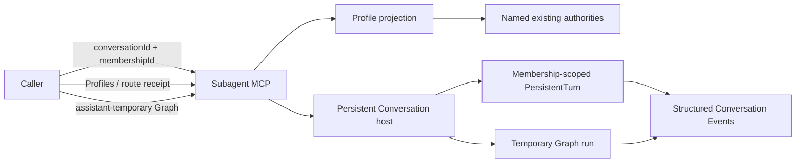

# LicoUp Subagent MCP

English (normative) · [简体中文](subagent-mcp.zh-CN.md) · [Architecture](../architecture/README.md)

Authority: `crates/licoup-native/src/bin/lico-subagent-mcp.rs`,
`domain/client_conversation` (Assistant designation and Membership Profiles),
`domain/adaptive_flywheel` (Assistant-temporary Graph admission and
execution), the persistent stdio-RPC Conversation host, the native target
scanner, and their verification. This document is a public projection of those
implementations.

LicoUp exposes runnable local Agents without defining a team topology. A direct
caller selects an exact active Agent Membership in a canonical Conversation. A
designated Assistant may additionally author one bounded temporary Graph whose
nodes are exact active Agent Memberships. Named roles, candidate order, and
Adaptive Flywheel strategy data are not MCP enums, fixed
predefined collaboration-role lanes, or a global preset.

## Implemented contract

| Tool | Purpose |
| --- | --- |
| `lico_assistant_profiles` | Rank active Agent Membership Profiles and return their privacy-safe route receipt |
| `lico_assistant_workflow_execute` | Compile, preflight, durably admit, and execute one `assistant-temporary` workflow under exact bindings and an idempotency key |
| `lico_assistant_workflow_inspect` | Read the projected state of one temporary workflow run |
| `lico_assistant_workflow_cancel` | Request cancellation of one temporary workflow run |
| `lico_subagents_list` | List scanned runnable local Agent integrations; it does not assign collaboration roles |
| `lico_subagent_probe` | Observe one admitted Agent's readiness read-only from target facts and the Conversation host's active-turn snapshot; `busy` is a successful state |
| `lico_subagent_delegate` | Start one direct dispatch for an exact active `conversationId + membershipId` |
| `lico_subagent_continue` | Resume the latest resumable dispatch for that same Conversation Membership |
| `lico_subagent_cancel` | Request cancellation through the selected adapter's native control surface |

All schemas are closed. A caller can read Profiles, execute one internally
preflighted assistant-temporary Graph, or delegate directly to an exact Membership. It
cannot create roles, replace Conversation/Profile/Graph authority, choose routes,
or bind native sessions itself; native runtime locations remain private
Conversation state. Assistant operations require the MCP-bound manager Agent
to be the exact active designated Assistant Membership. Direct delegate,
continue, and cancel operations require that manager to be an active Agent
Membership of the same Conversation. Inspect and cancel recheck the stored
run Conversation and Assistant Membership before returning data or requesting
an effect.

## Assistant Profile projection

Every active Agent Membership may carry a revisioned Profile intent
(`conversation.profile.update`). The MCP reads the projection through the
process-owned Conversation service (`conversation.profile.candidates`). Price, coding score, Skills,
environment, capabilities, readiness, and model facts come only from the named
existing authorities (`targets`, `providerModelPricing`,
`agentIntelligenceCatalog`, `skillHub`, and the bundled
`assistant-workflow-authoring` Skill). Each authority is read at most once per
request/revision, unknown optional facts remain visibly unknown, and candidate
order is the one deterministic tuple: explicit pin, preference misses,
verified reliability, coding score descending, known expected price ascending,
observed latency, then Membership id. The projection never carries a prompt, credential, absolute
path, machine identity, or runtime endpoint.

## Temporary Graph admission

A designated Assistant may author one bounded `assistant-temporary` workflow
with exact `conversationId` plus `membershipId` bindings chosen from eligible
Profile snapshots. `lico_assistant_workflow_execute` performs the internal
preflight and returns every locally discoverable failure (structure, quota,
Membership, model, Skill, environment, capability, readiness, Authority)
before durable admission or any Agent/script effect, with a stable code and the
complete check list. It then revalidates store-owned Membership and Profile
revisions immediately before durable admission, freezes the route receipt,
admits the run under an idempotency key, and starts each
ready actor as a Membership-scoped PersistentTurn through the persistent
Conversation host. Replaying an existing key returns the existing run without
duplicate effects. The facade deliberately exposes no separate public
preflight or start lane. `lico_assistant_workflow_inspect` and
`lico_assistant_workflow_cancel` address the run by its projected identifier.

The persistent host remains the sole run and turn owner; the MCP process never
creates a parallel turn registry or terminal writer. Runtime failures return a
typed terminal result with a stable `code`, `stage`, non-retryable projection,
and privacy-safe `recoveryClass` to the same Assistant turn. The failed Graph is
immutable and never implicitly retried; the Assistant may then work directly or
author a later Graph that completes. Graphs cannot invent timeout-based
failure, hidden participants, silent fallback, or private run data.

## Direct Membership operations

Delegate and continue address exact active Agent Memberships. They return
immediately with a bounded receipt and dispatch identifier while native
execution continues in the background. They accept a prompt and optional
runtime preferences such as model, reasoning effort, working directory,
timeout, explicit stream budgets, and user-authorized permission settings. They
do not create roles or a second scheduler.

The MCP verifies that the Membership is active, belongs to the Conversation,
represents an Agent, and matches the requested runnable integration. Native
session identifiers and continuation locations are resolved internally from
the Membership binding; callers cannot choose or retrieve them.

`lico_subagent_probe` is a read-only readiness observation rather than an
Agent-driving primitive. Its `agentId` is the exact identifier returned by
`lico_subagents_list`; aliases are rejected. It sends no Agent input, starts no
third-party Agent binary, and creates or mutates no Conversation: one bounded
request reads the private Conversation host's active-turn snapshot filtered by
the admitted Agent. Target inspection opens no model or history store and
refreshes no persisted discovery state; host observation connects only to an
endpoint the running host already published. Its receipt
(`licoup.subagent.readiness.v1`)
reports `agentId`, `state`, `integrationStatus`, `conversationDriver`,
`conversationReadiness`, `blockerCode`, `hostTransport`, and
`hostActiveTurns` — no path, session identifier, turn handle, process
identifier, port, model, or price. `state` is `ready` when the integration is
runnable, the host is reachable, and the host holds no non-terminal turn for
that Agent, and `busy` when it holds at least one; both are successful
observations, never failures. The snapshot covers only LicoUp-owned turns, so
`ready` means admitted, reachable, and idle inside LicoUp — it makes no claim
about the Agent's own external activity.

## Bounded execution

| Boundary | Implemented bound |
| --- | --- |
| MCP input frame | 64 KiB |
| Prompt | 48 KiB |
| Identifier | 256 bytes |
| Working-directory value | 4 KiB |
| Non-zero subordinate timeout | 1 second to 30 minutes; `0` opts out |
| Explicit native stdout budget | 64 KiB to 64 MiB |
| Explicit native stderr budget | 16 KiB to 4 MiB |
| MCP execution | 8 workers |
| Pending tool calls | 32 |
| Quota cooldown records | 64 |

Independent tool calls may run concurrently. Atomic Conversation dispatch
claims prevent two workers from executing the same accepted turn.

## Privacy and failure behavior

Prompts, Agent output, native session identifiers, continuation locations, and
working-directory bindings remain local. Public receipts contain only safe
operation identifiers, lifecycle state, stage, component, retryability,
recovery action, and numeric usage facts; they contain no native path or
message body. The list projection omits executable paths, account data, target
diagnostics, raw configuration, and Conversation role assignments.

Queue saturation, unavailable targets, invalid Memberships, invalid
continuations, cancellation uncertainty, preflight rejection, and native
transport failures return typed bounded errors. A preflight rejection keeps
its stable code (`graph_invalid`, `graph_identity_rejected`,
`graph_membership_rejected`, `graph_binding_incomplete`, `graph_model_rejected`,
`graph_readiness_rejected`, `graph_environment_unavailable`,
`graph_preflight_rejected`) so the Assistant can correct one request instead of
guessing. An uncertain native effect remains pending reconciliation and is
never reported as completed. Branches that already settled keep their recorded
outcome; no new branch effect is issued after the Assistant failure settles the
Graph.

Per-Agent mechanisms are projected from the native driver inventory in
[Compatibility](../COMPATIBILITY.md#agent-adapter-targets).
