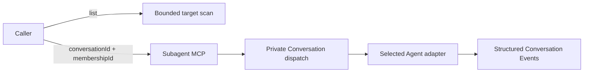

# LicoUp Subagent MCP

English (normative) · [简体中文](subagent-mcp.zh-CN.md) · [Architecture](../architecture/README.md)

Authority: `crates/licoup-native/src/bin/lico-subagent-mcp.rs`, the native
target scanner, and the canonical Conversation domain. Update this projection
when those implementations or their verification change.

LicoUp exposes runnable local Agents without defining a team topology. A caller
selects an exact active Agent Membership in a canonical Conversation. Named
collaboration roles, ordered candidate pools, and Adaptive Flywheel stages are
Conversation data; they are not MCP enums, fixed Designer/Worker/Reviewer
lanes, or a global preset.

## Implemented contract

| Tool | Purpose |
| --- | --- |
| `lico_subagents_list` | List scanned runnable local Agent integrations; it does not assign collaboration roles |
| `lico_subagent_probe` | Run a LicoUp-owned disposable readiness check and verify cleanup before success |
| `lico_subagent_delegate` | Start one new dispatch for an exact active `conversationId + membershipId` |
| `lico_subagent_continue` | Resume the latest resumable dispatch for that same Conversation Membership |
| `lico_subagent_cancel` | Request cancellation through the selected adapter's native control surface |

Delegate and continue return immediately with a bounded receipt and dispatch
identifier while native execution continues in the background. They accept a
prompt and optional runtime preferences such as model, reasoning effort,
working directory, timeout, explicit stream budgets, and user-authorized
permission settings. They do not accept lifecycle roles, frontend/backend
lanes, fallback candidate lists, session modes, native session identifiers, or
conversation paths.

The MCP verifies that the Membership is active, belongs to the Conversation,
represents an Agent, and matches the requested runnable integration. New and
continued executions are recorded as private Conversation dispatch state.
Native session identifiers and continuation locations are resolved internally
from the binding; callers cannot choose or retrieve them.

`lico_subagent_probe` is an infrastructure readiness check rather than an
Agent-driving primitive. It selects a price-backed available route by default,
or validates an explicitly requested route. Any persistent probe history is
moved to the operating-system Trash and a fresh scan must prove disappearance
before the probe can succeed.

## Adaptive Flywheel execution

Flywheel orchestration uses the generated Conversation service, not a special
MCP role contract. A run freezes its ordered stages, roles, candidates, and
runtime preferences. The execution boundary reads the run view, atomically
claims one eligible Agent turn, calls the Membership through this MCP/native
dispatch lane, appends structured Events, and transitions the turn. Selection
supports single, round-robin, all, and bounded-parallel modes with at most eight
active Agent turns.

## Bounded concurrency

| Boundary | Implemented bound |
| --- | --- |
| MCP input frame | 64 KiB |
| Delegation prompt | 48 KiB |
| Working-directory value | 4 KiB |
| Non-zero subordinate timeout | 1 second to 30 minutes; `0` opts out |
| Explicit native stdout budget | 64 KiB to 64 MiB |
| Explicit native stderr budget | 16 KiB to 4 MiB |
| MCP execution | 8 workers |
| Pending tool calls | 32 |
| Quota cooldown records | 64 |

Independent tool calls may run concurrently. The Conversation store uses an
atomic claim to prevent two workers from executing the same Flywheel turn.

## Privacy and failure behavior

Prompts, Agent output, native session identifiers, continuation locations, and
working-directory bindings remain local. Public receipts contain no native
path or Agent output. The list projection omits executable paths, account data,
target diagnostics, raw configuration, and Conversation role assignments.
Queue saturation, unavailable targets, invalid Memberships, invalid
continuations, cancellation uncertainty, and native transport failures return
typed bounded errors.

Per-Agent mechanisms are projected from the native driver inventory in
[Compatibility](../COMPATIBILITY.md#agent-adapter-targets).
