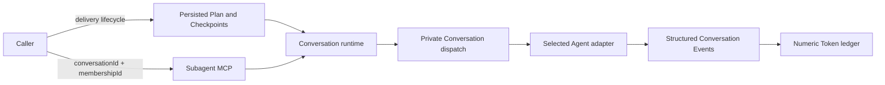

# LicoUp Subagent MCP

English (normative) · [简体中文](subagent-mcp.zh-CN.md) · [Architecture](../architecture/README.md)

Authority: `crates/licoup-native/src/bin/lico-subagent-mcp.rs`,
`domain/client_conversation`, `domain/delivery_plan`,
`domain/delivery_scheduler.rs`, `domain/delivery_state.rs`,
`domain/agent_usage/workflow_ledger.rs`, `platform/conversation_runtime`, the
native target scanner, and their verification. This document is a public
projection of those implementations.

LicoUp exposes runnable local Agents without defining a team topology. A direct
caller selects an exact active Agent Membership in a canonical Conversation. A
delivery caller operates on a persisted Plan; it does not submit a second task
graph or choose native sessions. Named roles, candidate order, and Adaptive
Flywheel strategy data are not MCP enums, fixed Designer/Worker/Reviewer lanes,
or a global preset.

## Implemented contract

| Tool | Purpose |
| --- | --- |
| `lico_delivery_start` | Start or reopen one persisted Delivery Plan |
| `lico_delivery_authorize` | Authorize the current Plan digest |
| `lico_delivery_status` | Read persisted Plan state and its next action |
| `lico_delivery_cancel` | Explicitly cancel the delivery and forward cancellation to active Conversation dispatches |
| `lico_subagents_list` | List scanned runnable local Agent integrations; it does not assign collaboration roles |
| `lico_subagent_probe` | Run a LicoUp-owned disposable readiness check and verify cleanup before success |
| `lico_subagent_delegate` | Start one non-delivery dispatch for an exact active `conversationId + membershipId` |
| `lico_subagent_continue` | Resume the latest resumable dispatch for that same Conversation Membership |
| `lico_subagent_cancel` | Request cancellation through the selected adapter's native control surface |

All schemas are closed. A caller can start, authorize, inspect, or explicitly
cancel delivery. It cannot submit Tasks or an eligible frontier, choose routes,
bind native sessions, accept a Reviewer, or replace Plan and Checkpoint state.

## Delivery Plan execution

The persisted Plan and Checkpoints are the sole delivery-lifecycle authority.
The Plan engine computes the complete eligible frontier. The Conversation
runtime claims it in stable order, uses bounded native lanes, and dispatches
each Agent through its exact Conversation Membership. Independent deliveries
may run concurrently; one delivery, Task attempt, and native session remain
ordered. Waiting for a terminal event never occupies a message-delivery lane.

Adaptive Flywheel is the sole Agent, model, and reasoning-effort route selector.
LicoUp freezes that route decision in the dispatch receipt before sending the
Plan brief. Plugin readiness is adapter preparation only; it cannot change Plan
eligibility, delivery ownership, or route selection.

Each accepted dispatch records its intent, Conversation binding, and Token
baseline before native send. Only a definite terminal Conversation Event settles
numeric usage and advances a Checkpoint; silence and elapsed time remain
pending. Terminal settlement and callbacks are idempotent. Restart recovery
reconciles the exact pending Conversation dispatch instead of creating another
one.

The Token ledger retains numeric prompt, cached-input, completion, total,
exact-or-estimated counts, coverage, and Plan/Task/dispatch hierarchy. It does
not retain prompts, replies, tool payloads, summaries, compaction, cache
controls, or a parallel context model. Public projections are path-free and
bounded to active deliveries plus the newest twenty terminal rollups.

## Direct one-off operations

Delegate and continue are for non-delivery turns. They return immediately with
a bounded receipt and dispatch identifier while native execution continues in
the background. They accept a prompt and optional runtime preferences such as
model, reasoning effort, working directory, timeout, explicit stream budgets,
and user-authorized permission settings. They do not create Plan roles or
Checkpoints and do not form a second delivery scheduler.

The MCP verifies that the Membership is active, belongs to the Conversation,
represents an Agent, and matches the requested runnable integration. Native
session identifiers and continuation locations are resolved internally from
the Membership binding; callers cannot choose or retrieve them.

`lico_subagent_probe` is an infrastructure readiness check rather than an
Agent-driving primitive. It selects a price-backed available route by default,
or validates an explicitly requested route. Any persistent probe history is
moved to the operating-system Trash and a fresh scan must prove disappearance
before the probe can succeed.

## Bounded execution

| Boundary | Implemented bound |
| --- | --- |
| MCP input frame | 64 KiB |
| Plan brief or one-off prompt | 48 KiB |
| Native continuation location | 4 KiB |
| Working-directory value | 4 KiB |
| Non-zero subordinate timeout | 1 second to 30 minutes; `0` opts out |
| Explicit native stdout budget | 64 KiB to 64 MiB |
| Explicit native stderr budget | 16 KiB to 4 MiB |
| MCP execution | 8 workers |
| Pending tool calls | 32 |
| Quota cooldown records | 64 |

Independent tool calls may run concurrently. Atomic Conversation dispatch
claims prevent two workers from executing the same accepted turn.

## Privacy and failure behavior

Prompts, Agent output, native session identifiers, continuation locations, Plan
storage locations, and working-directory bindings remain local. Public receipts
contain only safe operation identifiers, lifecycle state, stage, component,
retryability, recovery action, and numeric usage facts; they contain no native
path or message body. The list projection omits executable paths, account data,
target diagnostics, raw configuration, and Conversation role assignments.

Queue saturation, unavailable targets, invalid Memberships, invalid
continuations, cancellation uncertainty, Conversation admission failures, and
native transport failures return typed bounded errors. An uncertain native
effect remains pending reconciliation and is never reported as completed.
One terminal branch failure does not cancel unrelated eligible branches.

Per-Agent mechanisms are projected from the native driver inventory in
[Compatibility](../COMPATIBILITY.md#agent-adapter-targets).
