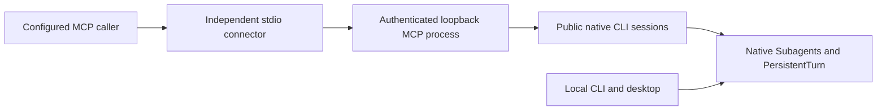

# LicoUp Subagent MCP

| Reference | Document |
| --- | --- |
| Localization | [简体中文](subagent-mcp.zh-CN.md) |
| Native façade | [Native CLI](../architecture/NATIVE-CLI.md) |
| Provider execution and registration | [Agent adapters](../architecture/AGENT-ADAPTERS-ARCHITECTURE.md) |
| Public schema | [Subagent MCP schema](../../schemas/subagent_mcp/subagent_mcp.schema.json) |

## Module boundary

`crates/licoup-mcp` owns the optional public MCP service and stdio connector.
It is independently buildable using published Rust dependencies; it has no
native, Flutter, domain-crate, or source-path dependency. Its only connection
to LicoUp is the public `licoup.stdio.v1` process contract of the installed
native CLI. The outbound MCP client adapter remains a separate native capability.

The native `domain/subagents` application owns caller Membership checks,
provider execution admission, durable dispatch claims, continuation, cancellation,
and receipts. Canonical Conversation and PersistentTurn retain their existing
stores, scheduler, history, runtime bindings, and protected-effect authority.
The MCP module owns no second copy of those authorities.



## Remote interface

The server is `lico-up-subagents` version `0.14.0`. It negotiates revision
`2025-06-18` or `2025-11-25`. Its complete ordered tool allowlist is:

| Tool | Operation |
| --- | --- |
| `lico_subagents_list` | Read admitted target inventory |
| `lico_subagent_probe` | Read one target's readiness and capability projection |
| `lico_subagent_delegate` | Admit a new Membership-scoped turn |
| `lico_subagent_continue` | Continue through the private native runtime binding |
| `lico_subagent_cancel` | Request cancellation of the exact active claim |

Tool schemas come from `licoup subagents catalog`; the independent adapter
selects exactly these five names and rejects every other operation. All input
schemas are closed. The connector declares its provider with `--caller` or
`LICOUP_MCP_CALLER_PROVIDER`. The native adapter registry supplies the admitted
caller set; neither the MCP process nor its connector maintains a provider list.

Assistant Profiles, Assistant workflows, full Conversation operations, and all
other native capabilities remain available through the [local CLI](../architecture/NATIVE-CLI.md).
They are not remotely exposed by this MCP service. The bundled `licoup-guide`
routes callers to the appropriate interface.

## Independent lifecycle and development

The packaged executable is `lico-subagent-mcp`. The local native façade manages
it with `licoup mcp start`, `stop`, `status`, and `reload`. `start` and `reload`
accept `--binary` to select a separately built module executable. They ensure
the native host is available without requiring Flutter. Normal desktop host
startup also starts the optional module; failure degrades MCP availability and
does not stop the native host.

For independent module development:

```sh
node tools/scripts/cargo-client.mjs build -p licoup-mcp
licoup mcp reload --binary <built-lico-subagent-mcp>
```

The module also accepts `service start|stop|status|reload` directly. Its native
CLI executable is explicitly supplied in `LICOUP_CLI_BINARY`; state is scoped by
`LICOUP_PORTABLE_DIR`. A reusable bounded pool of public CLI sessions carries
admissions. Cancellation has its own reserved transport session, so a slow
inventory or admission request cannot occupy its channel.

Stop authenticates a private control request, stops accepting new frames, and
drains accepted requests before releasing the service lease. Reload then starts
the selected executable. A connector renews its MCP handshake when discovery
changes; it never replays a tool call with an uncertain effect. Native turns,
claims, workflows, and history survive module stop or reload. No module timer
cancels a turn. OS lease liveness settles stale discovery after a service crash,
without killing a process by an untrusted PID.

## Authority and lineage

Every effect requires an authenticated caller and exact same-Conversation
active Agent Memberships. The native store commits a durable claim before
provider work starts. It rejects self-calls, duplicate active edges,
cross-Conversation calls, repeated ancestors, cycles, and depth above four.
Continue resolves the private adapter-owned native identity; callers do not
supply or receive a native session or path. Uncertain cancellation remains
`reconciliation-required`.

Delegate, continue, and cancel record `subagent_mcp_inbound` evidence on the
Canonical Conversation together with dispatch claims and the owning
PersistentTurn. These durable event names remain native data-format contracts.
Read-only list and probe do not launch a provider, inject prompts, refresh
history, or create another runtime authority.

## Local security and privacy

The service binds only numeric loopback. Each request must use the exact Host,
omit browser Origin, and authenticate before session lookup or any effect.
Private discovery contains one ephemeral bearer token for each admitted caller
and a separate control token. Tool callers cannot use the control endpoint.
The control token never enters public tool output or connector diagnostics.
Discovery writes are private and atomic; shutdown removes only its own generation.

Connection, session, and admitted-request counts are bounded. HTTP input framing
and health checks may bound transport I/O; accepted native work has no adapter
execution deadline. Protocol cancellation ends observation only; the explicit
`lico_subagent_cancel` operation is required to interrupt an Agent.

Provider registration still requires its existing digest-bound, single-use
approval. Namespaced entries, foreign-content checks, platform authentication,
OS permissions, native key custody, and protected-effect approvals remain in
the native owners. Remote suitability grants no authority to open a public
listener, change an endpoint, weaken authentication, or transfer additional data.
Configured connectors use the existing authenticated local transport under
their existing authority.

## Verification

| Scope | Maintained route |
| --- | --- |
| Public transport and tool expectations | [Interop manifest](../../tests/product-e2e/cli/subagent-mcp/interop-manifest.yaml) |
| Caller-side protocol acceptance | [Upstream interop](../../tests/product-e2e/cli/subagent-mcp/upstream.mjs) |
| Native target execution and control | [Downstream interop](../../tests/product-e2e/cli/subagent-mcp/downstream.mjs) |
| Independent process lifecycle, recovery and cancellation isolation | [Module lifecycle tests](../../crates/licoup-mcp/tests/lifecycle.rs) |
