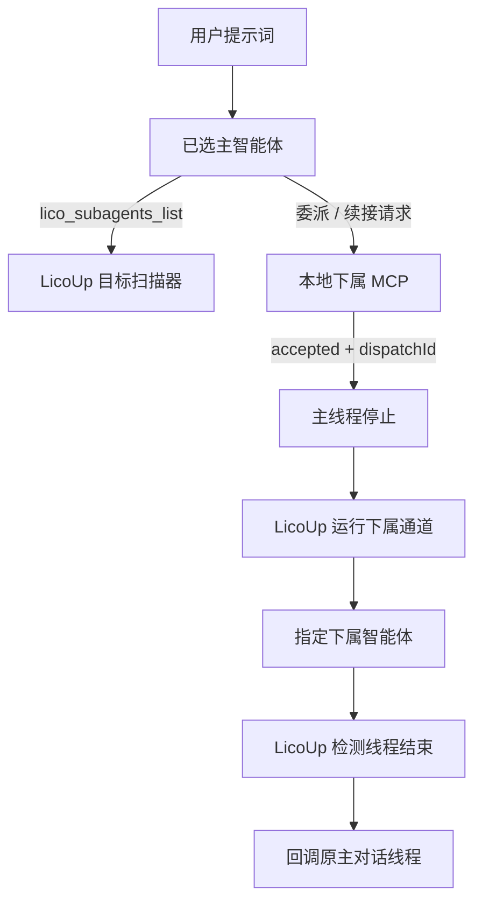

# LicoUp 下属智能体 MCP

[English（规范版本）](subagent-mcp.md) · 简体中文（本地化） · [架构](../architecture/README.zh-CN.md)

权威来源：`crates/licoup-native/src/bin/lico-subagent-mcp.rs`、原生目标扫描器和共享
对话通道。实现或验证变化时应同步更新本文档。

LicoUp 向一个主智能体提供下属智能体能力。安装 Codex 插件后，主智能体负责规划、
并遵循“适应性飞轮”保存的角色分配。代码工程使用一个前后端共享的 Designer，
以及两条明确工作线：后端 Worker 到后端 Reviewer、前端 Worker 到前端 Reviewer。
插件缺失或不可用时，LicoUp 本机回退调度器执行同样的 Designer 与两组
Worker-to-Reviewer 执行拓扑。两条路径都只把本机对话文件位置作为跨智能体的续接标识。

“适应性飞轮”只有一个持久化权威：私有客户端状态中的 `adaptive-flywheel.toml`。
桌面编辑器和 MCP 读取同一份 TOML，保存的模型选择必须通过当前目标扫描验证。Codex
读取 App Server 的 `model/list`；Cursor 和 Pi 调用各自的原生模型列举命令；其它适配器
读取经过验证的本机配置、供应商缓存或专用原生扫描器。历史观察仅在显式启用时补充
目录，不能覆盖成功的原生响应。

## 已实现契约

钢铁规则：主智能体不负责探测子智能体，子智能体也不直接反馈主智能体。主智能体只向
LicoUp 发出诉求；LicoUp 确认收到后主线程立即停止；由 LicoUp 转接子智能体、检测完成、
在群聊中投影 peer 气泡，并回调原先主智能体对话线程。

- `lico_subagents_list` 返回当前支持 `runtime.message.send` 的扫描目标，供主智能体选择
  诉求对象；就绪探测仍由 LicoUp 拥有。主智能体框架可通过 `sameFramework: true` 出现；
  选择它会新建独立下属对话，绝不会续接已挂起的主对话。
- `lico_subagent_probe` 是 LicoUp 拥有的一次性就绪探测；主智能体不得用它驱动下属。
- `lico_subagent_delegate` 接受 LicoUp 拥有的 handoff，并立即返回 `accepted: true`、
  `dispatchId`、`sessionMode` 与 `state: accepted`。主智能体用 `sessionMode` 选择：
  `new`（默认，新建下属会话，不得带 `conversationPath`）或 `resume`（续接，必须带
  `conversationPath`）。`lico_subagent_continue` 是 resume 别名。不等待下属完成，
  也不复制下属输出。LicoUp 在后台运行下属、写入 handoff 状态、在 Lico 群线程投影
  peer 气泡，再通过 `mainConversationPath` 或可解析的主会话回调原主对话。
- 委派与续接仍要求生命周期 `role`（`designer` / `worker` / `reviewer`），并可指定
  `backend` / `frontend` 工作线；Reviewer 提示词仍注入探针与清理验收约束。
- `lico_subagent_cancel` 通过指定适配器的原生控制面请求取消。
- MCP 可从客户端名称推断主智能体；需要显式绑定时，打包启动配置可设置
  `LICOUP_MAIN_AGENT_ID`。Codex 与 Antigravity 可通过 digest 确认安装 Subagent MCP；
  Antigravity 写入 `~/.gemini/config/mcp_config.json`（与 Hook/ACP Bridge 分条管理）。

## 有界并发

| 边界 | 已实现上限 |
| --- | --- |
| MCP 输入帧 | 64 KiB |
| 委派提示词 | 48 KiB |
| 对话文件位置 | 4 KiB |
| 下属智能体单轮 | 1 秒至 30 分钟 |
| 原生 stdout 事件预算 | 64 KiB 至 64 MiB |
| 原生 stderr 事件预算 | 16 KiB 至 4 MiB |
| MCP 执行 | 8 个工作线程 |
| 待处理工具调用 | 32 |
| 回退候选 | 8 个 |
| 额度冷却记录 | 64 条 |

不同工具调用可以并发执行；主智能体在收到 ACK 后停止本轮，由 LicoUp 在完成后回调主线程。

## 隐私与失败语义

提示词和下属输出只留在本地会话与原生通道内。MCP 工具回执不携带下属全文；群聊 peer
气泡由 LicoUp 读取本机 handoff / 下属会话后投影。列表投影不暴露可执行路径、账户数据
或原始配置。队列满、目标不可用或原生传输失败都会返回有类型且有界的错误。

逐智能体机制由原生驱动清单投影到[兼容性文档](../COMPATIBILITY.zh-CN.md#智能体适配目标)。
