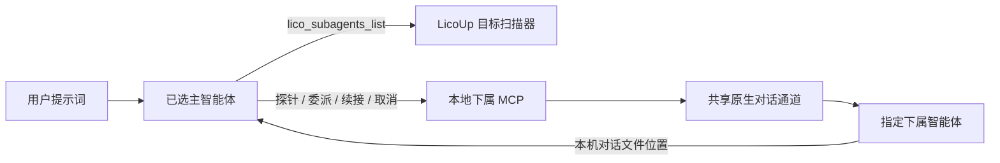

# LicoUp 下属智能体 MCP

[English（规范版本）](subagent-mcp.md) · 简体中文（本地化） · [架构](../architecture/README.zh-CN.md)

权威来源：`crates/licoup-native/src/bin/lico-subagent-mcp.rs`、原生目标扫描器和共享
对话通道。实现或验证变化时应同步更新本文档。

LicoUp 向一个主智能体提供下属智能体能力。安装 Codex 插件后，主智能体负责规划、
并遵循“适应性飞轮”保存的角色分配。代码工程使用一个前后端共享的 Designer，
以及两条明确工作线：后端 Worker 到后端 Reviewer、前端 Worker 到前端 Reviewer。
插件缺失或不可用时，LicoUp 本机回退调度器执行同样的 Designer 与两组
Worker-to-Reviewer 执行拓扑。两条路径都只把本机对话文件位置作为跨智能体的续接标识。

“适应性飞轮”只有一个持久化权威：私有客户端状态中的 `adaptive-flywheel.toml`。
桌面编辑器和 MCP 读取同一份 TOML，保存的模型选择必须通过当前目标扫描验证。Codex
读取 App Server 的 `model/list`；Cursor 和 Pi 调用各自的原生模型列举命令；其它适配器
读取经过验证的本机配置、供应商缓存或专用原生扫描器。历史观察仅在显式启用时补充
目录，不能覆盖成功的原生响应。

## 已实现契约

- `lico_subagents_list` 返回当前支持 `runtime.message.send` 的扫描目标。主智能体
  框架可通过 `sameFramework: true` 出现；选择它会新建一个独立下属对话，绝不会
  续接已经挂起的主对话。MCP 仍排除非对话编辑器目标。其有界的
  `codeEngineeringStrategy` 投影会返回已保存的共享 Designer，以及前后端各自的
  Worker 和 Reviewer 分配，但不会暴露可执行文件地址或原始 TOML 文档。
- `lico_subagent_probe` 执行一次性就绪探测。普通探针会把扫描得到的目标模型清单
  与 LicoUp 内嵌的实测价格表求交集，并选择当前可用的最低成本路由；只有验收该条
  精确路由本身时，才应设置 `exactModel` 和 `exactReasoningEffort`。探针创建的持久化
  历史都会移入操作系统废纸篓。Claude Code 的非持久化路径必须复扫并证明未创建
  历史；Cursor 和 Antigravity 使用精确原生会话清理，把各自的单会话存储叶移入
  废纸篓。所有路径都必须再次扫描并确认记录消失后才算通过。
  传输、响应、清理或清理复核任一步失败都会关闭失败；回执经过脱敏，不会暴露
  一次性对话地址。
- `lico_subagent_delegate` 通过指定智能体的原生对话通道发送一条有界提示词，
  等待该轮结束，但只返回本机 `conversationPath`，不复制下属输出。委派和续接都必须
  携带 `designer`、`worker` 或 `reviewer` 生命周期 `role`。Worker 和 Reviewer 可指定
  `backend` 或 `frontend` 工作线；存在匹配的已保存分配时会优先使用。LicoUp 会在
  传输前向所有 Reviewer 提示词注入同一份探针与清理验收约束，不依赖目标框架类型
  或该框架是否安装 LicoUp 技能。
- 委派和续接可显式设置 1 秒至 30 分钟的 `timeoutMs`；进程期限始终强制且有界。
- 原生许可设置按调用显式传递。只有在用户已授权当前工作且已绑定准确规范化工作目录
  时，才可使用 `allowAll` 或封闭白名单中的 `permissionMode`；它们会批准智能体工具，
  但不会额外建立操作系统沙箱。对 ACP 智能体，显式 `allowAll: true` 只能选择请求中
  提供的一次性允许选项；持久授权、缺少允许选项或隐式授权仍会失败关闭。
- 高体量原生工具事件可显式设置 stdout/stderr 预算，上限分别为 64 MiB 和 4 MiB；
  这些字节仍留在原生传输内，MCP 只返回对话交接地址。可恢复的超时或事件预算错误
  也可携带该地址，以便续接准确的部分完成会话。
- 新委派最多可提供 8 个事先审核、同能力档位的回退候选。LicoUp 只会在额度、
  余额、限流或供应商容量错误后尝试它们，并最多保存 64 条有界冷却记录；续接和
  所有非容量故障都会关闭失败，不触发回退。
- `lico_subagent_continue` 使用上一次委派返回的准确原生会话继续对话，并从该对话投影
  恢复已记录的规范工作目录。调用方可以省略 `workingDirectory`；若显式提供，则必须
  解析为同一目录，否则续接会失败关闭。
- `lico_subagent_cancel` 通过指定适配器的原生控制面请求取消。
- MCP 可从客户端名称推断主智能体；需要显式绑定时，打包启动配置可设置
  `LICOUP_MAIN_AGENT_ID`。

## 有界并发

| 边界 | 已实现上限 |
| --- | --- |
| MCP 输入帧 | 64 KiB |
| 委派提示词 | 48 KiB |
| 对话文件位置 | 4 KiB |
| 下属智能体单轮 | 1 秒至 30 分钟 |
| 原生 stdout 事件预算 | 64 KiB 至 64 MiB |
| 原生 stderr 事件预算 | 16 KiB 至 4 MiB |
| MCP 执行 | 8 个工作线程 |
| 待处理工具调用 | 32 |
| 回退候选 | 8 个 |
| 额度冷却记录 | 64 条 |

不同工具调用可以并发执行；主智能体负责保持同一原生会话的追问顺序。

## 隐私与失败语义

提示词和下属输出只留在本地 MCP 会话与原生智能体通道内。委派结果只返回后续调度
需要的本机对话文件位置；一次性探针只返回基于价格表选择的路由和已复核的清理状态。
列表投影不会暴露可执行路径、账户数据、目标诊断或原始配置；仅返回智能体标识、
显示名称、已审核的对话能力、有界模型选项和已配置的代码工程角色映射。队列满、
目标不可用、续接无效或原生传输失败都会返回有类型且有界的错误。

逐智能体机制由原生驱动清单投影到[兼容性文档](../COMPATIBILITY.zh-CN.md#智能体适配目标)。
