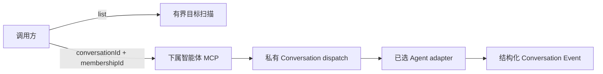

# LicoUp 下属智能体 MCP

[English（规范版本）](subagent-mcp.md) · 简体中文（本地化） · [架构](../architecture/README.zh-CN.md)

权威来源：`crates/licoup-native/src/bin/lico-subagent-mcp.rs`、原生目标扫描器与统一
Conversation 领域。实现或验证变化时应同步更新本文档。

LicoUp 暴露可运行的本地 Agent，但不预设团队拓扑。调用方在统一 Conversation 中选择
一个准确且活动的 Agent Membership。命名协作角色、有序候选池及适应性飞轮阶段都是
Conversation 数据，不是 MCP 枚举、固定 Designer/Worker/Reviewer 工作线或全局预设。

## 已实现契约

| 工具 | 用途 |
| --- | --- |
| `lico_subagents_list` | 列出扫描到的可运行本地 Agent 集成，不分配协作角色 |
| `lico_subagent_probe` | 执行 LicoUp 自有的一次性就绪探测，并在成功前验证清理结果 |
| `lico_subagent_delegate` | 为准确且活动的 `conversationId + membershipId` 启动一次新 dispatch |
| `lico_subagent_continue` | 续接同一 Conversation Membership 最近可续接的 dispatch |
| `lico_subagent_cancel` | 通过已选 adapter 的原生控制面请求取消 |

委派与续接会立即返回有界回执和 dispatch 标识，原生执行在后台继续。它们接收提示词，
以及可选的模型、推理强度、工作目录、超时、显式流预算和经用户授权的权限设置；不接收
生命周期角色、前后端工作线、回退候选列表、session mode、原生 session id 或对话路径。

MCP 会确认 Membership 处于活动状态、属于该 Conversation、代表 Agent，且与请求的可
运行集成匹配。新建与续接执行都记录为私有 Conversation dispatch 状态。原生会话标识
与续接位置只从私有绑定中解析，调用方既不能指定也不能读取。

`lico_subagent_probe` 是基础设施就绪检查，不是驱动智能体的原语。它默认选择有价格依据
且可用的路线，也可以校验调用方明确指定的路线。探测产生的任何持久历史都会被移入操作
系统废纸篓，并且必须由一次新扫描证明已经消失，探测才能成功。

## 适应性飞轮执行

飞轮编排使用生成的 Conversation 服务，而不是专用 MCP 角色契约。运行会冻结有序阶段、
角色、候选及运行时偏好。执行边界读取运行视图，以原子方式领取一个合格的 Agent turn，
经本 MCP/原生 dispatch 通道调用 Membership，追加结构化 Event，再转换 turn 状态。
选择模式支持单选、轮询、全部和有界并行，同时活动的 Agent turn 最多八个。

## 有界并发

| 边界 | 已实现上限 |
| --- | --- |
| MCP 输入帧 | 64 KiB |
| 委派提示词 | 48 KiB |
| 工作目录值 | 4 KiB |
| 非零下属超时 | 1 秒至 30 分钟；`0` 表示不设置期限 |
| 显式原生 stdout 预算 | 64 KiB 至 64 MiB |
| 显式原生 stderr 预算 | 16 KiB 至 4 MiB |
| MCP 执行 | 8 个工作线程 |
| 待处理工具调用 | 32 |
| 额度冷却记录 | 64 条 |

独立工具调用可以并发。Conversation 存储通过原子领取避免两个 worker 执行同一个飞轮 turn。

## 隐私与失败语义

提示词、Agent 输出、原生会话标识、续接位置及工作目录绑定都保留在本地。公开回执不含
原生路径或 Agent 输出。列表投影不暴露可执行路径、账户数据、目标诊断、原始配置或
Conversation 角色分配。队列饱和、目标不可用、Membership 无效、续接无效、取消结果
不确定及原生传输失败都会返回有类型且有界的错误。

逐智能体机制由原生驱动清单投影到[兼容性文档](../COMPATIBILITY.zh-CN.md#智能体适配目标)。
