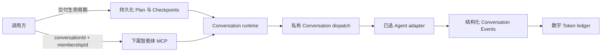

# LicoUp 下属智能体 MCP

[English](subagent-mcp.md) · 简体中文 · [架构](../architecture/README.zh-CN.md)

权威实现包括 `crates/licoup-native/src/bin/lico-subagent-mcp.rs`、
`domain/client_conversation`、`domain/delivery_plan`、`domain/delivery_scheduler.rs`、
`domain/delivery_state.rs`、
`domain/agent_usage/workflow_ledger.rs`、`platform/conversation_runtime`、原生目标扫描器
及其验证。本文件只是这些实现的公开投影。

LicoUp 暴露可运行的本机 Agent，但不定义团队拓扑。直接调用方选择统一 Conversation
中准确且活动的 Agent Membership；交付调用方只操作持久化 Plan，不提交第二套任务图，
也不选择原生会话。命名角色、候选顺序和 Adaptive Flywheel 策略数据都不是 MCP 枚举、
固定 Designer/Worker/Reviewer 通道或全局预设。

## 已实现契约

| 工具 | 用途 |
| --- | --- |
| `lico_delivery_start` | 启动或重新打开一份持久化 Delivery Plan |
| `lico_delivery_authorize` | 授权当前 Plan 摘要 |
| `lico_delivery_status` | 读取持久化 Plan 状态及其下一动作 |
| `lico_delivery_cancel` | 显式取消交付，并把取消请求转给活动 Conversation dispatch |
| `lico_subagents_list` | 列出扫描到的可运行本机 Agent 集成，不分配协作角色 |
| `lico_subagent_probe` | 以只读方式观察一个已准入手下智能体的就绪状态：目标事实加上 Conversation 主进程的活动回合快照；`busy` 也是成功状态 |
| `lico_subagent_delegate` | 为准确且活动的 `conversationId + membershipId` 启动一次非交付 dispatch |
| `lico_subagent_continue` | 续接同一 Conversation Membership 最近可续接的 dispatch |
| `lico_subagent_cancel` | 通过已选 adapter 的原生控制面请求取消 |

所有 schema 都是封闭的。调用方可以启动、授权、查看或显式取消交付；不能提交 Task 或
eligible frontier、选择 route、绑定原生会话、接受 Reviewer，也不能替换 Plan 与
Checkpoint 状态。

## Delivery Plan 执行

持久化 Plan 与 Checkpoints 是唯一交付生命周期权威。Plan engine 计算完整 eligible
frontier；Conversation runtime 以稳定顺序领取，并经由准确 Conversation Membership
派发每个 Agent。每次 dispatch 都是通过进程自有持久 Conversation 主进程
（`agent.conversation.dispatch`）在持久 Delivery dispatch 标识下开启的一个
Membership 作用域 PersistentTurn，并启用流式事件；主进程返回可挂接的回合句柄，并始终是
唯一的执行与完成属主。同一标识键控作为终态证据的 canonical dispatch 记录；显式取消经由
同一控制面（`agent.conversation.cancel`）按已记录的标识与 Conversation 作用域送达。
如果持久主进程不可用，dispatch 以有类型的
`persistent_conversation_transport_required` 拒绝失败，不经过任何其他通道执行 Agent
工作。不同交付可以并发；同一交付、Task attempt 与原生会话保持有序。等待终态 Event
不占用消息投递通道；只观察到活动回合的 runner 通道会休眠，不消耗有界的进度预算。

Adaptive Flywheel 是唯一的 Agent、model 与 reasoning-effort route 选择器。发送 Plan
brief 前，LicoUp 会把 route 决定冻结在 dispatch receipt 中。插件就绪只代表 adapter
准备状态，不能改变 Plan 资格、交付归属或 route 选择。

每次已接受的 dispatch 都在原生发送前记录 intent、Conversation 绑定和 Token baseline。
只有确定的终态 Conversation Event 才结算数字用量并推进 Checkpoint；沉默或耗时仍保持
pending。终态结算与回调是幂等的。重启恢复会在持久 Delivery dispatch 标识下读取
canonical dispatch 记录，而不是开启另一个回合：活动记录报告 pending，终态记录投影其
终态，已持久化但未提交的 dispatch 以可重试失败结算。

Token ledger 保留数字 prompt、cached-input、completion、total、精确或估算计数、覆盖率
以及 Plan/Task/dispatch 层级；不保留 prompt 正文、reply、tool payload、摘要、压缩、
cache 控件或平行 context 模型。公开投影不含路径，并且只保留活动交付和最新二十份终态
汇总。

## 直接一次性操作

委派与续接只用于非交付回合。它们会立即返回有界 receipt 和 dispatch 标识，原生执行在
后台继续。它们接收 prompt，以及可选的 model、reasoning effort、工作目录、超时、显式
流预算和经用户授权的权限设置；不会创建 Plan 角色或 Checkpoint，也不会形成第二个交付
调度器。

MCP 会确认 Membership 处于活动状态、属于该 Conversation、代表 Agent，并与请求的可
运行集成匹配。原生 session 标识与续接位置只从 Membership 私有绑定中解析，调用方既不能
指定也不能读取。

`lico_subagent_probe` 是只读的就绪观察，而不是驱动 Agent 的原语。其 `agentId` 必须是
`lico_subagents_list` 返回的准确标识；别名会被拒绝。它不发送任何 Agent 输入、不启动
第三方 Agent 二进制、也不创建或修改 Conversation：只发出一个有界
请求，读取私有 Conversation 主进程按该已准入手下智能体过滤的活动回合快照。目标检查
不会打开模型或历史存储，也不会刷新持久化发现状态；主进程观察只连接到运行中的主进程
已经发布的端点。其回执
（`licoup.subagent.readiness.v1`）报告 `agentId`、`state`、`integrationStatus`、
`conversationDriver`、`conversationReadiness`、`blockerCode`、`hostTransport` 与
`hostActiveTurns`——不包含路径、会话标识、回合句柄、进程标识、端口、模型或价格。
当集成可运行、主进程可达且主进程没有为该 Agent 持有非终态回合时，`state` 为
`ready`；持有至少一个时为 `busy`；两者都是成功观察，绝不是失败。快照只覆盖
LicoUp 自有的回合，因此 `ready` 的含义是在 LicoUp 内已准入、可达且空闲——它不对
Agent 自身的外部活动作任何断言。

## 有界执行

| 边界 | 已实现上限 |
| --- | --- |
| MCP 输入帧 | 64 KiB |
| Plan brief 或一次性 prompt | 48 KiB |
| 原生续接位置 | 4 KiB |
| 工作目录值 | 4 KiB |
| 非零下属超时 | 1 秒至 30 分钟；`0` 表示不设置期限 |
| 显式原生 stdout 预算 | 64 KiB 至 64 MiB |
| 显式原生 stderr 预算 | 16 KiB 至 4 MiB |
| MCP 执行 | 8 个工作线程 |
| 待处理工具调用 | 32 |
| 额度冷却记录 | 64 条 |

独立工具调用可以并发。原子 Conversation dispatch 领取可避免两个 worker 执行同一个
已接受回合。

## 隐私与失败语义

prompt、Agent 输出、原生 session 标识、续接位置、Plan 存储位置和工作目录绑定都保留在
本地。公开 receipt 只包含安全操作标识、生命周期状态、stage、component、retryability、
recovery action 和数字用量事实，不包含原生路径或消息正文。列表投影不暴露可执行路径、
账户数据、目标诊断、原始配置或 Conversation 角色分配。

队列饱和、目标不可用、Membership 无效、续接无效、取消结果不确定、Conversation 准入
失败及原生传输失败都会返回有类型且有界的错误。不确定的原生效果保持 pending 并等待
reconcile，绝不会报告为 completed。一个分支的终态失败不会取消无关 eligible 分支。

逐 Agent 机制由原生驱动清单投影到
[兼容性文档](../COMPATIBILITY.zh-CN.md#智能体适配目标)。
