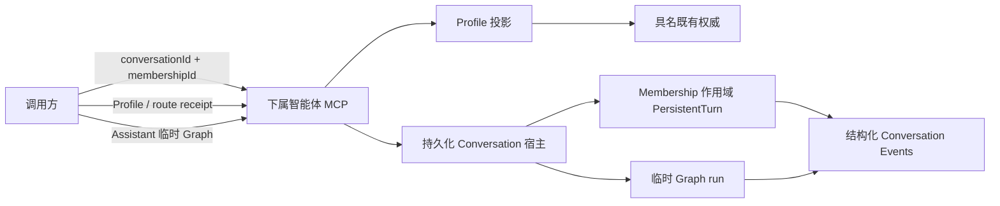

# LicoUp 下属智能体 MCP

[English](subagent-mcp.md) · 简体中文 · [架构](../architecture/README.zh-CN.md)

权威实现包括 `crates/licoup-native/src/bin/lico-subagent-mcp.rs`、
`domain/client_conversation`（Assistant 指定与 Membership Profile）、
`domain/adaptive_flywheel`（Assistant 临时 Graph 准入与执行）、持久化 stdio-RPC
Conversation 宿主、原生目标扫描器及其验证。本文件只是这些实现的公开投影。

LicoUp 暴露可运行的本机 Agent，但不定义团队拓扑。直接调用方选择统一 Conversation
中准确且活动的 Agent Membership。被指定的 Assistant 还可以编写一份有界临时 Graph，
其节点必须是准确且活动的 Agent Membership。命名角色、候选顺序和 Adaptive Flywheel
策略数据都不是 MCP 枚举、预定义协作角色通道或全局预设。

## 已实现契约

| 工具 | 用途 |
| --- | --- |
| `lico_assistant_profiles` | 对活动 Agent Membership Profile 排序并返回隐私安全的 route receipt |
| `lico_assistant_workflow_execute` | 在准确绑定与幂等键下编译、预检、持久准入并执行一个 `assistant-temporary` workflow |
| `lico_assistant_workflow_inspect` | 读取一个临时 workflow run 的投影状态 |
| `lico_assistant_workflow_cancel` | 请求取消一个临时 workflow run |
| `lico_subagents_list` | 列出扫描到的可运行本机 Agent 集成，不分配协作角色 |
| `lico_subagent_probe` | 以只读方式观察一个已准入手下智能体的就绪状态：目标事实加上 Conversation 宿主的活动回合快照；`busy` 也是成功状态 |
| `lico_subagent_delegate` | 为准确且活动的 `conversationId + membershipId` 启动一次直接 dispatch |
| `lico_subagent_continue` | 续接同一 Conversation Membership 最近可续接的 dispatch |
| `lico_subagent_cancel` | 通过所选 adapter 的原生控制面请求取消 |

所有 schema 都是封闭的。调用方可以读取 Profile、执行一份在内部完成预检的 assistant 临时
Graph，或直接委托给准确 Membership；不能创建角色、替换 Conversation/Profile/Graph
权威、选择 route 或自行绑定原生会话；原生运行位置始终是私有 Conversation 状态。Assistant
操作要求 MCP 绑定的管理 Agent 正是当前活动的指定 Assistant Membership。直接委派、
续接与取消要求该管理 Agent 是同一 Conversation 的活动 Agent Membership。查看与取消
还会在返回数据或请求效果前重新校验 run 中存储的 Conversation 与 Assistant Membership。

## Assistant Profile 投影

每个活动 Agent Membership 都可以携带一份带版本号的 Profile intent
（`conversation.profile.update`）。MCP 通过进程自有的 Conversation service
（`conversation.profile.candidates`）读取投影。
价格、编程评分、Skills、环境、能力、readiness 与模型事实只来自具名既有权威
（`targets`、`providerModelPricing`、`agentIntelligenceCatalog`、`skillHub`
以及随附的 `assistant-workflow-authoring` Skill）。每个权威在每次请求/版本中最多
读取一次，未知的可选事实保持可见的 unknown，候选顺序是唯一确定性元组：显式固定、
偏好缺失数、已验证可靠性、编码评分降序、已知预期价格升序、观测延迟，最后按 Membership id。
投影绝不携带 prompt、凭据、绝对路径、机器身份或运行端点。

## 临时 Graph 准入

被指定的 Assistant 可以编写一份有界的 `assistant-temporary` workflow，其绑定是从
合格 Profile 快照中选出的准确 `conversationId` 加 `membershipId`。
`lico_assistant_workflow_execute` 在内部完成预检，并在持久准入或任何 Agent/脚本效果
之前返回所有本地可发现失败（结构、额度、Membership、model、Skill、环境、能力、
readiness、Authority），同时提供稳定 code 与完整有序 `diagnostics` 列表。每项包含稳定
stage，并可附带白名单 JSON Pointer、受影响 Membership id 与 actual/limit 数字事实。随后它立即重新校验存储
自有的 Membership 与 Profile 版本、冻结 route receipt、在幂等键下准入 run，并通过持久化
Conversation 宿主把每个就绪 actor 作为 Membership 作用域 PersistentTurn 启动。
重放已有键会返回已有 run，不会产生重复效果。该 facade 不暴露独立的公开 preflight
或 start 通道；`lico_assistant_workflow_inspect` 与 `lico_assistant_workflow_cancel`
按投影标识寻址该 run。

持久化宿主始终是唯一的 run 与 turn 属主；MCP 进程绝不创建平行的 turn 注册表或
终态写入方。运行期失败以包含稳定 `code`、`stage`、不可重试投影和隐私安全
`recoveryClass` 的 typed 终态结果返回给同一 Assistant turn。失败的 Graph
不可变且绝不隐式重试；Assistant 随后可直接工作，或编写后续 Graph 完成目标。
Graph 不能发明基于超时的失败、隐藏参与者、silent fallback 或私有运行数据。

## 直接一次性操作

委派与续接只用于直接、非 Graph 回合，寻址准确且活动的 Agent Membership。它们立即
返回有界 receipt 与 dispatch 标识，原生执行在后台继续。它们接受 prompt 以及可选的
运行期偏好，例如 model、reasoning effort、工作目录、超时、显式流预算和经用户授权
的权限设置；不会创建角色或第二个调度器。

MCP 会确认 Membership 处于活动状态、属于该 Conversation、代表 Agent，并与请求的
可运行集成匹配。原生 session 标识与续接位置只从 Membership 绑定内部解析；调用方
既不能选择也不能读取。

`lico_subagent_probe` 是只读的就绪观察，而不是驱动 Agent 的原语。其 `agentId` 必须
是 `lico_subagents_list` 返回的准确标识；别名会被拒绝。它不发送任何 Agent 输入、
不启动第三方 Agent 二进制、也不创建或修改 Conversation：一次有界请求读取私有
Conversation 宿主按该已准入手下智能体过滤的活动回合快照。目标检查不打开模型或历史
存储，也不刷新持久化发现状态；宿主观察只连接到运行中宿主已经发布的端点。其回执
（`licoup.subagent.readiness.v1`）报告 `agentId`、`state`、`integrationStatus`、
`conversationDriver`、`conversationReadiness`、`blockerCode`、`hostTransport` 与
`hostActiveTurns`——不包含路径、session 标识、回合句柄、进程标识、端口、model 或
价格。当集成可运行、宿主可达且宿主没有为该 Agent 持有非终态回合时，`state` 为
`ready`；持有至少一个时为 `busy`；两者都是成功观察，绝不是失败。快照只覆盖 LicoUp
自有的回合，因此 `ready` 意味着在 LicoUp 内已准入、可达且空闲——它不对 Agent 自身的
外部活动作任何断言。

## 有界执行

| 边界 | 已实现上限 |
| --- | --- |
| MCP 输入帧 | 64 KiB |
| Prompt | 48 KiB |
| 标识 | 256 字节 |
| 工作目录值 | 4 KiB |
| 非零下属超时 | 1 秒至 30 分钟；`0` 表示不设置期限 |
| 显式原生 stdout 预算 | 64 KiB 至 64 MiB |
| 显式原生 stderr 预算 | 16 KiB 至 4 MiB |
| MCP 执行 | 8 个工作线程 |
| 待处理工具调用 | 32 |
| 额度冷却记录 | 64 条 |

独立工具调用可以并发。原子 Conversation dispatch 领取可避免两个 worker 执行同一个
已接受回合。

## 隐私与失败语义

prompt、Agent 输出、原生 session 标识、续接位置与工作目录绑定都保留在本地。公开
回执只包含安全操作标识、生命周期状态、阶段、组件、可重试性、恢复动作与数字用量
事实；不含原生路径或消息正文。列表投影省略可执行文件路径、账号数据、目标诊断、
原始配置与 Conversation 角色指派。

队列饱和、目标不可用、无效 Membership、无效续接、取消不确定性、预检拒绝与原生运输
失败都返回有界 typed 错误。预检拒绝保留稳定 code（`graph_invalid`、
`graph_identity_rejected`、`graph_membership_rejected`、`graph_binding_incomplete`、
`graph_model_rejected`、`graph_readiness_rejected`、`graph_environment_unavailable`、
`graph_preflight_rejected`），让 Assistant 修正一次请求而不是猜测。诊断投影会丢弃未知
字段与原始值。不确定的原生效果
保持 pending 对账，绝不会报告为已完成。已经结算的分支保留其结果；Assistant 失败
结算 Graph 后不会再发出新的分支效果。

每个 Agent 的机制由[兼容性文档](../COMPATIBILITY.zh-CN.md#智能体适配目标)中的
原生驱动清单投影。
